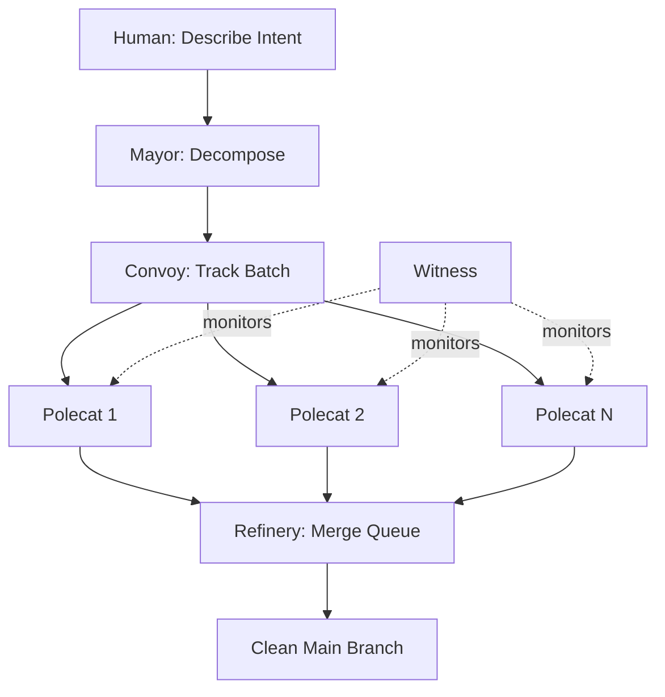
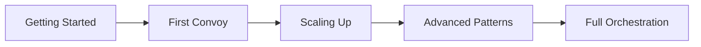
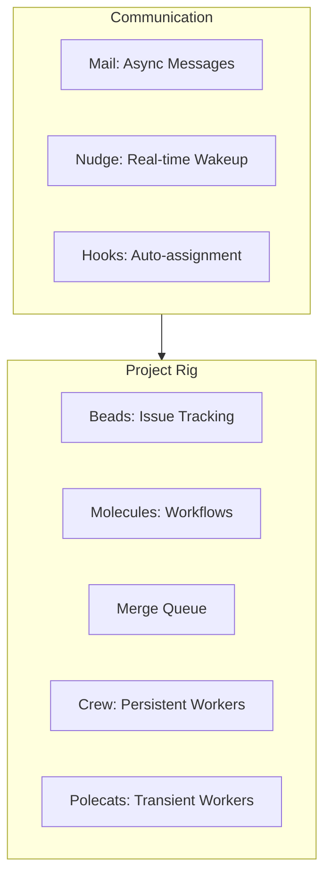

Welcome to the Gas Town blog. This is where we share updates about Gas Town, tips for running multi-agent workflows, architecture deep dives, and practical guides for scaling AI-assisted development.

<!-- truncate -->

## What is Gas Town?

Gas Town is a multi-agent orchestration system that coordinates fleets of AI coding agents working on your projects simultaneously. Built on top of Claude Code (with support for other runtimes), it scales from a single agent to 20-30 concurrent workers — all managed through the `gt` CLI.

The name comes from the oil refinery citadel in Mad Max: Fury Road, reflecting the system's industrial approach to coordinating autonomous agents at scale.

## Key Ideas

Gas Town is built around a few core principles that set it apart from ad-hoc multi-agent setups:

- **Supervisor trees** — Agents monitor each other in a hierarchy (Mayor → Deacon → Witness → Polecats), so failures are detected and recovered automatically.
- **Git-backed persistence** — All work state lives in git or git-adjacent storage. Context survives crashes, restarts, and session cycling.
- **Hook-driven propulsion** — When an agent finds work on its hook, it executes immediately. No confirmation step, no waiting for approval. This is what makes Gas Town fast.
- **Serialized merges** — The Refinery merge queue ensures that parallel agent work lands cleanly on main, one commit at a time.

## Why Gas Town?

AI coding agents are powerful individually, but running many of them simultaneously creates real coordination problems. Without orchestration, you end up with:

- **Merge conflicts** — Multiple agents editing the same files, overwriting each other's work
- **Lost context** — Agent sessions expire and work disappears because no one tracked the state
- **Zombie processes** — Stalled agents consuming tokens without making progress
- **Divergent branches** — Feature branches piling up with no one to merge them cleanly

Gas Town solves these problems with a battle-tested architecture: supervisor trees that detect failures, a merge queue that serializes commits, hook-driven assignment that eliminates idle time, and git-backed persistence that survives any crash. The result is a system where you describe what you want, and a fleet of agents delivers validated code to `main` — often in minutes rather than hours.

:::tip Think of it as a factory
Gas Town treats software development like a production line. Raw materials (beads) enter the system, workers (polecats) process them in parallel, quality control (Refinery) validates the output, and finished goods (commits) land on main. The supervision hierarchy (Mayor → Deacon → Witness) keeps the factory running 24/7.
:::

## What You'll Find Here

This blog covers practical topics for Gas Town users at every level:

- **Getting started** — [Your First Convoy](/blog/first-convoy), [What Stage Are You?](/blog/eight-stages-self-assessment)
- **Architecture deep dives** — [Gas Town vs CI/CD](/blog/gas-town-vs-cicd), [Understanding GUPP](/blog/understanding-gupp)
- **Operational guides** — [Incident Response](/blog/incident-response), [Cost Optimization](/blog/cost-optimization)
- **Advanced patterns** — [Advanced Convoy Patterns](/blog/advanced-convoy-patterns), [Custom Formulas](/blog/custom-formulas)

## Core Architecture

Under the hood, Gas Town organizes work through several interlocking systems. **Rigs** are isolated project environments, each with their own git clone, merge queue, and worker pool. **Molecules** define multi-step workflows as state machines — they track which step each agent is on and what happens next. **Beads** provide lightweight issue tracking that lives alongside your code, powered by [Dolt](https://www.dolthub.com/) for versioned database storage.

The communication layer uses **mail** for asynchronous messages between agents and **nudge** for real-time wake-up signals. Combined with **hooks** that automatically assign work when agents start, this creates a self-propelling system where work flows continuously without human intervention.

For a deeper look at the architecture, see the [Architecture Overview](/docs/architecture/overview) and [Design Principles](/docs/architecture/design-principles).

## Who Is Gas Town For?

Gas Town is designed for developers and teams who:

- **Already use AI coding agents** and want to scale from one agent to many without chaos
- **Work on large codebases** where multiple areas can be developed in parallel
- **Need predictable delivery** — convoy tracking and merge queue give visibility into progress
- **Want autonomous operation** — Gas Town runs while you sleep, handling failures and retries automatically

You don't need to be running 30 agents to benefit. Even with 2-3 concurrent workers, Gas Town's Refinery and Witness dramatically reduce the manual coordination overhead compared to running agents ad-hoc.

:::note Gas Town is runtime-agnostic
While Gas Town was built on Claude Code, the [multi-runtime support](/docs/guides/multi-runtime) means you can use other AI coding tools as polecats. The orchestration layer — beads, convoys, Refinery, supervision — works the same regardless of which LLM powers your agents.
:::

## Getting Started

If you're new here, check out the [Getting Started guide](/docs/getting-started/) to install Gas Town and run your first convoy. The [Quick Start](/docs/getting-started/quickstart/) will have you up and running in about 10 minutes.

For the full documentation, visit the [docs home](/docs/). If you prefer to learn by example, the [Usage Guide](/docs/guides/usage-guide/) walks through day-to-day workflows in detail. The [Cheat Sheet](/docs/getting-started/cheat-sheet) provides a handy reference for the most common commands.

We also recommend reading the [Eight Stages of Gas Town Maturity](/blog/eight-stages-self-assessment) to understand where you are on the learning curve and what to focus on next. For hands-on learners, the [First Convoy](/blog/first-convoy) tutorial walks through the full create-sling-merge cycle in about five minutes.

Stay tuned for more posts on workflow patterns, operational tips, and deep dives into Gas Town's internals.

- [Using Search](/docs/getting-started/using-search) — How to search across Gas Town documentation
- [Glossary](/docs/guides/glossary) — Definitions for all Gas Town terminology
- [Workspace CLI Reference](/docs/cli-reference/workspace) — Commands for installing, enabling, and managing your Gas Town workspace
