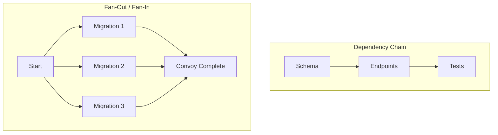
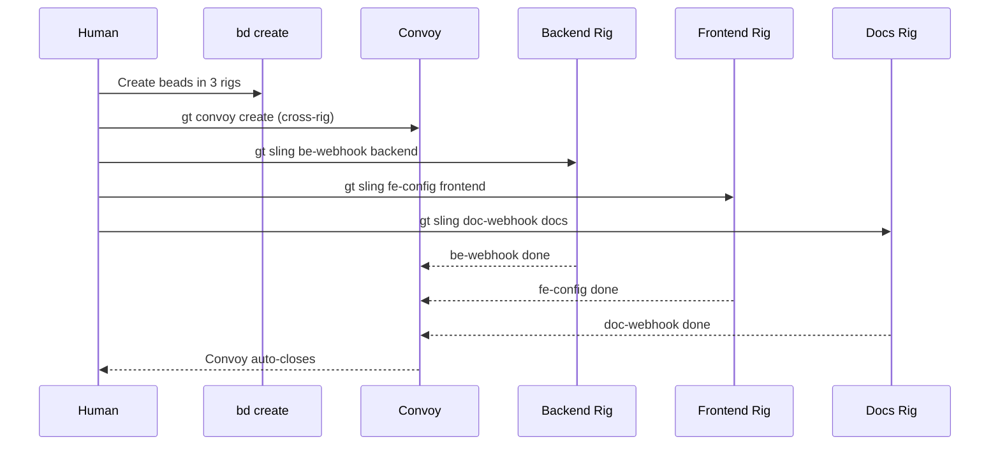
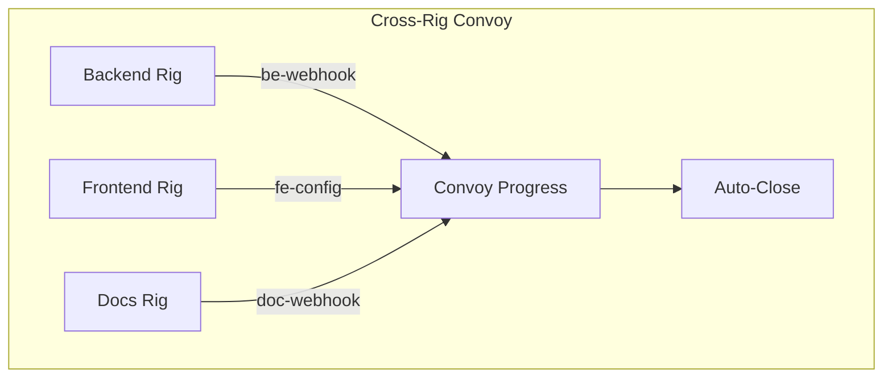
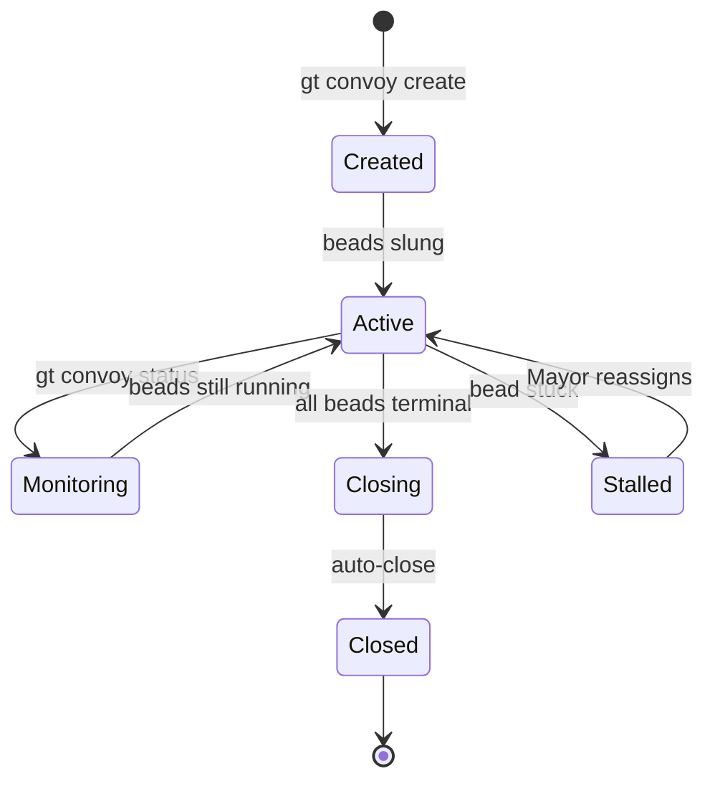

Move past the basics. Once you've run your first convoy, these patterns will help you orchestrate complex, multi-rig workflows that keep dozens of agents productive.

<!-- truncate -->



## Pattern 1: Dependency Chains

Not all work can run in parallel. Sometimes bead B depends on bead A completing first. Gas Town handles this with bead dependencies inside a convoy:

```bash
# Create the beads
bd create --title "Define API schema" --type task --priority 1
# → ga-schema

bd create --title "Implement API endpoints" --type task --priority 1
# → ga-endpoints

bd create --title "Write integration tests" --type task --priority 2
# → ga-tests

# Set up the dependency chain: tests need endpoints, endpoints need schema
bd dep add ga-endpoints ga-schema
bd dep add ga-tests ga-endpoints

# Bundle into a convoy
gt convoy create "API v2 Implementation" ga-schema ga-endpoints ga-tests
```

When you sling `ga-schema`, a polecat picks it up immediately. The other two beads show up as **blocked** in `bd ready` until their dependencies resolve. As each bead completes, the next in the chain becomes available automatically.

```bash
# See what's blocked vs ready
bd blocked
bd ready
```

The Witness and Mayor monitor the chain. If a dependency stalls, the Mayor can reassign or escalate.

:::tip Use `bd blocked` and `bd ready` to Debug Chains
When a dependency chain stalls, `bd blocked` shows you which beads are waiting and what they depend on. Pair it with `bd ready` to see what can run immediately. This is faster than manually tracing the chain and lets you identify the exact bottleneck bead.
:::

## Pattern 2: Fan-Out / Fan-In

The most common pattern in Gas Town: decompose a task into independent sub-tasks, run them all in parallel, and converge when they're done.

```bash
# Fan-out: 5 independent migration tasks
for table in users orders products inventory reviews; do
  bd create --title "Migrate $table table to new schema" --type task --priority 1
done

# Bundle them all
gt convoy create "Database Migration" ga-users ga-orders ga-products ga-inventory ga-reviews

# Sling all at once — 5 polecats spin up in parallel
for bead in ga-users ga-orders ga-products ga-inventory ga-reviews; do
  gt sling $bead myproject
done
```

The convoy auto-closes when all five complete. Since each table migration is independent, they run in true parallel — no sequencing needed.

:::info Verify Independence Before Fanning Out
Before creating a fan-out convoy, confirm that the tasks truly have no hidden dependencies. Two beads that both modify the same configuration file or database schema will race and create merge conflicts even if they appear logically independent. Check file overlap with `git diff --name-only` before slinging parallel work.
:::

**When to fan out:**
- File-by-file migrations
- Per-module test suites
- Independent feature additions
- Documentation updates across sections

## Pattern 3: Cross-Rig Convoys

Real projects span multiple repositories. A single convoy can track work across rigs:

```bash
# Create beads in different rigs
bd create --rig backend --title "Add webhook endpoint" --type task
# → be-webhook

bd create --rig frontend --title "Add webhook config UI" --type task
# → fe-config

bd create --rig docs --title "Document webhook API" --type task
# → doc-webhook

# One convoy tracks all three
gt convoy create "Webhook Feature" be-webhook fe-config doc-webhook

# Sling to respective rigs
gt sling be-webhook backend
gt sling fe-config frontend
gt sling doc-webhook docs
```

Each rig's polecats work independently in their own codebase. The convoy provides a unified progress view across all three.

```bash
gt convoy status hq-cv-webhook
# Progress: 1/3 done (be-webhook complete, fe-config in progress, doc-webhook pending)
```



:::info Fan-Out Works Best When Tasks Touch Different Files
Fan-out parallelism yields the highest throughput when each bead modifies a distinct set of files. If multiple fan-out beads edit the same files, the Refinery will spend extra cycles resolving merge conflicts and may trigger polecat retries. Check for file overlap before fanning out.
:::

## Pattern 4: Rolling Convoys

For ongoing work (like a sprint), use a rolling convoy pattern where you add beads as work is discovered:

```bash
# Start with initial scope
gt convoy create "Sprint 42"
# → hq-cv-sprint42

# Add work as it comes in
gt convoy add hq-cv-sprint42 ga-bugfix1
gt convoy add hq-cv-sprint42 ga-feature2
gt convoy add hq-cv-sprint42 ga-refactor3

# Check progress throughout the sprint
gt convoy status hq-cv-sprint42
```

The convoy won't auto-close until everything added to it completes. This gives you a live dashboard for the entire sprint.

## Pattern 5: Convoy Monitoring

For large convoys, combine these monitoring commands:

```bash
# High-level dashboard
gt convoy list

# Detailed progress on a specific convoy
gt convoy status hq-cv-001

# Live activity stream (shows polecat actions in real-time)
gt feed

# Find convoys with work that nobody picked up
gt convoy stranded
```

```mermaid
timeline
    title Convoy Lifecycle Timeline
    00:00 : Create convoy : Define beads
    00:05 : Sling work : Polecats spawn
    00:15 : First completion : Bead 1 done
    00:30 : Mid-progress : 50% complete
    00:45 : Dependencies resolve : Blocked beads start
    01:00 : Final bead done : Auto-close triggered
```

**Escalation signals to watch for:**
- **Stranded convoys** — work sitting unassigned means something broke in the sling step
- **Stalled beads** — a polecat may have crashed; the Witness should restart it
- **Dependency deadlocks** — circular deps prevent progress; check with `bd blocked`



## Pattern Comparison

| Pattern | When to Use | Complexity | Parallelism | Key Command |
|---------|------------|------------|-------------|-------------|
| **Dependency Chain** | Steps must execute in strict order (e.g., schema before endpoints before tests) | Low | Sequential — one bead at a time | `bd dep add <child> <parent>` |
| **Fan-Out / Fan-In** | Many independent sub-tasks that can all run simultaneously (e.g., per-table migrations) | Low | Fully parallel — all beads at once | `gt sling <bead> <rig>` in a loop |
| **Cross-Rig Convoy** | Feature spans multiple repositories (backend, frontend, docs) | Medium | Parallel across rigs, each rig independent | `gt convoy create` with beads from multiple rigs |
| **Rolling Convoy** | Ongoing work where scope grows over time (e.g., a sprint) | Medium | Mixed — beads added and executed as discovered | `gt convoy add <convoy> <bead>` |
| **Convoy Monitoring** | Large convoys needing real-time visibility and escalation | Low | N/A — observability layer, not an execution pattern | `gt convoy status`, `gt feed`, `gt convoy stranded` |

These patterns become even more powerful when combined with [custom formulas](/blog/custom-formulas) that define specialized workflows for each convoy bead, and work seamlessly with the [work distribution](/docs/architecture/work-distribution) strategies that route beads to the right polecats.

:::warning Keep Convoys Focused (3-10 Beads)
A single stalled bead prevents the entire convoy from auto-closing. If you bundle 50 beads into one convoy, one stuck task blocks the completion signal for all 49 others. Decompose large efforts into multiple smaller convoys rather than one mega-convoy.
:::

:::note Cross-Rig Convoys Require Explicit Artifact Sharing
Polecats in different rigs cannot access each other's filesystems. If a frontend bead depends on a backend API contract, you must make that dependency explicit through bead dependencies or shared artifacts (such as a published API schema). Without this, cross-rig polecats will race on assumptions and produce incompatible output.
:::



:::caution Test Your Dependency Chains Before Scaling
If you add dependencies between beads using `bd dep add`, verify the chain resolves correctly with `bd blocked` and `bd ready` before slinging all the work. A circular dependency or mistyped bead ID will block the entire convoy, and debugging dependency issues after 10 polecats are already running is far more expensive than catching it at definition time.
:::

## Anti-Patterns to Avoid

**Mega-convoys**: Don't put 50 beads in one convoy. If a single bead stalls, you can't close the convoy. Keep convoys focused (3-10 beads).

**Hidden dependencies**: If bead B actually needs bead A's output, make that explicit with `bd dep add`. Otherwise polecats will race and one will fail.

**Cross-rig assumptions**: A polecat in the frontend rig can't read files from the backend rig. If beads need to share artifacts, make the dependency explicit.

**Manual babysitting**: The whole point is autonomous execution. If you're constantly checking `gt convoy status`, either your beads aren't specific enough or your tests aren't catching failures. Trust the system; improve the inputs.

## Putting It Together

A typical orchestration for a medium feature:

```bash
# 1. Decompose
bd create --title "Backend: add /api/v2/search endpoint" --type task --priority 1
bd create --title "Backend: add search indexing worker" --type task --priority 1
bd create --title "Frontend: add search bar component" --type task --priority 2
bd create --title "Docs: document search API" --type task --priority 3

# 2. Dependencies (frontend needs backend, docs need both)
bd dep add ga-searchbar ga-searchapi
bd dep add ga-searchdocs ga-searchapi

# 3. Bundle
gt convoy create "Search Feature" ga-searchapi ga-searchworker ga-searchbar ga-searchdocs

# 4. Sling independent work immediately
gt sling ga-searchapi backend
gt sling ga-searchworker backend
# ga-searchbar and ga-searchdocs will become ready when deps resolve

# 5. Monitor
gt convoy status hq-cv-search
```

The backend beads run in parallel. When the API endpoint lands, the frontend bead unblocks and a polecat picks it up. When that finishes, docs unblocks. The convoy auto-closes when all four are done.

## Next Steps

- **[Convoys (Batch Tracking)](/docs/concepts/convoys)** — Full convoy reference
- **[Mayor Workflow](/docs/workflows/mayor-workflow)** — Let the Mayor handle decomposition automatically
- **[Hooks & Slinging](/docs/concepts/hooks)** — How work gets assigned to agents
- **[GUPP & NDI](/docs/concepts/gupp)** — Why agent crashes don't lose convoy progress
- **[Work Distribution Patterns](/blog/work-distribution-patterns)** — When to use convoys vs Mayor vs formula workflows
- **[Your Second Convoy](/blog/your-second-convoy)** — Dependencies and cross-rig convoy patterns in practice
- [Mastering gt sling](/blog/mastering-gt-sling) — Work assignment patterns that power advanced convoy execution
- [Your First Convoy](/blog/first-convoy) — Start here if you haven't run a basic convoy before tackling advanced patterns
- [Convoy CLI Reference](/docs/cli-reference/convoys) — Commands for creating, tracking, and managing convoys
