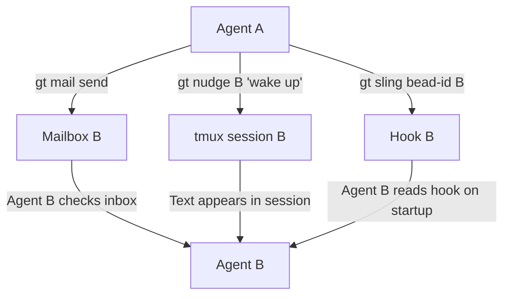
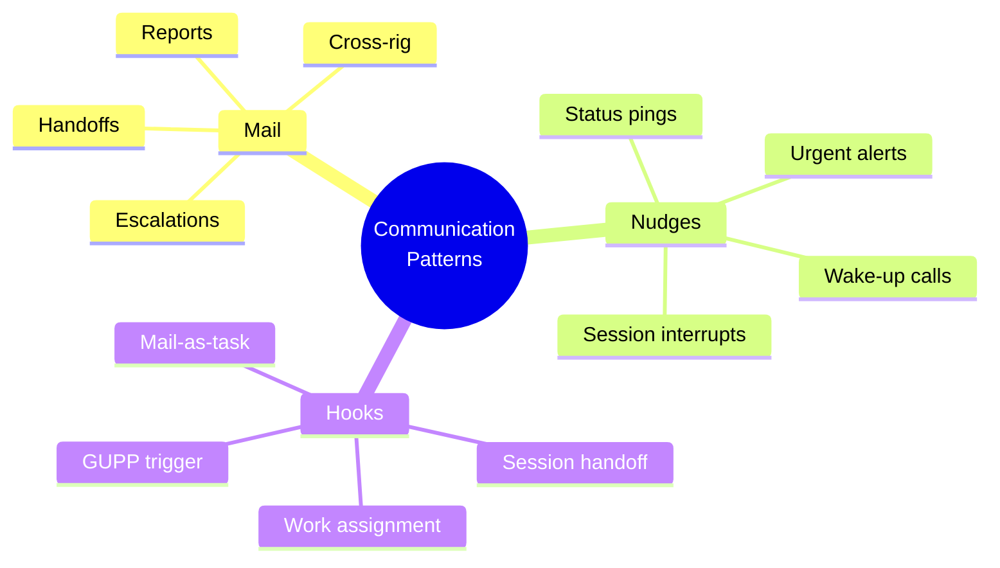
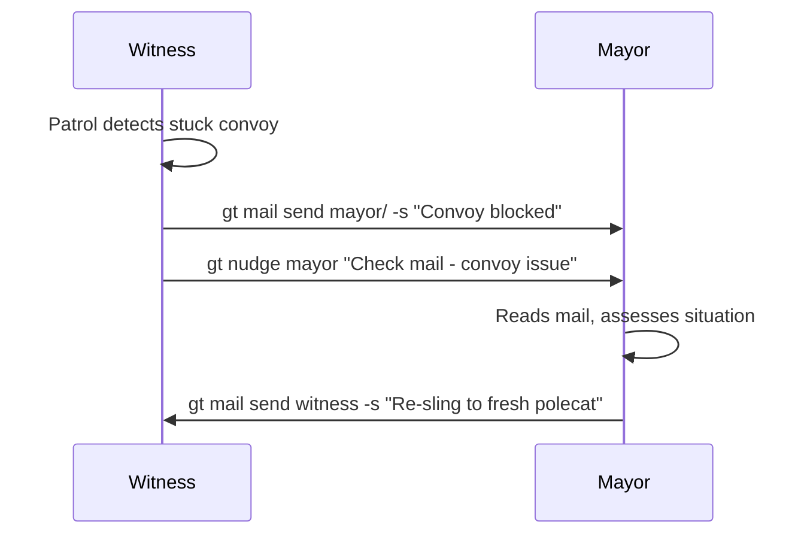
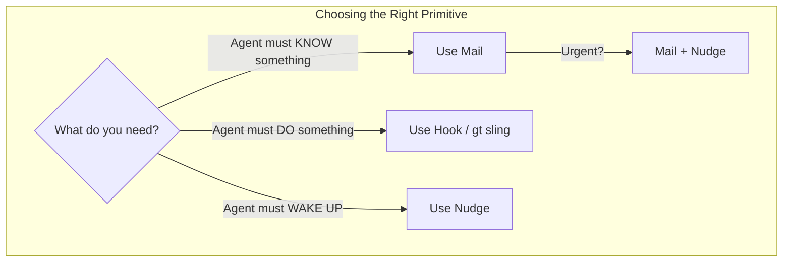
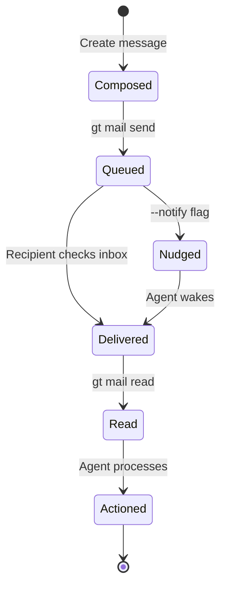

Gas Town agents are independent processes running in separate tmux sessions. They can't share memory, can't call each other's functions, and can't peek at each other's context windows. Yet they coordinate complex multi-agent workflows involving dozens of concurrent tasks. The secret is three complementary communication primitives: mail, nudges, and hooks.

<!-- truncate -->

## The Three Primitives

Each primitive serves a distinct purpose. Using the wrong one is a common source of confusion. For a full understanding of how these mechanisms enable autonomous agent behavior, see the [design principles](/docs/architecture/design-principles).

| Primitive | Delivery | Persistence | Use Case |
|-----------|----------|-------------|----------|
| **Mail** | Async (queued) | Durable (in beads) | Information transfer, reports, handoff context |
| **Nudge** | Immediate (tmux) | None | Wake sleeping agents, send short alerts |
| **Hook** | Immediate (filesystem) | Durable (survives restarts) | Work assignment |



## Mail: Async Information Transfer

Mail is the workhorse of agent communication. It's durable, queued, and doesn't require the recipient to be online.

### When to Use Mail

- **Sending reports** — Witness patrol digests, convoy status updates
- **Handoff context** — Notes for your next session about what you were doing
- **Escalation** — Notifying the Mayor about a blocked convoy
- **Cross-rig coordination** — Informing another rig's Witness about a dependency

### How It Works

```bash
# Send mail to another agent
gt mail send myproject/crew/alice -s "Auth bug found" -m "The token refresh is broken on line 145..."

# Send to the Mayor
gt mail send mayor/ -s "Convoy hq-cv-012 blocked" -m "Two beads are stuck waiting on external API..."

# Send to the human overseer
gt mail send --human -s "Need decision" -m "Should we use OAuth or JWT?"

# Check your inbox
gt mail inbox

# Read a specific message
gt mail read ga-abc12
```

Mail is stored as beads in the town-level beads database (`~/gt/.beads/`). This means mail survives restarts, crashes, and context compaction. An agent can go offline for hours and find all its mail waiting when it returns.

### Mail + Notify

For urgent mail where you also want to wake the recipient:

```bash
gt mail send myproject/polecats/toast -s "Urgent" -m "Tests failing on main" --notify
```

The `--notify` flag sends a tmux bell alongside the mail, which the recipient's session can detect.

## Nudge: Immediate Wake-Up

Nudges send text directly to another agent's tmux session. They're immediate but not persistent — if the agent isn't running, the nudge is lost.

### When to Use Nudges

- **Waking a sleeping agent** — After sending mail, nudge to ensure they check it
- **Quick status pings** — "Are you alive?"
- **Interrupting idle agents** — "Work is available on your hook"

### How It Works

```bash
# Nudge a specific agent
gt nudge myproject/polecats/toast "Check your mail - PR review waiting"

# Nudge with a shortcut target
gt nudge mayor "Status update needed"
gt nudge witness "Check polecat health"

# Common pattern: mail + nudge
gt mail send myproject/crew/bob -s "Code review" -m "PR #42 needs review"
gt nudge myproject/crew/bob "Check your mail - code review request"
```

### Why Not Just Nudge?

Nudges are unreliable for important information because:

1. **No persistence** — If the agent's session isn't running, the text vanishes
2. **No threading** — Nudges are raw text, not structured messages
3. **Context window pollution** — Frequent nudges consume the recipient's context
4. **No delivery guarantee** — You can't confirm the agent actually processed it

Use nudges as wake-up calls, not as primary information channels.

:::tip Match the Primitive to the Purpose
A common mistake is using nudges for information that should be mail, or mail for work that should be slung. Remember the rule: **mail for information, hooks for assignments, nudges for wake-ups**. If you want an agent to *know* something, send mail. If you want an agent to *do* something, create a bead and sling it.
:::

## Hooks: Durable Work Assignment

[Hooks](/docs/concepts/hooks) are the most powerful primitive. When work is attached to an agent's hook (via `gt sling`), it persists in the filesystem and survives any disruption.

### When to Use Hooks

- **Assigning work** — This is the primary use case
- **Session handoff** — `gt handoff` hooks work for your next session
- **Mail-as-assignment** — `gt mail hook <id>` hooks a mail message as ad-hoc work

### How It Works

```bash
# Sling work onto an agent's hook
gt sling gt-abc12 myproject

# Check your own hook
gt hook

# Hook a mail message as your assignment
gt mail hook ga-xyz99

# Handoff to yourself with context
gt handoff -s "Working on auth" -m "Check line 145 first"
```

The hook triggers [GUPP](/docs/concepts/gupp): when an agent starts and finds work on its hook, it begins immediately without confirmation. This is the engine that makes Gas Town autonomous.

:::caution Do Not Use Mail for Time-Sensitive Coordination
Mail is durable but asynchronous -- recipients only see messages when they check their inbox or get nudged. If you need an agent to react within seconds (for example, to abort a conflicting merge), use a nudge for the immediate alert and follow up with mail for the details.
:::

## Coordination Patterns



### Pattern: Witness → Mayor Escalation

When a Witness detects a problem it can't solve:



Mail carries the payload (detailed problem description). Nudge ensures the Mayor checks it promptly.

### Pattern: Handoff Between Sessions

When context fills up and you need a fresh session:

```bash
# Before cycling
gt handoff -s "Working on auth bug" -m "
Found the issue in token refresh.
Line 145 in auth.go has the race condition.
Tests 3 and 7 are the ones that catch it.
"
```

:::tip Include File Paths and Line Numbers in Handoff Mail
The most effective handoff notes include exact file paths and line numbers, not just descriptions of the problem. Your next session (or another agent picking up the work) can jump straight to the relevant code instead of spending tokens re-discovering the location.
:::

This creates a mail to yourself and hooks it. Your next session starts, reads the hook, reads the mail, and continues from where you left off.

The following timeline illustrates how mail delivery works asynchronously compared to immediate nudges.

```mermaid
timeline
    title Mail Delivery Flow Timeline
    00:00 : Sender composes : gt mail send
    00:01 : Mail queued : Stored in beads
    00:05 : Recipient checks : gt mail inbox
    00:06 : Mail delivered : Agent reads
    00:07 : Action taken : Agent processes
    00:10 : Optional nudge : Wake recipient
```



### Pattern: Cross-Rig Work Request

When work in your rig depends on a change in another rig, you can coordinate through beads and mail. The [crew workflow](/blog/crew-workflow) also supports cross-rig work using worktrees for human oversight:

```bash
# Create a bead in the other rig
bd create --rig backend "Fix API endpoint for our frontend feature"

# Sling it to the other rig's polecat pool
gt sling gt-backend-bead backend

# Send mail to the other rig's crew for context
gt mail send backend/crew/admin -s "Dependency" -m "We need the /api/auth endpoint fixed before our frontend can proceed"
```

For large cross-rig efforts involving multiple dependencies, consider using [advanced convoy patterns](/blog/advanced-convoy-patterns) to track progress across all repositories. The [communication CLI reference](/docs/cli-reference/communication) provides complete details on all mail, nudge, and hook commands.

:::info Hooks Are the Only Reliable Work Persistence Mechanism
When an agent's tmux session crashes or gets killed, any work assignment stored only in the agent's memory is lost. Hooks persist assignments to the filesystem, which means work survives crashes, restarts, and even full system reboots. This is why `gt sling` (which uses hooks) is the canonical way to assign work in Gas Town.
:::

:::note Mail Survives Everything -- Nudges Do Not
Mail is stored as beads in `~/gt/.beads/` and persists through agent crashes, context compaction, and full session restarts. A nudge, by contrast, is just text injected into a tmux pane -- if the agent is not running, the nudge disappears permanently. When in doubt, always send mail first and follow up with a nudge to wake the recipient.
:::

:::warning Avoid Sending Large Payloads via Nudge
Nudges inject raw text directly into the recipient's tmux session, which means every character counts against the agent's context window. Sending long diagnostic output, stack traces, or multi-paragraph messages via nudge can crowd out the agent's working context and degrade its performance. Keep nudges under one sentence and put detailed content in mail instead.
:::



## Anti-Patterns

**Don't use raw `tmux send-keys` for agent communication.** Always use `gt nudge`. Raw tmux commands are unreliable and bypass Gas Town's logging.

**Don't rely on nudges for important state changes.** If an agent must know about something, use mail (durable) or hooks (work assignment). Nudges are best-effort.

**Don't send mail for work that should be slung.** If you want an agent to *do* something, create a bead and sling it. Mail is for information, hooks are for assignments.

**Don't spam nudges.** Each nudge consumes context in the recipient's session. Batch your communication into one mail + one nudge rather than five nudges in a row.

## Next Steps

- [GUPP: The Propulsion Principle](/docs/concepts/gupp) — Why hooks trigger immediate execution
- [Work Distribution](/docs/architecture/work-distribution) — How hooks, mail, and beads form the assignment pipeline
- [Hooks: The Persistence Primitive](/blog/hook-persistence) — Deep dive into hook durability
- [Understanding GUPP](/blog/understanding-gupp) — The behavioral rule that makes hooks powerful
- [Session Cycling Explained](/blog/session-cycling) — How handoff mail preserves context across sessions
- [The Mail System](/blog/mail-system) — Deep dive into Gas Town's durable async messaging infrastructure
- [Nudge CLI Reference](/docs/cli-reference/nudge) — Commands for sending nudges to wake agents
- [Hook-Driven Architecture](/blog/hook-driven-architecture) — How hook-based communication enables autonomous agent workflows
- [Session Commands](/docs/cli-reference/session-commands) — CLI reference for managing agent sessions and communication channels
