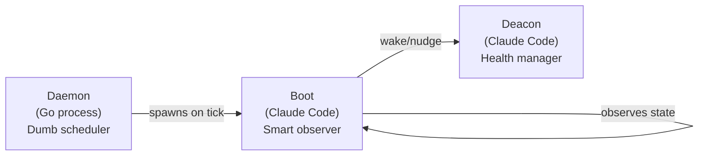
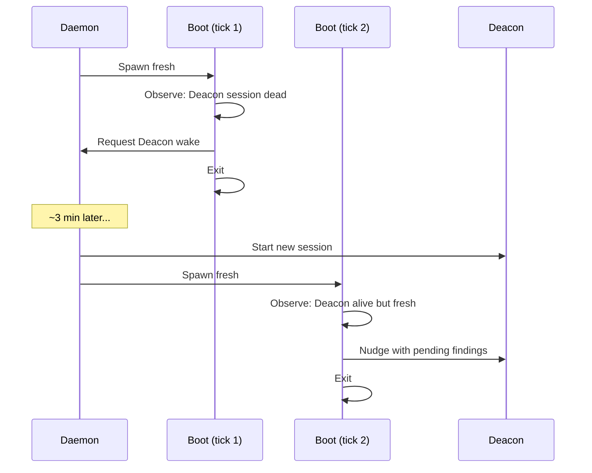

Every three minutes, a fresh agent spawns, takes a snapshot of the entire Gas Town system, makes a decision, and exits. No context from previous runs. No accumulated state. No bias from past observations. This is Boot — the simplest and most important safety mechanism in Gas Town.

<!-- truncate -->

## Why Boot Exists

Gas Town has a deliberate architectural split: the [Daemon](/docs/operations/lifecycle) is a "dumb" Go process that sends heartbeats and spawns sessions. The [Deacon](/docs/agents/deacon) is a "smart" Claude Code agent that makes health decisions. But what watches the watcher?

Boot fills this gap. It's a short-lived Claude Code session spawned by the Daemon on every tick. Its job is to answer one question: **is the Deacon alive and doing its job?**



Without Boot, a crashed Deacon would go unnoticed. Witnesses would stop getting dispatched. [Dogs](/docs/agents/dogs) would stop getting tasks. The entire supervision tree would quietly collapse while the Daemon kept sending heartbeats to nobody.

## The Triage Cycle

Boot follows a strict three-phase cycle: **Observe → Decide → Act**.

### Phase 1: Observe

Boot surveys the system in seconds:

- **Deacon status** — Is the session alive? When did it last produce output?
- **Witness inventory** — Are all expected Witnesses running?
- **Polecat census** — Any obvious zombies consuming resources?
- **Queue state** — Is the merge queue backed up?
- **Disk health** — Is disk space critically low?
- **Stale hooks** — Are there hooks with no active agent?

### Phase 2: Decide

Boot uses a precise decision matrix:

| Deacon State | Activity Level | Action |
|---|---|---|
| Dead session | N/A | **START** new Deacon session |
| Active output | N/A | **NOTHING** (healthy) |
| Idle < 5 min | N/A | **NOTHING** (recently active) |
| Idle 5-15 min | Has mail waiting | **NUDGE** with findings |
| Idle > 15 min | N/A | **WAKE** (restart session) |

### Phase 3: Act

Boot executes exactly one action:

- **Wake**: Request the Daemon to start a fresh Deacon session
- **Nudge**: Send findings to the Deacon's tmux session via `gt nudge`
- **Nothing**: Exit cleanly (the most common outcome)

## The Fresh Start Advantage

Boot's defining characteristic is that it starts clean every time. This gives it unique properties:

**No stale state.** A persistent agent can accumulate corrupted state from previous operations. Boot can't — every run observes reality as it actually is.

**Crash-proof.** If Boot crashes mid-triage, no work is lost. The next daemon tick spawns a fresh instance that tries again. There's no recovery to manage.

**Unbiased.** A long-running observer might develop blind spots — "I checked that 5 minutes ago, it was fine." Boot has no memory. It checks everything fresh.

**Low cost.** Boot runs for seconds, not hours. Short-lived sessions use minimal resources and context.

:::note Boot Is an Observer, Not a Fixer
Boot never takes corrective action itself. It only observes system state and either nudges the Deacon or requests a wake. This strict separation of concerns prevents Boot from becoming a complex agent that could itself get stuck. Think of it as the smoke detector, not the fire department.
:::

## Common Patterns

### Normal Healthy Tick (99% of Runs)

Most Boot runs find everything healthy:

```text
Spawn → Observe: Deacon active, recent output → Decide: NOTHING → Exit
```

Boot confirms health and exits in under 10 seconds. This is the expected state.

### Deacon Recovery After Crash

When the Deacon crashes, Boot handles the recovery across multiple ticks:



Tick 1 detects the crash and requests a wake. Tick 2 finds the new Deacon alive and nudges it with accumulated observations (stale hooks, pending warrants, etc.).

## Boot vs. Other Agents

Boot is unique in the Gas Town agent hierarchy:

| Property | Boot | Deacon | Witness | Polecats |
|---|---|---|---|---|
| Lifecycle | Per-tick (fresh) | Persistent | Persistent | Ephemeral (one task) |
| Intelligence | Triage only | Full health mgmt | Per-rig health | Task execution |
| Memory | None | Full session | Full session | Task context |
| Can fix problems | No (only alerts) | Yes | Yes (per-rig) | Yes (task scope) |

Think of Boot as the smoke detector. It doesn't fight fires — it rings the alarm so the Deacon can respond.

:::tip Check the Triage Log for Boot History
If you suspect Boot is not behaving correctly, inspect `~/gt/deacon/dogs/boot/triage-log.jsonl` for a complete record of every triage decision Boot has made. Each entry shows what Boot observed, what it decided, and what action it took. This is the fastest way to diagnose whether Boot is correctly detecting Deacon issues.
:::

## Troubleshooting

### Boot Is Not Running

Boot is spawned automatically by the Daemon. If Boot isn't running:

```bash
gt daemon status      # Is the Daemon alive?
gt daemon start       # Restart if needed
```

Boot has no independent lifecycle. If the Daemon runs, Boot runs.

### Deacon Not Being Woken

If the Deacon is dead and Boot isn't starting it:

1. Verify the Daemon: `gt daemon status`
2. Check Boot's triage log: `~/gt/deacon/dogs/boot/triage-log.jsonl`
3. If Boot decides NOTHING despite a dead Deacon, it may be misreading session state

### Boot Runs Taking Too Long

Boot is designed for sub-10-second triage. If it's slow:

- Disk I/O may be saturated
- Agent state files may be corrupted or oversized
- Too many rigs/agents to inventory quickly

## Next Steps

- [Boot Documentation](/docs/agents/boot) — Full reference for Boot's triage cycle and decision matrix
- [Deacon Documentation](/docs/agents/deacon) — The agent that Boot monitors and wakes
- [Infrastructure Dogs](/docs/agents/dogs) — Boot is a specialized dog in the Deacon's kennel
- [The Deacon: Gas Town's Background Coordinator](/blog/deacon-patrol) — How the Deacon handles the problems Boot identifies
- [Infrastructure Dogs: The Cleanup Crew](/blog/infrastructure-dogs) — How regular dogs differ from Boot's specialized triage role
- [The Daemon: Gas Town's Heartbeat](/blog/daemon-process) — How the daemon schedules Boot's observations
- [Death Warrants](/blog/death-warrants) — How Boot executes warrants to terminate stuck agents it discovers during triage
