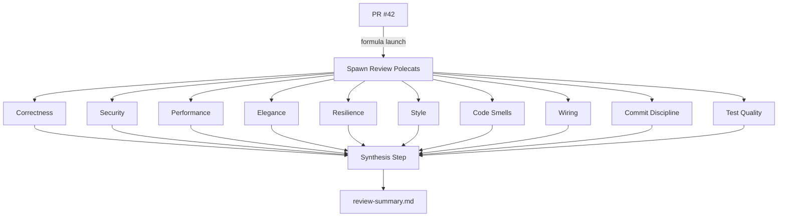
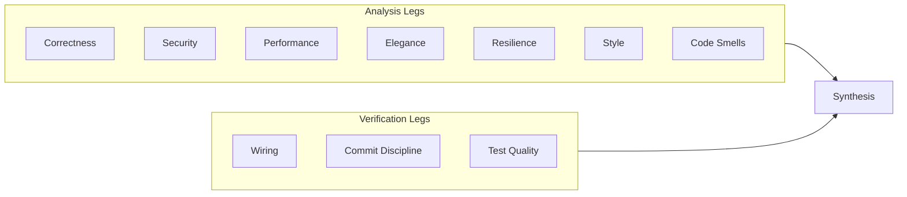
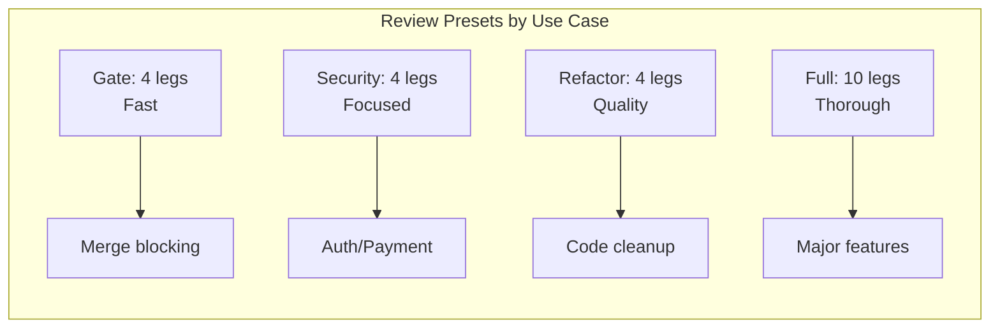
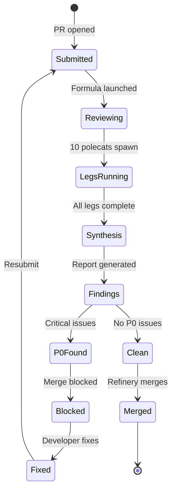
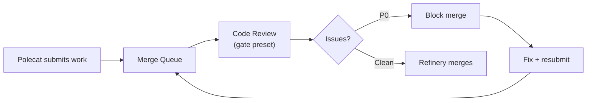
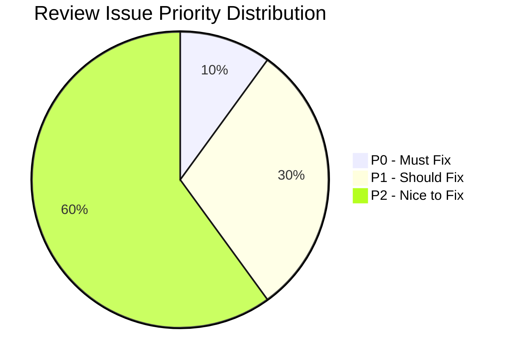

Most code reviews are one person reading diffs and leaving comments. Gas Town's `code-review` formula takes a fundamentally different approach: spawn 10 specialized polecats, each examining the code from a different perspective, then synthesize everything into a single prioritized report. A full review runs in minutes rather than hours.

<!-- truncate -->

## The Problem with Single-Reviewer Code Review

Human code review has well-known failure modes:

- **Attention fatigue.** By the 200th line of a large diff, reviewers start skimming.
- **Perspective bias.** A backend engineer focuses on logic, misses the CSS regression. A security engineer catches the injection but ignores the N+1 query.
- **Throughput bottleneck.** One reviewer processes one PR at a time. In a multi-agent system where polecats produce work every few minutes, the review queue backs up fast.

Gas Town solves these by parallelizing review across specialized dimensions.

## How It Works

The `code-review` formula is a convoy formula. When you run it, Gas Town spawns up to 10 polecats — each with a specific review lens:

```bash
gt formula run code-review --pr=42 --preset=full
```



Each polecat reads the diff, examines the code from its perspective, and writes findings to a structured markdown file. When all legs complete, a synthesis step deduplicates, prioritizes, and combines everything into `review-summary.md`.

## The 10 Review Dimensions

### Analysis Legs (Read and Analyze)

| Leg | What It Catches |
|-----|-----------------|
| **Correctness** | Off-by-one errors, null handling, race conditions, dead code, logic errors |
| **Performance** | O(n²) algorithms, N+1 queries, memory leaks, missing caching opportunities |
| **Security** | Injection, auth bypass, exposed secrets, OWASP Top 10 vulnerabilities |
| **Elegance** | Unclear naming, over-engineering, tight coupling, SOLID violations |
| **Resilience** | Swallowed errors, missing timeouts, partial failure states, retry gaps |
| **Style** | Naming violations, formatting issues, import organization, missing docs |
| **Code Smells** | God classes, long methods, deep nesting, copy-paste duplication |

### Verification Legs (Check Implementation)

| Leg | What It Catches |
|-----|-----------------|
| **Wiring** | Dependencies added but never imported, old code not replaced — the "installed but not wired" problem |
| **Commit Discipline** | Giant WIP commits, unhelpful messages, non-atomic changes that should have been split |
| **Test Quality** | Weak assertions, missing negative tests, tests that always pass, inadequate coverage |

The wiring leg is particularly valuable in multi-agent environments. When a polecat adds a dependency to `go.mod` but forgets to actually use it, or replaces an implementation but leaves the old one wired in, the wiring leg catches it.



## Presets: Matching Review Depth to Risk

Running all 10 legs on every PR would be expensive. Presets let you match review thoroughness to the change's importance:



### Gate (4 legs — fast, for merge gating)

```bash
gt formula run code-review --pr=42 --preset=gate
```

Runs: wiring, security, smells, test-quality. This is the minimum viable review — catches the most critical issues in minutes. Good as an automated merge gate in the Refinery pipeline.

### Full (10 legs — thorough)

```bash
gt formula run code-review --pr=42 --preset=full
```

Runs all 10 legs. Use for major features, security-sensitive changes, or release candidates. More expensive but comprehensive.

### Security-Focused (4 legs — security emphasis)

```bash
gt formula run code-review --pr=42 --preset=security-focused
```

Runs: security, resilience, correctness, wiring. When the change touches auth, payments, or any attack surface.

### Refactor (4 legs — quality emphasis)

```bash
gt formula run code-review --pr=42 --preset=refactor
```

Runs: elegance, smells, style, commit-discipline. When you're cleaning up code and want to ensure the refactoring actually improves things.

### Custom

```bash
gt formula run code-review --pr=42 --legs=security,correctness,wiring,test-quality
```

Pick exactly the legs you want.

## The Synthesis Step

Individual leg findings are useful, but the synthesis is where the real value emerges. The synthesis step:

1. **Deduplicates** — If both security and correctness flag the same SQL injection, it appears once.
2. **Prioritizes** — Issues are ranked P0 (must fix), P1 (should fix), P2 (nice to fix).
3. **Groups by theme** — Related issues are clustered for efficient fixing.
4. **Provides an executive summary** — A one-paragraph assessment and merge recommendation.

The following state diagram illustrates the complete review lifecycle from PR submission to final merge.



The output looks like:

```text
# Code Review Summary: PR #42 "Add rate limiting"

## Executive Summary
Solid implementation with 1 critical security issue (exposed API key in
config) and 2 major performance concerns (unbounded cache, missing index).
Recommend fixing P0 before merge.

## Critical Issues (P0)
- src/config/api.go:15 — API key in plaintext config file
  Impact: Credential exposure in version control
  Fix: Move to environment variable or secrets manager

## Major Issues (P1)
- src/cache/store.go:42 — Unbounded cache grows without eviction
- src/db/queries.go:18 — Sequential scan on high-cardinality column

## Positive Observations
- Clean separation of rate limiting logic from business logic
- Good test coverage for edge cases (429 responses, header values)
```

:::danger Always Review Synthesis Output Before Acting
While individual review legs can produce false positives, the synthesis step filters most of them out. However, the synthesis can also miss nuanced issues or misjudge severity. Always read the full synthesis report yourself before blocking merges based on P0 findings, especially in early deployments when the review formula is still being tuned.
:::


## Integrating with the Merge Queue

The code review formula integrates naturally with the Refinery:



For automated pipelines, the `gate` preset acts as a quality gate. The [Refinery](/docs/agents/refinery) can be configured to run a gate review before merging. If P0 issues are found, the merge is blocked and the original polecat (or a new one) is spawned to fix the issues.

This creates a continuous quality loop: polecats produce work, the review formula validates it, and the Refinery only merges clean code.

:::note Parallel Review Legs May Find Duplicate Issues
The correctness, security, and performance legs all examine the same code independently. When they flag the same issue from different perspectives, the synthesis step deduplicates these findings to prevent redundant fix work. Check the synthesis report rather than individual leg outputs to see the final deduplicated list.
:::

## Practical Tips

:::tip
**Start with `gate`, escalate to `full`.** The gate preset catches the most critical issues at 40% of the cost. Reserve full reviews for releases and major features.
:::

:::tip
**Review branches, not just PRs.** You can review any branch or even specific file patterns. This is useful for reviewing work-in-progress before it reaches the merge queue.
:::

:::warning
**Watch the cost.** A full 10-leg review spawns 10 polecats plus a synthesis step. Each polecat processes the entire diff. On large PRs, this can consume significant tokens. Use presets strategically.
:::

:::tip
**Create custom legs.** The code-review formula is a standard TOML formula — you can fork it and add legs specific to your project (accessibility, i18n, API compatibility, etc.).
:::



## Why This Approach Works

The parallel review model works because each perspective is genuinely independent. A security reviewer doesn't need to wait for the performance reviewer. A style reviewer doesn't need the correctness reviewer's findings. The only dependency is at the end: synthesis needs all leg outputs.

This is the exact pattern Gas Town is built for — independent parallel work with a final coordination step. The code-review formula is just a convoy where every bead is a review leg and the synthesis is the convoy's completion handler. For more sophisticated review orchestration across multiple pull requests, see [work distribution patterns](/blog/work-distribution-patterns) for strategies on batching and prioritizing review work, which build on the foundational [work distribution architecture](/docs/architecture/work-distribution).

## Next Steps

- [Code Review Workflow Reference](/docs/workflows/code-review) — Full reference with all presets, options, and output formats
- [Molecules & Formulas](/docs/concepts/molecules) — How convoy formulas orchestrate parallel review molecules
- [Polecats](/docs/agents/polecats) — The ephemeral workers that execute each review perspective
- [Formula Workflow](/docs/workflows/formula-workflow) — Operational guide to running and managing formula-based review workflows
- [Building Your First Custom Formula](/blog/custom-formulas) — Create custom review formulas with project-specific dimensions
- [The Refinery: How Merges Actually Work](/blog/refinery-deep-dive) — How the Refinery integrates with review gates
- [Formula Design Patterns](/blog/formula-design-patterns) — Patterns for building effective multi-step formulas
- [Molecules and Formulas](/blog/molecules-and-formulas) — How the molecule engine orchestrates the parallel review legs
- [Cost Optimization](/blog/cost-optimization) — Strategies for managing token costs when running multi-leg review formulas
