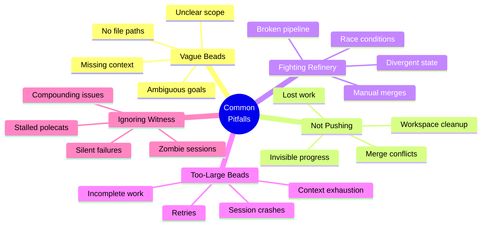
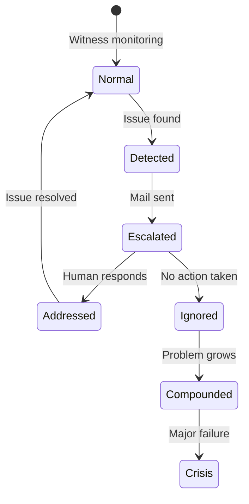
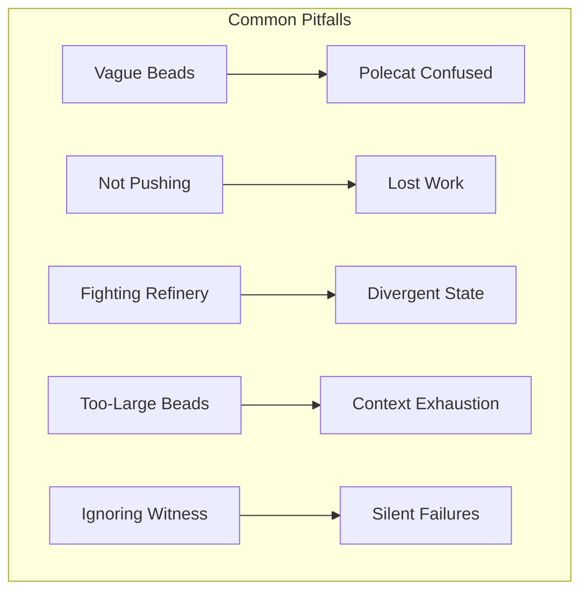
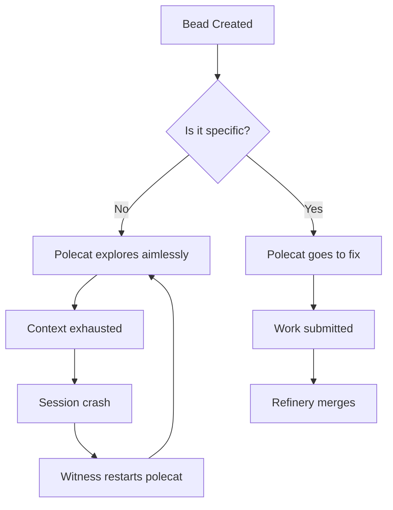
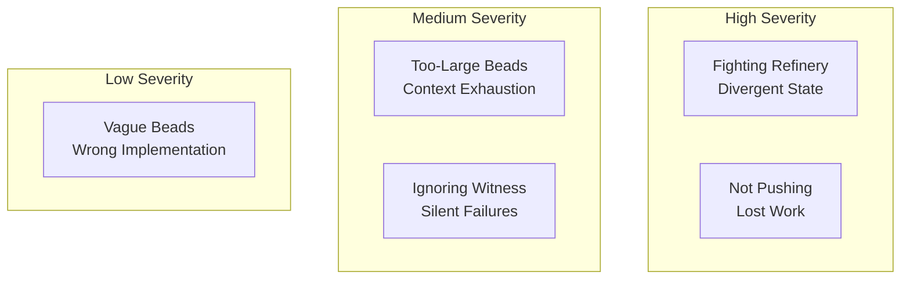
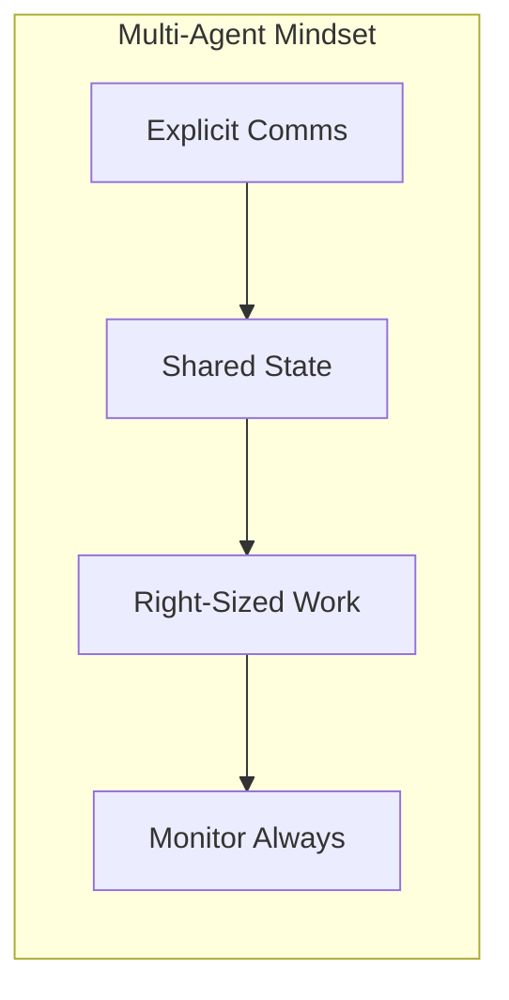
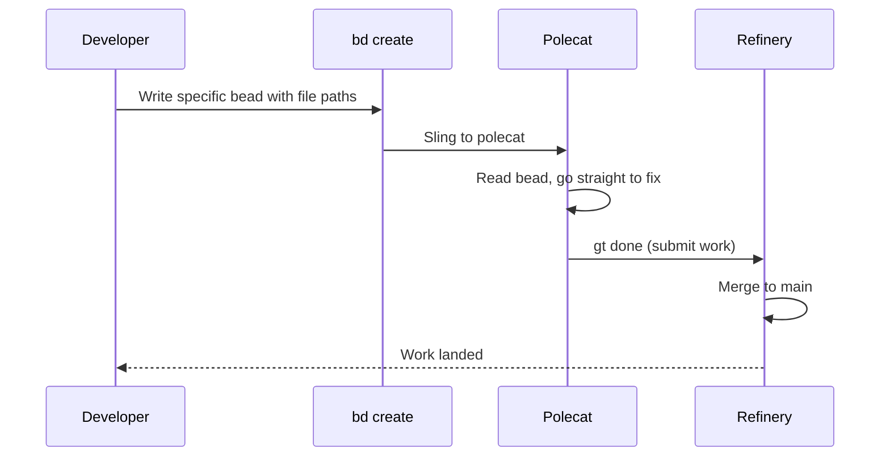

After helping many users get started with Gas Town, we've identified the patterns that trip people up most often. Here are the top five pitfalls and how to avoid them.

<!-- truncate -->

## 1. Writing Vague Beads

**The mistake:** Creating beads like "Fix the auth system" or "Make the API better."

**Why it fails:** Polecats are autonomous. They can't ask clarifying questions the way a human teammate would. A vague bead leads to an implementation that doesn't match what you wanted.

**The fix:** Write beads as if briefing a contractor who can't ask follow-up questions. This is also the most effective [cost optimization](/blog/cost-optimization) strategy:

```bash
# ❌ Vague
bd create --title "Fix auth"

# ✅ Specific
bd create --title "Fix JWT refresh: return 401 when refresh token expired" \
  --description "The /api/refresh endpoint returns 500 when the refresh token
is expired. It should return 401 with a clear error message. The token
validation is in src/auth/middleware.go line 45."
```

## 2. Not Pushing Before Cycling

**The mistake:** Running `gt handoff` or letting a session expire without pushing commits.

**Why it fails:** In a multi-agent environment, unpushed work is invisible. Other agents can't build on it. Worse, if your workspace gets cleaned up, uncommitted changes are lost.

**The fix:** Always follow the landing sequence:

```bash
git add <files>
git commit -m "Description"
git pull --rebase && git push   # Push BEFORE handoff
gt handoff -m "Context notes"
```

:::tip Make Pushing Muscle Memory
Treat `git push` like saving a file -- do it reflexively after every logical chunk of work. In a multi-agent environment where polecats are constantly merging code, waiting even an hour to push creates painful merge conflicts. The more frequently you push, the smaller and easier those conflicts become.
:::

:::danger Uncommitted Work Vanishes on Workspace Cleanup
Polecat workspaces are ephemeral and get deleted after the session ends. Crew workspaces persist, but any uncommitted changes in your working directory are invisible to other agents and will be lost if the workspace is accidentally removed or you switch machines. Always commit and push completed work immediately.
:::


## 3. Fighting the Refinery

**The mistake:** Trying to push directly to `main` when polecats are active, or manually merging branches.

**Why it fails:** The Refinery serializes all merges to prevent race conditions. Bypassing it creates divergent state that confuses every agent in the rig.

**The fix:** Let the pipeline work:
- **Polecats** submit via `gt done` — the Refinery handles the merge
- **Crew workers** push directly to `main` (this is fine — crew have push access)
- **Never** manually merge polecat branches

:::tip Include File Paths in Every Bead
The single most effective way to help a polecat succeed is to include the exact file path and line number in the bead description. Instead of "fix the auth bug," write "fix the race condition in `src/auth/middleware.go` line 145." This eliminates the exploration phase and lets the polecat start coding immediately.
:::

:::caution Polecats Cannot Ask Clarifying Questions
Unlike a human teammate who might message you when a task is ambiguous, a polecat will attempt to interpret vague instructions on its own and proceed with its best guess. This is why specificity in bead descriptions is critical -- there is no feedback loop before the work is submitted.
:::

## 4. Creating Too-Large Beads

**The mistake:** Creating a single bead for "Build the entire notification system" and assigning it to one polecat.

**Why it fails:** Polecats have context windows. A massive task fills the context before the work is done, leading to loss of focus, repeated work, and eventual stalling.

**The fix:** Break work into focused, session-sized beads. Each bead should be completable in one polecat session (roughly 15-30 minutes of coding):

```bash
# ❌ Too big
bd create --title "Build notification system"

# ✅ Right-sized
bd create --title "Add notification data model and migrations"
bd create --title "Create notification delivery service"
bd create --title "Add email notification channel"
bd create --title "Add in-app notification channel"
bd create --title "Write notification integration tests"
```

Bundle them in a convoy for tracking:

```bash
gt convoy create "Notification system" ga-a1 ga-b2 ga-c3 ga-d4 ga-e5
```

## 5. Ignoring the Witness

**The mistake:** Not checking what the Witness is reporting, or dismissing its escalations.

**Why it fails:** The Witness detects stalled polecats, zombie sessions, and Refinery issues. Ignoring its reports means problems compound silently until something breaks badly.

**The fix:** Check the feed regularly:

```bash
# See what's happening across all rigs
gt feed

# Check for escalations
gt mail inbox

# Run diagnostics if something seems off
gt doctor
```

The following mindmap categorizes the five major pitfall areas and their common symptoms.





When the Witness escalates something, address it promptly. A stalled polecat wastes tokens every minute it loops.

:::info Use `gt doctor` to Catch All Five Pitfalls at Once
The `gt doctor` command checks for vague beads (no file paths), unpushed work (uncommitted changes), Refinery conflicts (divergent branches), oversized beads (context exhaustion patterns), and Witness escalations (unread mail). Running it before slinging a new convoy catches most of these pitfalls before they cost tokens.
:::





## Bonus: The Debug Checklist

When something goes wrong in Gas Town, run through this checklist before escalating:

```bash
# 1. Is the system healthy?
gt doctor

# 2. Are agents running?
gt polecat list --rig <yourrig>

# 3. Is the Refinery processing?
gt mq list

# 4. Any stuck work?
bd list --status=in_progress

# 5. What does the feed say?
gt feed --last 20
```

:::warning Don't ignore Witness escalations
The Witness is your early warning system. When it sends you mail about stalled polecats or Refinery issues, address them immediately. A stalled polecat burns tokens every minute it loops, and Refinery blockages prevent all other polecats from landing their work. See the [Witness Explained](/blog/witness-explained) post for details on what each escalation type means.
:::

Most issues trace back to one of the five pitfalls above. Once you've diagnosed which one, the fix is straightforward.

:::note Run `gt doctor` as Your First Diagnostic Step
Before diving into manual debugging, always run `gt doctor` first. It performs a comprehensive health check across agents, the Refinery, hooks, and disk state in seconds. Most of the five pitfalls above produce distinct signatures in the doctor output, saving you the time of tracing the issue manually.
:::

## The Meta-Lesson

All five pitfalls share a common root: treating Gas Town like a single-developer tool. It's a **multi-agent system**, which means:

- Communication must be explicit (specific beads, not vague instructions)
- State must be shared (push early, push often)
- The pipeline must be respected (Refinery exists for a reason)
- Work must be right-sized (agents have limits)
- Monitoring matters (the supervision tree is there to help)

Once you internalize these principles, Gas Town becomes remarkably smooth. The [Eight Stages of Gas Town Maturity](/blog/eight-stages-self-assessment) framework can help you assess where you are on this journey. For comprehensive troubleshooting procedures when things go wrong, consult the [troubleshooting guide](/docs/guides/troubleshooting).

### Pitfall Severity and Recovery Effort

This chart shows the relative severity and recovery effort for each of the five common pitfalls.







```mermaid
timeline
    title The Cost of Vague Beads Over Time
    00:00 : Vague bead created
    00:05 : Polecat spawns : Context loading
    00:10 : Exploration phase : Searching codebase
    00:30 : Confused : Tries wrong approach
    00:45 : Context exhausted : Session crash
    01:00 : Retry session : Fresh polecat
    01:30 : Still unclear : Divergent implementation
    02:00 : Work submitted : Wrong solution merged
```

## Quick Reference: Pitfall vs Fix

| Pitfall | Symptom | One-Line Fix |
|---------|---------|-------------|
| Vague beads | Polecat implements wrong thing | Write beads like contractor briefs with file paths |
| Not pushing | Work vanishes after session cycle | Always `git push` before `gt handoff` |
| Fighting Refinery | Divergent state, broken merges | Let polecats use `gt done`, crew push to main |
| Too-large beads | Polecat stalls mid-task | Split into 15-30 minute session-sized beads |
| Ignoring Witness | Silent cascading failures | Check `gt feed` and `gt mail inbox` regularly |

## Further Reading

- **[Quick Start](/docs/getting-started/quickstart)** — Set up your first workspace correctly
- **[Beads](/docs/concepts/beads)** — Write effective beads that polecats can execute autonomously
- **[Crew Collaboration](/docs/workflows/crew-collaboration)** — Best practices for working alongside polecats
- **[Troubleshooting](/docs/operations/troubleshooting)** — Solutions when things go wrong
- **[Design Principles](/docs/architecture/design-principles)** — The "why" behind Gas Town's constraints
- **[Understanding GUPP](/blog/understanding-gupp)** — Why GUPP prevents the most common failure modes
- **[Your Second Convoy](/blog/your-second-convoy)** — Real-world convoy patterns that avoid beginner mistakes
- **[Session Cycling Explained](/blog/session-cycling)** — Avoid context window pitfalls with proper session management
- [FAQ](/docs/getting-started/faq) — Frequently asked questions about Gas Town setup and operations
- [Tap CLI Reference](/docs/cli-reference/tap) — Commands for safety guards and agent permission management
- [The Refinery Deep Dive](/blog/refinery-deep-dive) — Understand the merge pipeline to avoid fighting the Refinery
- [First Convoy](/blog/first-convoy) — Avoid common beginner mistakes by following the step-by-step first convoy tutorial
