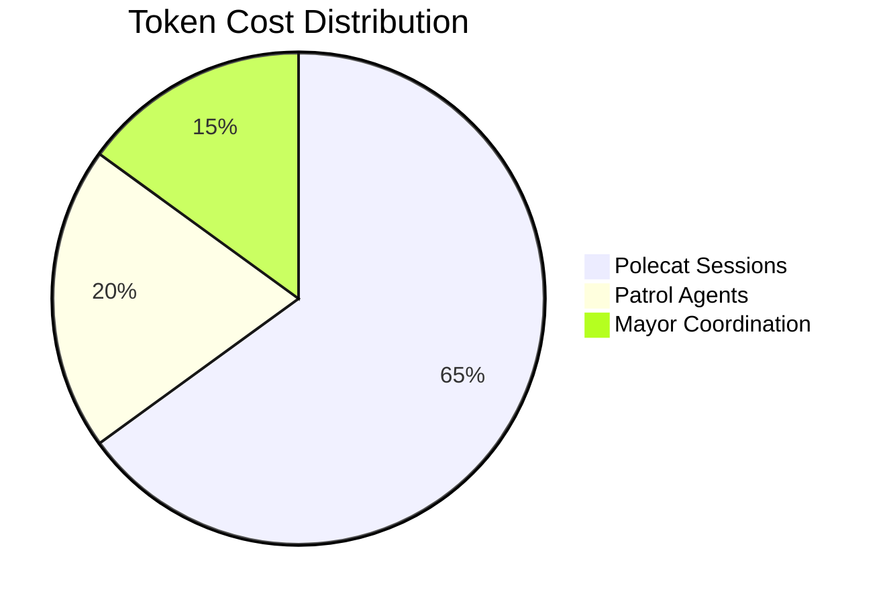
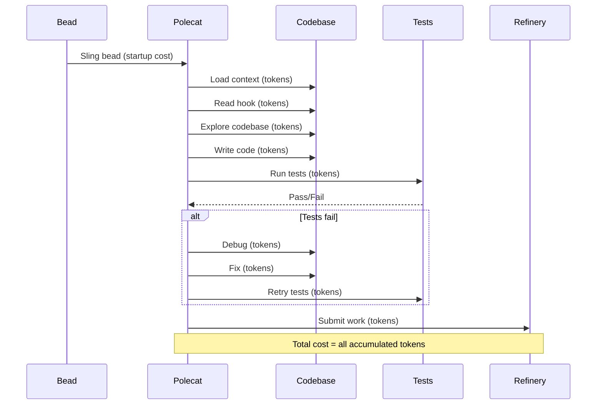
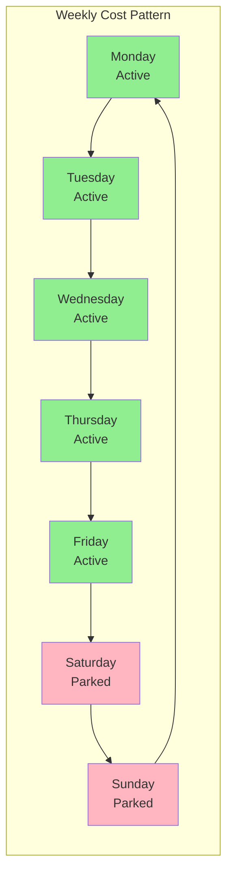
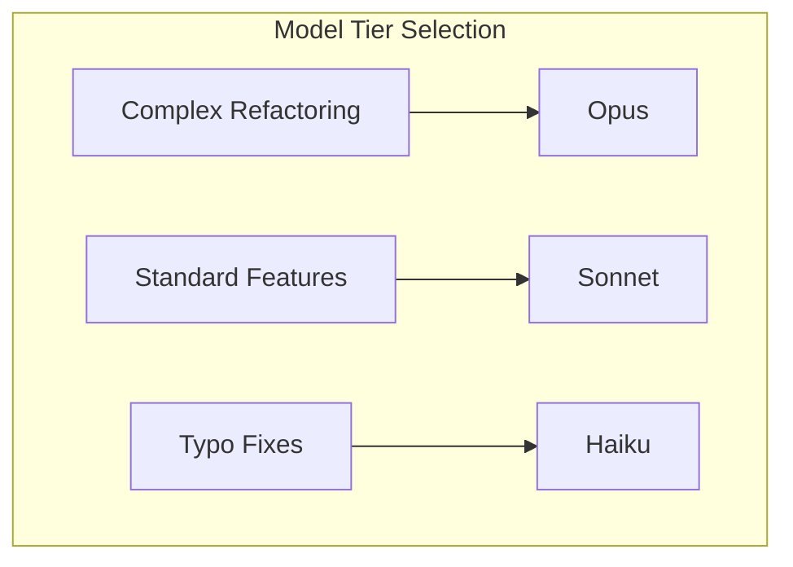
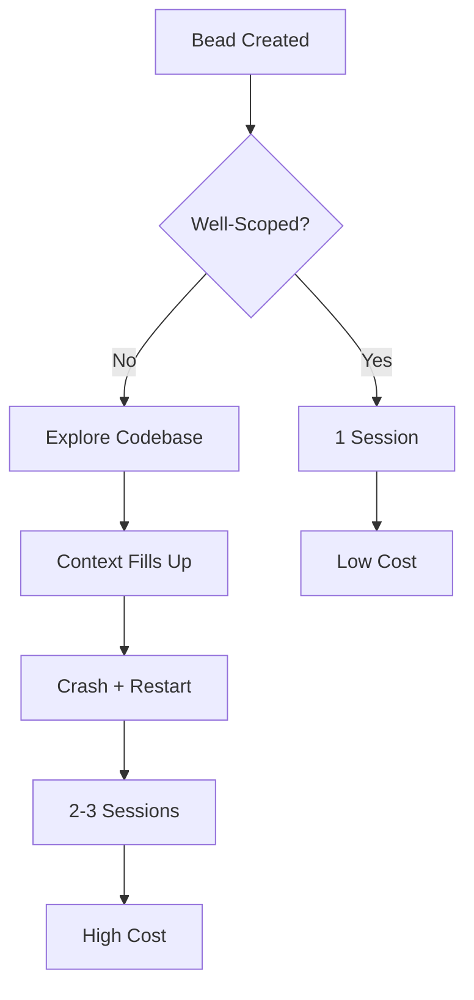
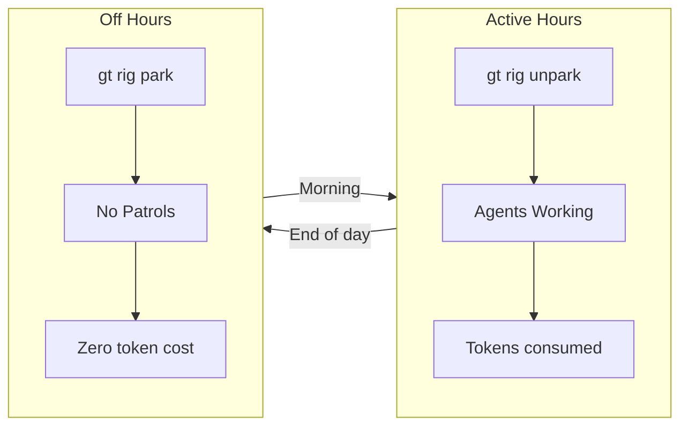

Running multiple AI agents in parallel is powerful, but it costs real money. Here's how to monitor costs, optimize your workflow, and avoid the common traps that burn through API budgets.

<!-- truncate -->

## Understanding Where Costs Come From

In a Gas Town setup, costs come from three main sources:

| Source | Cost Driver | Typical % |
|--------|------------|-----------|
| **Polecat sessions** | Token usage per task | 60-70% |
| **Patrol agents** (Witness, Refinery, Deacon) | Ongoing monitoring cycles | 15-25% |
| **Mayor coordination** | Decomposition and planning | 10-15% |

The single biggest cost driver is polecat sessions — each one consumes tokens to read context, reason about the task, write code, and self-review. Optimizing [polecat](/docs/agents/polecats) efficiency gives the best return.



## Strategy 1: Write Better Beads

The most impactful cost optimization is free: write better task descriptions. A well-scoped bead completes in one session. A vague bead burns through context trying to figure out what to do.

**Expensive bead:**
```bash
bd create --title "Fix the auth system" --type task
```

**Cheap bead:**
```bash
bd create --title "Fix token refresh race condition in auth/middleware.go:145" \
  --type bug --priority 1 \
  --description "The refreshToken() call doesn't hold the mutex, causing concurrent requests to get stale tokens. Add mutex.Lock() around lines 145-160."
```

The second bead gives the polecat a clear target. It doesn't need to explore the codebase to understand the problem — it goes straight to the fix.

:::tip The Cheapest Optimization Is a Better Bead Description
A vague bead like "Fix the auth system" forces the polecat to spend tokens exploring the codebase before it can even begin work. A precise bead with file paths, line numbers, and expected behavior goes straight to the fix. This single practice can cut per-bead token cost by 50% or more.
:::

**Rules of thumb for cost-effective beads:**
- One file, one function, one concern
- Include the file path and line number when known
- Describe the expected behavior, not just the symptom
- Set priority appropriately — P0/P1 beads get more powerful (expensive) models

:::note Bead Quality Affects Cost More Than Model Selection
A well-written bead executed by Haiku (the cheapest model) will often cost less in total than a vague bead executed by Sonnet that requires multiple retry sessions. Invest time in writing clear, specific bead descriptions before trying to optimize by switching to cheaper models.
:::


## Strategy 2: Right-Size Your Convoys

Don't fan out to 10 polecats when 3 would do. Each polecat session has fixed overhead (loading context, reading the hook, running preflight). Small tasks don't justify that overhead.

**Over-decomposed (expensive):**
```bash
# 5 separate polecats for trivial changes
bd create --title "Fix typo in README line 12"
bd create --title "Fix typo in README line 45"
bd create --title "Fix typo in README line 78"
bd create --title "Fix typo in CONTRIBUTING line 3"
bd create --title "Fix typo in CHANGELOG line 8"
```

**Right-sized (efficient):**
```bash
# One polecat handles all typos
bd create --title "Fix typos across README, CONTRIBUTING, and CHANGELOG" \
  --description "README: line 12 (teh→the), line 45 (recieve→receive), line 78 (occured→occurred). CONTRIBUTING: line 3 (submiting→submitting). CHANGELOG: line 8 (relaesed→released)."
```

The following sequence diagram shows how costs accumulate across a polecat's lifecycle.



:::info Session Restarts After Crashes Are Full-Cost Operations
When a polecat crashes mid-task and restarts, the new session starts from scratch -- re-reading all context, re-loading the hook, and re-evaluating what was already done. This means a task that crashes once costs roughly 2x the tokens of one that completes on the first try. Reducing crash rates (through better beads, stable tests, and smaller tasks) has an outsized impact on total cost.
:::

## Strategy 3: Control Patrol Frequency

Patrol agents (Witness, Deacon) cycle on a fixed interval. If your project has quiet periods, consider parking the rig:

```bash
# Park the rig during off-hours (no agent cycles)
gt rig park myproject

# Unpark when you're ready to work
gt rig unpark myproject
```



Parked rigs don't consume any API tokens. The Deacon daemon skips them entirely.

## Strategy 4: Monitor Token Usage

Track your costs by examining session activity:

```bash
# See recent activity and rough token consumption
gt feed --rig myproject

# Check how many polecats ran today
gt polecat list --rig myproject --status=all

# Review convoy efficiency
gt convoy list
```

**Key metrics to watch:**
- **Sessions per bead** — If beads regularly need 2+ sessions (polecat crashes and restarts), your beads may be too complex or your tests too strict
- **Time to merge** — Long merge times in the Refinery suggest frequent conflicts, meaning beads are touching overlapping files
- **Stranded work** — Beads sitting unassigned waste convoy overhead without producing value

For comprehensive visibility into your fleet's behavior, combine these metrics with the techniques described in [monitoring your fleet](/blog/monitoring-fleet) and the [monitoring operations](/docs/operations/monitoring) guide.

## Strategy 5: Use the Right Model Tier

Gas Town supports multiple model tiers. Match the model to the task:

| Task Type | Recommended Tier | Why |
|-----------|-----------------|-----|
| Complex refactoring | Opus (highest) | Needs deep reasoning |
| Standard features | Sonnet (default) | Good balance of cost/capability |
| Typo fixes, formatting | Haiku (cheapest) | Simple tasks don't need big models |

Configure at the rig level:

```bash
# Set default model for a rig
gt rig config myproject model sonnet

# Override for specific beads (via formula)
gt formula edit polecat-standard --model haiku
```

:::danger Never Let Polecats Run Without a Working Test Suite
If your project has no tests or only broken tests, polecats have no way to validate their own work. They will submit untested code to the Refinery, which will merge it to main unchecked. This can corrupt your codebase quickly when running multiple agents in parallel. Always ensure at least a basic passing test suite before slinging work.
:::

## Strategy 6: Batch Related Work

Instead of creating 5 separate convoys for related features, batch them into one:

```bash
# One convoy, all related beads
gt convoy create "Q1 API Improvements" ga-b1 ga-b2 ga-b3 ga-b4 ga-b5

# Sling in one burst — polecats share the Refinery more efficiently
for bead in ga-b1 ga-b2 ga-b3 ga-b4 ga-b5; do
  gt sling $bead backend
done
```

Batching reduces Refinery overhead (fewer individual merge cycles) and gives the Mayor better visibility for progress reporting.



:::warning Fix Flaky Tests Before Scaling Up
A test that fails 20% of the time does not just cost 20% more -- it compounds. Each polecat retry is a full fresh session with all its startup overhead, and retries can cascade when the Refinery rejects merge requests. Fix any test with a flake rate above 5% before adding more polecats to a rig.
:::

:::note Park Rigs During Off-Hours to Eliminate Idle Costs
Patrol agents (Witness, Deacon) cycle continuously on active rigs, consuming API tokens even when no productive work is happening. Running `gt rig park <rig>` during nights and weekends immediately stops all patrol cycles for that rig. Unpark in the morning with `gt rig unpark <rig>` and agents resume exactly where they left off.
:::





## Common Cost Traps

**The "just one more polecat" trap.** It's tempting to throw more parallelism at a problem. But each polecat has startup costs, and if they touch overlapping files, the Refinery spends more time resolving conflicts — which triggers re-runs.

**The "perfect test suite" trap.** Overly strict tests cause polecats to fail and retry. Each retry is a fresh session. A test that flakes 20% of the time costs you 20% more per bead. Fix flaky tests before scaling up polecats.

**The "always-on patrol" trap.** Running the Witness and Deacon 24/7 on a project you only use during business hours doubles your patrol costs for zero benefit. Park when idle.

**The "mega-bead" trap.** A bead that requires 3000+ lines of changes will exhaust the polecat's context window, causing a crash and restart. Break large work into smaller beads — it's cheaper even accounting for the overhead.

## Quick Reference: Cost Optimization Checklist

```text
[ ] Beads include file paths and specific descriptions
[ ] Convoys are 3-10 beads (not 1, not 50)
[ ] Rig is parked during idle hours
[ ] Flaky tests are fixed (< 5% flake rate)
[ ] Model tier matches task complexity
[ ] No beads requiring > 1000 lines of changes
[ ] Related work is batched into single convoys
```

## Next Steps

- **[Convoys](/docs/concepts/convoys)** — Batch tracking and auto-close
- **[Formulas](/docs/concepts/molecules)** — Configure molecule behavior including model selection
- **[Operations Guide](/docs/operations/troubleshooting)** — Debug cost anomalies
- **[Mayor Workflow](/docs/workflows/mayor-workflow)** — Automatic work decomposition
- **[Scaling Beyond 30 Agents](/blog/scaling-beyond-30)** — Architectural patterns for cost-effective large deployments
- **[Monitoring Your Fleet](/blog/monitoring-fleet)** — Track spending and identify optimization opportunities
- **[Session Cycling Explained](/blog/session-cycling)** — Context management strategies that reduce wasted tokens
- **[Common Pitfalls](/blog/common-pitfalls)** — Avoid the cost traps and anti-patterns that burn through API budgets
- **[Understanding GUPP](/blog/understanding-gupp)** — How GUPP's persistence reduces expensive retry costs
- **[Cost Management Guide](/docs/guides/cost-management)** — Comprehensive guide to monitoring and reducing API costs
