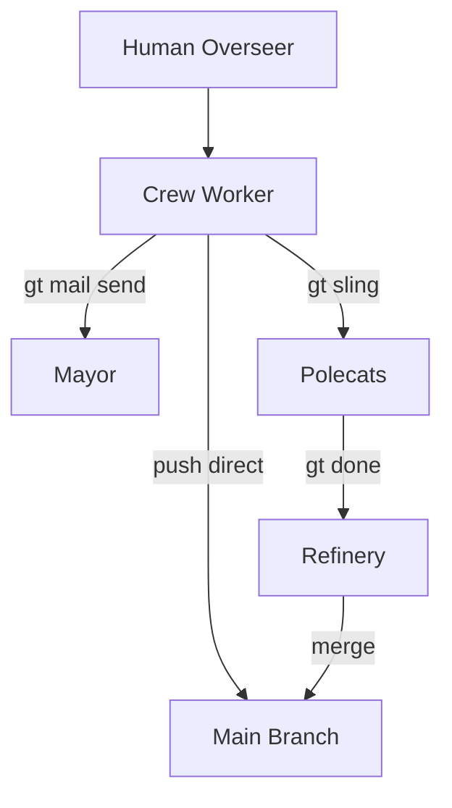
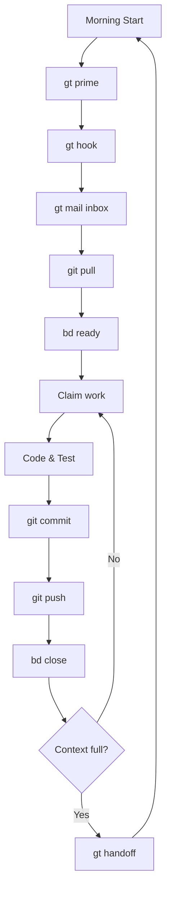
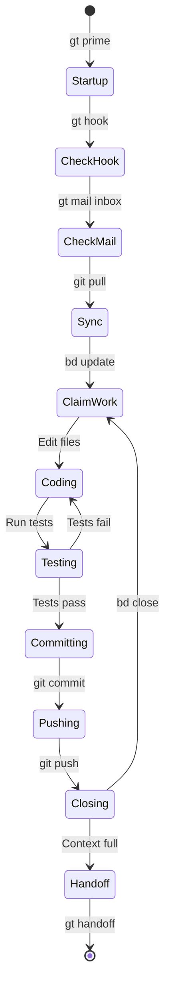
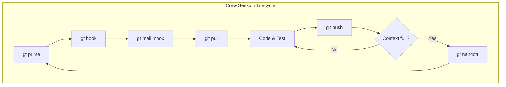
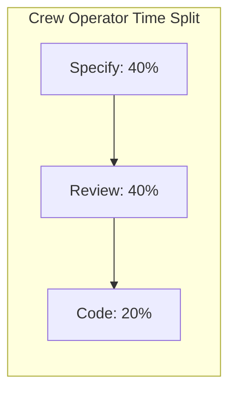
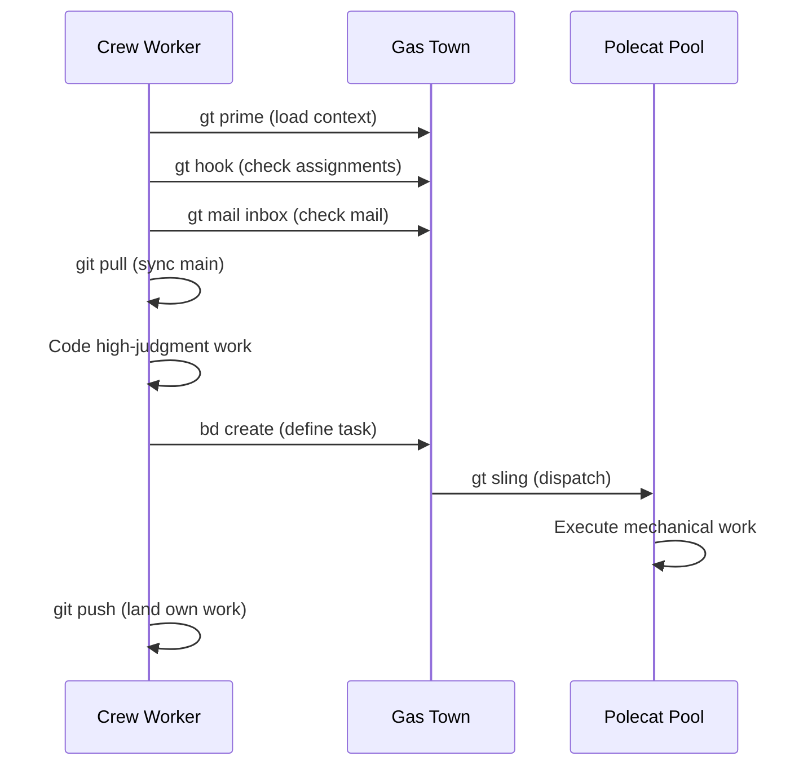
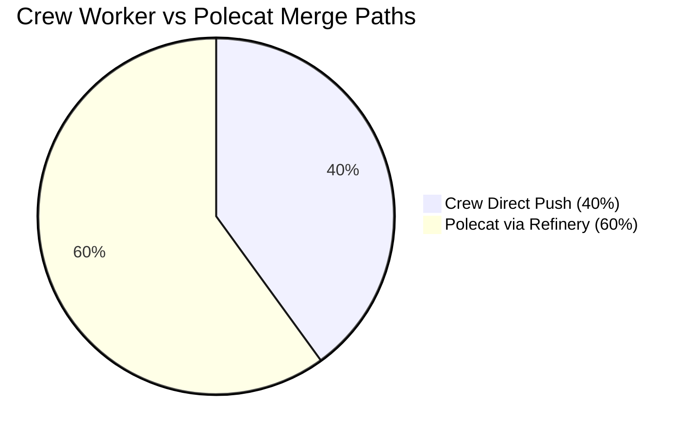

Gas Town is not just for AI agents. Human developers have their own workspace type -- the **crew worker** -- designed to integrate seamlessly with the agent fleet. You get a persistent clone, direct push access to main, and the full Gas Town communication stack.

<!-- truncate -->

## What Makes Crew Different

Polecats are ephemeral. They spawn, do one task, submit to the merge queue, and self-destruct. Crew workers are the opposite:

| Property | Polecats | Crew |
|----------|----------|------|
| **Lifecycle** | Minutes to hours | Weeks to months |
| **Merge path** | Submit MR to Refinery | Push directly to main |
| **Monitoring** | Witness-supervised | Self-managed |
| **Workspace** | Isolated worktree (nuked after use) | Persistent git clone |
| **Identity** | Auto-generated name (toast, alpha) | Chosen name (dave, emma) |

Crew workers push directly to main because they have human judgment. There is no need for the Refinery to validate their work -- the human reviewer is already in the loop. For details on the complete agent ecosystem, see the [polecats documentation](/docs/agents/polecats).



## Setting Up a Crew Workspace

Adding a crew member to a rig creates a full git clone:

```bash
# Add a crew workspace
gt crew add myproject dave

# Attach to the workspace
gt crew at dave --rig myproject
```

This creates:

```text
~/gt/myproject/crew/dave/    # Full git clone
├── .git/                    # Independent git history
├── src/                     # Your working copy
└── ...
```

The clone is completely independent. You can have uncommitted changes, experimental branches, and work-in-progress without affecting any other agent.

## The Daily Workflow

### Morning Startup

```bash
# 1. Load context
gt prime

# 2. Check your hook (any assigned work?)
gt hook

# 3. Check mail
gt mail inbox

# 4. Pull latest from main
git pull

# 5. Check what's ready to work on
bd ready
```



### Working on Issues

```bash
# Claim an issue
bd update ga-abc --status in_progress

# Do the work...
# (edit files, run tests, etc.)

# Commit and push directly to main
git add -A
git commit -m "Fix auth bug in token refresh"
git push

# Close the issue
bd close ga-abc --reason "Fixed in commit abc1234"
```

The following state diagram shows the typical crew worker states throughout a work session.



:::warning Crew Direct Push Bypasses All Quality Gates
Unlike polecats, whose work goes through the Refinery for validation and testing, crew workers push directly to main with no automated review. This is powerful but risky. Run your test suite locally with full coverage before pushing, especially when working alongside active polecats who assume main is always stable.
:::


### Communicating with Agents

```bash
# Send mail to the Mayor
gt mail send mayor/ -s "Feature request" -m "Add rate limiting to the API"

# Nudge a stuck polecat
gt nudge myproject/toast "Check your mail - the API endpoint changed"

# Create work and dispatch it
bd create "Add input validation" --type task --priority 1
gt sling ga-xyz myproject
```

## Session Cycling for Crew

Unlike polecats (which cycle automatically when context fills), crew workers cycle at their own pace:

- **Context getting full?** Run `gt handoff -m "notes for next session"`
- **Finished a chunk of work?** Good time to cycle for a fresh perspective
- **Need to step away?** Commit, push, and your hook preserves your assignment

The key difference: crew cycling is optional and human-controlled. You are never forced to cycle.

```bash
# Handoff with context notes
gt handoff -s "Working on auth refactor" -m "
Finished token refresh logic.
Next: update the middleware in auth/middleware.go.
The failing test is TestRefreshExpired - needs mock update.
"
```



:::info Crew Workers See the Same Feed as Agents
Running `gt feed` in a crew workspace shows all agent activity across the rig in real time -- polecat spawns, Refinery merges, Witness escalations, and convoy progress. This is the fastest way to stay aware of what the fleet is doing without interrupting any agent.
:::

## Working Across Rigs

Sometimes you need to fix something in a different project. Gas Town's worktree system lets you work on other rigs without leaving your crew workspace:

```bash
# Create a worktree in another rig
gt worktree beads

# Now you can work in ~/gt/beads/crew/myproject-dave/
# Your identity stays as myproject/crew/dave

# When done, remove the worktree
gt worktree remove beads
```

This is better than using `gt sling` (which dispatches work to a polecat) because you maintain human judgment over the fix.

:::caution Worktrees Bypass the Refinery Queue
When you use a worktree to work in another rig, you push directly to that rig's main branch, bypassing its Refinery merge queue. This is powerful but means no automated testing or conflict resolution happens. Only use worktrees for fixes you are confident about, and always run the full test suite locally before pushing.
:::

:::danger Always Remove Worktrees When Done
Worktrees are full git clones that persist on disk even after you finish the work. Forgetting to run `gt worktree remove` after completing cross-rig work leaves stale clones that consume disk space and can cause confusion later when you accidentally edit files in the wrong workspace. Make `gt worktree remove` the final step of any cross-rig fix.
:::

## Crew vs. Vibe Coding

Gas Town embraces "vibe coding" -- letting AI do the heavy lifting while you focus on direction and review. Crew workers sit at the intersection:

- **Specify work clearly** -- Write good bead descriptions so polecats know exactly what to build
- **Review polecat output** -- Check merged code, file follow-up beads for issues
- **Handle the hard stuff** -- Take on complex refactoring, architecture decisions, and sensitive operations that benefit from human judgment
- **Stay in the loop** -- Use `gt feed` and `gt convoy list` to monitor progress

The most effective Gas Town operators spend 80% of their time on specification and review, and 20% on direct coding in their crew workspace. For strategies on maximizing the value you get from AI work while minimizing wasted tokens, see [cost optimization](/blog/cost-optimization). Understanding the [design principles](/docs/architecture/design-principles) that shaped Gas Town helps crew members work more effectively with the agent fleet.



:::warning Push Early and Often
In a multi-agent environment, polecats are constantly merging code to main. If you hold uncommitted changes in your crew workspace for too long, you will face painful merge conflicts when you finally pull. Push after every logical chunk of work to stay in sync with the fleet.
:::

:::tip Use `gt handoff` to Preserve Context Across Sessions
When your context window fills up or you finish a work chunk, always run `gt handoff` with descriptive notes before cycling. The handoff creates a mail to yourself and hooks it, so your next session automatically picks up exactly where you left off -- no manual ramp-up needed.
:::

:::note Crew Workers Can Dispatch Work to Polecats
You do not need to do everything yourself in a crew workspace. For well-defined, repetitive tasks, create a bead with a clear description and sling it to a polecat with `gt sling`. This lets you focus on high-judgment work while the agent fleet handles the mechanical tasks in parallel.
:::





## Best Practices

1. **Push frequently.** In a multi-agent environment, unpushed work diverges fast. Push after every logical chunk.
2. **Use handoff mail.** Even for your own next session, good notes save significant ramp-up time.
3. **Keep git status clean.** Before stepping away, commit or stash everything. A dirty workspace causes confusion on restart.
4. **File beads for follow-ups.** If you notice something while working, file a bead rather than trying to fix everything at once.
5. **Communicate through Gas Town channels.** Use `gt mail` and `gt nudge` rather than side channels so all coordination is observable.

For more guidance on effective crew practices, see [common pitfalls](/blog/common-pitfalls) to avoid mistakes that waste time and tokens.

## Next Steps

- [Crew Workers](/docs/agents/crew) -- Full crew worker reference
- [Crew Collaboration](/docs/workflows/crew-collaboration) -- Patterns for crew members working with agents
- [Git Workflow](/docs/guides/git-workflow) -- Multi-agent git workflow patterns
- [Session Cycling](/docs/concepts/session-cycling) -- How context refresh works for crew
- [Cost Management](/docs/guides/cost-management) -- Optimizing token spend across your team
- [Session Cycling Explained](/blog/session-cycling) -- How crew members handle context limits with handoffs
- [Agent Communication Patterns](/blog/agent-communication-patterns) -- Mail, nudges, and hooks for crew coordination
- [The Mayor Workflow](/blog/mayor-workflow) -- How crew members interact with Mayor-driven automation
- [Git Workflows for Multi-Agent Teams](/blog/git-workflows-multi-agent) -- Git strategies for crew members working alongside parallel agents
- [Git Worktrees](/blog/git-worktrees) -- How crew workers use worktrees for cross-rig work without creating polecats
- [Understanding Rigs](/blog/understanding-rigs) -- How crew workspaces are organized within the rig structure
- [Agents Overview](/docs/cli-reference/agents) -- CLI reference for managing crew and agent workspaces
