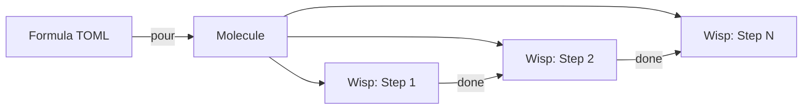
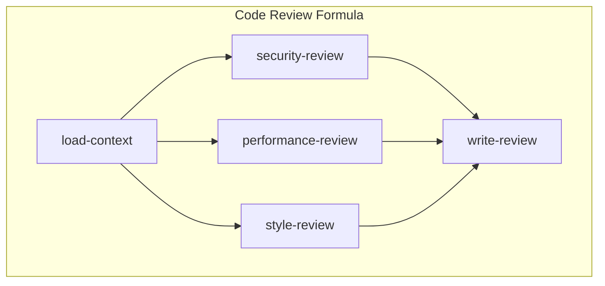

Gas Town ships with built-in formulas for common workflows, but the real power comes from writing your own. Custom formulas let you define exactly how agents handle your specific tasks — from code review pipelines to database migration workflows.

<!-- truncate -->

## What's a Formula?

A formula is a TOML file that defines a sequence of steps for an agent to follow. When work gets assigned, Gas Town "pours" the formula into a molecule — a live workflow instance that tracks progress through each step.

```text
Formula (TOML template)  →  pour  →  Molecule (running workflow)
```

The key benefit: if an agent crashes mid-workflow, the molecule remembers which steps completed. The next agent picks up exactly where the last one left off.



## Anatomy of a Formula

Every formula lives in `.beads/formulas/` and follows this structure:

```toml
[formula]
id = "my-custom-workflow"
name = "My Custom Workflow"
description = "What this workflow does"
version = "1.0.0"

[[steps]]
id = "step-1"
title = "First step"
description = """
Detailed instructions for the agent.
This is what the agent reads to know what to do.
"""

[[steps]]
id = "step-2"
title = "Second step"
needs = ["step-1"]
description = """
This step runs after step-1 completes.
"""
```

The `needs` field creates dependencies — step-2 won't start until step-1 is done.

## Example: Code Review Formula

Let's build a formula that guides an agent through a structured code review:

```toml
[formula]
id = "code-review"
name = "Structured Code Review"
description = "Systematic code review with security, performance, and style checks"
version = "1.0.0"

[[steps]]
id = "load-context"
title = "Load PR context"
description = """
Read the PR description and all changed files.
Understand the intent of the changes before reviewing.

```bash
gh pr view {{pr_number}} --json title,body,files
gh pr diff {{pr_number}}
```

Note the files changed, the PR title, and any linked issues.
"""

[[steps]]
id = "security-review"
title = "Security review"
needs = ["load-context"]
description = """
Check all changed files for security issues:
- SQL injection risks (unsanitized input in queries)
- XSS vulnerabilities (unescaped output in templates)
- Authentication/authorization bypasses
- Secrets or credentials in code
- Unsafe deserialization

If you find issues, add them to your review notes with severity.
"""

[[steps]]
id = "performance-review"
title = "Performance review"
needs = ["load-context"]
description = """
Check for performance issues:
- N+1 query patterns
- Missing database indexes for new queries
- Unbounded loops or recursion
- Large allocations in hot paths
- Missing pagination on list endpoints

Note: this step runs in parallel with security-review since both
only depend on load-context.
"""

[[steps]]
id = "style-review"
title = "Style and consistency review"
needs = ["load-context"]
description = """
Check code style and consistency:
- Follows existing patterns in the codebase
- Consistent naming conventions
- Appropriate test coverage for new code
- Documentation for public APIs
- No dead code or commented-out blocks
"""

[[steps]]
id = "write-review"
title = "Write and submit review"
needs = ["security-review", "performance-review", "style-review"]
description = """
Compile findings from all review steps into a single PR review.
Categorize findings as:
- 🔴 Must fix (security issues, bugs)
- 🟡 Should fix (performance, maintainability)
- 🟢 Suggestion (style, optional improvements)

Submit the review via:
```bash
gh pr review {{pr_number}} --body "review content"
```
"""
```

Notice how `security-review`, `performance-review`, and `style-review` all depend only on `load-context`. In theory, they could run in parallel (though a single agent executes them sequentially).

## Variables with Double Braces

Formulas support `{{variable}}` placeholders that get filled when the molecule is poured:

```toml
[[steps]]
id = "checkout"
title = "Check out the target branch"
description = """
```bash
git checkout {{branch_name}}
git pull origin {{branch_name}}
```
"""
```

When you pour this formula, you provide the variable values:

```bash
gt mol pour code-review --var pr_number=42 --var branch_name=feature/auth
```

## Step Types: Gates and Pauses

Some workflows need to wait for external events. Use gates for this:

```toml
[[steps]]
id = "wait-for-ci"
title = "Wait for CI to pass"
gate = true
gate_type = "gh:run"
description = """
Create a gate and park. The Deacon will close this gate
when the GitHub Actions run completes.

```bash
bd gate create --type gh:run --run-id <run-id> --title "Wait for CI"
gt mol step park --gate <gate-id>
```
"""
```

When a step has `gate = true`, the agent parks the molecule at that step. The Deacon's patrol cycle checks whether the gate condition is met and resumes the workflow automatically.

## Registering Your Formula

Once you've written your formula, register it:

```bash
# Copy to the formulas directory
cp my-workflow.formula.toml .beads/formulas/

# List available formulas
bd formula list

# Pour it into a molecule for testing
gt mol pour my-custom-workflow --var key=value
```

## Testing Your Formula

Before deploying a formula to production polecats, test it manually:

```bash
# Pour and hook to yourself
gt mol pour code-review --var pr_number=1 --hook

# Check the molecule status
gt mol status

# Step through manually
gt mol step next    # Move to next step
gt mol step show    # See current step details
gt mol step done    # Mark current step complete
```

This lets you verify that:
1. Steps are in the right order
2. Dependencies make sense
3. Instructions are clear enough for an agent
4. Variables resolve correctly



## Best Practices

**Keep steps focused.** Each step should be one clear action. If a step description is more than a paragraph, consider splitting it into multiple steps.

**Use descriptive IDs.** Step IDs appear in logs and status output. `security-review` is better than `step-3`.

**Add needs conservatively.** Only declare dependencies that are actually required. Unnecessary dependencies serialize work that could run in parallel (across multiple formulas).

**Version your formulas.** The `version` field helps track which formula version produced a given molecule. Bump it when you make changes.

**Write for agents, not humans.** Formula step descriptions are read by AI agents. Be explicit about what commands to run, what files to check, and what the success criteria are. Don't assume background knowledge.

## Next Steps

- **[Molecules & Formulas](/docs/concepts/molecules)** — Full reference for the molecule system
- **[Gates](/docs/concepts/gates)** — Async coordination for pausing workflows
- **[GUPP & NDI](/docs/concepts/gupp)** — Why molecule progress survives crashes
- **[Polecat Lifecycle](/docs/agents/polecats)** — How polecats execute molecules
- **[Formula Design Patterns](/blog/formula-design-patterns)** — Advanced patterns for composing multi-step workflows
- **[Molecules and Formulas](/blog/molecules-and-formulas)** — How the molecule engine powers formula execution
