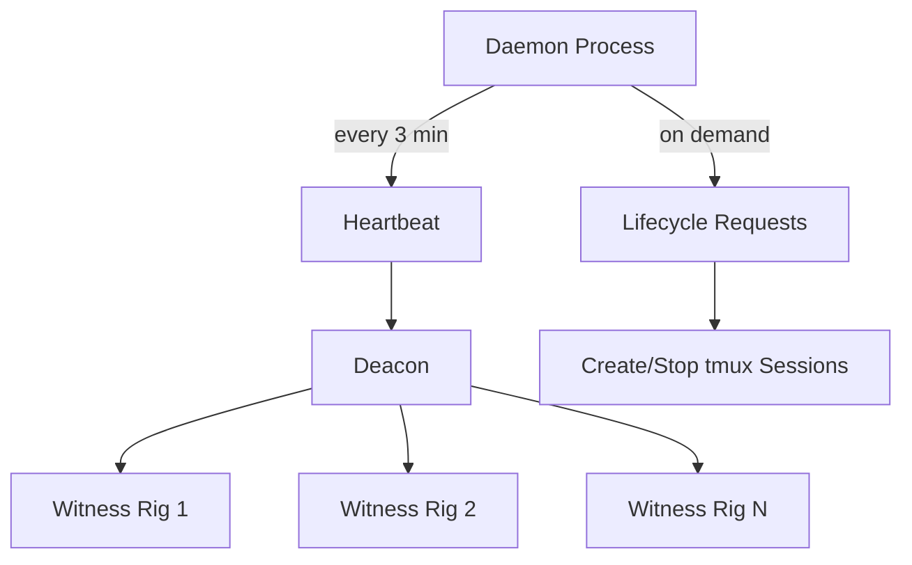
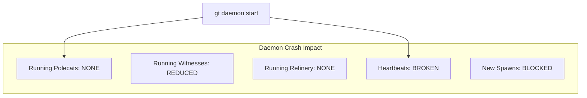

Gas Town's daemon is the simplest component in the system -- and that's by design. Written in Go, it does three things: send heartbeats, process lifecycle requests, and stay out of the way. Understanding why it's deliberately "dumb" reveals a core Gas Town design principle.

<!-- truncate -->

## What the Daemon Does

The daemon is a background Go process that runs continuously on the host machine. Its responsibilities are narrow:

| Responsibility | Frequency | What It Does |
|---------------|-----------|--------------|
| **Heartbeat** | Every 3 minutes | Sends a tick to the Deacon, which triggers patrol cycles |
| **Lifecycle** | On demand | Starts, stops, and restarts agent sessions via tmux |
| **Polling** | Configurable | Checks external services (Discord, webhooks) for incoming work |

That's it. The daemon doesn't make decisions, doesn't route work, doesn't monitor health, and doesn't handle escalations. All intelligence lives in the agents.

## Why Go?

The daemon is written in Go for practical reasons:

- **Single binary**: No runtime dependencies. Copy the binary and it works.
- **Low memory**: The daemon idles at ~10MB RSS. It runs for weeks without growing.
- **Concurrency**: Goroutines handle lifecycle requests without blocking heartbeats.
- **Crash recovery**: If the daemon crashes, `systemd` or `launchd` restarts it in seconds. Agents don't lose work because their state lives in hooks, not in the daemon.



## The Dumb Scheduler Principle

The daemon is intentionally "dumb" -- a design choice borrowed from Erlang/OTP. In Erlang, the VM scheduler is simple; all intelligence lives in the processes (actors). Gas Town follows the same pattern:

```text
Traditional orchestrator:
  Scheduler → decides what agents do → tracks their progress → handles failures

Gas Town:
  Daemon → sends heartbeat → that's it
  Agents → decide what to do based on their hooks and mail
```

This design has several advantages:

1. **No single point of intelligence failure**: If the daemon crashes, agents continue working. They just don't get new heartbeats until it restarts.
2. **No stale state**: The daemon doesn't cache agent state. Each heartbeat triggers fresh discovery by the Deacon.
3. **Simple recovery**: Restarting the daemon is trivial -- it has no state to recover.

## The Heartbeat Loop

The core of the daemon is a simple ticker:

```go
ticker := time.NewTicker(3 * time.Minute)
for {
    select {
    case <-ticker.C:
        nudgeDeacon("heartbeat")
    case req := <-lifecycleChan:
        handleLifecycle(req)
    case <-ctx.Done():
        return
    }
}
```

Every 3 minutes, the daemon nudges the Deacon. The Deacon then:
1. Checks all Witnesses across all rigs
2. Runs health checks on the supervision tree
3. Processes any pending warrants via Boot
4. Reports status back

The daemon doesn't know or care what the Deacon does with the heartbeat. It just sends the tick.

## Lifecycle Management

When you run `gt start`, `gt rig reboot`, or `gt polecat spawn`, these commands send lifecycle requests to the daemon:

```text
gt start --all
  → daemon receives "start" request
  → daemon creates tmux sessions for each agent
  → daemon sends initial nudge to each session
  → agents take over from there
```

The daemon creates the container (tmux session) but doesn't control what happens inside it. Each agent runs `gt prime` on startup, checks its hook, and begins autonomous operation.

## When the Daemon Crashes

The daemon crashing is a non-event for running agents:

| Component | Impact of Daemon Crash |
|-----------|----------------------|
| Running polecats | **None** -- continue working in their sessions |
| Running witnesses | **Reduced** -- miss patrol triggers, but can self-trigger |
| Running refinery | **None** -- continues processing merge queue |
| Heartbeat chain | **Broken** -- Deacon stops getting ticks |
| New agent spawns | **Blocked** -- can't create sessions until daemon restarts |

:::note A Daemon Crash Is a Non-Event
Because all agent state lives in hooks and beads (not in the daemon), a daemon crash has zero impact on running agents. They continue working in their tmux sessions as if nothing happened. Only new agent spawns and heartbeats are affected. Restart with `gt daemon start` and everything resumes.
:::

The key insight: the daemon is a convenience, not a dependency. A crashed daemon doesn't lose work, corrupt state, or kill agents. It just stops creating new sessions and sending heartbeats.

Recovery is trivial:

```bash
gt daemon start    # Restart the daemon
# All existing agents continue; heartbeats resume
```

## Monitoring the Daemon

```bash
# Check daemon status
gt daemon status

# View daemon logs
gt daemon logs

# Check heartbeat timing
gt daemon status --json | jq '.last_heartbeat'
```

If `gt daemon status` shows the daemon is down but agents are still running, you can restart it without affecting active work.



:::tip Park Idle Rigs to Save Resources
The daemon sends heartbeats to every active rig on every tick. If you have rigs that sit idle during off-hours or weekends, use `gt rig park <rig>` to skip them. The Deacon ignores parked rigs entirely, which eliminates unnecessary Witness and patrol cycles and saves both API tokens and compute.
:::

:::warning Do Not Add Intelligence to the Daemon
It may be tempting to extend the daemon with smarter scheduling, conditional heartbeats, or agent health tracking. Resist this impulse. Every feature added to the daemon increases its failure blast radius and makes recovery harder. Gas Town's architecture deliberately keeps the daemon simple so that all intelligence lives in agents, which have built-in crash recovery via hooks and molecules.
:::

## Design Lessons

The daemon embodies several Gas Town principles:

1. **Dumb scheduler, smart agents**: Intelligence at the edges, simplicity at the center
2. **Crash-safe by design**: No state to lose means no recovery to perform
3. **Discovery over tracking**: The Deacon discovers what needs attention each cycle rather than the daemon tracking it
4. **Minimal blast radius**: A daemon crash affects no running work

These principles scale. As your fleet grows from 5 to 30 agents, the daemon stays the same -- a simple loop sending heartbeats every 3 minutes.

## Next Steps

- [System Overview](/docs/architecture/overview) -- How the daemon fits into the five-layer architecture
- [Design Principles](/docs/architecture/design-principles) -- The twelve principles that shaped Gas Town
- [Deacon](/docs/agents/deacon) -- The agent that turns heartbeats into patrol cycles
- [Starting & Stopping](/docs/operations/lifecycle) -- Lifecycle commands that interact with the daemon
- [Boot Dogs](/blog/boot-dogs) -- How Boot observes system state on every daemon tick
- [Lifecycle Management](/blog/lifecycle-management) -- Starting, stopping, and managing the daemon lifecycle
- [The Deacon: Background Coordinator](/blog/deacon-patrol) -- How the Deacon extends the daemon's coordination
- [Hook Persistence](/blog/hook-persistence) -- Why agent hooks survive daemon crashes and restarts
