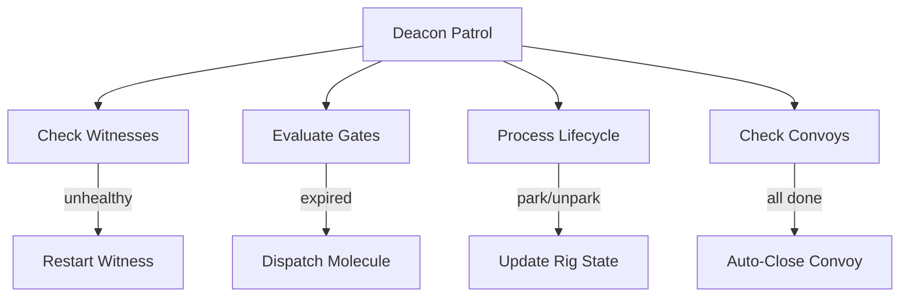
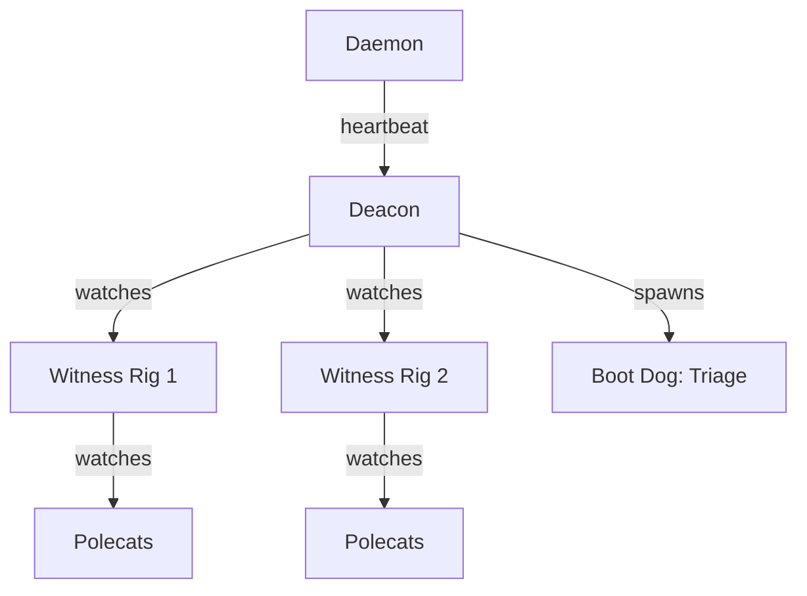
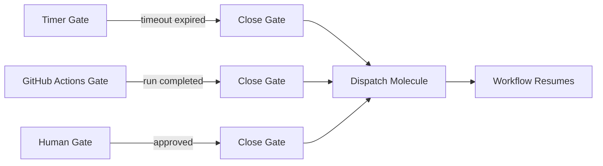
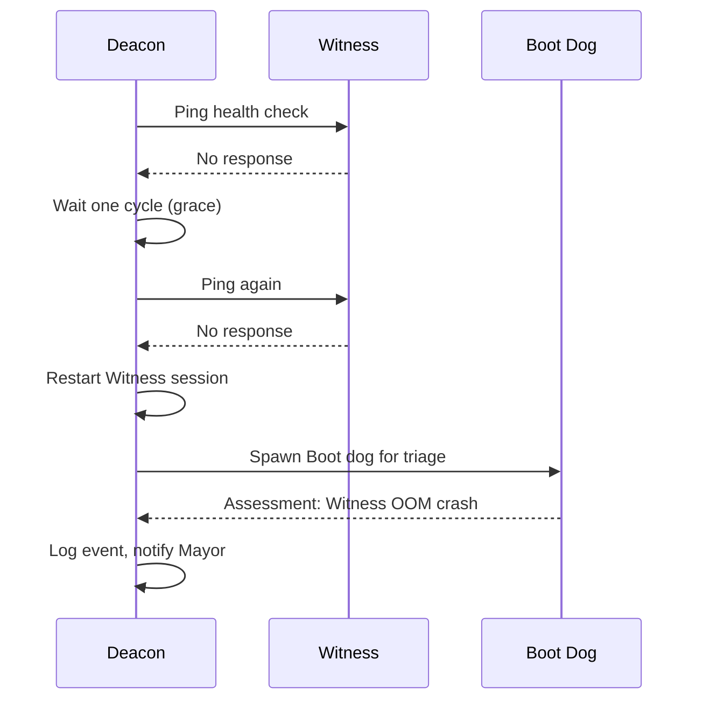

If the Mayor is the strategic brain and the Witness is the floor supervisor, the Deacon is the building's maintenance system. It runs quietly in the background, handling the operational plumbing that keeps Gas Town running: lifecycle management, gate evaluation, health checks, and recovery coordination.

<!-- truncate -->

## What the Deacon Does

The Deacon is a persistent town-level agent that runs a continuous patrol cycle. Every 5 minutes (by default), it performs a systematic check of the entire Gas Town deployment:

```text
Deacon Patrol Cycle:
  1. Health check all Witnesses     → alive? responsive?
  2. Evaluate open gates            → timers expired? CI done? human approved?
  3. Process lifecycle requests     → start/stop/park/unpark rigs
  4. Dispatch gated molecules       → resume workflows that were waiting
  5. Check convoy completion        → auto-close completed convoys
  6. Report to Mayor                → summary of town health
```

Each patrol cycle is tracked as a molecule (`mol-deacon-patrol`), so if the Deacon crashes mid-patrol, the next session picks up from the last completed step.



## Gate Evaluation

Gates are the Deacon's most important responsibility. When a workflow step needs to wait for an external condition -- CI completing, a human approving, a timer expiring -- it parks on a gate. The Deacon evaluates all open gates during each patrol:

### Timer Gates

```text
Gate: "Cooldown before retry" (type: timer, timeout: 30m)
Created: 10:00
Current: 10:25
Status:  OPEN (5 minutes remaining)
```

The Deacon checks `created_at + timeout < now`. When the timer expires, it closes the gate and dispatches any waiting molecules.

### GitHub Actions Gates

```text
Gate: "Wait for CI" (type: gh:run, run_id: 12345)
Status: Polling GitHub...
Result: Run 12345 completed with status: success
Action: CLOSE gate, dispatch waiting molecule
```

The Deacon polls the GitHub API to check workflow run status. When a run completes (success or failure), the gate closes and the result is passed to the waiting workflow.

### Human Approval Gates

Human gates are the simplest -- they stay open until a human explicitly approves:

```bash
# Deacon checks: any recently approved gates?
bd gate list --type human --status closed --since-last-patrol
# If found: dispatch waiting molecules
```

## Lifecycle Management

The Deacon processes lifecycle requests from the Mayor and human operators:

| Request | What Happens |
|---------|-------------|
| `gt rig park myproject` | Deacon tells Witness to stop spawning polecats, waits for in-flight work |
| `gt rig unpark myproject` | Deacon signals Witness to resume normal operation |
| `gt rig dock myproject` | Deacon stops all rig agents, marks rig as docked |
| `gt rig undock myproject` | Deacon restarts Witness and Refinery |

Lifecycle changes are always graceful -- the Deacon waits for in-flight work to complete before stopping agents. This prevents work loss during administrative operations.

## Health Monitoring

While the Witness monitors individual polecats within a rig, the Deacon monitors the Witnesses themselves. If a Witness becomes unresponsive:

```text
Deacon patrol → ping Witness-myproject → no response
  → Wait one more cycle (grace period)
  → Still unresponsive
  → Restart Witness session
  → Log restart event
  → Notify Mayor
```

This creates the supervision tree: Daemon watches Deacon, Deacon watches Witnesses, Witnesses watch Polecats. Each level can recover the level below it.

## Boot Dog Triage

When the Deacon encounters an ambiguous situation -- a rig in an unexpected state, a Witness reporting confusing data -- it spawns a Boot dog for triage:

```text
Deacon → "Rig myproject has 5 stale polecats, Witness claims all healthy"
  → Spawn Boot dog
  → Boot assesses: polecats are actually completing, just slow
  → Boot reports: "Normal operation, large codebase causing slow builds"
  → Deacon: No action needed
```

[Boot](/docs/agents/boot) dogs are deliberately short-lived. They assess and report, then exit. The Deacon takes action based on Boot's assessment. This separation keeps triage lightweight and prevents the Deacon from getting stuck doing detailed investigation.



## Convoy Completion

The Deacon checks convoy status during each patrol. When all beads in a convoy reach a terminal state (`done`, `wontfix`), the convoy auto-closes:

```text
Convoy hq-cv-001 "Auth System Fixes"
  gt-a1b2c [done]
  gt-d3e4f [done]
  gt-g5h6i [done]
  → All items terminal → AUTO-CLOSE
  → Notify: Mayor, Overseer
```

This auto-close mechanism means you never need to manually close convoys in normal operation. The Deacon handles it.

:::caution Gates Can Keep Convoys Open Indefinitely
If a convoy contains a bead that creates a gate (for example, waiting for human approval or CI to pass), the convoy will not auto-close until that gate resolves. A forgotten gate can keep a convoy open for days or weeks. Use `bd gate list --open` to audit open gates and close any that are no longer needed.
:::

:::tip Let the Deacon Handle Convoy Lifecycle
You should never need to manually close convoys. The Deacon checks convoy completion on every patrol cycle and auto-closes convoys when all beads reach a terminal state. If a convoy is not closing, check whether a bead is stuck rather than trying to force-close the convoy itself.
:::

:::note The Deacon Uses a Patrol Molecule for Crash Recovery
Each patrol cycle is tracked as a molecule (`mol-deacon-patrol`). If the Deacon crashes mid-patrol, the next session picks up from the last completed step rather than re-running the entire cycle. This is the same molecule system that powers polecat workflows -- the Deacon eats its own dog food.
:::

:::warning Never Manually Close Convoys That Appear Stuck
If a convoy is not auto-closing, it means at least one bead has not reached a terminal state. Force-closing the convoy hides the problem instead of solving it. Use `gt convoy status <id>` to identify the stuck bead, then either fix the bead's blocking issue or mark it as `wontfix` with `bd close <bead> --reason wontfix`. The Deacon will auto-close the convoy on its next patrol once all beads are terminal.
:::





:::info The Deacon Patrol Interval Is Configurable
The default 5-minute patrol cycle works well for most deployments, but you can adjust it with `gt config set deacon.patrol_interval <minutes>`. Shorter intervals catch problems faster but increase token usage. Longer intervals save tokens but delay gate evaluations and health checks.
:::

## Patrol Molecule: Squash and Respawn

To avoid accumulating stale step beads, the Deacon uses the squash-and-respawn pattern:

1. Complete a patrol cycle (all steps done)
2. Squash the molecule into a digest bead: `gt mol squash --summary "Patrol: 3 gates evaluated, 1 closed, 0 issues"`
3. Pour a fresh patrol molecule for the next cycle
4. The digest preserves audit history without per-step pollution

This keeps the beads database clean while maintaining full observability of what happened during each patrol.

## When Things Go Wrong

The Deacon is the safety net for most operational problems:

| Problem | Deacon's Response |
|---------|------------------|
| Witness unresponsive | Restart Witness session |
| Gate expired with no resolution | Escalate to Mayor |
| Convoy stalled (no progress for 1+ hour) | Flag for Mayor attention |
| Rig in inconsistent state | Spawn Boot dog for triage |
| Daemon heartbeat missed | (Daemon restarts Deacon) |

The Deacon never panics. It follows its patrol molecule step by step, handles what it can, and escalates what it cannot.

## Next Steps

- [Deacon](/docs/agents/deacon) -- Full Deacon agent reference
- [Gates](/docs/concepts/gates) -- The async coordination system the Deacon evaluates
- [Agent Hierarchy](/docs/architecture/agent-hierarchy) -- The supervision tree the Deacon participates in
- [Monitoring & Observability](/docs/operations/monitoring) -- Watching Deacon patrol activity
- [Infrastructure Dogs](/blog/infrastructure-dogs) -- How the Deacon dispatches dogs for cleanup work
- [Death Warrants](/blog/death-warrants) -- The warrant system the Deacon uses for stuck agents
- [The Daemon: Gas Town's Heartbeat](/blog/daemon-process) -- The Go process that hosts the Deacon's patrol
- [The Escalation System](/blog/escalation-system) -- How the Deacon routes problems through severity-based escalation
