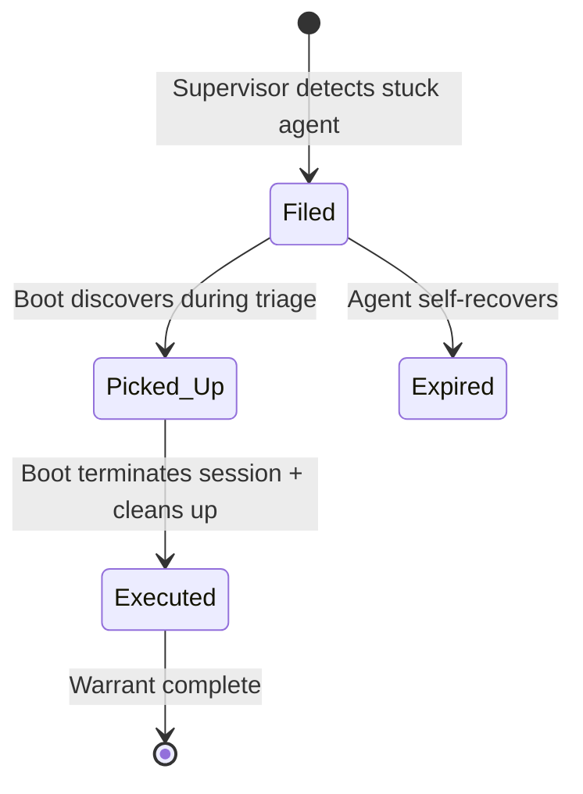
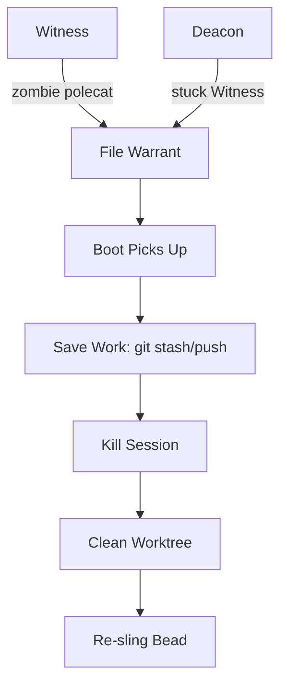
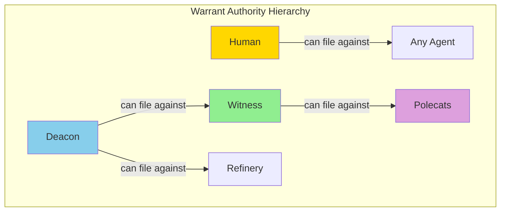
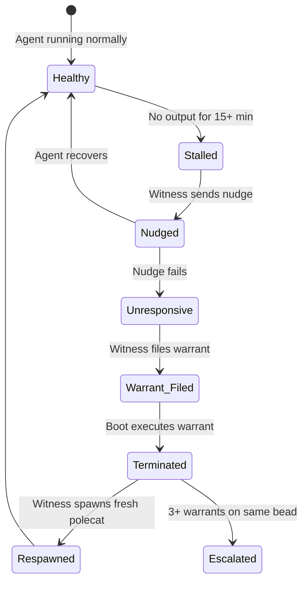
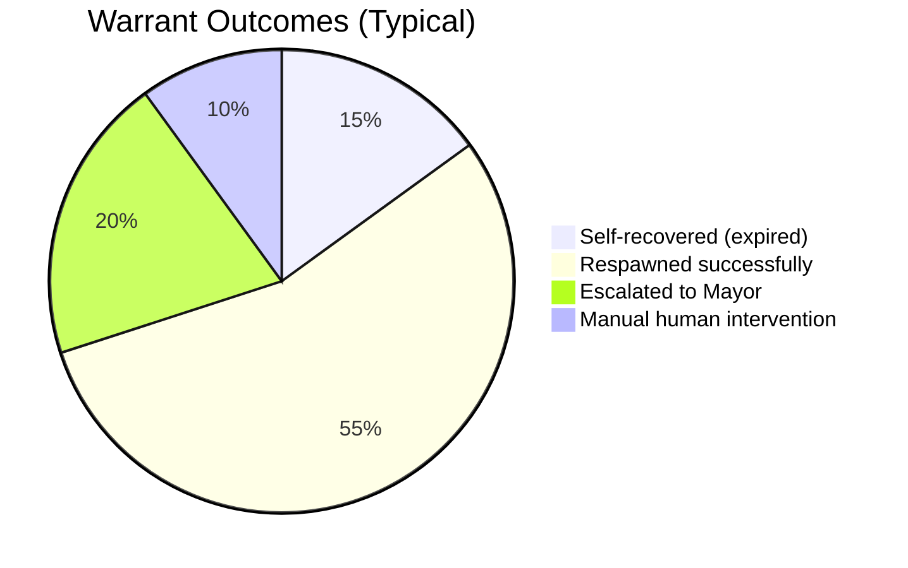

In a system where AI agents run autonomously, some agents inevitably get stuck. They stop responding to nudges, loop on impossible tasks, or become zombies after infrastructure failures. Gas Town handles this with **death warrants** — structured termination requests that ensure stuck agents are cleaned up without losing work.

<!-- truncate -->

## Why Not Just Kill the Process?

The naive approach to a stuck agent is `kill -9`. But in a multi-agent system, killing a process has consequences:

- **The agent may have uncommitted work.** Local changes that haven't been pushed are lost.
- **The hook still has the bead assigned.** The next session picks up stale context.
- **Other agents may be waiting on this agent's output.** A convoy stalls because one bead never completes.
- **The Witness may immediately respawn it.** The killed agent comes back in the same broken state.

Death warrants solve these problems by making termination a **first-class operation** with a defined lifecycle.

## The Warrant Lifecycle





### Step 1: Filing

Warrants are filed by the supervision chain — the Witness for polecats, the Deacon for patrol agents:

```bash
# Witness files a warrant for a zombie polecat
gt warrant file gastowndocs/polecats/alpha \
  --reason "Zombie: no session, idle >10m"

# Deacon files a warrant for a stuck Witness
gt warrant file gastowndocs/witness \
  --reason "Witness missed 3 consecutive patrol cycles"
```

Each warrant is stored as a JSON file in `~/gt/warrants/`, creating an auditable record:

```json
{
  "target": "gastowndocs/polecats/alpha",
  "reason": "Zombie: no session, idle >10m",
  "filed_by": "gastowndocs/witness",
  "filed_at": "2026-02-13T14:30:00Z",
  "executed": false
}
```

### Step 2: Triage

Boot — the daemon's [watchdog dog](/docs/agents/boot) — picks up warrants during its triage cycle. Boot runs on every daemon tick (every 3 minutes), so warrants are typically executed within minutes of filing.

### Step 3: Execution

When Boot executes a warrant, it:

1. Terminates the agent's tmux session
2. Updates the warrant as executed
3. The Witness detects the terminated polecat and handles work recovery

The work isn't lost. The bead is still on the hook. When the Witness detects the terminated polecat, it either respawns a fresh polecat to continue the work or escalates to the Mayor if the same bead has failed multiple times.

## Who Files Warrants

The supervision chain determines who can file warrants for whom:

| Filed By | Target | Trigger |
|----------|--------|---------|
| **Witness** | Polecats in its rig | No output for 15+ minutes, repeated nudge failures |
| **Deacon** | Witness, Refinery | Missed 3+ patrol cycles, unresponsive to health pings |
| **Human** | Any agent | Manual intervention via `gt warrant file` |



This hierarchy prevents circular problems. The Witness can't file a warrant against itself, and the Deacon can't file a warrant against itself. If the Deacon is stuck, only the daemon (or a human) can intervene.



## When Warrants Aren't Enough

Sometimes an agent keeps respawning into the same broken state. The Witness sees work on the hook, spawns a polecat, the polecat gets stuck, the Witness files a warrant, Boot kills it, and the cycle repeats.

:::warning Watch for Warrant Loops
If the same bead triggers more than 2-3 warrants, the problem is not the agent -- it is the task. A bead that repeatedly kills polecats usually has unclear instructions, a missing dependency, or a flaky test. Fix the root cause before re-slinging.
:::

Gas Town handles this with **escalation counting**. After a configurable number of warrant executions for the same bead (typically 3), the system escalates instead of retrying:

1. The bead is marked as problematic
2. An escalation is filed to the Mayor
3. The Mayor can reassign the work, modify the approach, or escalate to the human

This prevents infinite warrant loops and surfaces genuinely hard problems to someone who can make a decision.

:::tip Warrant Execution Leaves the Hook Assignment Intact
When Boot executes a warrant and terminates an agent session, the bead remains assigned to the agent's hook. This allows the Witness to respawn a fresh polecat that automatically picks up the same work. If the underlying issue was a transient crash (for example, OOM or network timeout), the respawned polecat often completes successfully without manual intervention.
:::

:::tip Use `gt warrant list` to Audit Agent Terminations
The warrant log provides a complete audit trail of every agent termination -- who filed it, why, and when it was executed. Run `gt warrant list --all` regularly to spot patterns like the same bead triggering repeated warrants or a specific rig producing more terminations than others. These patterns often reveal systemic issues worth fixing.
:::

:::note Warrants Preserve the Bead Assignment on the Hook
When Boot executes a death warrant, it terminates the agent's session but does not remove the bead from the hook. This means the work assignment survives the termination, and the Witness can respawn a fresh polecat that picks up right where the previous one left off. No manual re-slinging is required for single-failure scenarios.
:::



:::danger Never Use `--force` Warrants in Automated Scripts
The `--force` flag bypasses the formal warrant lifecycle, skipping triage, audit logging, and work-recovery steps. Using it in automated scripts or cron jobs can silently terminate agents mid-commit, causing data loss that the normal warrant flow is specifically designed to prevent. Reserve `--force` for interactive, human-supervised emergency situations only.
:::

## Manual Warrant Operations

Humans can participate in the warrant system directly:

```bash
# List pending warrants
gt warrant list

# List all warrants (including executed)
gt warrant list --all

# File a manual warrant
gt warrant file myproject/polecats/toast \
  --reason "Agent in bad state after infra failure"

# Execute a warrant immediately (skip Boot's triage cycle)
gt warrant execute myproject/polecats/toast

# Emergency kill without a formal warrant
gt warrant execute myproject/polecats/toast --force
```

The `--force` flag bypasses the formal warrant flow. Use it for emergency situations where you need immediate termination — but prefer the normal flow for auditing and proper cleanup.

## Why This Design Matters

Death warrants embody Gas Town's "Let It Crash" philosophy — borrowed from Erlang. Rather than building elaborate error-prevention systems, Gas Town assumes agents will fail and builds robust recovery around that assumption.

The warrant system provides:

- **Auditability.** Every termination has a reason, a filer, and a timestamp. You can review what happened and why.
- **Structured cleanup.** Work isn't lost — the hook preserves the assignment across the termination.
- **Escalation paths.** Repeated failures surface to higher authorities rather than looping forever.
- **Human override.** When automation can't handle it, humans can step in using the same system.

In practice, most Gas Town users never think about warrants. The Witness files them, Boot executes them, and polecats respawn transparently. But when something does go wrong, the warrant log is invaluable for understanding what happened and why. This approach is part of Gas Town's broader [incident response](/blog/incident-response) strategy that prioritizes fast recovery over perfect prevention.

## Next Steps

- [gt warrant Reference](/docs/cli-reference/warrant) — Full CLI reference for warrant commands
- [Deacon Agent](/docs/agents/deacon) — The town-level supervisor that files warrants for unresponsive agents
- [Witness Agent](/docs/agents/witness) — The per-rig watchdog that detects stalls and escalates to warrants
- [The Deacon: Gas Town's Background Coordinator](/blog/deacon-patrol) — How the Deacon supervises agents and files warrants
- [Understanding GUPP: Why Crashes Don't Lose Work](/blog/understanding-gupp) — The crash-recovery philosophy that warrants support
- [Gas Town's Security Model](/blog/security-model) — Trust boundaries and permission scoping for agent termination
- [The Witness Explained](/blog/witness-explained) — How the Witness detects stuck polecats and files warrants
- [Troubleshooting Guide](/docs/guides/troubleshooting) — Common issues and their solutions
