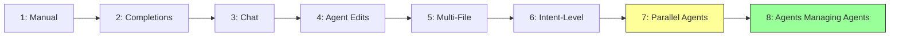
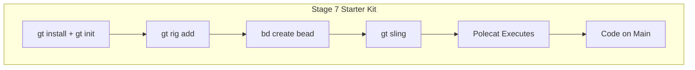

Gas Town targets developers at Stage 7 and above on the AI coding maturity model. But most developers are still at Stage 4 or 5. Here's how to figure out where you are and what it takes to level up.

<!-- truncate -->

## The Quick Assessment

Answer honestly. Which statement best describes your daily workflow?

**Stage 1-2: Manual or Completions**
- "I write all my code by hand" → Stage 1
- "I use Copilot/Codeium for tab-complete" → Stage 2

**Stage 3-4: Chat or Agents**
- "I ask ChatGPT/Claude questions while coding" → Stage 3
- "I use Cursor/Claude Code to write whole functions" → Stage 4

**Stage 5-6: Deep Agent Use**
- "I let agents make multi-file changes with review" → Stage 5
- "I trust agents to implement features end-to-end" → Stage 6

**Stage 7-8: Orchestration**
- "I run multiple agents on different tasks simultaneously" → Stage 7
- "I manage agents with other agents (like Gas Town)" → Stage 8

Most developers reading this blog are probably at Stage 4-6. That's fine — Gas Town will make more sense once you understand the progression.



## What Each Stage Transition Feels Like

### Stage 2 → 3: "I Can Ask Questions"

The shift from completions to chat feels like getting a knowledgeable coworker. Instead of guessing at APIs, you ask. Instead of reading docs for 20 minutes, you get an answer in 10 seconds.

**What changes:** Your browser has fewer Stack Overflow tabs open.

### Stage 3 → 4: "The Agent Can Edit My Code"

This is where most people get stuck. Giving an AI agent permission to modify your files feels uncomfortable. You worry about it breaking things. You review every change line by line.

**What changes:** You stop copy-pasting from chat and start approving diffs.

**How to get past it:** Start with low-risk files. Let the agent write tests, update documentation, or refactor small functions. Build trust incrementally.

### Stage 4 → 5: "I Trust Multi-File Changes"

At Stage 4, you use agents for single-function or single-file tasks. Stage 5 means trusting the agent to make coordinated changes across multiple files — adding a new API endpoint means the agent updates the handler, the router, the tests, and the docs.

**What changes:** You review by intent ("did it add the endpoint correctly?") instead of by diff ("what did it change in each file?").

### Stage 5 → 6: "I Describe What, Not How"

Stage 5 still involves directing the agent step by step. Stage 6 means describing the outcome and letting the agent figure out the implementation path.

**Stage 5:** "Add a `validateEmail` function in `utils.go`, then call it from `CreateUser` in `handlers.go`, then add a test case in `handlers_test.go`."

**Stage 6:** "Add email validation to the user creation flow."

**What changes:** Your prompts get shorter and higher-level.

### Stage 6 → 7: "Multiple Agents in Parallel"

This is the Gas Town entry point. Instead of one agent doing one task while you wait, you spawn multiple agents working on different tasks simultaneously.

**What changes:** You go from "one agent, one task, wait, review" to "five agents, five tasks, monitor, merge." Your throughput jumps dramatically.

**Prerequisites:**
- Good test coverage (agents need automated validation)
- Clean git workflow (parallel agents need clean merge paths)
- Comfort with agent autonomy (you can't review every line from 5 agents)

### Stage 7 → 8: "Agents Managing Agents"

Stage 8 is where Gas Town operates. The Mayor decomposes high-level requests into beads. Polecats execute autonomously. The Witness monitors health. The Refinery merges code. The Deacon manages infrastructure. You operate at the level of intent.

**What changes:** You stop thinking about code and start thinking about outcomes.

## Common Fears at Each Stage

| Stage Transition | Fear | Reality |
|-----------------|------|---------|
| 3 → 4 | "It'll break my code" | Version control exists; undo is one command |
| 4 → 5 | "I can't review all those changes" | You review intent, not diffs |
| 5 → 6 | "It won't understand what I want" | Better prompts come from practice |
| 6 → 7 | "I'll lose track of parallel work" | That's what convoys are for |
| 7 → 8 | "I'm giving up too much control" | You're trading control for leverage |

## The Stage 7 Starter Kit

If you're at Stage 5-6 and want to try Gas Town, here's a minimal setup:

```bash
# Install Gas Town
gt install
gt init

# Set up your first rig
gt rig add myproject --repo <your-repo-url>

# Create your first bead
bd create --title "Add input validation to /api/users" --type task --priority 1

# Sling it — your first autonomous agent
gt sling <bead-id> myproject
```

Watch what happens. The polecat will:
1. Read the bead description
2. Understand the task
3. Create a branch
4. Implement the change
5. Run tests
6. Submit for merge

If it works on the first try, congratulations — you just moved to Stage 7.



## The Honest Truth About Stage 8

Stage 8 is not for everyone. It requires:

- **High test coverage** — Agents need automated gates to validate their work
- **Clean architecture** — Poorly structured code confuses agents, causing expensive retries
- **Tolerance for imperfection** — Agent code is good-enough code, not artisanal code
- **Trust in the system** — You have to let go of reviewing every commit

But for teams with well-tested codebases and a backlog of clearly-defined tasks, Stage 8 can deliver 10-50x throughput over Stage 6. That's not hyperbole — it's math: 10 agents working in parallel, each 2-5x as productive as manual coding.

## Next Steps

- **[The 8 Stages of AI Coding](/docs/guides/eight-stages)** — Full reference with detailed descriptions
- **[Quick Start](/docs/getting-started/quickstart)** — Get Gas Town running in 10 minutes
- **[Your First Convoy](/blog/first-convoy)** — Run your first parallel workflow
- **[Philosophy](/docs/guides/philosophy)** — The design thinking behind Gas Town
- **[Common Pitfalls](/blog/common-pitfalls)** — Avoid the most frequent mistakes at every stage
