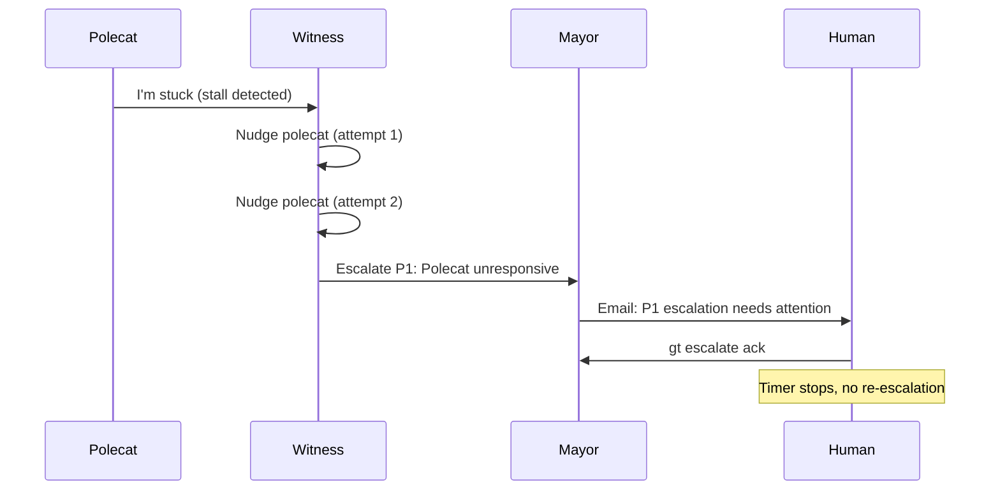
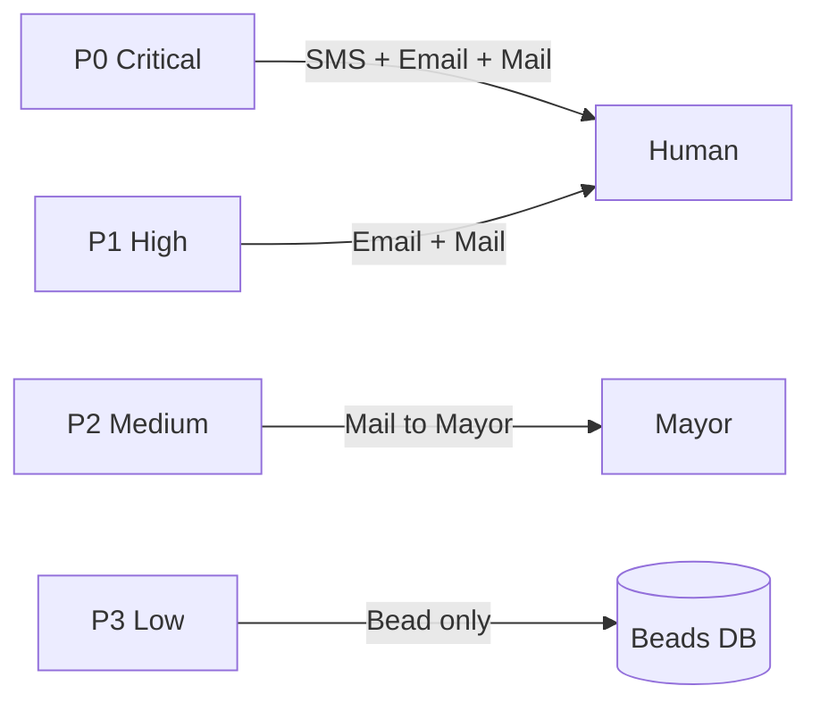
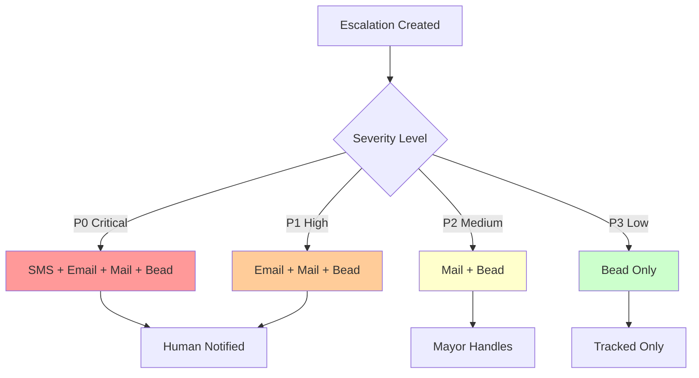
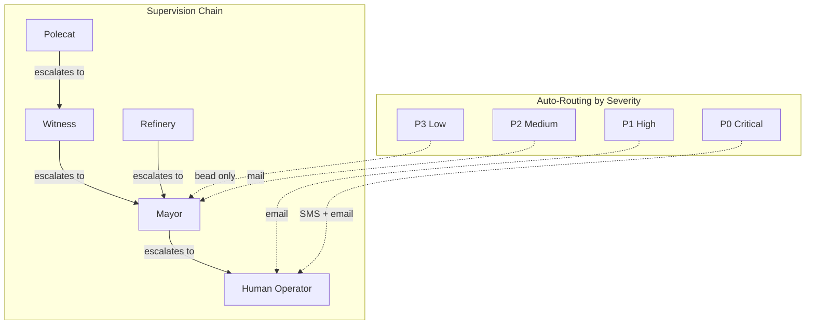
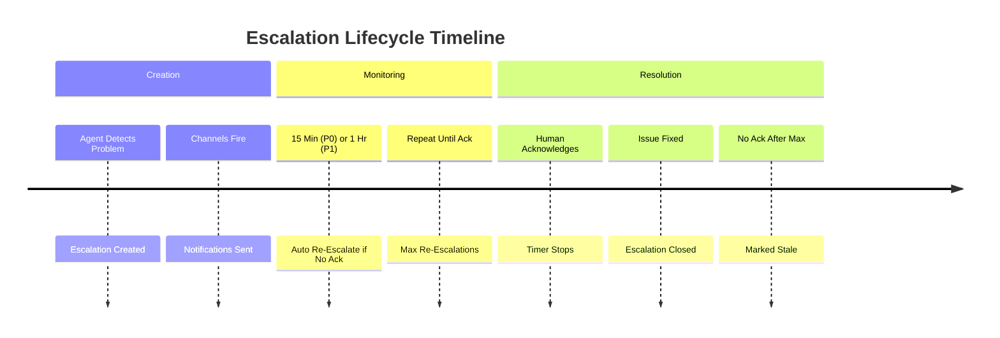
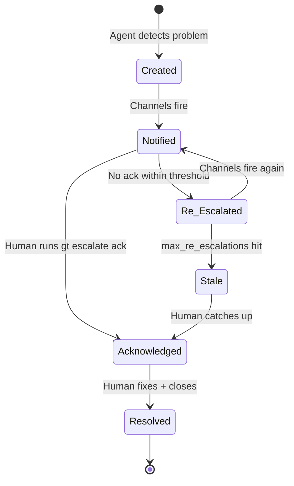

When you hand control of your codebase to a fleet of AI agents, the question isn't *if* something will go wrong — it's *when*, and more importantly, whether you'll find out in time to do something about it. Gas Town's escalation system is the bridge between autonomous operation and human awareness. It routes problems through a severity-based hierarchy that ensures critical issues reach you immediately while low-priority noise stays out of your way.

<!-- truncate -->

## Why Escalations Exist

In a single-agent setup, you watch the agent work. You see it get stuck, you intervene. With 10+ agents running in parallel across multiple rigs, that direct observation model breaks down. You can't watch everything simultaneously.

Gas Town's answer is **priority-routed escalations** — a system inspired by on-call incident management (PagerDuty, OpsGenie) but designed specifically for AI agent fleets:

| Severity | What It Means | How You're Notified |
|----------|---------------|---------------------|
| **P0 Critical** | System down, data at risk | Bead + Mail + Email + SMS |
| **P1 High** | Major functionality broken | Bead + Mail + Email |
| **P2 Medium** | Degraded but working | Bead + Mail to Mayor |
| **P3 Low** | Minor issue, tracked only | Bead only |

The key insight: **agents should not try to handle problems above their authority level**. A polecat that encounters a broken test suite shouldn't spend 40 minutes retrying — it should escalate, and a human or the Mayor should decide what to do. This follows the [agent hierarchy](/docs/architecture/agent-hierarchy) where each level has defined authority boundaries. For more on agent communication patterns, see [agent communication patterns](/blog/agent-communication-patterns).

:::tip Escalations Reveal Systemic Issues That Need Fixing
If you see the same escalation category appearing repeatedly — like "flaky test" or "missing dependency" — the problem is not the individual agents failing, but the underlying system state. Treat recurring escalations as bug reports about your infrastructure, not as agent misbehavior. Fix the root cause and watch the escalation rate drop.
:::

## How Escalations Flow

Every escalation travels upward through the supervision hierarchy until it reaches an agent (or human) authorized to handle it:



The Witness doesn't just create an escalation and forget about it. If no one acknowledges the escalation within the configured threshold (1 hour for P1 by default), the system **automatically re-escalates** — sending notifications again through the same channels. This happens up to `max_re_escalations` times before the escalation is marked as stale.



## Creating Escalations

Any agent can create an escalation, and you can create them manually too:

```bash
# Polecat hits a wall
gt escalate --severity high "Blocked: staging API returns 503"

# Attach to a specific bead for context
gt escalate --severity medium --bead gt-abc12 "Flaky test causing intermittent failures"

# The Mayor can escalate to the human
gt escalate --severity critical "Database migration broke all downstream tests"
```

Agents create escalations automatically when they detect problems they can't resolve. The Witness creates them for stalled polecats. The Refinery creates them for repeated merge failures. You rarely need to create them manually — but when you do, the same routing rules apply.

:::caution Always Attach a Bead to Manual Escalations
When creating escalations manually with `gt escalate`, use the `--bead` flag to link the escalation to the relevant task. Unattached escalations lack context, making it harder for the Mayor or other responders to understand what went wrong and where. A bead reference provides the full history of the problem including agent logs, prior attempts, and related commits.
:::

The following diagram illustrates how different severity levels map to notification channels.





## Configuring Routing



The default routing works well out of the box, but you can customize it in `settings/escalation.json`:

```json
{
  "routing": {
    "critical": {
      "channels": ["bead", "mail:mayor", "email:human", "sms:human"],
      "auto_escalate_after": "15m",
      "max_re_escalations": 3
    },
    "high": {
      "channels": ["bead", "mail:mayor", "email:human"],
      "auto_escalate_after": "1h",
      "max_re_escalations": 2
    }
  },
  "quiet_hours": {
    "enabled": true,
    "start": "22:00",
    "end": "08:00",
    "timezone": "America/Los_Angeles",
    "override_for": ["critical"]
  }
}
```

**Quiet hours** are essential if you run Gas Town overnight. With quiet hours enabled, only P0 critical escalations will wake you up. Everything else queues until morning. For more details on configuring quiet hours and notification channels, see the [diagnostics reference](/docs/cli-reference/diagnostics).

**Per-rig overrides** let you tighten thresholds for production-critical rigs while keeping them relaxed for experimental work. Place an `escalation.json` in `<rig>/settings/` to override town-level defaults.

## Real-World Scenarios

### The Flaky Test

This is the most common escalation scenario. A test passes 90% of the time but fails enough to cause repeated Refinery rejections.

**What happens:**
1. Polecat completes work and submits MR
2. Refinery runs tests — flaky test fails
3. MR is rejected, polecat work bounces
4. After multiple bounces, Refinery creates a P2 escalation

**What to do:**

```bash
# Acknowledge so the timer stops
gt escalate ack ESC-001 --note "Flaky test: test_auth_timeout"

# Fix the flaky test from your crew workspace
# (You're the human — fix it on main directly)
gt escalate close ESC-001 --note "Added retry logic to test_auth_timeout"
```

### The Stuck Polecat

A polecat gets into a loop — trying the same approach, failing, trying again. The Witness nudges it, but it can't break out.

**What to do:**

```bash
gt escalate ack ESC-002
gt polecat nuke toast --rig myproject
gt release gt-abc12

# Add guidance before re-slinging
bd update gt-abc12 --comment "Previous approach failed. Try using the v2 API instead."
gt sling gt-abc12 myproject

gt escalate close ESC-002 --note "Respawned with updated guidance"
```

### The Cost Spike

You return from lunch to find token costs doubled. A P2 escalation tells you a polecat was spinning in a loop generating massive context.

```bash
gt costs --since 4h --group-by agent    # Find the culprit
gt polecat nuke <name> --rig myproject  # Stop the bleeding
gt escalate close ESC-003 --note "Stopped runaway polecat, task needs re-scoping"
```

:::warning Alert Fatigue Is the Real Danger
Overusing P0 severity for non-critical issues causes alert fatigue — the most dangerous outcome in any alerting system. Reserve P0 for genuine emergencies where data is at risk or the system is down. If agents escalate too often, the root cause is usually systemic (flaky tests, misconfigured rig) rather than the agent being noisy. Fix the root cause instead of suppressing the alerts.
:::

:::tip Configure Quiet Hours for Overnight Runs
If you run Gas Town outside business hours, set up quiet hours in `settings/escalation.json` to suppress non-critical notifications. Only P0 critical alerts will break through. Everything else queues until morning, giving you a clean summary instead of a flood of stale notifications. This is essential for maintaining sanity during overnight agent runs.
:::

:::info Review Stale Escalations Every Morning
Run `gt escalate stale` as part of your daily routine. Stale escalations are issues that were raised but never acknowledged -- they represent problems that fell through the cracks. Catching them early prevents small issues from compounding into larger outages. A clean stale queue each morning is the best indicator that your escalation routing is working correctly.
:::



:::danger Never Disable Escalations to Suppress Noise
If you find yourself wanting to disable escalations because they fire too often, the problem is not the escalation system — it is the underlying issue causing repeated failures. Suppressing escalations masks systemic problems like flaky tests, misconfigured rigs, or under-scoped beads. Fix the root cause rather than silencing the alerts, or you will miss genuine emergencies when they arise.
:::

## Best Practices

1. **Acknowledge promptly.** Even if you can't fix it yet, acknowledging stops re-escalation and tells the system a human is aware.

2. **Don't suppress agent escalations.** If an agent escalates too often, the root cause is usually systemic (flaky tests, misconfigured rig) rather than the agent being noisy.

3. **Use severity levels correctly.** P0 is for genuine emergencies. Overusing P0 causes alert fatigue — the most dangerous outcome in any alerting system.

4. **Configure quiet hours.** Running overnight without quiet hours means waking up to dozens of stale notifications. Let the system batch non-critical issues.

5. **Close with notes.** Future you will appreciate knowing how past escalations were resolved. Use `--note` to leave a trail.

6. **Review stale escalations daily.** Run `gt escalate stale` each morning. Stale escalations represent issues that fell through the cracks.

## Next Steps

- [Escalation System Reference](/docs/operations/escalations) — Full configuration reference
- [Monitoring & Observability](/docs/operations/monitoring) — Detecting problems before they escalate
- [Incident Response with Gas Town](/blog/incident-response) — Broader incident management patterns
- [Troubleshooting](/docs/operations/troubleshooting) — Resolving the issues escalations surface
- [Witness Agent](/docs/agents/witness) — The per-rig monitor that detects stalls and triggers escalations
- [Death Warrants](/blog/death-warrants) — How warrants handle the problems escalations identify
- [The Witness Explained](/blog/witness-explained) — How the Witness detects issues that trigger escalations
- [Monitoring Your Fleet](/blog/monitoring-fleet) — Proactive monitoring that catches problems before they become escalations
- [Gas Town's Mail System](/blog/mail-system) — How escalations are delivered through the mail infrastructure to reach the right responders
