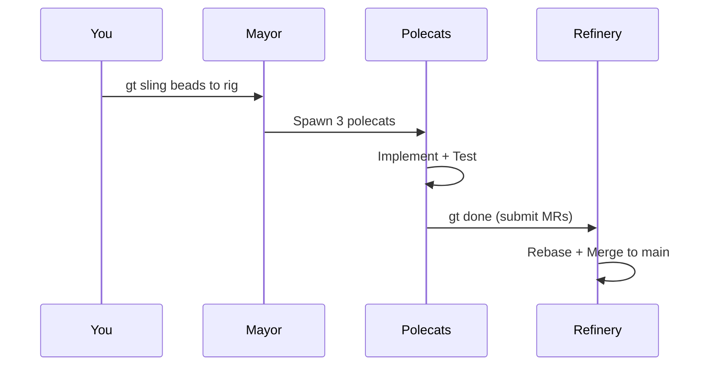
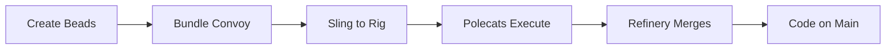
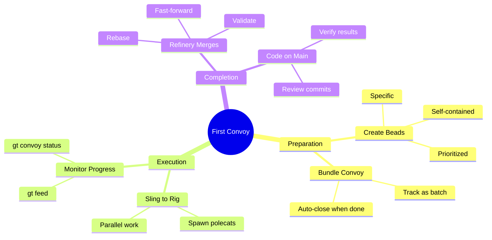
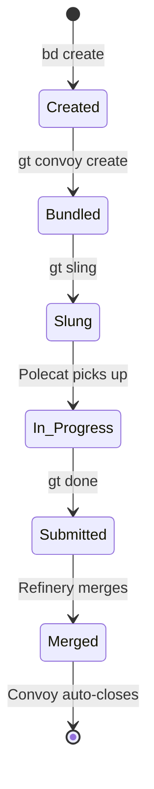
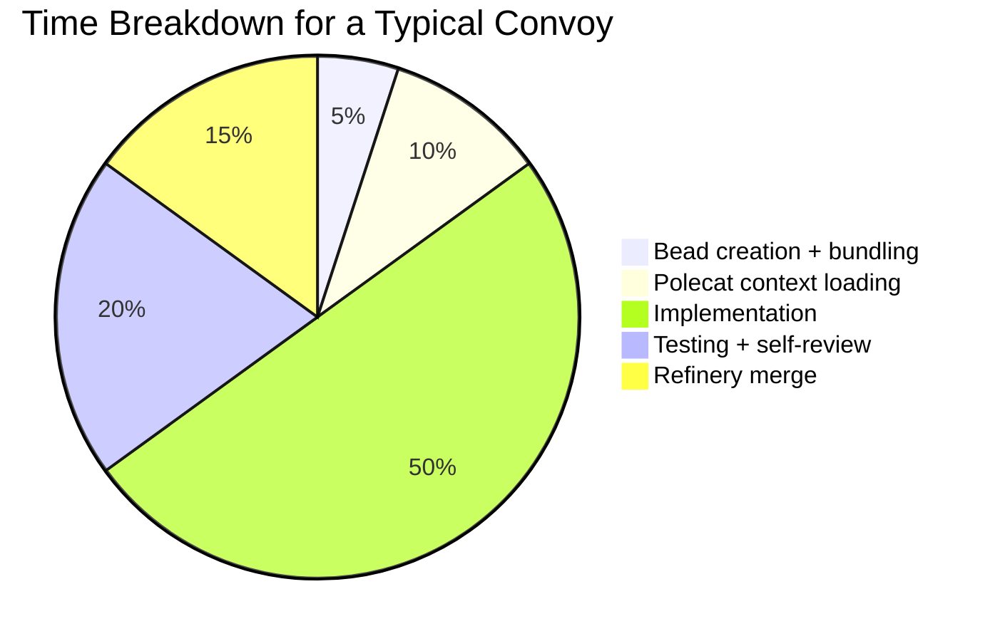
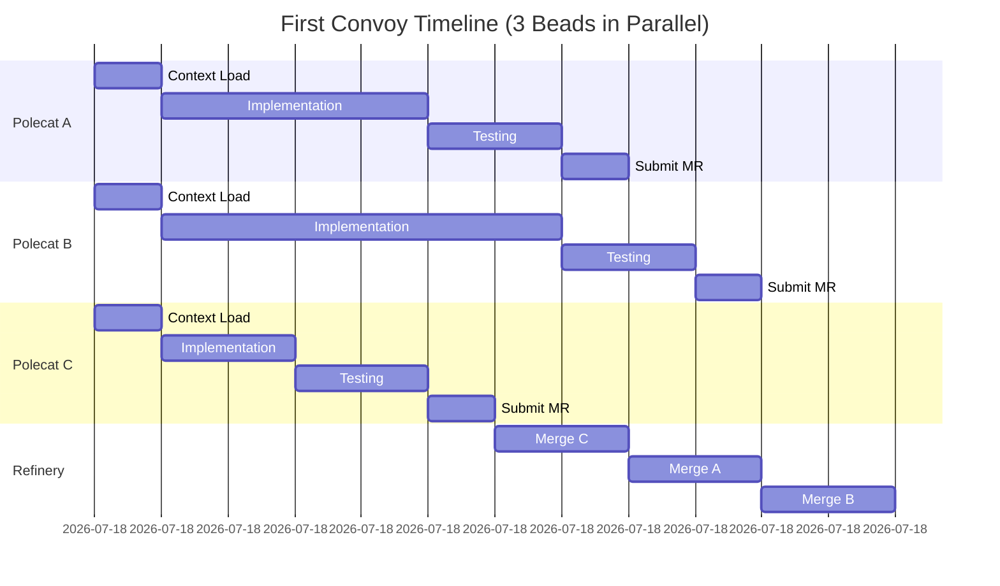
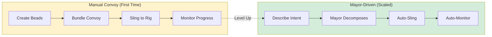
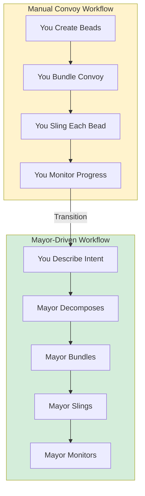

A step-by-step walkthrough of the core Gas Town workflow: create beads, bundle them into a convoy, sling work to a rig, and watch polecats deliver code to `main`.

<!-- truncate -->

## Prerequisites

You'll need Gas Town installed and initialized with at least one rig. If you haven't done that yet, see the [Installation guide](/docs/getting-started/installation) and [Quick Start](/docs/getting-started/quickstart).

## Step 1: Create Your Beads

Beads are the atomic units of work in Gas Town. Each one is a trackable issue that an agent will pick up and implement.

```bash
# Create three focused tasks
bd create --title "Add input validation to /api/users" --type task --priority 1
# → Created: ga-a1b2c

bd create --title "Write unit tests for user validation" --type task --priority 2
# → Created: ga-d3e4f

bd create --title "Update API docs with validation rules" --type task --priority 2
# → Created: ga-g5h6i
```

Good beads are **specific and self-contained** — each one should be completable by a single polecat in one session.

## Step 2: Bundle Into a Convoy

A convoy groups related beads so you can track them as a batch:

```bash
gt convoy create "User validation" ga-a1b2c ga-d3e4f ga-g5h6i
# → Created convoy: hq-cv-001
```

The convoy tracks overall progress. When all three beads are done, the convoy auto-closes.

## Step 3: Sling Work to a Rig

Now send the beads to a rig where polecats will pick them up:

```bash
gt sling ga-a1b2c myproject
gt sling ga-d3e4f myproject
gt sling ga-g5h6i myproject
```

Each `sling` creates a polecat, assigns the bead to its hook, and starts execution. Within seconds, you'll have three polecats working in parallel.

:::note The First Convoy Is Usually Slower Than Subsequent Ones
Your first convoy will involve agents downloading dependencies, cloning repos, and building initial context. Subsequent convoys run faster because the rig infrastructure is already in place. Do not judge Gas Town's performance on the first convoy — evaluate after the third or fourth run when caches are warm and agents have built up context.
:::



## Step 4: Watch It Happen

Monitor the convoy's progress:

```bash
# Live activity feed
gt feed

# Convoy progress
gt convoy status hq-cv-001

# Check individual polecat status
gt polecat list --rig myproject
```

You'll see polecats move through their molecule steps: loading context, setting up branches, running preflight tests, implementing, self-reviewing, and submitting.

:::info The `gt feed` Command Is Your Best Friend
During your first convoy, keep `gt feed` running in a separate terminal. It shows a real-time stream of events across all agents -- bead assignments, molecule step transitions, merge queue activity, and escalations. This live view is the fastest way to understand what Gas Town is actually doing under the hood.
:::

## Step 5: Code Lands on Main

As each polecat finishes, it runs `gt done` to submit a merge request. The Refinery picks up each MR, rebases onto latest `main`, runs validation, and merges. You'll see commits appearing on `main` within minutes.

```bash
# See what's been merged
cd ~/gt/myproject/crew/myname
git pull
git log --oneline -5
```

## What Just Happened?





In five minutes, you:

1. **Created** three focused work items (beads)
2. **Bundled** them into a tracked convoy
3. **Assigned** each to a parallel worker (polecat)
4. **Watched** autonomous implementation, testing, and merge
5. **Received** validated code on `main`

This is the core Gas Town loop. The Mayor can automate steps 1-3 for you (just describe what you want in natural language), but understanding the manual flow helps you debug and fine-tune later. For details on how the Mayor orchestrates this automation, see the [Mayor workflow guide](/blog/mayor-workflow).





## Behind the Scenes

When you sling a bead to a rig, several things happen automatically:

1. **Polecat spawning** — The Deacon creates a new tmux session, clones the repo into a fresh workspace under `polecats/`, and starts a Claude Code session
2. **Hook assignment** — The bead is placed on the polecat's hook via `gt mol attach`, so when the agent starts it immediately finds its work
3. **Molecule execution** — The polecat follows its molecule (workflow state machine), progressing through steps like context loading, implementation, testing, and self-review
4. **Merge request** — When done, `gt done` creates a merge request in the Refinery's queue
5. **Serialized merge** — The Refinery rebases the MR onto latest `main`, runs validation, and fast-forward merges

:::tip Understanding the pipeline
The key insight is that polecats never push directly to `main`. The Refinery serializes all merges, which is what prevents the merge conflicts that plague naive multi-agent setups. See the [Refinery Deep Dive](/blog/refinery-deep-dive) for the full story.
:::

:::note Polecats Never Push Directly to Main
All polecat work goes through the Refinery's merge queue. This serialized merge process is what prevents the merge conflicts that would otherwise plague parallel agents. Even if a polecat finishes its work instantly, the code still passes through rebase, validation, and fast-forward merge before appearing on `main`.
:::

:::caution Keep Beads Small and Focused
If a bead's scope is too large, the polecat may exhaust its context window before finishing the implementation. A good rule of thumb is that each bead should be completable in a single agent session — if you find yourself writing more than two sentences to describe it, consider splitting it into multiple beads with explicit dependencies.
:::

The following diagram shows a typical convoy execution timeline with three parallel polecats.



## Troubleshooting Your First Convoy

A few things that might go wrong on your first run:

| Symptom | Likely Cause | Fix |
|---------|-------------|-----|
| Polecat never starts | Rig not initialized | Run `gt rig init` first |
| Polecat stalls at "loading context" | Missing `CLAUDE.md` or large repo | Add project instructions, check clone size |
| Merge rejected by Refinery | Tests fail on rebase | Check `gt mq list`, read the failure log |
| Convoy stuck at partial completion | One polecat errored | Check `gt feed`, re-sling the failed bead |

For deeper troubleshooting, see the [Troubleshooting guide](/docs/operations/troubleshooting) and the [Common Pitfalls](/blog/common-pitfalls) blog post.

:::warning Your First Convoy Should Be on a Non-Critical Project
Do not run your first convoy on your production codebase or anything mission-critical. Start with a side project, internal tool, or experimental repo where mistakes are cheap. You need to build intuition for what good beads look like, how to interpret the feed output, and what kinds of tasks agents handle well — that learning process involves failures, and those failures should not block your team.
:::

## Scaling Beyond Your First Convoy



:::danger First Convoy Failures Are Learning Opportunities — Not Production Blockers
If your first convoy fails completely — polecats crash, tests break, nothing merges — resist the temptation to abandon Gas Town. First-run failures almost always stem from missing project context (incomplete CLAUDE.md), flaky tests, or overly broad bead scope. These are fixable configuration issues, not fundamental tool problems. Treat your first convoy as a diagnostic run that reveals what needs tuning.
:::

Once you've run a manual convoy successfully, you're ready to let the Mayor take over. Instead of creating beads and slinging them yourself, just describe what you want:

```bash
gt mayor "Add user validation to the API with unit tests and docs"
```

The Mayor will decompose your request into right-sized beads, set up dependencies between them, bundle a convoy, and sling work to the appropriate rig — all automatically. This is where Gas Town starts to feel like a superpower.

### From Manual to Automated Convoys

The progression from manual to Mayor-driven convoys represents a maturity shift.



## Next Steps

- **[Mayor Workflow](/docs/workflows/mayor-workflow)** — Let the Mayor handle decomposition and assignment automatically
- **[Crew Collaboration](/docs/workflows/crew-collaboration)** — Work alongside polecats in real-time
- **[Convoys](/docs/concepts/convoys)** — Deep dive into batch tracking and cross-rig convoys
- **[GUPP & NDI](/docs/concepts/gupp)** — Understand why crashes don't lose work
- **[Session Cycling](/docs/concepts/session-cycling)** — How agents maintain continuity across restarts
- **[Your Second Convoy](/blog/your-second-convoy)** — Level up with dependencies and cross-rig coordination
- **[Work Distribution Patterns](/blog/work-distribution-patterns)** — When to use convoys vs Mayor vs formula workflows
- **[Common Pitfalls](/blog/common-pitfalls)** — Avoid the 5 most common mistakes with your first convoy
- [First Convoy Tutorial](/docs/getting-started/first-convoy) — Step-by-step guide to running your first convoy
- **[Advanced Convoy Patterns](/blog/advanced-convoy-patterns)** — Sophisticated orchestration patterns for coordinating complex multi-bead workflows
- **[Eight Stages Self-Assessment](/blog/eight-stages-self-assessment)** — Understand your AI coding maturity before starting your first convoy
