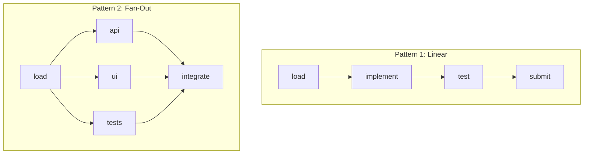
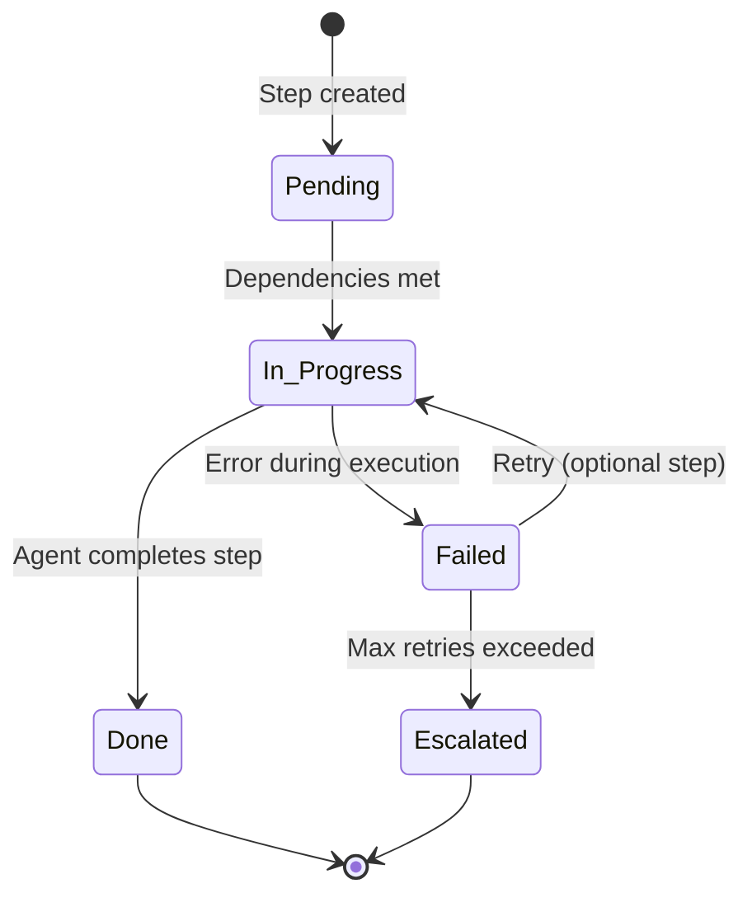
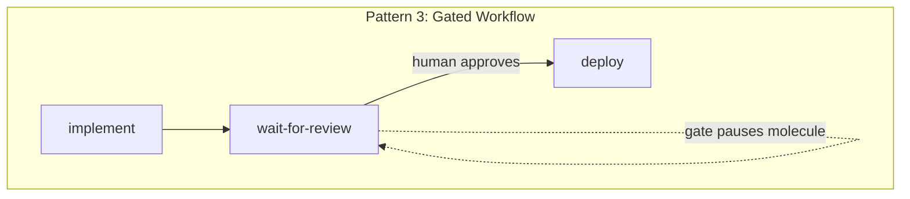
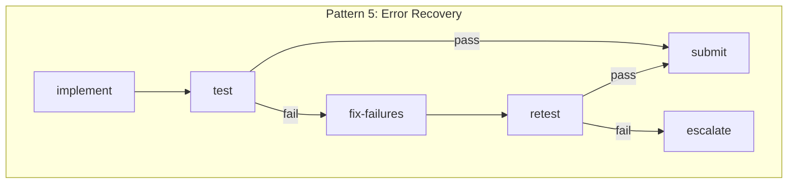

Formulas are Gas Town's workflow templates. When you pour a formula, it becomes a molecule -- a live, trackable execution plan with steps (wisps) that agents work through. Getting your formula design right is the difference between agents that execute smoothly and agents that stall.

<!-- truncate -->



## Formula Basics

A formula is a TOML file that defines a sequence of steps. Each step becomes a [wisp](/docs/concepts/wisps) when the formula is poured into a [molecule](/docs/concepts/molecules):

```toml
[meta]
name = "simple-fix"
description = "Fix a bug: load context, implement, test, submit"

[[steps]]
name = "load-context"
description = "Read the bead, understand the codebase"

[[steps]]
name = "implement"
description = "Write the fix"
needs = ["load-context"]

[[steps]]
name = "test"
description = "Run tests to verify the fix"
needs = ["implement"]

[[steps]]
name = "submit"
description = "Commit, push, and submit MR"
needs = ["test"]
```

The `needs` field creates dependencies between steps. A step won't start until all its dependencies are done.

## Pattern 1: Linear Pipeline

The simplest pattern -- steps execute one after another:

```text
load-context → implement → test → submit
```

Use this for straightforward tasks where each step naturally depends on the previous one. This is the default pattern for most polecat work.

**When to use:** Bug fixes, small features, documentation updates.

## Pattern 2: Parallel Fan-Out

Multiple steps execute concurrently after a shared prerequisite:

```toml
[[steps]]
name = "load-context"
description = "Read requirements and codebase"

[[steps]]
name = "implement-api"
description = "Write API endpoint"
needs = ["load-context"]

[[steps]]
name = "implement-ui"
description = "Write UI component"
needs = ["load-context"]

[[steps]]
name = "implement-tests"
description = "Write test cases"
needs = ["load-context"]

[[steps]]
name = "integrate"
description = "Wire everything together"
needs = ["implement-api", "implement-ui", "implement-tests"]
```

```text
                ┌─ implement-api ──┐
load-context ──┤─ implement-ui ───├── integrate
                └─ implement-tests─┘
```

**When to use:** Features with independent components that can be built in parallel. The agent may serialize execution, but the formula explicitly documents which steps are independent.

:::warning Avoid Circular Dependencies in Step Graphs
If step A `needs` step B and step B `needs` step A, the molecule will deadlock — no step can start because each is waiting on the other. Gas Town does not currently detect circular dependencies at pour time, so always verify your `needs` fields form a DAG (directed acyclic graph) before deploying a formula.
:::

## Pattern 3: Gated Workflow

Steps that pause and wait for an external condition:

```toml
[[steps]]
name = "implement"
description = "Write the feature"

[[steps]]
name = "wait-for-review"
description = "Wait for human review approval"
needs = ["implement"]
gate = "human"

[[steps]]
name = "deploy"
description = "Deploy to staging"
needs = ["wait-for-review"]
```

[Gates](/docs/concepts/gates) pause the molecule without losing progress. The agent's session can cycle, restart, or even crash -- the gate state persists. When the gate resolves, the molecule resumes from where it paused.

**When to use:** Workflows requiring human approval, external API responses, or cross-agent coordination.



## Pattern 4: Preflight + Main Work

Run validation before the main task to catch problems early:

```toml
[[steps]]
name = "preflight"
description = "Verify main is clean: tests pass, no conflicts"

[[steps]]
name = "load-context"
description = "Read requirements"
needs = ["preflight"]

[[steps]]
name = "implement"
description = "Write the code"
needs = ["load-context"]

[[steps]]
name = "validate"
description = "Run full test suite"
needs = ["implement"]

[[steps]]
name = "submit"
description = "Submit to merge queue"
needs = ["validate"]
```

The preflight step ensures the agent doesn't waste tokens implementing a feature on a broken main branch. If preflight fails, the agent can escalate immediately instead of discovering the problem after implementation.

:::caution Preflight Steps Can Produce False Negatives on Busy Repos
On repos with heavy agent traffic, main may be in a temporarily broken state when preflight runs -- a flaky test, an in-progress revert, or a Refinery merge that hasn't stabilized yet. Consider adding a short retry or delay to your preflight step so a single transient failure doesn't block the entire workflow unnecessarily.
:::

**When to use:** Any workflow where main branch health affects the task.

## Pattern 5: Error Recovery

Design steps that handle expected failure modes:

```toml
[[steps]]
name = "implement"
description = "Write the feature"

[[steps]]
name = "test"
description = "Run tests"
needs = ["implement"]

[[steps]]
name = "fix-failures"
description = "If tests fail, analyze and fix. If tests pass, skip."
needs = ["test"]
optional = true

[[steps]]
name = "retest"
description = "Run tests again after fixes"
needs = ["fix-failures"]
optional = true

[[steps]]
name = "submit"
description = "Submit to merge queue"
needs = ["test"]
```

The `optional` flag means the step can be skipped if not needed. The agent reads the molecule state and decides whether to execute optional steps based on the outcome of previous steps.

**When to use:** Workflows where test failures are common and you want structured retry logic.

## Formula Design Guidelines

### Keep Steps Coarse-Grained

Each step should represent a meaningful unit of work, not a single command:

```toml
# ❌ Too fine-grained
[[steps]]
name = "read-file"
[[steps]]
name = "edit-line-42"
[[steps]]
name = "save-file"

# ✅ Right granularity
[[steps]]
name = "implement-validation"
description = "Add input validation to the registration endpoint"
```

### Write Descriptive Step Names

Step names appear in `gt mol status` output. Make them scannable:

```text
# ❌ Cryptic
step1 → step2 → step3 → step4

# ✅ Descriptive
load-context → implement → validate → submit
```

:::tip Design Every Step as a Crash-Safe Checkpoint
The most common formula design mistake is combining durable and non-durable operations in a single step. If an agent crashes mid-step, the entire step must be re-executed. Keep each step independently verifiable — mark it done only when its output is committed to git or written to beads.
:::

### Design for GUPP

Every step should be a checkpoint. If the agent crashes after completing a step, a fresh agent should be able to resume without redoing that step. This means:

- Mark steps done only when their output is durable (committed to git, written to beads)
- Don't combine durable and non-durable operations in one step
- Each step should be independently verifiable

### Test Formulas with Dry Runs

Before deploying a formula to production:

```bash
# List available formulas
gt formula list

# Preview what a pour would create
gt formula show <name>
```



:::note Optional Steps Require Agent Judgment
When using the `optional = true` flag on steps, the agent must decide at runtime whether to execute or skip them. This works well for error-recovery patterns, but avoid making critical quality gates optional — steps like testing and self-review should always be mandatory to prevent untested code from reaching the merge queue.
:::



## Built-In Formulas

Gas Town ships with several built-in formulas:

| Formula | Steps | Use Case |
|---------|-------|----------|
| `mol-polecat-work` | load → implement → test → submit | Standard polecat task execution |
| `mol-witness-patrol` | mail → refinery → polecats → gates → swarm → inbox → context | Witness health check cycle |
| `mol-refinery-process` | fetch → rebase → test → merge | Refinery merge processing |

You can inspect any built-in formula to use as a template for your own:

```bash
gt formula show mol-polecat-work
```

## Next Steps

- [Molecules & Formulas](/docs/concepts/molecules) -- Full documentation of the molecule lifecycle
- [Wisps](/docs/concepts/wisps) -- How steps are tracked as ephemeral sub-beads
- [Gates](/docs/concepts/gates) -- Async coordination points within formulas
- [Building Your First Custom Formula](/blog/custom-formulas) -- Step-by-step tutorial for creating your first formula
- [Molecules and Formulas](/blog/molecules-and-formulas) -- How the molecule engine powers formula execution
- [Code Review with Polecats](/blog/code-review-workflow) -- Formulas in action: parallel code review workflow
- [Hook-Driven Architecture](/blog/hook-driven-architecture) -- How hooks connect formula execution to the agent lifecycle
