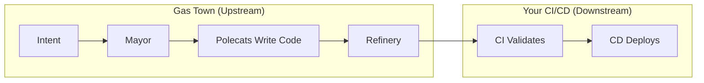
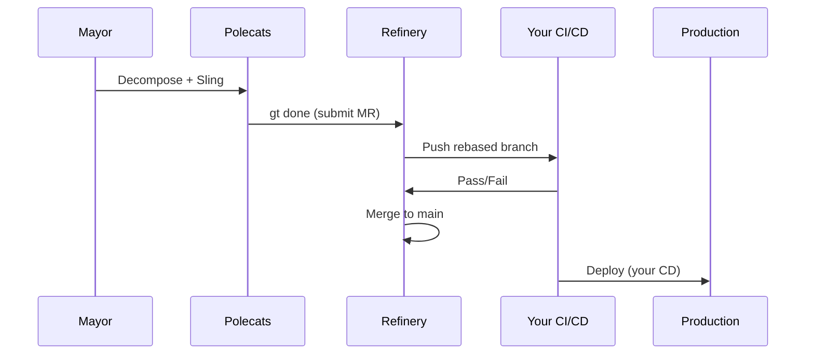

If you come from a DevOps background, Gas Town might look like a CI/CD system. It has pipelines (molecules), queues (merge queue), workers (polecats), and automated testing. But the mental model is fundamentally different.

<!-- truncate -->

## The Key Difference

Traditional CI/CD operates on code that humans already wrote. Gas Town operates *before* code exists — it writes the code, then uses CI/CD to validate it.

```text
Traditional:  Human writes code → CI builds → CD deploys
Gas Town:     Human describes intent → Agent writes code → CI validates → Refinery merges
```

Gas Town doesn't replace your CI/CD pipeline. It sits upstream of it, generating the code that your existing pipeline validates.

## Where They Overlap

Both Gas Town and CI/CD share some concepts:

| Concept | CI/CD | Gas Town |
|---------|-------|----------|
| Work queue | Build queue | Merge queue (Refinery) |
| Workers | Build agents | Polecats |
| Pipeline | Build/test/deploy steps | Molecule steps |
| Triggers | Push/PR events | Sling/hook events |
| Artifacts | Build outputs | Git commits |

The Refinery's merge queue is the closest analog to a CI pipeline — it takes submitted work, rebases it, runs validation, and merges clean code. But the validation step typically *calls your existing CI* rather than reimplementing it.

## Where They Diverge

### 1. Authorship

CI/CD assumes a human authored the code. Gas Town's polecats are the authors. This changes everything about the review model:

- **CI/CD:** Automated checks validate human intent
- **Gas Town:** Automated checks validate agent output (the agent might have misunderstood the task)

### 2. Parallelism Model

CI/CD parallelizes across builds (multiple PRs building simultaneously). Gas Town parallelizes across *authorship* (multiple agents writing code simultaneously).

```text
CI/CD:     PR1 → build | PR2 → build | PR3 → build
Gas Town:  Bead1 → write+build | Bead2 → write+build | Bead3 → write+build
```

This means Gas Town has a conflict problem that CI/CD doesn't: multiple agents changing the same codebase simultaneously can create merge conflicts that don't exist in human-paced development.

### 3. Failure Recovery

When a CI build fails, a human investigates and fixes the code. When a Gas Town validation fails, the system can either:
- Retry with the same agent (maybe the test was flaky)
- Spawn a new agent with the error context
- Escalate to a human via the Mayor

This self-healing loop doesn't exist in traditional CI/CD.

### 4. Work Decomposition

CI/CD doesn't decompose work — it processes whatever gets pushed. Gas Town actively decomposes high-level requests into atomic units (beads) before any code is written. The Mayor does this decomposition, creating a plan before execution begins.



## How They Work Together

The recommended setup uses Gas Town upstream of your existing CI/CD:

```text
1. Mayor decomposes request → beads
2. Polecats write code on branches
3. Polecats submit via gt done → merge queue
4. Refinery rebases onto main
5. YOUR CI runs (GitHub Actions, Jenkins, etc.)
6. If CI passes → Refinery merges to main
7. YOUR CD deploys (ArgoCD, Flux, etc.)
```

Gas Town plugs into step 5-6 of your existing pipeline. The Refinery can be configured to wait for your CI checks:

```bash
# Refinery waits for GitHub Actions CI to pass before merging
gt rig config myproject refinery.require_ci true
```

## What Gas Town Adds That CI/CD Can't

**Autonomous code generation.** CI/CD can't write code. Gas Town can take a high-level request and produce working, tested code without human involvement.

**Batch orchestration.** CI/CD processes individual PRs. Gas Town manages batches of related work (convoys) with dependency tracking and auto-close.

**Agent lifecycle management.** CI/CD doesn't manage the workers that produce code. Gas Town's Witness monitors polecat health, restarts stuck agents, and escalates failures.

**Intent-level tracking.** CI/CD tracks commits and builds. Gas Town tracks beads (intent) through the entire lifecycle from idea to merged code.

## When to Use What

| Scenario | Tool |
|----------|------|
| Validate code quality | Your CI (unchanged) |
| Deploy to production | Your CD (unchanged) |
| Write new features | Gas Town polecats |
| Manage parallel development | Gas Town convoys |
| Monitor agent health | Gas Town Witness |
| Merge safely at scale | Gas Town Refinery + your CI |



## The Bottom Line

Gas Town is not CI/CD 2.0. It's the layer that generates the code your CI/CD validates. Think of it as "AI-driven development management" that happens to interface with your existing automation.

If your CI/CD pipeline works well, keep it. Gas Town will feed it better, faster, and in higher volume.

:::note Integration is the default
Gas Town was designed from day one to complement existing CI/CD, not replace it. The `refinery.require_ci` config flag is the bridge — it tells the Refinery to wait for your CI checks before merging. This means your existing quality gates remain fully in control of what lands on main.
:::

## Next Steps

- **[Architecture Overview](/docs/architecture/overview)** — How Gas Town's components fit together
- **[Refinery](/docs/agents/refinery)** — The merge queue that interfaces with your CI
- **[Convoys](/docs/concepts/convoys)** — Batch tracking for parallel work
- **[Quick Start](/docs/getting-started/quickstart)** — Get started in 10 minutes
- **[The Refinery Deep Dive](/blog/refinery-deep-dive)** — How the Refinery merge queue replaces CI/CD
- **[Work Distribution Patterns](/blog/work-distribution-patterns)** — Work distribution that goes beyond traditional CI/CD
- **[Understanding GUPP](/blog/understanding-gupp)** — The crash-recovery model that makes Gas Town different from CI/CD
