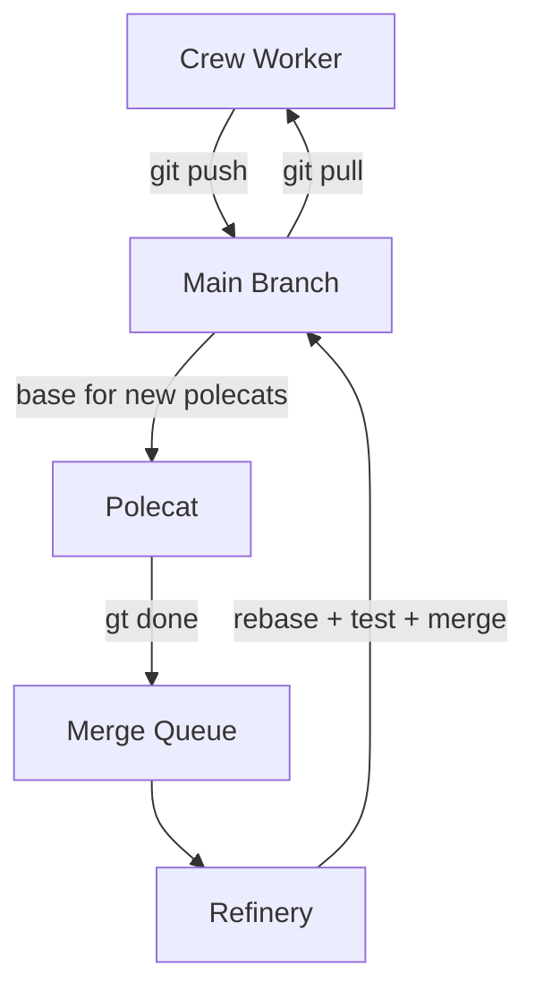
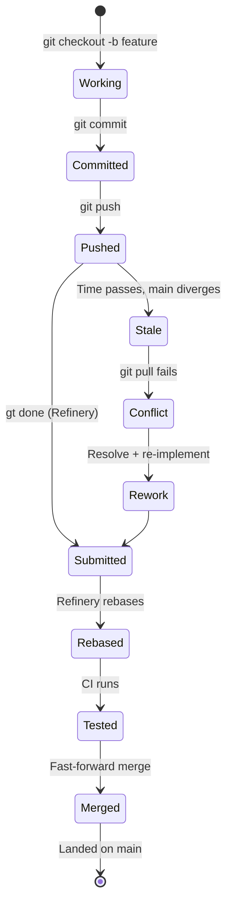
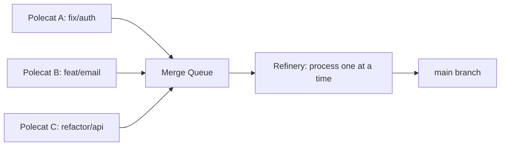
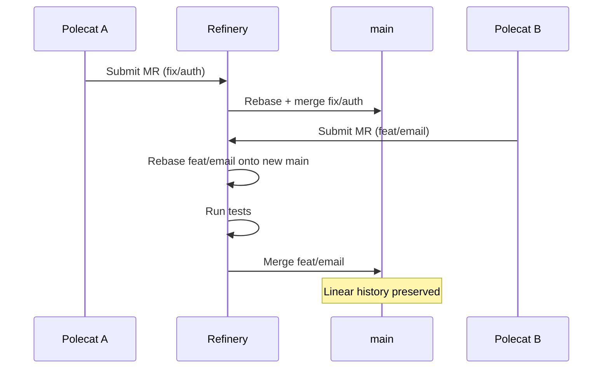
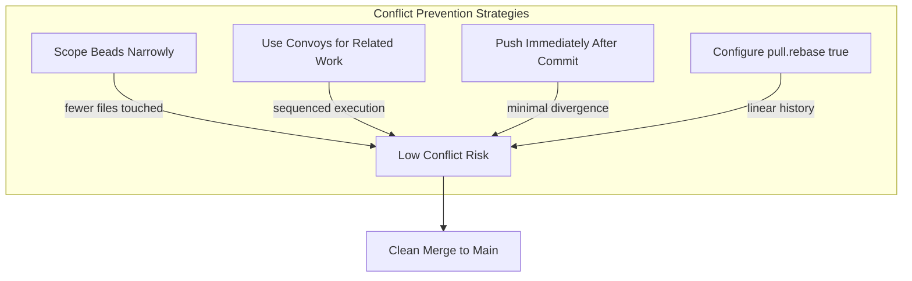

Traditional git workflows assume one developer pushing at a time. In Gas Town, you might have a crew worker, three polecats, and the Refinery all pushing to the same repository within a five-minute window. This changes everything about how you think about branches, rebasing, and merge conflicts.

<!-- truncate -->

## The Problem: Git at Agent Speed

In a single-developer workflow, you push when you're done. You pull when you start. The remote changes between those events at human speed — maybe once an hour.

In Gas Town, where agents work inside isolated [rigs](/docs/concepts/rigs), the remote changes at **agent speed**:

```text
14:00:00  Polecat toast pushes fix/login-bug
14:00:30  Refinery merges fix/login-bug to main
14:01:00  Polecat alpha pushes feat/email-validation
14:01:15  You (crew) push your changes
14:01:15  → REJECTED: remote has diverged
```

If you follow the standard "branch, work, push, merge" pattern, you'll spend more time resolving conflicts than writing code. Gas Town solves this with three principles.



## Principle 1: The Landing Rule



> Work is NOT landed until it's either on main or submitted to the Refinery merge queue.

Feature branches are dangerous in multi-agent environments:

- The repo baseline diverges in hours, not days
- Branches go stale between context cycles
- Merge conflicts compound exponentially with time
- Other agents can't see or build on unmerged work

**Crew workers push directly to main.** No feature branches, no pull requests (you're a maintainer, not an external contributor). If the push fails because someone else pushed first, rebase and push again:

```bash
git add <files>
git commit -m "Fix auth callback URL"
git pull --rebase
git push
```

**Polecats use short-lived branches** that the Refinery merges within minutes. The branch exists only as long as the polecat is working — once `gt done` runs, the branch is submitted to the merge queue and the polecat is nuked.

## Principle 2: Always Rebase, Never Merge

In a multi-agent repo, merge commits create noise. With 10 agents pushing independently, your git history becomes unreadable if every sync creates a merge commit.

```bash
# BAD: Creates merge commits
git pull          # default: merge
git push

# GOOD: Linear history
git pull --rebase  # rebase local commits onto remote
git push
```

Configure git to rebase by default so you don't forget:

```bash
git config --global pull.rebase true
```

The Refinery enforces this too — it rebases every polecat branch onto the latest main before merging. The result is a clean, linear commit history even with dozens of agents working in parallel.

## Principle 3: Push Immediately, Always

In multi-agent environments, **unpushed work is invisible work**. Every minute you delay pushing:

- Other agents might modify the same files
- Merge conflicts accumulate silently
- A session crash loses unpushed commits

The rule is simple: **every commit should be followed by a push**.

```bash
# One atomic operation
git add <files> && git commit -m "description" && git pull --rebase && git push
```

This feels aggressive compared to normal development, where you might batch up commits and push once a day. But in Gas Town, the cost of a merge conflict (another agent redoing work, or a human resolving it manually) far outweighs the cost of frequent pushes.

:::note Unpushed Commits Are Invisible to the Refinery
The Refinery can only merge work that has been pushed to the remote. If a polecat crashes before pushing, its local commits exist only in the worktree. The Witness will detect the stalled agent and respawn a new polecat, which starts fresh on the latest main. To minimize rework, agents should commit and push after every meaningful unit of progress, not just at the end of the task.
:::

## Git Strategy Comparison

| Strategy | Who Uses It | Pros | Cons | When to Use |
|---|---|---|---|---|
| Direct push to main | Crew workers | Immediate visibility; no stale branches; simplest workflow | Risk of push rejection if remote diverged; requires manual conflict resolution | Day-to-day crew work where you are a maintainer on the repo |
| Short-lived branch + merge queue | Polecats | Isolated work; Refinery validates before merge; automatic rebase | Branch can go stale if polecat is slow; conflict respawn adds latency | All polecat-driven feature and fix work |
| Long-lived feature branch | Not recommended | Familiar to traditional teams | Diverges quickly at agent speed; merge conflicts compound exponentially; invisible to other agents | Avoid in Gas Town; use convoys for coordinated multi-bead work instead |
| Fork-based pull requests | External contributors | Standard open-source workflow; full code review | Too slow for agent speed; adds review bottleneck; branches go stale in minutes | Only for external or untrusted contributors, never for internal agents |
| Convoy-sequenced commits | Coordinated multi-agent work | Prevents conflicts on shared files; ordered execution; clean dependency graph | Serializes work that could otherwise parallelize; requires upfront planning | When multiple beads must touch the same files or modules |

## Handling Conflicts

Even with these principles, conflicts happen. Multiple agents sometimes touch the same file. Here's how Gas Town handles each scenario:

### Crew Worker Conflicts

You're pushing directly to main and `git pull --rebase` shows a conflict:

```bash
git pull --rebase
# CONFLICT: both modified src/auth/callback.ts
```

Resolve it manually (you're a human — you can read both versions and decide), then continue:

```bash
# Edit the conflicted file
git add src/auth/callback.ts
git rebase --continue
git push
```

### Polecat Merge Conflicts

When the Refinery tries to rebase a polecat's branch onto main and hits a conflict, it can't resolve it itself (the original polecat is already nuked). Instead, it spawns a **fresh polecat** with context about the conflict:

```text
Refinery: Conflict in mr-001 (fix/login-bug)
  Files: src/auth/callback.ts
  Action: Spawning polecat to re-implement
```

The new polecat starts fresh on the latest main, reads the original bead, and re-implements the fix without the conflict. This is the "squash and respawn" pattern — it's often faster than teaching an AI to resolve merge conflicts.

### Avoiding Conflicts Entirely

The best conflict resolution is prevention:

- **Use convoys to coordinate related work.** If two beads touch the same files, put them in the same convoy so they're worked sequentially rather than in parallel. See [advanced convoy patterns](/blog/advanced-convoy-patterns) for coordination strategies. The [crew collaboration guide](/docs/workflows/crew-collaboration) covers coordination techniques for multi-agent work.
- **Scope beads narrowly.** A bead that touches 20 files across 5 modules will conflict with everything. Break it into focused beads.
- **Push frequently.** The faster changes land on main, the less time there is for divergence.

## The Refinery's Role

The Refinery is the serialization point. Even though 10 polecats work in parallel, merges to main happen one at a time:



Each MR is rebased onto the latest main, validated (tests, build), and fast-forward merged. This guarantees a clean, linear history where every commit on main passes all checks.

If a rebase fails, the Refinery either retries (for transient issues) or spawns a fresh polecat (for real conflicts). The merge queue acts as a buffer that absorbs the chaos of parallel development and produces ordered, validated commits.





:::caution Force-Pushing to Shared Branches Breaks Multi-Agent Workflows
In a multi-agent environment, `git push --force` is nearly always a mistake. Other agents may have based work on commits you are about to overwrite, and force-push destroys that shared history. If you need to rewrite history, coordinate with all active agents first using `gt polecat list`, or work on a personal branch that only you control. The Refinery never force-pushes to main — your crew workspace should follow the same rule.
:::

## Practical Tips

:::tip
Configure `git config pull.rebase true` in every Gas Town workspace. This should be the first thing you do after `gt rig add`.
:::

:::warning
Never `git push --force` in a Gas Town repo unless explicitly asked. Other agents may have based work on the commits you're about to overwrite.
:::

:::tip
If you're a crew worker and keep hitting conflicts, check if a polecat is working on the same files. Use `gt polecat list` and `gt peek <polecat>` to see what's in flight.
:::

## Next Steps

- [Multi-Agent Git Workflow Reference](/docs/guides/git-workflow) — Full guide with all the edge cases
- [Merge Queue Commands](/docs/cli-reference/merge-queue) — CLI reference for listing, submitting, and retrying merge requests
- [Refinery Agent](/docs/agents/refinery) — The per-rig agent that rebases, validates, and merges code serially
- [Convoys](/docs/concepts/convoys) — How to coordinate multi-bead work and prevent git conflicts through sequencing
- [The Refinery: How Merges Actually Work](/blog/refinery-deep-dive) — How the Refinery serializes parallel work
- [Why Git Worktrees?](/blog/git-worktrees) — How Gas Town uses worktrees for agent isolation
- [Convoy Orchestration Patterns](/blog/advanced-convoy-patterns) — Coordinating work to minimize conflicts
- [Your First Convoy](/blog/first-convoy) — Hands-on tutorial for convoy-based coordination that prevents git conflicts
