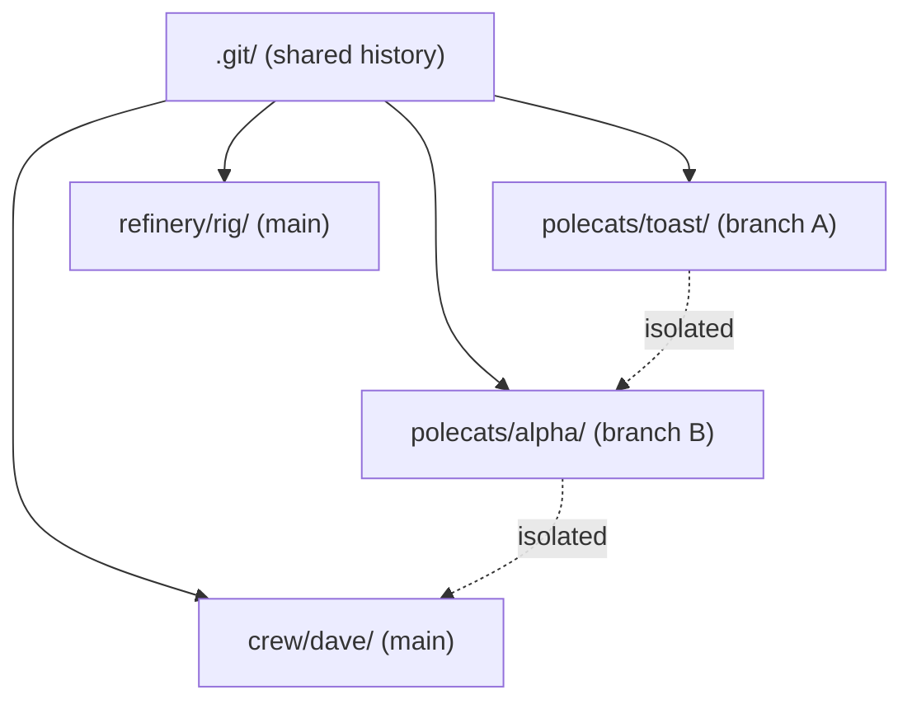
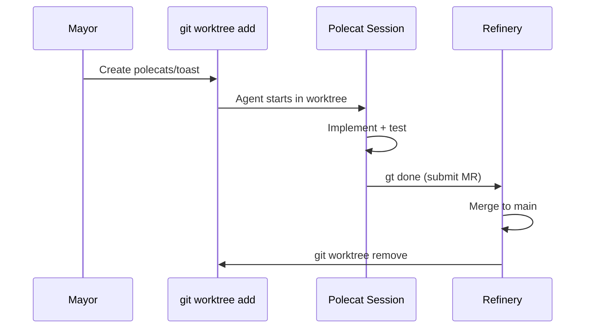
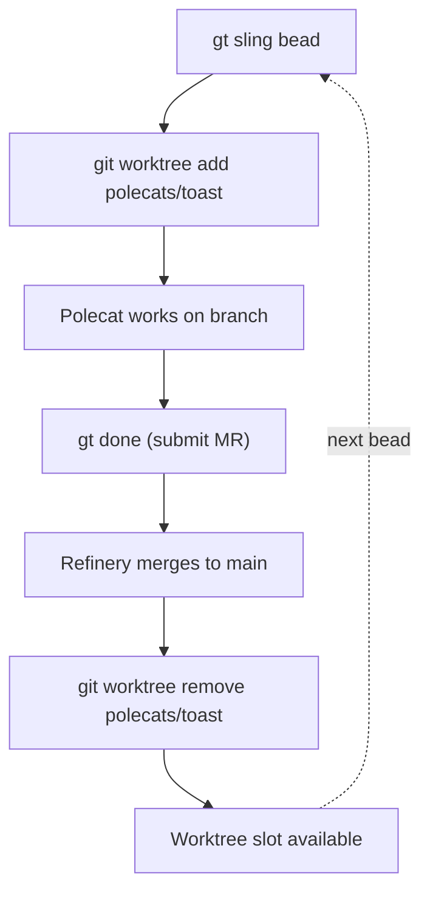
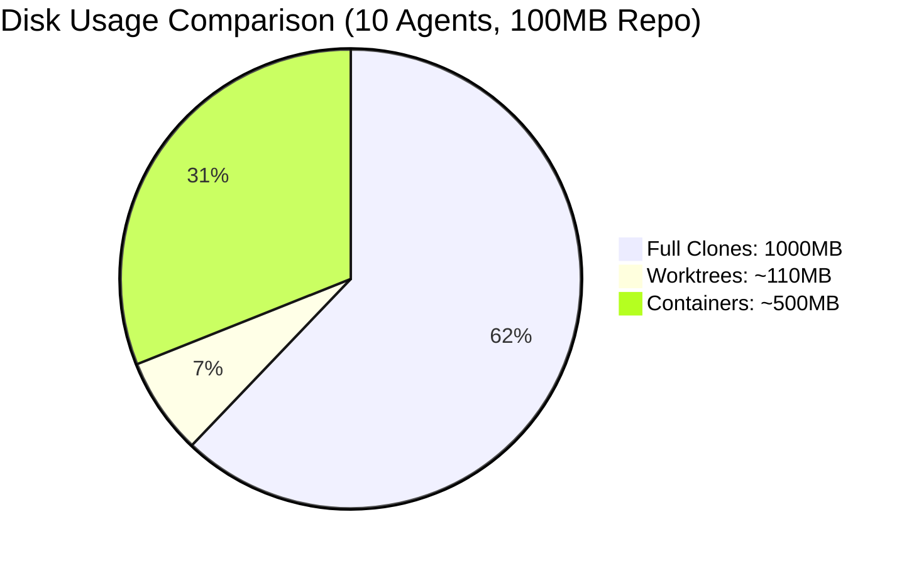

When you run 10 agents writing code in parallel, you need isolation. Each agent needs its own copy of the codebase where it can make changes without stepping on other agents' work. Gas Town solves this with git worktrees -- and the choice was deliberate.

<!-- truncate -->

## The Isolation Problem

Consider what happens without isolation:

```text
Agent A: Edits src/auth.go (adds validation)
Agent B: Edits src/auth.go (fixes token refresh)
Agent C: Edits src/auth.go (updates error messages)
```

Three agents editing the same file simultaneously in the same directory leads to chaos. Each agent's writes overwrite the others. The final state is unpredictable garbage.

You need each agent to have its own copy of the codebase. The question is: how?

## Option 1: Full Git Clones

The obvious approach is giving each agent a full `git clone`:

```bash
git clone repo.git agent-a/
git clone repo.git agent-b/
git clone repo.git agent-c/
```

This works but is expensive. Each clone copies the entire git history. For a repo with 100MB of history, ten clones means 1GB of disk. Cloning also takes time -- seconds to minutes depending on repo size.

## Option 2: Docker Containers

Another approach is running each agent in a Docker container:

```bash
docker run -v repo:/workspace agent-a
docker run -v repo:/workspace agent-b
```

Containers provide strong isolation (process-level, network-level) but add overhead: container startup time, image management, Docker daemon dependency, and complexity in managing git state across container boundaries.

## Option 3: Git Worktrees (Gas Town's Choice)

Git worktrees are the sweet spot for Gas Town's use case:

```bash
git worktree add ../polecats/toast feature-branch-a
git worktree add ../polecats/alpha feature-branch-b
```

Each worktree shares the same `.git` directory (zero duplication of history) but has its own working directory with its own branch checked out:

```text
myproject/
├── refinery/rig/           # Main clone (.git lives here)
│   └── .git/
├── polecats/
│   ├── toast/              # Worktree (own branch, shared .git)
│   └── alpha/              # Worktree (own branch, shared .git)
```

### Why Worktrees Win

| Factor | Full Clone | Container | Worktree |
|--------|-----------|-----------|----------|
| **Creation time** | Seconds-minutes | Seconds | Milliseconds |
| **Disk overhead** | Full repo per agent | Image + volume | Near zero |
| **Git integration** | Independent | Complex | Native |
| **Cleanup** | Delete directory | Remove container | `git worktree remove` |
| **Branch management** | Manual | Manual | Automatic |
| **History access** | Full (duplicated) | Mounted | Full (shared) |

Worktree creation is essentially instant -- it's just creating a directory and checking out files. No network calls, no image pulls, no history duplication.



## How Gas Town Uses Worktrees

### Polecat Sandboxes

When the Mayor [slings](/docs/cli-reference/sling) a bead to a rig, a polecat worktree is created:

```text
gt sling gt-a1b2c myproject
→ git worktree add polecats/toast -b polecat/toast
→ Polecat session starts in polecats/toast/
→ Agent works on its own branch
→ Agent submits MR to Refinery
→ Refinery merges to main
→ Witness nukes worktree: git worktree remove polecats/toast
```

The entire polecat lifecycle -- create, work, submit, cleanup -- happens within worktree mechanics. No external tooling needed.

### Cross-Rig Worktrees

Crew workers can create worktrees in other rigs for cross-project work:

```bash
# Create a worktree to work on the beads project
gt worktree beads
# → Creates ~/gt/beads/crew/myproject-dave/

# Work on beads code directly
cd ~/gt/beads/crew/myproject-dave/
# ... fix a bug ...

# Clean up when done
gt worktree remove beads
```

This is how crew workers contribute to projects outside their home rig without needing a full clone.

:::info Cross-Rig Worktrees Share the Same Git History
When you create a cross-rig worktree with `gt worktree`, it shares the `.git` directory with the rig's canonical clone. This means you get full git history access with zero additional disk cost. However, remember to clean up cross-rig worktrees with `gt worktree remove` when you are done -- orphaned worktrees consume inode resources and can block branch checkouts for other agents.
:::

### Refinery Merge Operations

The Refinery uses the canonical clone in `refinery/rig/` for merge operations:

```text
1. Fetch polecat branch: git fetch origin polecat/toast
2. Checkout main: git checkout main
3. Rebase polecat work: git rebase main polecat/toast
4. Run tests on rebased code
5. Fast-forward main: git merge --ff-only polecat/toast
6. Push: git push origin main
```

This happens in the Refinery's own working directory, completely isolated from all polecat worktrees.



:::warning Worktrees Provide Code Isolation, Not Process Isolation
Git worktrees share the same `.git` directory and run in the same OS process space. A misbehaving agent can theoretically access files outside its worktree. For security-sensitive workloads that run untrusted code, layer container-based isolation on top of the worktree system. For standard AI code generation, worktree-level isolation is sufficient.
:::

:::note Each Branch Can Only Have One Worktree
Git enforces a one-to-one relationship between branches and worktrees — you cannot check out the same branch in two worktrees simultaneously. If a polecat's worktree is not properly cleaned up after completion, subsequent agents trying to use that branch name will fail. The Witness handles this cleanup automatically, but be aware of this constraint when debugging "branch already checked out" errors.
:::





:::tip Clean Up Orphaned Worktrees Weekly
Over time, failed slings or interrupted agent sessions can leave orphaned worktrees consuming disk space and blocking branch checkouts. Run `git worktree prune` weekly in each rig to clean up stale references, and use `gt doctor` to detect worktrees that should have been removed but were not. This prevents the "branch already checked out" errors that confuse agents trying to spawn new worktrees.
:::

## The Trade-Off

Gas Town's worktree approach provides **code isolation**, not **process isolation**. A misbehaving polecat could theoretically access files outside its worktree. For most code generation use cases, this is acceptable -- the risk model is "agent writes bad code" (caught by tests), not "agent escapes sandbox" (which requires container-level isolation).

If you need stronger isolation for security-sensitive workloads (running untrusted code, network-restricted environments), you can layer containers on top of Gas Town's worktree system. But for the common case of AI agents writing and testing code, worktrees provide the right balance of isolation, speed, and simplicity.

:::tip Worktree lifecycle is automatic
You don't need to manage worktrees manually. The Deacon creates them when spawning polecats, and Boot cleans them up when processing death warrants after work completes. The only time you interact with worktrees directly is when using `gt worktree` for cross-rig crew work.
:::

## Next Steps

- [Rigs](/docs/concepts/rigs) -- How rigs organize worktrees and agent infrastructure
- [Hooks](/docs/concepts/hooks) -- How work state persists in worktree-based hooks
- [Security Model](/blog/security-model) -- Gas Town's trust boundaries and isolation strategy
- [Git Workflow](/docs/guides/git-workflow) -- Multi-agent git patterns with worktrees
- [Polecats](/docs/agents/polecats) -- The ephemeral agents that work inside worktree sandboxes
- [Git Workflows for Multi-Agent Development](/blog/git-workflows-multi-agent) -- Git patterns for multi-agent development with worktrees
- [Understanding Rigs](/blog/understanding-rigs) -- How rigs use worktrees to isolate agent workspaces
- [Hooks: The Persistence Primitive](/blog/hook-persistence) -- How hooks store work state inside git worktrees
