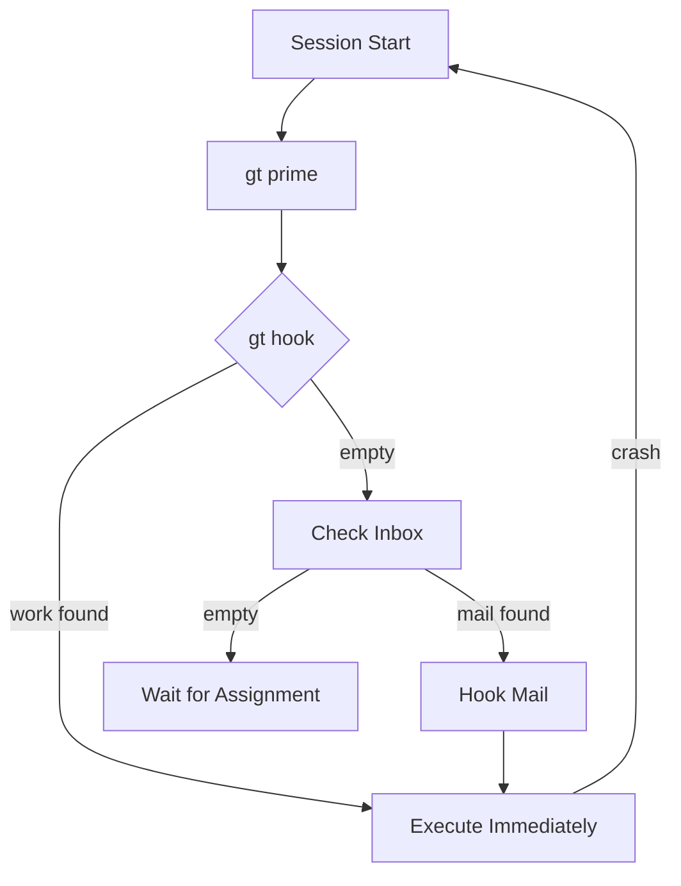
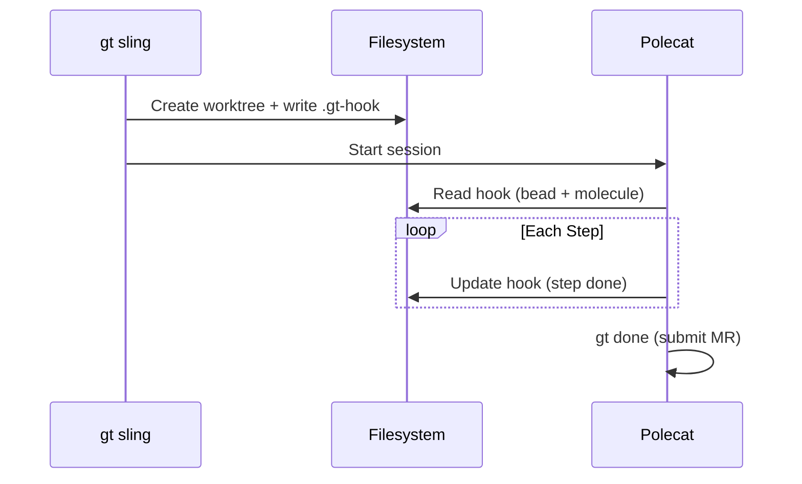
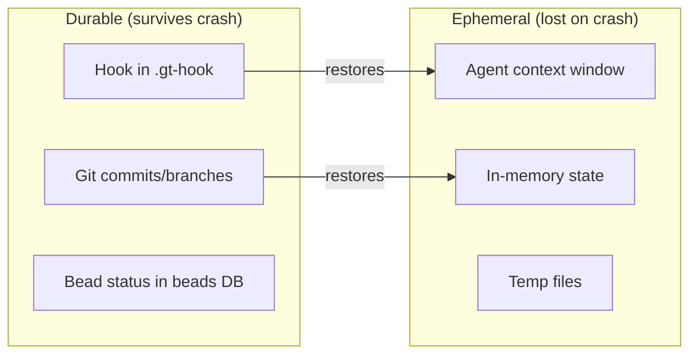
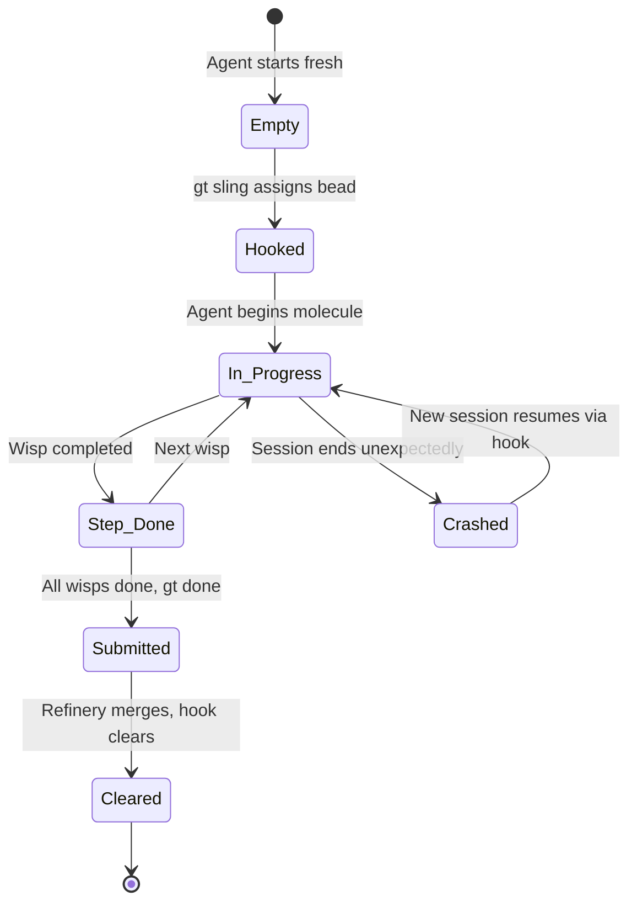

The biggest risk in multi-agent AI systems is lost work. An agent crashes at 80% completion, and everything it did vanishes. Gas Town's hook system eliminates this risk entirely through a simple but powerful persistence primitive.

<!-- truncate -->

## The Problem: Ephemeral Context

AI coding agents are fundamentally ephemeral. Every session starts with a blank context window. When the context fills up or the session crashes, everything in that window -- the files the agent read, the decisions it made, the progress it tracked -- is gone.

This creates a catastrophic failure mode:

```text
Session 1:  Read 50 files → Planned approach → Implemented 80% → CRASH
Session 2:  (blank context) → "What was I doing?" → Re-reads files → Different approach
```

Without persistence, every crash means starting over. Worse, the second session might take a completely different approach, creating conflicts with the partial work from the first session.

## The Solution: Hooks

A hook is a persistent attachment point that stores work state in the filesystem -- outside the agent's context window. When work is "hooked" to an agent, three things are recorded:

1. **The assigned bead** -- Which issue this agent is working on
2. **The molecule state** -- Which step of the workflow the agent has reached
3. **The git branch state** -- Any code changes in the worktree

Because hooks live in the filesystem (specifically, in the git worktree), they survive everything:

| Disruption | Hook Status |
|-----------|-------------|
| Context fills up | Preserved |
| Session crashes | Preserved |
| Machine reboots | Preserved |
| Agent killed by Witness | Preserved |
| Manual session restart | Preserved |

The new session simply reads the hook and picks up where the previous session left off.



## The Propulsion Cycle

Hooks create a self-propelling work cycle. Every agent follows the same startup protocol:

```text
1. Start session
2. Run gt prime (load role context)
3. Check gt hook (find assigned work)
4. If work found → Execute immediately
5. If no work → Check inbox → Wait
```

This is the Gas Town Universal Propulsion Principle (GUPP) in action. The hook converts every session restart from "start over" to "continue forward." No central scheduler needs to tell agents what to do -- they discover it themselves. This self-propelling behavior is what makes [beads](/docs/concepts/beads) work as a task primitive -- the bead on the hook drives all agent activity.

:::tip Always Check the Hook Before Checking the Inbox
The startup protocol order matters: `gt hook` before `gt mail inbox`. If an agent checks mail first, it might pick up a new assignment while an existing hooked task is still in progress. The hook is the source of truth for current work — mail is supplementary context, not a replacement for the hook check.
:::

## How Hooks Work Internally

When `gt sling` assigns a bead to a polecat, here is what happens:

```text
1. Bead status changes to 'hooked'
2. A polecat worktree is created under polecats/<name>/
3. The hook metadata file is written:
   polecats/<name>/.gt-hook
   ├── bead_id: gt-a1b2c
   ├── molecule: mol-polecat-work
   └── step: load-context
4. The polecat session starts and reads this hook
```

As the agent progresses through molecule steps, the hook metadata is updated:

```text
Step completed: load-context → done
Hook update:    step: branch-setup

Step completed: branch-setup → done
Hook update:    step: implement

... agent crashes here ...

New session reads hook:
  bead_id: gt-a1b2c
  molecule: mol-polecat-work
  step: implement         ← resume from here
```

The molecule tracks which steps are done, in progress, or pending. A fresh agent reads this state and skips completed steps entirely.



## Hooks vs. Handoff Mail

Gas Town has two persistence mechanisms for session boundaries. They serve different purposes:

| Mechanism | What It Preserves | Format | Audience |
|-----------|------------------|--------|----------|
| **Hook** | Work assignment + progress | Structured metadata | The next session (automated) |
| **Handoff mail** | Context notes + strategy | Free-form text | The next session (human-readable) |

The hook is the minimum viable persistence -- it tells the next session WHAT to work on and WHERE to resume. Handoff mail is supplementary context -- it tells the next session HOW the previous session was approaching the problem.

A hook without handoff mail works fine. The agent knows its assignment and can figure out the approach. Handoff mail without a hook is useless -- the agent has context notes but no work to apply them to.

## Real-World Recovery Scenarios

### Scenario 1: Polecat Crashes Mid-Implementation

```text
Session 1:  load-context ✓ → branch-setup ✓ → implement ● → CRASH
Session 2:  gt prime → gt hook → sees implement in_progress
            → reads the diff to understand partial work
            → continues implementation from where Session 1 left off
```

### Scenario 2: Context Window Fills Up

```text
Session 1:  Implemented feature, running tests, context is 95% full
            → gt handoff -m "Tests failing on line 42, auth mock is wrong"
            → Session exits cleanly
Session 2:  gt prime → gt hook → sees run-tests in_progress
            → reads handoff mail → fixes auth mock → tests pass
            → continues to next step
```

### Scenario 3: Witness Kills a Stuck Polecat

```text
Session 1:  Agent stuck in retry loop for 30 minutes
            → Witness detects stall → nukes session
Session 2:  New polecat spawned → gt hook → same assignment
            → takes a different approach (NDI) → succeeds
```

In all three cases, the hook ensures continuity. The work assignment persists, the progress is tracked, and the new session moves forward.

:::note Hooks Are More Authoritative Than Context
Because work assignment is stored in the filesystem — not in the agent's context window — it cannot be manipulated through prompt injection or context manipulation. This is why Gas Town agents check `gt hook` before doing anything else. The hook is the source of truth, not whatever the context window says.
:::

:::caution Handoff Mail Supplements Hooks — It Does Not Replace Them
When cycling sessions, always ensure work is hooked before relying on handoff mail. A common mistake is sending detailed handoff notes but failing to verify the hook state. The next session will find context in its inbox but no assignment on the hook, leaving it unable to act on the information. The hook is the assignment; the mail is the context.
:::





:::warning Never Manually Edit `.gt-hook` Files
The hook metadata files are managed by Gas Town's internal tooling (`gt sling`, `gt hook`, `gt mol`). Manually editing a `.gt-hook` file can put the hook in an inconsistent state -- for example, marking a step as done when its output was never committed to git. If you need to change a hook's state, always use the CLI commands like `gt hook clear` or `gt hook attach` which validate state transitions.
:::

:::info Hooks Survive Git Operations That Would Lose Uncommitted Work
Because hooks are stored as metadata files in the worktree, they persist through most git operations including branch switches, rebases, and even git resets. This durability is what makes hook-driven architecture reliable — even if an agent runs a destructive git command that loses uncommitted changes, the hook still points to the correct bead and molecule state, allowing a fresh session to retry the work from the last committed checkpoint.
:::

## The Security Angle

Hooks also serve a security function. Because work assignment is stored in the filesystem (not in the agent's context), it cannot be manipulated through prompt injection or context manipulation. An agent cannot "forget" its assignment or be tricked into working on something else -- the hook is the source of truth.

This is why Gas Town agents check `gt hook` before doing anything else. The hook is more authoritative than anything in the context window.

## Next Steps

- [Hooks (Persistence)](/docs/concepts/hooks) -- Full reference for the hook system
- [GUPP & NDI](/docs/concepts/gupp) -- The design principles that hooks implement
- [Molecules & Formulas](/docs/concepts/molecules) -- How molecules track step-level progress on hooks
- [Session Cycling](/docs/concepts/session-cycling) -- How hooks and handoff mail work together across sessions
- [Hooks: The Persistence Primitive](/blog/hook-persistence) -- The crash-safe storage behind hook-driven architecture
- [Understanding GUPP](/blog/understanding-gupp) -- Why GUPP relies on hook-driven execution
- [Mastering gt sling](/blog/mastering-gt-sling) -- How sling uses hooks to assign work to agents
- [Session Cycling Explained](/blog/session-cycling) -- How hooks and handoff mail preserve continuity across sessions
