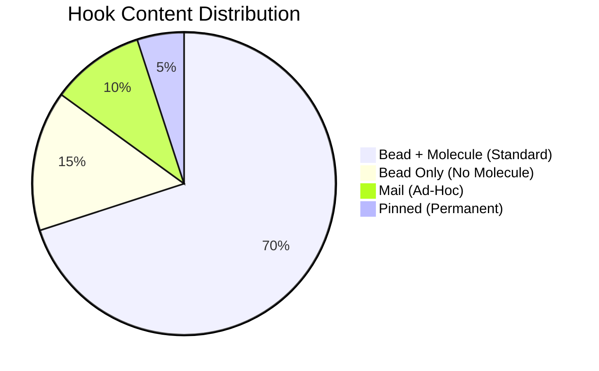
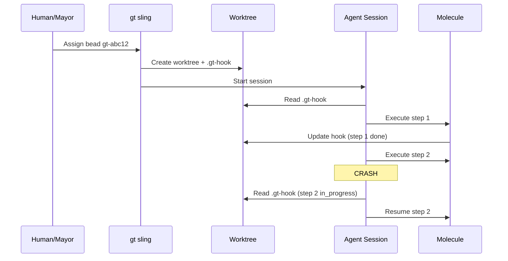
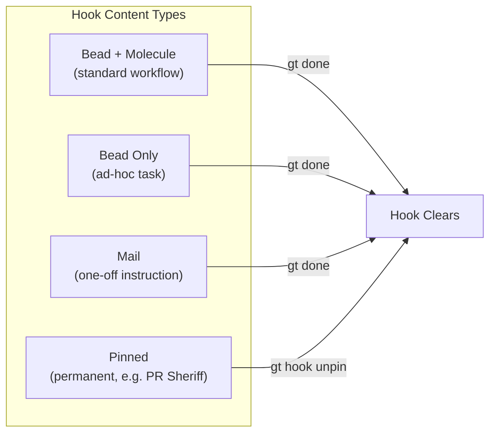
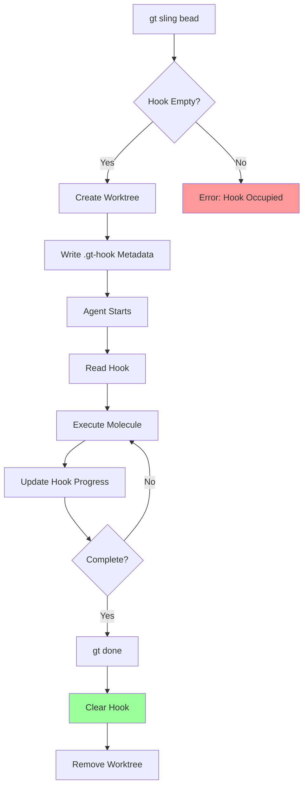

Every Gas Town agent has a hook. It's the simplest concept in the system and arguably the most important. A hook is a persistent pointer from an agent to its current work — stored in the filesystem, surviving crashes, restarts, and context compaction. Without hooks, multi-agent orchestration falls apart the moment any session ends unexpectedly.

<!-- truncate -->

## The Problem

AI coding agents are ephemeral by nature. A session can end for many reasons:

- Context window fills up (the most common)
- Session crashes or times out
- The operator requests a handoff
- Machine restarts
- Infrastructure failures

Without some form of durable state, every session restart means starting over. The agent has no memory of what it was doing, what files it changed, or how far it got through a multi-step workflow.

Traditional approaches (database-backed task queues, message brokers) add complexity and create new failure modes. Gas Town takes a different approach: **store work state in the same git worktree the agent is already working in**.

## How Hooks Work

A hook is metadata attached to an agent's working directory. When work is assigned to an agent via `gt sling`, three things are recorded:

1. **The bead ID** — Which task is assigned
2. **The molecule state** — Which step of the workflow the agent is on
3. **The git branch** — Where uncommitted changes live

Because this lives in the filesystem (the git worktree), it survives any session boundary. When a new session starts in the same workspace, it checks the hook and finds exactly where the previous session left off.


## The Propulsion Principle

Hooks enable Gas Town's most important behavioral rule: **GUPP** (Gas Town Universal Propulsion Principle).

> If it's on your hook, YOU RUN IT.

When an agent starts a session, it checks its hook. If work is there, the agent begins immediately — no confirmation, no waiting for human approval, no announcing itself and pausing. The hook is the assignment. The assignment is the authorization. This connects to broader [daemon process](/blog/daemon-process) patterns and is core to the [minimal mode workflow](/docs/workflows/minimal-mode).

This is critical for autonomous operation. In a system with 10+ agents, you can't have each one waiting for a human to say "yes, go ahead." The hook having work IS the go-ahead. The human (or Mayor, or Witness) placed work on the hook deliberately. The agent trusts that intent and acts.

:::tip The Hook Is Both Assignment and Authorization
The genius of the hook system is that it solves two problems at once: it tells the agent WHAT to work on (the assignment) and grants permission to proceed (the authorization). There is no separate approval step, no confirmation prompt, no waiting period. This unification is what makes autonomous operation possible — agents can act immediately because assignment and authorization are atomically linked.
:::

:::caution Verify the Hook Before Slinging New Work
If you sling a new bead to an agent that already has work on its hook, the existing assignment will be overwritten. Always run `gt hook --target <agent>` before slinging to confirm the hook is empty. Overwriting an active hook can orphan the in-progress bead, leaving partially completed work on a branch that no agent is tracking.
:::

## Types of Hook Content



Hooks can carry different types of work:

### Bead + Molecule (Standard)

The most common case. A bead (task) is hooked with a molecule (workflow) that guides the agent through steps:

```bash
gt hook
# Hooked: gt-abc12 (molecule: mol-shiny-abc12, step: implement)
```

### Bead Only (No Molecule)

A bead without a molecule. The agent reads the bead and decides what to do:

```bash
gt hook
# Hooked: gt-def34 (no molecule)
```

### Mail (Ad-Hoc Instructions)

Mail messages can be hooked for one-off tasks that don't warrant a formal bead:

```bash
gt mail hook m-001
gt hook
# Hooked: mail m-001 (subject: "Fix the typo in README.md")
```

### Pinned (Permanent Reference)

Some hooks are "pinned" — they stay permanently. The PR Sheriff pattern uses a pinned hook so every session checks open PRs:

```bash
gt hook
# Pinned: gt-pr-sheriff (permanent)
```

## How Assignment Works

Work reaches hooks through several paths:


- **`gt sling`** — The Mayor or human assigns work to a rig. Gas Town finds an available polecat (or spawns one) and hooks the bead.
- **Witness respawn** — When a polecat crashes and is respawned, the hook still has the original bead.
- **Self-assignment** — An agent hooks work to itself (e.g., crew members picking up beads).
- **Mail hookup** — Hooking a mail message for ad-hoc instructions.

:::warning Pinned Hooks Never Auto-Clear
Unlike standard hooks that clear on `gt done`, pinned hooks persist permanently across sessions. If you pin a hook (e.g., for the PR Sheriff pattern), it will run on every session start until you explicitly unpin it. Be deliberate about what you pin — an accidental pin can cause an agent to re-execute the same task every time it starts.
:::

## Why Git Worktrees?

Gas Town uses git worktrees as the isolation mechanism for agents. Each [polecat](/docs/agents/polecats) gets its own worktree — a lightweight checked-out copy of the repository. This is where the hook lives.

The worktree gives you three things for free:

1. **File isolation** — Each agent edits its own copy of files. No conflicts during implementation.
2. **Branch isolation** — Each agent works on its own branch. No stepping on each other's commits.
3. **Hook durability** — The hook metadata is stored in the worktree. If the agent crashes, the worktree (and hook) remain.

When the polecat finishes and calls `gt done`, the worktree is cleaned up. The branch is submitted to the Refinery merge queue. The hook is cleared.

## Hooks vs. Traditional Task Queues

| Feature | Gas Town Hooks | Task Queue (Redis, etc.) |
|---------|---------------|--------------------------|
| Persistence | Git worktree (filesystem) | External service (Redis, DB) |
| Failure mode | Survives machine restart | Service must be running |
| Assignment model | 1 agent : 1 hook | N agents pull from queue |
| Progress tracking | Molecule state in hook | Custom implementation |
| Recovery | Agent reads hook on start | Requires re-queue logic |
| External dependency | None (just filesystem) | Requires running service |

The hook model is simpler because it doesn't require any external services. There's no Redis to keep running, no database to maintain. The hook is just files in a directory. If the machine reboots, the hooks are still there when it comes back up.

## Common Hook Operations

```bash
# Check what's on your hook
gt hook

# Check a specific agent's hook
gt hook --target myproject/polecats/toast

# Clear a hook (release the assignment)
gt hook clear

# Attach work to your hook manually
gt hook attach gt-abc12

# Check molecule progress on the hook
gt mol status
```

:::tip Hooks Clear Only on Explicit Completion
Work stays hooked until it is explicitly done or released — crashes, context compaction, and machine restarts do not clear the hook. This asymmetry is deliberate and prevents work from falling through the cracks. If you need to remove work from a hook manually, use `gt hook clear`.
:::

:::info Hook State Is Queryable From Outside the Agent
You do not need to be inside an agent's session to inspect its hook. Use `gt hook --target <path>` from any terminal to check what work is assigned to any agent in any rig. This is invaluable for debugging stalled polecats or verifying that a sling command landed correctly — you can inspect the hook without interrupting the agent's session.
:::





:::danger Check the Hook Before Every Sling
If you sling a new bead to an agent that already has work on its hook, the existing assignment is overwritten — the previous bead becomes orphaned and falls through the cracks unless you manually recover it. Always run `gt hook --target <agent>` before slinging to confirm the hook is empty. This simple check prevents the most common source of lost work in Gas Town environments.
:::

The following diagram illustrates the complete hook assignment and execution lifecycle.



## When Hooks Clear

Hooks clear when:

1. **Work completes** — `gt done` submits to merge queue and clears the hook
2. **Manual clear** — `gt hook clear` releases the assignment
3. **Warrant execution** — When Boot terminates an agent, the Witness handles the orphaned hook

Hooks do NOT clear when:
- The session crashes
- Context compacts
- The machine restarts
- The agent hands off to a fresh session

This asymmetry is deliberate. Work stays hooked until it's explicitly done or released. This prevents work from falling through the cracks.

## Next Steps

- [Hooks Reference](/docs/concepts/hooks) — Full reference with all hook types, states, and commands
- [GUPP & NDI](/docs/concepts/gupp) — The propulsion principle that hooks implement at the system level
- [Session Cycling](/docs/concepts/session-cycling) — How hooks persist work assignments across context window refreshes
- [Molecules & Formulas](/docs/concepts/molecules) — How molecules track step-level progress on hooked work
- [Mayor Agent](/docs/agents/mayor) — The town-level orchestrator that assigns work to hooks via gt sling
- [Understanding GUPP: Why Crashes Don't Lose Work](/blog/understanding-gupp) — The propulsion principle that hooks enable
- [Hook-Driven Architecture](/blog/hook-driven-architecture) — Design patterns for hook-based agent coordination
- [Session Cycling](/blog/session-cycling) — How hooks preserve work across context window refreshes
- [Molecules and Formulas](/blog/molecules-and-formulas) — How molecules track step-level progress on hooks
- [Mayor Workflow Automation](/blog/mayor-workflow) — How the Mayor uses hooks to assign decomposed tasks to polecats automatically
