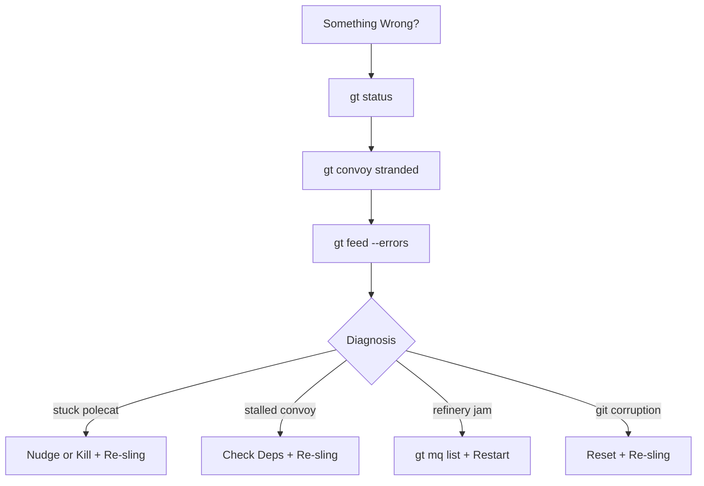
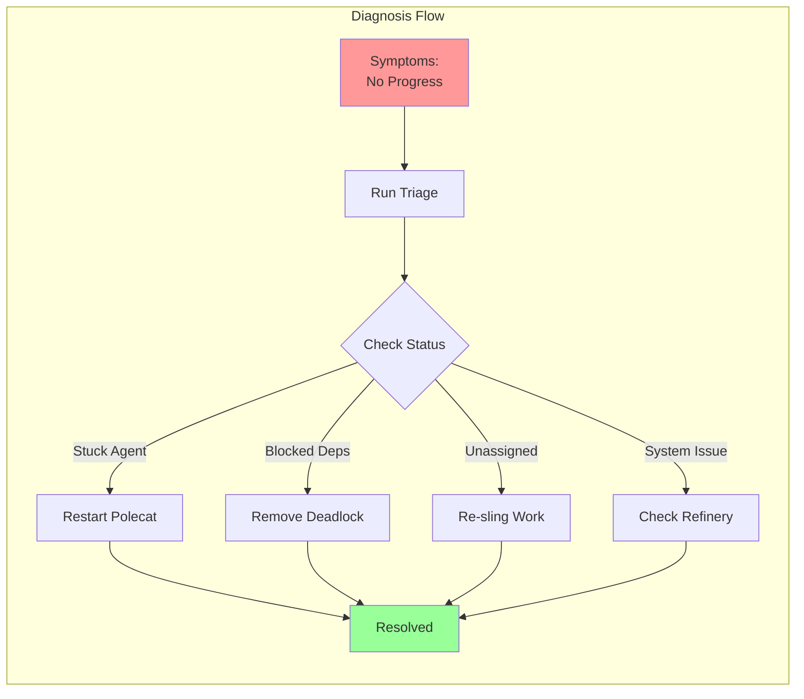
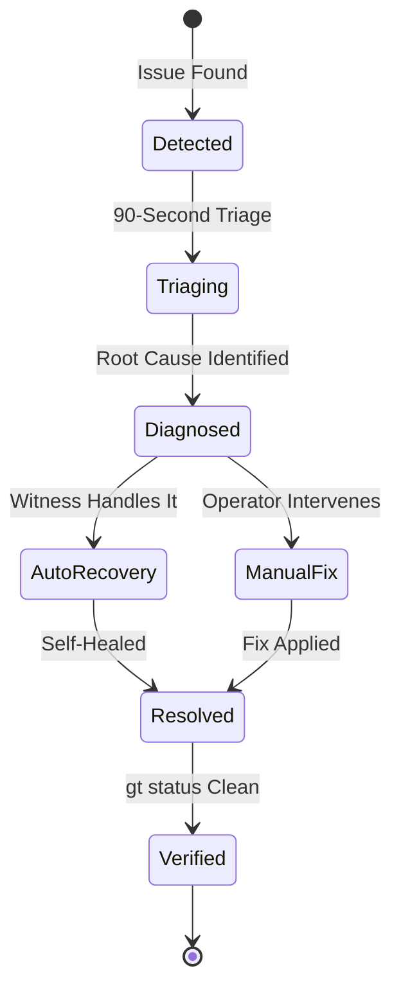
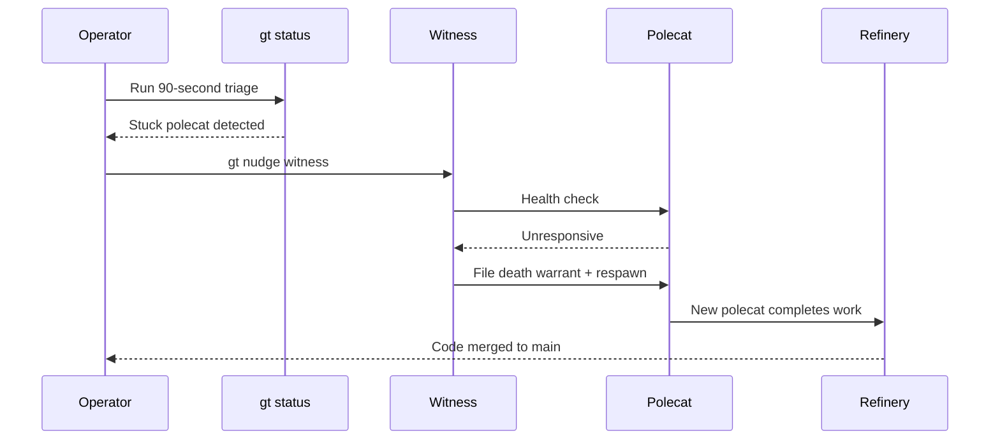
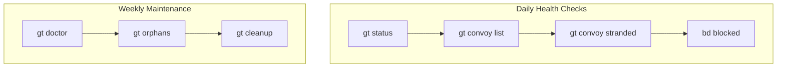
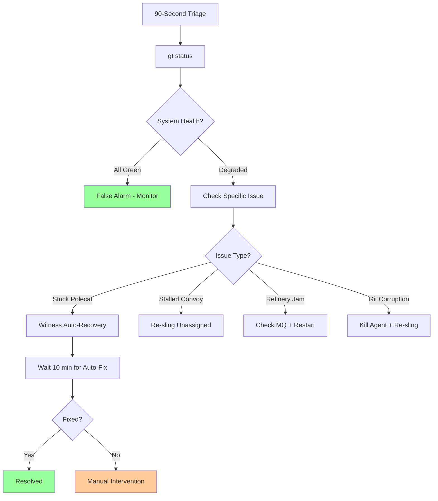

Gas Town is designed to recover from failures automatically. But when the automated recovery isn't enough, you need to know how to diagnose and fix things manually. Here's your playbook for the most common failure scenarios.

<!-- truncate -->

## The 90-Second Triage

When something seems wrong, run these three commands first:

```bash
# 1. What's the overall health?
gt status

# 2. Any stuck or stranded work?
gt convoy stranded
bd blocked

# 3. Check the activity stream for errors
gt feed --errors
```

This gives you a snapshot of system health in under 90 seconds. Most issues become obvious from here.



## Severity Levels and Response Actions

| Severity | Description | Example Scenarios | Initial Response | Escalation Timeframe |
|---|---|---|---|---|
| **SEV-1: Critical** | Town-wide outage; no agents can operate | Beads database corruption; daemon crash; all rigs offline | Stop all slings; run `gt status` and `gt feed --errors`; notify operator immediately | Immediate — manual intervention required within 5 minutes |
| **SEV-2: Major** | One rig or core agent is down; work is blocked | Refinery jam blocking all merges; Deacon down so no dogs spawn; rig git corruption | Run 90-second triage; restart affected agent with `gt rig restart`; check merge queue | 10 minutes — if automated recovery (Witness patrol) has not resolved |
| **SEV-3: Moderate** | Single agent stuck or convoy stalled; other work continues | Stuck polecat; stalled convoy with unassigned beads; hook delivery failure | Check agent logs; nudge Witness; re-sling if needed | 30 minutes — allow 2-3 Witness patrol cycles before manual intervention |
| **SEV-4: Low** | Minor issue; cosmetic or non-blocking | Orphaned worktrees consuming disk; stale branches; temp file buildup | Log for next Deacon patrol; no immediate action needed | Next scheduled maintenance window or daily health check |

## Scenario 1: Stuck Polecat

**Symptoms:** A bead shows `in_progress` but no commits are appearing. The polecat's session might be unresponsive.

**Diagnosis:**

```bash
# Check the polecat's session
gt polecat list --rig myproject

# Look at the session directly
gt polecat logs <polecat-name>
```

**Common causes:**
- **Context window exhaustion** — The agent ran out of context trying to solve a complex problem
- **Infinite loop** — The agent is retrying a failing operation
- **External dependency** — Waiting on a service that's down

**Recovery:**

```bash
# Option 1: Let the Witness handle it (preferred)
# The Witness automatically detects stuck polecats and restarts them
gt nudge witness "Check polecat health"

# Option 2: Manual restart
gt polecat restart <polecat-name> --rig myproject

# Option 3: Nuclear — kill and re-sling
gt polecat kill <polecat-name> --rig myproject
gt sling <bead-id> myproject
```

The key insight: killing a polecat doesn't lose work. The bead is still tracked, and any commits on the branch are preserved. GUPP (Gas Town Universal Propulsion Principle) ensures that the next agent picks up where the last one left off. For more on GUPP, see [understanding GUPP](/blog/understanding-gupp).

:::info Polecats Are Ephemeral — Beads Are Permanent
The most important mental model for incident response is understanding that polecats are disposable containers for work, while beads are the durable record of the work itself. When troubleshooting, focus on bead state first, then agent state second. A stuck polecat is an inconvenience; a lost bead is data loss. This priority ordering guides every recovery decision.
:::

## Scenario 2: Stalled Convoy



**Symptoms:** `gt convoy status` shows the convoy is open, but no beads have progressed in a while.

**Diagnosis:**

```bash
# Check the convoy's beads
gt convoy show hq-cv-001

# Are any beads blocked?
bd blocked

# Are beads assigned to agents?
bd list --status=open --convoy=hq-cv-001
```

**Common causes:**
- **Dependency deadlock** — Circular dependencies preventing any bead from becoming ready
- **Unassigned work** — Beads are ready but never got slung to a rig
- **All polecats failed** — Each polecat hit the same issue and gave up

**Recovery:**

```bash
# Break a deadlock by removing a dependency
bd dep remove <bead-a> <bead-b>

# Re-sling unassigned work
gt convoy stranded
gt sling <bead-id> myproject

# For systematic failures, check the common issue
bd show <failing-bead>
# Fix the root cause, then re-sling
```

:::warning Never Force-Clear Hooks During Active Incidents
When a polecat is stuck, it is tempting to run `gt hook clear` to free the assignment. But if the polecat has uncommitted work on its branch, clearing the hook orphans that work. Always check `git status` in the polecat's worktree first, and prefer `gt polecat restart` over manual hook clearing — the restart preserves the hook and lets the fresh session recover the partial work.
:::

## Scenario 3: Refinery Jam

**Symptoms:** Work is submitted (polecats ran `gt done`) but nothing is merging to `main`.

**Diagnosis:**

```bash
# Check the merge queue
gt mq list

# Check Refinery status
gt rig info myproject
```

**Common causes:**
- **Test failures** — The Refinery rebased onto latest `main` and tests broke
- **Merge conflicts** — Multiple polecats touched the same files
- **Refinery crash** — The Refinery agent itself needs a restart

**Recovery:**

```bash
# Check what's in the queue
gt mq list

# If tests are failing after rebase, the Refinery will report why
gt mq show <mr-id>

# Restart the Refinery
gt rig restart myproject

# If a specific MR is blocking, you can reject it
gt mq reject <mr-id> --reason "Conflicts with other changes"
```

For persistent merge conflicts, consider processing the conflicting MRs sequentially rather than letting the Refinery attempt parallel merges.





## Scenario 4: Agent Can't Find Its Hook

**Symptoms:** An agent starts up and reports "hook empty" even though work was assigned.

**Diagnosis:**

```bash
# Check what's on the hook from outside
gt hook --agent <agent-name>

# Check if the mail was delivered
gt mail outbox
```

**Common causes:**
- **Race condition** — The agent started before the sling completed
- **Wrong rig** — Work was slung to a different rig than expected
- **Hook corruption** — Rare, but the hook state file might be damaged

**Recovery:**

```bash
# Re-hook the work manually
gt mol attach <bead-id> <molecule-id>

# Or re-sling
gt sling <bead-id> myproject
```

## Scenario 5: Git State Corruption

**Symptoms:** `git status` shows unexpected state, merge conflicts, or detached HEAD.

**Diagnosis:**

```bash
# Check git state
git status
git log --oneline -5
git branch -a
```

**Recovery for crew workers:**

```bash
# If you have uncommitted work worth saving
git stash

# Reset to main
git checkout master
git pull --rebase

# Re-apply your work
git stash pop
```

:::info Polecats Are Disposable — Don't Waste Time Repairing Their Git State
Unlike crew workspaces where you may have uncommitted work worth saving, polecat worktrees are ephemeral. If a polecat's git state is corrupted, skip the diagnosis and go straight to kill-and-re-sling. The bead tracks all progress, so the replacement polecat picks up where the last one left off.
:::

**Recovery for polecat workspaces:**

Polecats are disposable. If a polecat's git state is corrupted, just kill and re-sling:

```bash
gt polecat kill <name> --rig myproject
gt sling <bead-id> myproject
```

:::caution Most Incidents Resolve Themselves — Wait for the Witness Patrol
The Witness runs automated health checks every few minutes, detecting stuck polecats, stalled work, and orphaned processes. Most incidents that seem urgent at first glance resolve themselves within one or two Witness patrol cycles. Before intervening manually, wait at least 10 minutes and re-run `gt status` to see if the Witness has already fixed it. Premature manual intervention can conflict with automated recovery, creating more problems than it solves.
:::

## Prevention Checklist

The best incident response is prevention. Run these checks regularly:

```bash
# Daily health check
gt status                    # Overall system health
gt convoy list               # Any stalled convoys?
gt convoy stranded           # Any unassigned work?
bd blocked                   # Any dependency issues?

# Weekly maintenance
gt rig info myproject        # Rig health
bd stats                     # Beads statistics
bd doctor                    # Check for beads issues
```



:::tip Start Every Incident with the 90-Second Triage
Before diving into any fix, always run `gt status`, `gt convoy stranded`, and `gt feed --errors` first. This gives you a system-wide health snapshot in under 90 seconds, and most issues become obvious from the output. Skipping triage leads to fixing symptoms while the real problem persists.
:::

:::note Document Recurring Incidents in Your Runbook
If you encounter the same failure scenario more than twice, create a project-specific runbook entry with the exact diagnosis steps and fix. Gas Town's self-healing covers the common cases, but project-specific issues — like a flaky integration test that causes Refinery rejections — need documented workarounds so any operator can resolve them quickly.
:::

The following diagram shows the decision tree for incident response based on triage output.



## The Golden Rule

When in doubt, remember: **beads are the source of truth**. Agents come and go, sessions crash and restart, git branches get created and deleted. But the bead tracking state persists. As long as the bead is open, someone (or some new agent) will eventually pick it up. For more on the work distribution philosophy, see [Work Distribution](/docs/architecture/work-distribution).

Gas Town is designed to be self-healing. Most incidents resolve themselves within a Witness patrol cycle (a few minutes). Save the manual intervention for when automated recovery has clearly failed.

## Next Steps

- **[Troubleshooting Guide](/docs/operations/troubleshooting)** — Comprehensive troubleshooting reference
- **[GUPP & NDI](/docs/concepts/gupp)** — Why crashes don't lose work
- **[Witness](/docs/agents/witness)** — How the Witness monitors and recovers agents
- **[Refinery](/docs/agents/refinery)** — How the merge queue works
- **[Diagnostics CLI](/docs/cli-reference/diagnostics)** — Commands for `gt status`, `gt doctor`, and other diagnostic tools
- **[The Escalation System](/blog/escalation-system)** — How Gas Town surfaces problems before they snowball
- **[Death Warrants](/blog/death-warrants)** — Structured agent termination during incidents
- **[Monitoring Your Fleet](/blog/monitoring-fleet)** — Proactive monitoring that prevents incidents
- **[The Witness Explained](/blog/witness-explained)** — How the Witness detects and recovers from agent failures
- **[Multi-Runtime Workflows](/blog/multi-runtime-workflows)** — Managing incidents across polyglot codebases with language-specific recovery patterns
