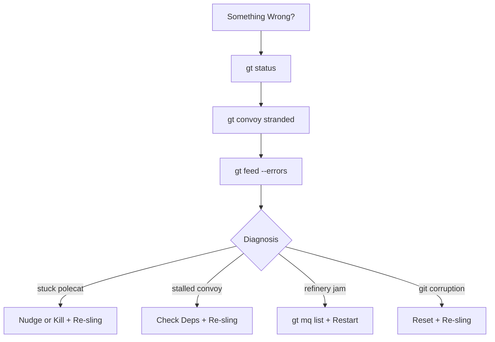

Gas Town is designed to recover from failures automatically. But when the automated recovery isn't enough, you need to know how to diagnose and fix things manually. Here's your playbook for the most common failure scenarios.

<!-- truncate -->

## The 90-Second Triage

When something seems wrong, run these three commands first:

```bash
# 1. What's the overall health?
gt status

# 2. Any stuck or stranded work?
gt convoy stranded
bd blocked

# 3. Check the activity stream for errors
gt feed --errors
```

This gives you a snapshot of system health in under 90 seconds. Most issues become obvious from here.



## Scenario 1: Stuck Polecat

**Symptoms:** A bead shows `in_progress` but no commits are appearing. The polecat's session might be unresponsive.

**Diagnosis:**

```bash
# Check the polecat's session
gt polecat list --rig myproject

# Look at the session directly
gt polecat logs <polecat-name>
```

**Common causes:**
- **Context window exhaustion** — The agent ran out of context trying to solve a complex problem
- **Infinite loop** — The agent is retrying a failing operation
- **External dependency** — Waiting on a service that's down

**Recovery:**

```bash
# Option 1: Let the Witness handle it (preferred)
# The Witness automatically detects stuck polecats and restarts them
gt nudge witness "Check polecat health"

# Option 2: Manual restart
gt polecat restart <polecat-name> --rig myproject

# Option 3: Nuclear — kill and re-sling
gt polecat kill <polecat-name> --rig myproject
gt sling <bead-id> myproject
```

The key insight: killing a polecat doesn't lose work. The bead is still tracked, and any commits on the branch are preserved. GUPP (Gas Town Universal Propulsion Principle) ensures that the next agent picks up where the last one left off.

## Scenario 2: Stalled Convoy

**Symptoms:** `gt convoy status` shows the convoy is open, but no beads have progressed in a while.

**Diagnosis:**

```bash
# Check the convoy's beads
gt convoy show hq-cv-001

# Are any beads blocked?
bd blocked

# Are beads assigned to agents?
bd list --status=open --convoy=hq-cv-001
```

**Common causes:**
- **Dependency deadlock** — Circular dependencies preventing any bead from becoming ready
- **Unassigned work** — Beads are ready but never got slung to a rig
- **All polecats failed** — Each polecat hit the same issue and gave up

**Recovery:**

```bash
# Break a deadlock by removing a dependency
bd dep remove <bead-a> <bead-b>

# Re-sling unassigned work
gt convoy stranded
gt sling <bead-id> myproject

# For systematic failures, check the common issue
bd show <failing-bead>
# Fix the root cause, then re-sling
```

## Scenario 3: Refinery Jam

**Symptoms:** Work is submitted (polecats ran `gt done`) but nothing is merging to `main`.

**Diagnosis:**

```bash
# Check the merge queue
gt mq list

# Check Refinery status
gt rig info myproject
```

**Common causes:**
- **Test failures** — The Refinery rebased onto latest `main` and tests broke
- **Merge conflicts** — Multiple polecats touched the same files
- **Refinery crash** — The Refinery agent itself needs a restart

**Recovery:**

```bash
# Check what's in the queue
gt mq list

# If tests are failing after rebase, the Refinery will report why
gt mq show <mr-id>

# Restart the Refinery
gt rig restart myproject

# If a specific MR is blocking, you can reject it
gt mq reject <mr-id> --reason "Conflicts with other changes"
```

For persistent merge conflicts, consider processing the conflicting MRs sequentially rather than letting the Refinery attempt parallel merges.

## Scenario 4: Agent Can't Find Its Hook

**Symptoms:** An agent starts up and reports "hook empty" even though work was assigned.

**Diagnosis:**

```bash
# Check what's on the hook from outside
gt hook --agent <agent-name>

# Check if the mail was delivered
gt mail outbox
```

**Common causes:**
- **Race condition** — The agent started before the sling completed
- **Wrong rig** — Work was slung to a different rig than expected
- **Hook corruption** — Rare, but the hook state file might be damaged

**Recovery:**

```bash
# Re-hook the work manually
gt mol attach <bead-id> <molecule-id>

# Or re-sling
gt sling <bead-id> myproject
```

## Scenario 5: Git State Corruption

**Symptoms:** `git status` shows unexpected state, merge conflicts, or detached HEAD.

**Diagnosis:**

```bash
# Check git state
git status
git log --oneline -5
git branch -a
```

**Recovery for crew workers:**

```bash
# If you have uncommitted work worth saving
git stash

# Reset to main
git checkout master
git pull --rebase

# Re-apply your work
git stash pop
```

**Recovery for polecat workspaces:**

Polecats are disposable. If a polecat's git state is corrupted, just kill and re-sling:

```bash
gt polecat kill <name> --rig myproject
gt sling <bead-id> myproject
```

## Prevention Checklist

The best incident response is prevention. Run these checks regularly:

```bash
# Daily health check
gt status                    # Overall system health
gt convoy list               # Any stalled convoys?
gt convoy stranded           # Any unassigned work?
bd blocked                   # Any dependency issues?

# Weekly maintenance
gt rig info myproject        # Rig health
bd stats                     # Beads statistics
bd doctor                    # Check for beads issues
```

## The Golden Rule

When in doubt, remember: **beads are the source of truth**. Agents come and go, sessions crash and restart, git branches get created and deleted. But the bead tracking state persists. As long as the bead is open, someone (or some new agent) will eventually pick it up.

Gas Town is designed to be self-healing. Most incidents resolve themselves within a Witness patrol cycle (a few minutes). Save the manual intervention for when automated recovery has clearly failed.

## Next Steps

- **[Troubleshooting Guide](/docs/operations/troubleshooting)** — Comprehensive troubleshooting reference
- **[GUPP & NDI](/docs/concepts/gupp)** — Why crashes don't lose work
- **[Witness](/docs/agents/witness)** — How the Witness monitors and recovers agents
- **[Refinery](/docs/agents/refinery)** — How the merge queue works
- **[The Escalation System](/blog/escalation-system)** — How Gas Town surfaces problems before they snowball
- **[Death Warrants](/blog/death-warrants)** — Structured agent termination during incidents
