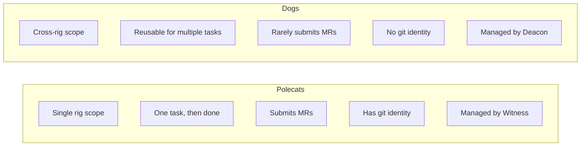
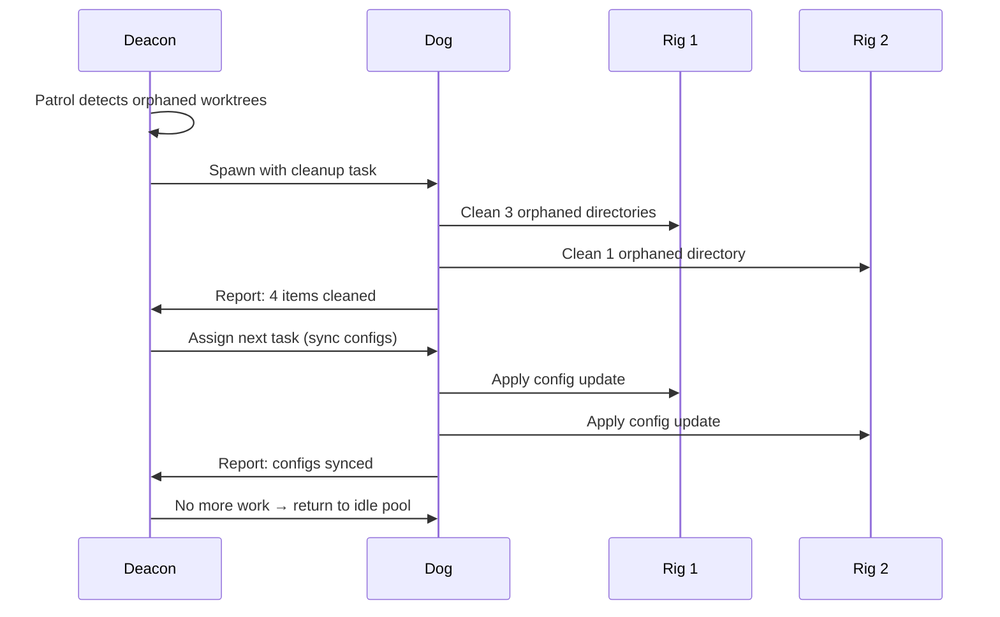

Polecats build features. Dogs clean up messes. This division of labor is fundamental to Gas Town's architecture, but Dogs are often misunderstood. They're not lesser agents — they're the infrastructure backbone that keeps the town running while polecats focus on shipping code.

<!-- truncate -->

## Why Dogs Exist

In a system with 10+ agents running across multiple rigs, infrastructure problems accumulate fast:

- Orphaned worktrees from crashed polecats eating disk space
- Stale branches from abandoned work cluttering repositories
- Configuration drift between rigs after manual edits
- Corrupted beads databases from interrupted writes
- Temp files from build processes nobody cleaned up

These problems don't belong to any single rig or feature. They span the entire town. Polecats can't handle them — they're scoped to one rig and one task. The [Witness](/docs/agents/witness) monitors health but doesn't do manual labor. The [Deacon](/docs/agents/deacon) coordinates but needs workers.

Enter Dogs.

## Dogs vs. Polecats

The distinction is clean and absolute:



The rule of thumb: **if the work produces a feature branch and a merge request, it's a polecat. If the work maintains infrastructure, it's a dog.**

## What Dogs Do

### Cross-Rig Cleanup

The most common dog task. When the Deacon detects orphaned resources across rigs, it dispatches a dog to clean them all:

```text
Dog receives: "Clean orphaned worktrees across all rigs"
  → Scan rig 1: Remove 3 orphaned directories
  → Scan rig 2: Remove 1 orphaned directory
  → Report results to Deacon
  → Return to idle pool
```

### Configuration Syncing

When a shared configuration changes, a dog propagates it:

```text
Dog receives: "Sync .editorconfig to all rigs"
  → Read canonical config from template
  → Apply to rig 1, rig 2, rig 3
  → Verify consistency
  → Report diffs if any rig needed changes
```

### System Rebuilding

When infrastructure breaks, dogs rebuild it:

- Recreating corrupted worktrees
- Re-initializing beads databases after schema changes
- Rebuilding agent context files after format updates
- Restoring state from backups

### Migrations

When Gas Town itself updates, dogs handle the transition:

- Schema migrations for the beads database
- Configuration format updates across all rigs
- Plugin upgrades that need cross-rig coordination

## The Deacon-Dog Relationship

Dogs don't operate independently. The [Deacon](/docs/agents/deacon) manages their entire lifecycle:



The Deacon:
1. **Spawns** dogs when infrastructure work accumulates
2. **Assigns** tasks with clear scope and completion criteria
3. **Monitors** progress and applies timeouts
4. **Reuses** dogs for sequential tasks (unlike polecats which are one-and-done)
5. **Warrants** stuck dogs that exceed their timeout

## Boot: The Special Dog

[Boot](/docs/agents/boot) is a specialized dog with a unique lifecycle. Unlike regular dogs that the Deacon spawns on demand, Boot runs fresh on every daemon tick. Its primary job is processing [death warrants](/docs/cli-reference/warrant) — the structured cleanup requests for stuck agents.

Boot doesn't sit in the idle pool. It spawns, processes warrants, and exits. Think of it as the town's janitor who does a sweep every few minutes rather than waiting for a dispatch.

## Anti-Patterns

**Don't use dogs for feature work.** Dogs bypass the merge queue and code review process. If you need a feature implemented, sling it to a polecat via `gt sling`.

**Don't manually spawn dogs for routine work.** The Deacon handles dog lifecycle automatically. Manual dog creation (`gt dog add`) should be reserved for emergencies.

**Don't confuse dogs with cross-rig polecats.** If you need to work on another rig's codebase as a crew member, use `gt worktree` to create a worktree in the target rig. Dogs are for infrastructure, not development.

## Troubleshooting

### No Idle Dogs Available

If the Deacon has work queued but no dogs to dispatch:

```bash
gt dog list                # See active dogs
gt dog add emergency-dog   # Manually add one
```

The Deacon should auto-spawn, but if it's down or overloaded, manual intervention helps.

### Dog Stuck on a Task

Dogs that exceed their timeout get death warrants from the Deacon:

```bash
gt dog list                # Look for "warrant pending" status
gt dog status <id>         # Check what it's stuck on
```

Boot will process the warrant on the next daemon tick.

## Next Steps

- [Dogs Documentation](/docs/agents/dogs) — Full reference for dog types, commands, and patterns
- [Boot Agent](/docs/agents/boot) — The specialized dog for warrant processing
- [Deacon Documentation](/docs/agents/deacon) — How the Deacon manages the dog pool
- [The Deacon: Gas Town's Background Coordinator](/blog/deacon-patrol) — Deep dive into the Deacon's patrol cycle
- [Death Warrants: Structured Agent Termination](/blog/death-warrants) — How warrants handle stuck dogs and polecats
- [Boot Dogs: The Triage Engine](/blog/boot-dogs) — How Boot performs initial triage before dispatching infrastructure dogs
