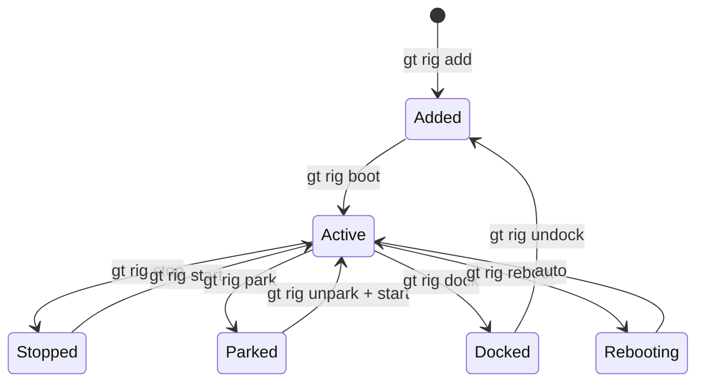
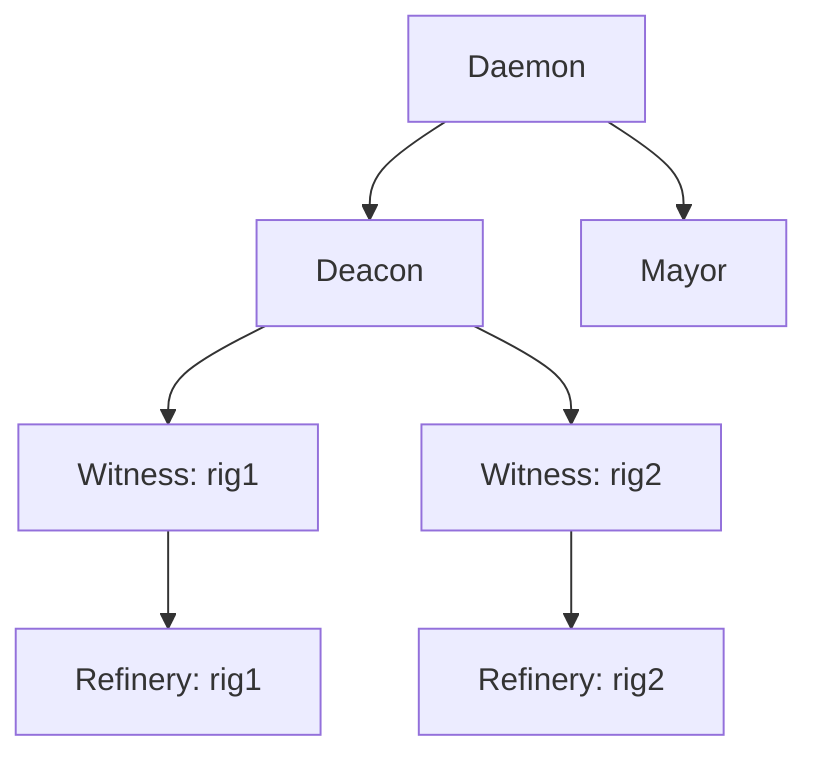
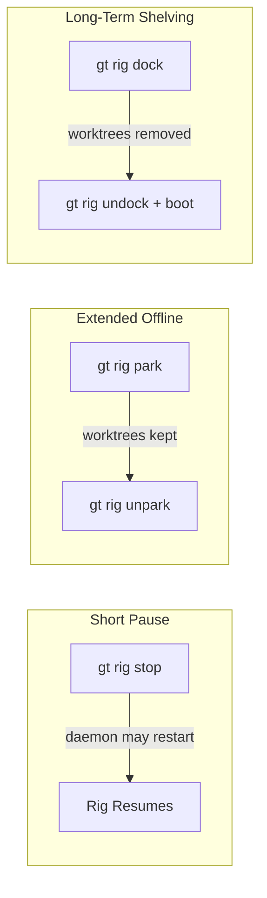
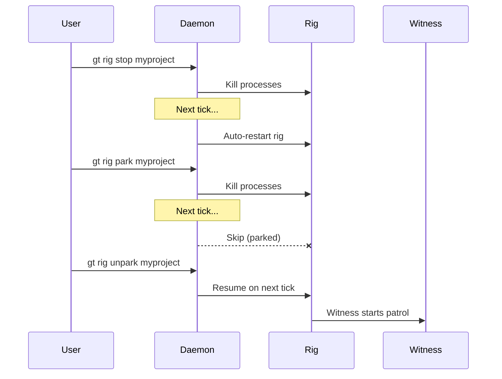

Gas Town rigs have a lifecycle that goes well beyond "on" and "off." Understanding the difference between parking, docking, stopping, and shutting down is critical for day-to-day operations. Get it wrong and you'll either leave zombie agents consuming resources or accidentally destroy work-in-progress state.

<!-- truncate -->

## The Rig Lifecycle States

Every rig exists in one of these states:

```mermaid
gantt
    title Gas Town Rig Lifecycle Timeline
    dateFormat HH:mm
    section Rig Operations
    Active Work        :active, 09:00, 4h
    Park (Lunch Break) :crit, 13:00, 1h
    Active Work        :active, 14:00, 3h
    Stop (Quick Pause) :17:00, 15m
    Active Work        :active, 17:15, 45m
    Dock (End of Day)  :done, 18:00, 1h
```





The key insight: **these states have very different implications for data preservation and resource consumption.**

## Stop vs. Park vs. Dock

This is the most common source of confusion. Here's the definitive comparison:

| Action | Processes | Worktrees | State | Daemon Restarts? |
|--------|-----------|-----------|-------|-----------------|
| `gt rig stop` | Killed | Preserved | Preserved | Yes (daemon will restart it) |
| `gt rig park` | Killed | Preserved | Preserved | No (daemon skips parked rigs) |
| `gt rig dock` | Killed | **Removed** | Preserved | No (persists across daemon restarts) |

:::warning The Daemon May Restart Stopped Rigs
A common gotcha: `gt rig stop` only pauses a rig momentarily. The daemon may restart it on its next tick. If you want a rig to stay offline, use `gt rig park` instead. Park preserves all worktrees and state while preventing the daemon from automatically restarting the rig.
:::

### When to Use Stop

Use `gt rig stop` for momentary pauses:

```bash
gt rig stop myproject
# ... do something quick ...
gt rig start myproject
```

**Warning**: The daemon may restart a stopped rig on its next tick. If you want it to *stay* stopped, use `park` instead.

### When to Use Park

Use `gt rig park` when you want a rig offline for a while but plan to return:

```bash
gt rig park myproject
```

Parked rigs:
- Keep their worktrees intact (fast restart)
- Keep all hook and bead state
- Are skipped by `gt start --all`
- Don't consume agent session resources

This is ideal when:
- Focusing on other rigs temporarily
- Running on a machine with limited resources
- Doing manual maintenance on the rig's codebase
- Taking a break from a project

Bring it back with:

```bash
gt rig unpark myproject
gt rig start myproject
```

### When to Use Dock

Use `gt rig dock` when you're shelving a project indefinitely:

```bash
gt rig dock myproject
```

Docked rigs:
- Have their worktrees **removed** (saves disk space)
- Retain configuration and bead history
- Survive daemon restarts (unlike `park` which is session-scoped)
- Require `gt rig boot` to fully restore

This is for projects you're done with for now:
- Completed milestones waiting for the next phase
- Low-priority projects during crunch time
- Archived experiments you might revisit

:::note[Docking Preserves Beads and Configuration]
When you dock a rig, only the worktrees are removed — all beads, hooks, and configuration remain intact in the town-level and rig-level databases. This means you can undock and boot the rig months later and all your tracked work, history, and settings are immediately available. Docking is safe for long-term storage without data loss.
:::

Restore with:

```bash
gt rig undock myproject
gt rig boot myproject
```

:::tip Use Park for Overnight Breaks, Dock for Long-Term Shelving
The most common mistake is using `gt rig stop` to pause a rig overnight — the daemon may restart it while you sleep. Use `gt rig park` instead: it preserves all worktrees and state while preventing auto-restart. Reserve `gt rig dock` for projects you are shelving indefinitely, since docking removes worktrees and requires a full `gt rig boot` to restore.
:::

## Town-Level Lifecycle

Beyond individual rigs, the entire town has lifecycle commands:

### Starting the Fleet

```bash
# Start core agents only (Deacon + Mayor)
gt start

# Start everything: core + all Witnesses + all Refineries
gt start --all
```

### Pausing vs. Shutting Down

```bash
# Pause: stop processes, keep everything intact
gt down

# Shutdown: stop processes AND remove polecat worktrees
gt shutdown

# Nuclear: stop everything including crew sessions
gt shutdown --all
```

The distinction matters:

| | `gt down` | `gt shutdown` |
|---|---|---|
| Agent sessions | Stopped | Stopped |
| Worktrees | **Kept** | **Removed** |
| Hook state | Preserved | Preserved |
| Beads | Preserved | Preserved |
| Resume time | Fast | Slow (needs rebuild) |

**Use `gt down`** when pausing overnight. **Use `gt shutdown`** when cleaning up for real.

:::caution Always Check for In-Flight Work Before Docking
Running `gt rig dock` removes all worktrees, which destroys any uncommitted polecat work. Before docking a rig, verify no polecats have active hooks with `gt polecat list --rig <name>` and ensure the merge queue is empty with `gt mq list`. Docking a rig with in-flight work will orphan those beads and require manual re-slinging after undocking.
:::

## Startup Order Dependencies

Gas Town components must start in a specific order. `gt start --all` handles this automatically, but understanding the dependency chain helps when troubleshooting:



If you start a Witness before the Deacon, it'll function but the Deacon won't know about it until its next patrol cycle. Always let `gt start --all` handle the ordering unless you have a specific reason to do it manually.



## Emergency Recovery

### Full System Unresponsive

When nothing responds to `gt` commands:

```bash
# Check if the daemon is alive
gt daemon status

# If daemon is dead, restart it
gt daemon start

# If gt commands still hang, check tmux
tmux list-sessions

# Nuclear option: kill everything and restart clean
tmux kill-server
gt start --all
```

### Single Rig in Bad State

One rig is misbehaving but others are fine:

```bash
# Surgical shutdown
gt rig stop myproject

# Clean up orphaned resources
gt cleanup --rig myproject

# Fresh start
gt rig boot myproject
```

:::danger Avoid tmux kill-server Unless Absolutely Necessary
Running `tmux kill-server` destroys all tmux sessions across every rig, including crew member sessions with unsaved work. Only use it when the daemon and all `gt` commands are completely unresponsive. Try `gt daemon restart` and `gt rig stop <rig>` first to surgically address the issue without collateral damage.
:::

### Polecats Spawning and Dying

Polecats crash within seconds of starting, repeatedly:

```bash
# Stop the spawn cycle
gt shutdown --polecats-only --rig myproject

# Check what's causing crashes
gt trail --rig myproject --last 20

# Common cause: broken main branch
# Fix main first, then resume
```

### Lost Work from Crashed Polecat

A polecat crashed before pushing:

```bash
# Check if worktree still exists
ls ~/gt/myproject/polecats/*/myproject/

# If it exists, recover the work manually
cd ~/gt/myproject/polecats/<name>/myproject
git status && git log --oneline -5

# If worktree is gone, check for orphaned commits
gt orphans --commits --rig myproject
gt orphans --recover <commit-hash>
```

## Graceful Degradation



Gas Town continues operating even when components fail. Understanding what keeps working helps prioritize recovery:

| Failed Component | What Still Works | What Stops |
|-----------------|-----------------|------------|
| Daemon | All agents continue running | No new agent spawning |
| Deacon | Rigs operate independently | No town-wide health monitoring |
| Mayor | Existing work continues | No new work distribution |
| Witness (one rig) | Other rigs unaffected | Stale polecats not detected |
| Refinery (one rig) | Polecats can still work | Completed work doesn't merge |

Each component operates independently with its own state. A failed Witness in one rig has zero impact on polecats in another rig.

## Next Steps

- [Starting & Stopping](/docs/operations/lifecycle) — Full lifecycle command reference
- [Troubleshooting](/docs/operations/troubleshooting) — Diagnosing agent boot failures and stuck rigs
- [Monitoring & Health](/docs/operations/monitoring) — Health checks and patrol digests
- [Deacon Agent](/docs/agents/deacon) — The background coordinator that manages agent lifecycle across the town
- [Rigs](/docs/concepts/rigs) — The rig concept: how rigs provide the runtime context for parking, docking, and lifecycle transitions
- [The Deacon: Gas Town's Background Coordinator](/blog/deacon-patrol) — How the Deacon manages the lifecycle of agents across the town
- [Death Warrants: Structured Agent Termination](/blog/death-warrants) — How warrants coordinate safe cleanup of stuck agents
- [Understanding Rigs](/blog/understanding-rigs) — How rigs provide the lifecycle context for parking and docking
- [Monitoring Your Fleet](/blog/monitoring-fleet) — How to monitor fleet health across rig lifecycle transitions
