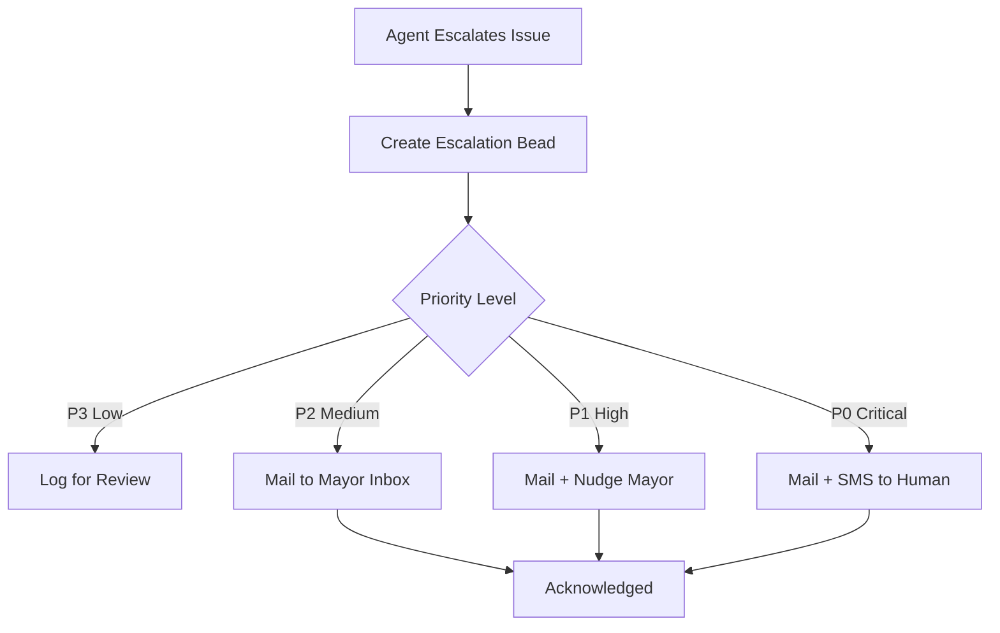
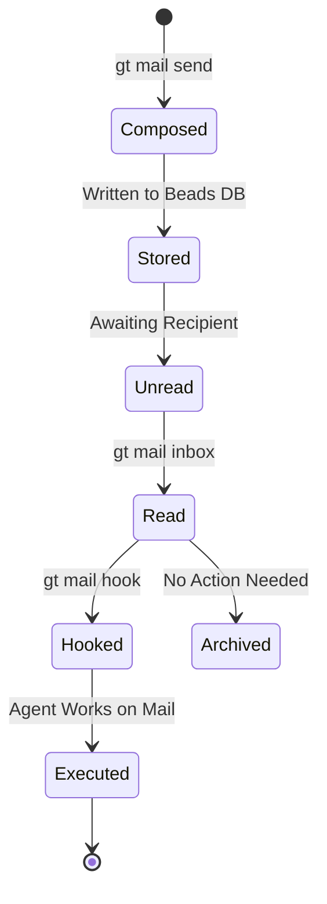

In a multi-agent system, communication is as important as computation. Gas Town's mail system provides async message passing between agents, enabling coordination without requiring both parties to be running simultaneously.

<!-- truncate -->

## Why Async Mail?

AI coding agents have unpredictable lifecycles. A polecat might complete its work and self-destruct before the Witness checks on it. The Mayor might cycle context while a polecat is still working. The Deacon might need to notify an agent that is not running yet.

Synchronous communication (nudges) requires both parties to be active. Async mail does not:

```text
Nudge (synchronous):
  Agent A → sends to Agent B → B must be running NOW

Mail (asynchronous):
  Agent A → drops in B's mailbox → B reads whenever it starts
```

Mail is the backbone of Gas Town coordination. Nudges are the exception for time-sensitive interrupts.

## Mail Anatomy

Every mail message is a bead in the town-level `.beads/` database:

```text
ID:      hq-abc123
Type:    message
From:    gastowndocs/crew/nic
To:      gastowndocs/polecats/toast
Subject: Context for auth bug fix
Body:    "The token refresh logic is in auth/refresh.go.
          Focus on the TestRefreshExpired test case."
Status:  unread
```

Because mail is stored as [beads](/docs/concepts/beads), it benefits from all bead features: persistence, sync, cross-rig routing, and searchability.


## Common Mail Patterns

### Handoff Mail

The most important mail pattern. When an agent cycles to a fresh session, it leaves notes for its successor:

```bash
gt handoff -s "Working on auth bug" -m "
Found the issue in token refresh logic.
Check line 145 in auth.go first.
The failing test is TestRefreshExpired.
"
```

This creates a mail bead addressed to yourself. Your next session finds it in the inbox and uses it for orientation.

### Work Dispatch Notifications

When the Mayor slings work to a rig, it sends mail to provide context:

```bash
gt mail send gastowndocs/polecats/toast \
  -s "Assigned: Fix auth token refresh" \
  -m "Bead gt-a1b2c is on your hook. The issue is in auth/refresh.go.
      Focus on making TestRefreshExpired pass."
```

The polecat reads this on startup, getting both the assignment (from the hook) and context (from the mail).

### Escalation Notifications

When an agent escalates an issue, it mails the escalation chain:

```bash
# Automated escalation routing based on priority
gt escalate "CI broken for 2 hours" -s HIGH
# → Creates bead + mails Mayor + emails Human
```



:::caution Escalation Mail Bypasses the Inbox When Priority Is P0
For P0 critical escalations, the mail system routes directly to external channels (SMS, email) in addition to the in-app inbox. If you rely solely on `gt mail inbox` to track escalations, you may miss the fact that a P0 has already triggered external notifications. Always check `gt escalate list` alongside your inbox to see the full picture.
:::

### Status Reports

Persistent agents periodically mail status summaries:

```bash
# Witness patrol summary
gt mail send mayor/ -s "Witness Report: myproject" \
  -m "Patrol complete. 3 polecats healthy. 1 MR pending in Refinery."
```

## Mail Commands

### Sending Mail

```bash
# Send to a specific agent
gt mail send gastowndocs/crew/dave -s "Review needed" -m "Check PR #42"

# Send to the Mayor
gt mail send mayor/ -s "Feature request" -m "Add rate limiting"

# Send to the human overseer
gt mail send --human -s "Approval needed" -m "Deploy v2.3.1?"

# Send with notification flag (also sends tmux bell)
gt mail send gastowndocs/polecats/toast -s "Urgent" -m "..." --notify
```

### Reading Mail

```bash
# Check inbox
gt mail inbox

# Read a specific message
gt mail read hq-abc123

# Mark as read
gt mail read hq-abc123  # Reading marks it read automatically
```

### Mail + Hook Integration

Mail can be hooked for ad-hoc task assignment:

```bash
# Hook mail as your current assignment
gt mail hook hq-abc123

# The overseer can also send-and-hook:
gt handoff -m "Instructions for next session..."
```

When you find mail on your hook (instead of a molecule), the mail content IS your instructions. Read it and execute.

:::warning Handoff Mail Without a Hook Is Useless
A common mistake is sending handoff mail but forgetting to hook the work. The next session will find context notes in its inbox but no assignment to apply them to. Always ensure work is hooked via `gt sling` or `gt hook attach` before relying on handoff mail for continuity. The hook tells the agent WHAT to do; the mail tells it HOW.
:::

:::note Mail Messages Are Beads Under the Hood
Because every mail message is stored as a bead in the town-level `.beads/` database, mail benefits from all bead features: persistence across restarts, cross-rig routing, full text search with `bd search`, and inclusion in bead statistics. This means your agent communication history is always auditable and never lost, even if the sending or receiving agent has long since terminated.
:::

## Mail Routing

Mail uses the two-level beads architecture:

| Mail Type | Stored In | Routing |
|-----------|-----------|---------|
| Agent-to-agent (same rig) | Town `.beads/` | Direct delivery |
| Agent-to-agent (cross-rig) | Town `.beads/` | Prefix routing |
| Agent-to-human | Town `.beads/` | Email/SMS gateway |
| Handoff (self-addressed) | Town `.beads/` | Same agent, next session |

All mail goes through the town-level beads database, regardless of which rig the agents belong to. The `gt mail` command handles routing transparently.




## Mail vs. Nudge: When to Use Which

| Scenario | Use Mail | Use Nudge |
|----------|----------|-----------|
| Recipient may not be running | Mail | - |
| Time-sensitive interrupt | - | Nudge |
| Need delivery confirmation | - | Nudge (immediate) |
| Sending context for later | Mail | - |
| Waking a sleeping agent | Mail + Nudge | Nudge alone |
| Cross-session communication | Mail | - |

The most common pattern for urgent work: send mail (carries the payload), then nudge (wakes the recipient to check their mail).

```bash
# The one-two punch: mail then nudge
gt mail send gastowndocs/polecats/toast -s "Priority change" -m "Drop current work, new P0"
gt nudge gastowndocs/polecats/toast "Check your mail - priority change"
```

:::tip Mail is your audit trail
Every mail message is a bead, which means it's permanently stored and searchable. When debugging why an agent did something unexpected, check its mail history with `gt mail inbox --agent <path>`. The handoff mails and dispatch notifications often reveal the context that led to the behavior.
:::

## Next Steps

- [Communication CLI Reference](/docs/cli-reference/communication) -- Full mail command documentation
- [Hooks](/docs/concepts/hooks) -- How mail integrates with the hook system
- [Session Cycling](/docs/concepts/session-cycling) -- Handoff mail in the context refresh workflow
- [Agent Hierarchy](/docs/architecture/agent-hierarchy) -- The escalation chain that mail supports
- [Agent Communication Patterns](/blog/agent-communication-patterns) -- How mail fits alongside nudges and hooks
- [Session Cycling Explained](/blog/session-cycling) -- Handoff mail in the context refresh workflow
- [The Mayor Workflow](/blog/mayor-workflow) -- How the Mayor uses mail for convoy coordination
- [The Escalation System](/blog/escalation-system) -- How escalation notifications route through the mail system
