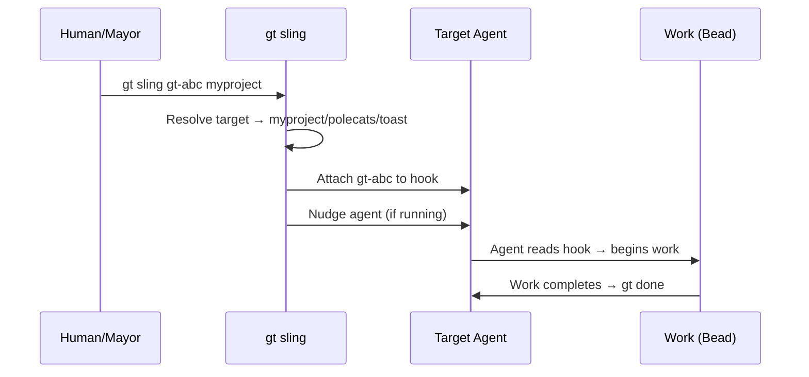
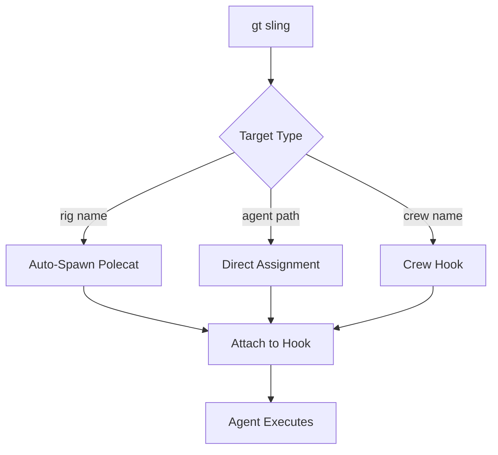
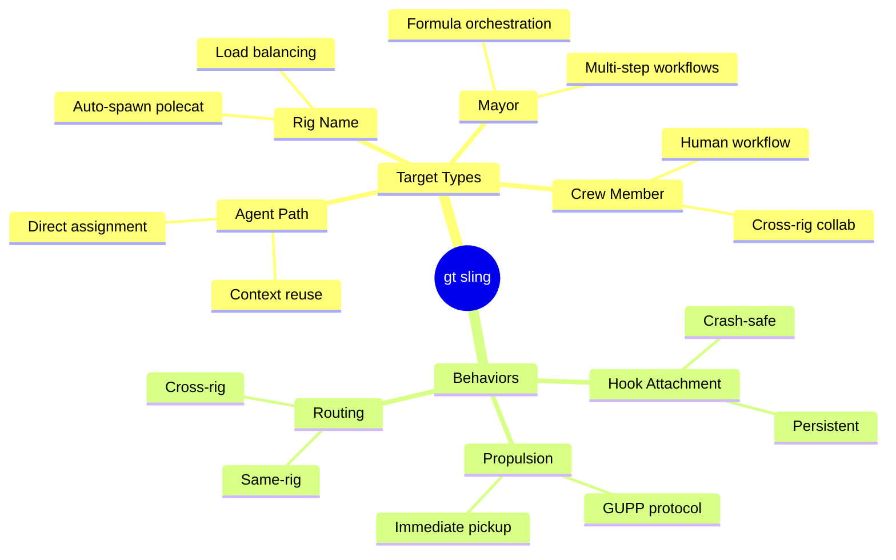
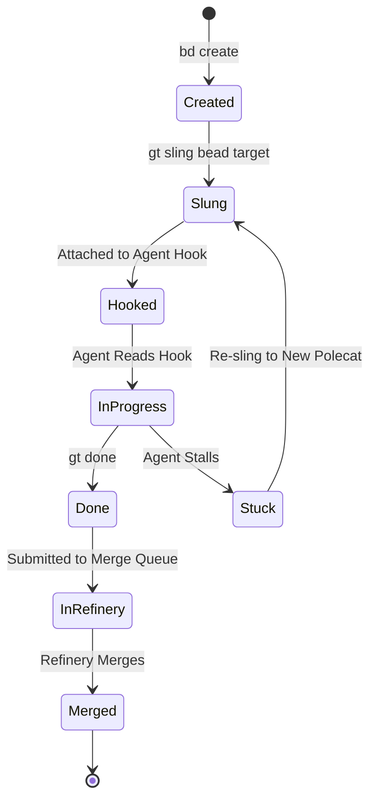
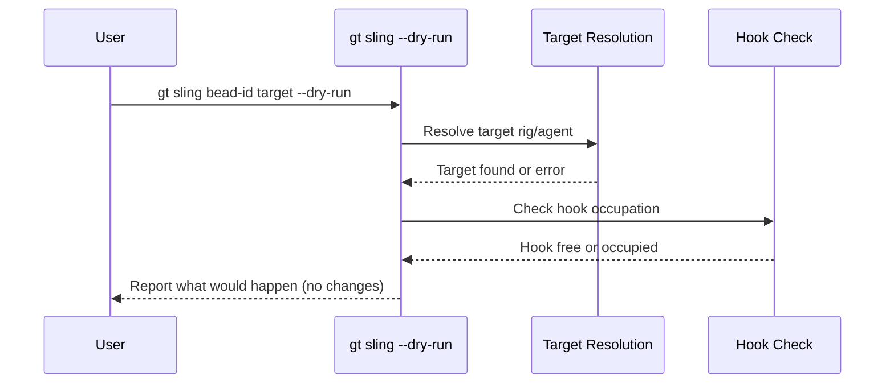
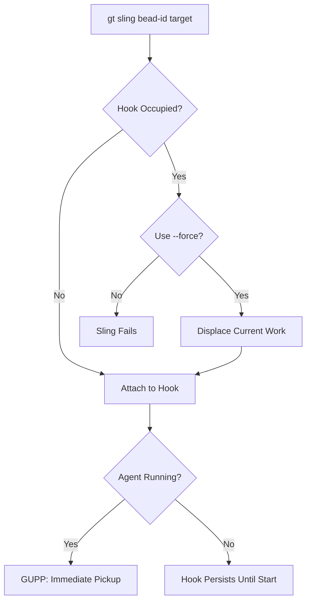

`gt sling` is the single most important operational command in Gas Town. Every piece of work — from a bug fix to a multi-rig infrastructure migration — gets to an agent through slinging. Understanding its patterns, flags, and failure modes is the difference between a smooth fleet and a confused pile of idle polecats.

<!-- truncate -->

## What Slinging Actually Does

When you run `gt sling <bead-id> <target>`, three things happen in sequence:

1. **Target resolution** — Gas Town figures out which agent or rig you mean
2. **Hook attachment** — The bead is attached to the target agent's hook
3. **Propulsion** — If the agent is running, it picks up the work immediately via [GUPP](/docs/concepts/gupp)

The hook is the key. It's a persistent pointer stored in the agent's worktree, surviving crashes and session restarts. When a slung bead lands on an agent's hook, it stays there until the work is done.





## Sling Target Types

| Target Type | Syntax Example | Behavior | Best Use Case |
|---|---|---|---|
| **Rig** | `gt sling gt-abc myproject` | Witness auto-spawns a fresh polecat and attaches the bead to its hook | Default for most work — lets Gas Town handle agent selection and load balancing |
| **Agent** | `gt sling gt-abc myproject/polecats/toast` | Directly attaches the bead to the named agent's hook | Re-assigning failed work or stacking sequential tasks on an agent with relevant context |
| **Crew** | `gt sling gt-abc frontend/crew/alice` | Routes the bead to a specific crew member in any rig | Cross-rig collaboration where a human crew member needs to handle the work personally |
| **Mayor** | `gt sling mol-release mayor/` | Attaches a formula or molecule to the Mayor for orchestration | Structured multi-step workflows driven by TOML formulas |

## Basic Patterns

### Sling to a Rig (Auto-Spawn)

The simplest pattern. Gas Town spawns a fresh polecat automatically:

```bash
gt sling gt-abc12 myproject
```

The Witness for `myproject` will spawn a polecat, attach the bead to its hook, and the polecat starts working immediately. You don't need to know the polecat's name in advance.

### Sling to a Specific Agent

When you want a particular agent to handle the work:

```bash
gt sling gt-abc12 myproject/polecats/toast
```

This is useful when:
- You know `toast` has relevant context from previous work
- You're re-assigning work after a failed attempt
- You want to stack sequential tasks on one agent

### Sling with Instructions

Add context beyond what's in the bead itself:

```bash
gt sling gt-abc12 myproject --args "Focus on the SQL injection vector. Ignore the XSS findings for now."
```

The `--args` text is injected into the agent's context alongside the bead description. Use this for nuance that doesn't belong in the bead itself.

### Sling a Formula

Formulas are TOML templates for structured workflows. Slinging a formula cooks it into a live [molecule](/docs/concepts/molecules):

```bash
gt sling mol-release mayor/ --on shiny
```

This creates a molecule from the `shiny` formula and attaches it to the Mayor. The Mayor then works through each step of the formula.

:::danger[Slinging Formulas Requires the Target Agent to Support Molecules]
Not all agents can execute formulas. Polecats and the Mayor support molecule-based workflows, but crew members and some custom runtimes may not. Before slinging a formula, verify the target agent type with `gt agent info <path>`. Slinging a formula to an incompatible agent will result in a "cannot process molecule" error and leave the work stranded on the hook.
:::

## Cross-Rig Slinging

:::note[Slinging Cross-Rig Work Requires No Special Syntax]
The same `gt sling` command works whether the target rig is local or remote, parked or active. Gas Town resolves rig names, checks availability, and routes the bead to the correct Witness automatically. From your perspective, slinging to another rig is identical to slinging within your current rig.
:::

Work often needs to land in a different rig than where you're operating. Gas Town handles this seamlessly:



```bash
# Sling from anywhere to the backend rig
gt sling gt-abc12 backend

# Sling to a crew member in another rig
gt sling gt-abc12 frontend/crew/alice
```

The sling command resolves the target rig, finds (or spawns) an appropriate agent, and attaches the work. Cross-rig slinging is the backbone of [convoy workflows](/docs/workflows/manual-convoy) where related work spans multiple projects.

:::caution Cross-Rig Slinging Requires the Target Rig to Be Active
If you sling a bead to a rig that is parked or docked, the sling will fail with a "target not found" error. Before slinging cross-rig work, verify the target rig's status with `gt rig status <rig>` and unpark or undock it if necessary.
:::

## Batch Slinging

For convoys with multiple beads, sling them all at once:

```bash
# Create the convoy first
gt convoy create "API Security Hardening" gt-a1 gt-b2 gt-c3

# Sling each bead to appropriate rigs
gt sling gt-a1 backend
gt sling gt-b2 frontend
gt sling gt-c3 api-gateway
```

Each bead lands on a separate polecat. The Witnesses monitor all three in parallel, and the convoy tracks overall completion. For a complete walkthrough of this pattern, see [Your First Convoy](/blog/first-convoy).



## Dry Run

Not sure what will happen? Preview first:

```bash
gt sling gt-abc12 myproject --dry-run
```

This resolves the target, checks for conflicts, and reports what *would* happen without actually doing anything. Use this liberally when learning.

The following diagram shows how dry-run mode validates before execution:




## Common Failure Modes

### "Target not found"

The target rig or agent doesn't exist or isn't active:

```bash
gt rig list              # Verify the rig exists
gt rig status myproject  # Check if it's parked or docked
```

Parked rigs don't accept slung work. Unpark first: `gt rig unpark myproject`.

### "Hook occupied"

The target agent already has work on its hook:

```bash
gt hook --agent myproject/polecats/toast  # See what's hooked
```

Options:
- Wait for the current work to finish
- Use `--force` to override (be careful — this displaces the current work)
- Sling to the rig instead and let a fresh polecat pick it up

### "Bead not found"

The bead ID doesn't resolve. Check the bead exists and isn't already closed:

```bash
bd show gt-abc12        # Verify the bead
bd list --status=open   # Check open beads
```

:::tip Use --dry-run When Learning
Not sure what a sling will do? Run `gt sling <bead-id> <target> --dry-run` first. It resolves the target, checks for conflicts, and reports what would happen without actually doing anything. This is especially useful when working with cross-rig slinging or specific agent targets for the first time.
:::

:::warning Slinging to a Busy Agent Displaces Its Current Work
If you sling a bead to an agent that already has work on its hook, the new bead replaces the existing assignment (with `--force`) or the sling fails. Either way, the current task is disrupted. Unless you have a specific reason to target a particular agent, always sling to the rig and let the Witness spawn a fresh polecat.
:::

:::info Sling Targets Are Resolved at Execution Time
When you sling to a rig name like `myproject`, Gas Town resolves the target agent dynamically — it finds an idle polecat or spawns a new one at the moment of slinging. This means you do not need to pre-create polecats or predict agent names. The system handles agent lifecycle automatically, so you can focus on describing the work rather than managing workers.
:::



## Anti-Patterns

**Don't sling to busy agents.** If an agent is mid-task, slinging more work forces a context switch. Sling to the rig and let a fresh polecat handle it.

**Don't sling without a bead.** Every piece of work should be tracked. Create the bead first, then sling it. This ensures the audit trail is complete.

**Don't over-specify the target.** Unless you have a reason to target a specific polecat, sling to the rig. Let the [Witness](/docs/agents/witness) handle agent selection and spawning.

**Don't sling dependent beads simultaneously.** If bead B depends on bead A's output, set up the dependency with `bd dep add` first. The Mayor will wait for A to merge before slinging B, preventing merge conflicts from overlapping work.

## Next Steps

- [Work Distribution Architecture](/docs/architecture/work-distribution) — How work flows through Gas Town end-to-end
- [Manual Convoy Workflow](/docs/workflows/manual-convoy) — Step-by-step convoy creation and slinging
- [Formula Workflow](/docs/workflows/formula-workflow) — Structured workflows using TOML templates
- [Understanding GUPP](/blog/understanding-gupp) — Why the propulsion principle makes slinging work
- [Hooks: The Persistence Primitive](/blog/hook-persistence) — How hooks make slung work crash-safe
- [Advanced Convoy Patterns](/blog/advanced-convoy-patterns) — Complex convoy orchestration that builds on sling mastery
- [Work Distribution Patterns](/blog/work-distribution-patterns) — How sling fits into Gas Town's broader work distribution strategy
- [Crew Workflow](/blog/crew-workflow) — Slinging work to crew members in persistent workspaces
- [Sling CLI Reference](/docs/cli-reference/sling) — Full command reference for gt sling and its flags
