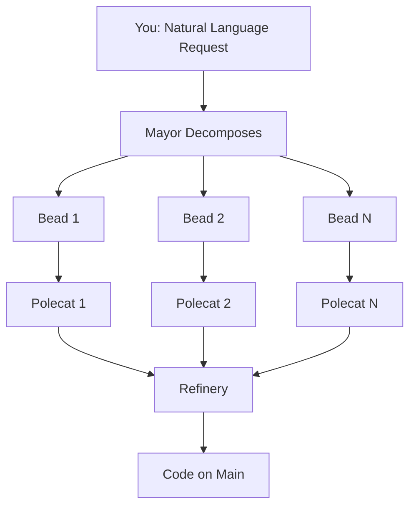

The Mayor Workflow — or MEOW (Mayor-Execute-Orchestrate-Watch) — is Gas Town's highest-automation workflow. You describe what you want in plain English, and the Mayor handles everything else: decomposing the request, creating beads, spawning polecats, monitoring progress, and landing the code on main.

<!-- truncate -->

## The Core Loop

The MEOW workflow follows a simple cycle:

```text
You: "Add input validation to all API endpoints"
  → Mayor decomposes into beads
    → Mayor creates convoy to track the batch
      → Mayor slings beads to polecats
        → Polecats implement changes
          → Polecats run gt done → Refinery queue
            → Refinery rebases and merges
              → Convoy auto-closes when all beads land
```

You give one instruction. Gas Town does the rest.



## Getting Started with MEOW

### Step 1: Start the Mayor

```bash
gt mayor attach
```

This attaches you to the Mayor's tmux session. The Mayor is a long-running agent that coordinates work across all your rigs.

### Step 2: Give Instructions

Talk to the Mayor in natural language:

```text
You: Add email validation to the user registration endpoint.
     It should reject invalid formats and disposable email domains.
     Add tests for both valid and invalid cases.
```

### Step 3: Watch It Work

The Mayor will:

1. **Analyze** the request and identify the work needed
2. **Create beads** for each discrete task (validation function, handler integration, tests)
3. **Create a convoy** to bundle the beads
4. **Sling** each bead to the appropriate rig
5. **Report back** with what it created

You can then detach and let the system run:

```bash
# Detach from Mayor (Ctrl-B D in tmux)
# Or just switch to another terminal

# Monitor progress
gt convoy status
gt feed
```

## What the Mayor Decides

The Mayor makes several decisions automatically:

### Work Decomposition

A single request becomes multiple beads. The Mayor breaks work into the smallest useful units:

```text
Request: "Add authentication to the API"

Mayor creates:
  → Bead 1: Add JWT token generation
  → Bead 2: Add auth middleware
  → Bead 3: Protect existing endpoints
  → Bead 4: Add login endpoint
  → Bead 5: Add tests for auth flow
  → Bead 6: Update API documentation
```

Each bead is independent enough for a single polecat to implement.

### Dependency Ordering

The Mayor sets dependencies between beads when needed:

```text
Bead 2 (auth middleware) depends on Bead 1 (JWT generation)
Bead 3 (protect endpoints) depends on Bead 2 (middleware)
Bead 4 (login endpoint) depends on Bead 1 (JWT generation)
Bead 5 (tests) depends on Beads 2, 3, 4
Bead 6 (docs) depends on Beads 3, 4
```

Polecats won't be spawned for dependent work until prerequisites merge.

### Rig Assignment

If you have multiple rigs, the Mayor routes work to the right one:

```text
API changes → backend rig
Frontend changes → frontend rig
Documentation → docs rig
```

## Monitoring Progress

While MEOW runs, you have several ways to check progress:

```bash
# Convoy-level progress (how many beads landed?)
gt convoy status

# Real-time activity
gt feed

# Rich dashboard
gt dashboard

# Check specific bead
bd show <bead-id>
```

The convoy gives you the clearest view of overall progress. A convoy with 6 beads shows:

```text
Convoy: hq-cv-auth-001  "Add authentication to API"
  ✓ ga-001  Add JWT token generation        [merged]
  ✓ ga-002  Add auth middleware              [merged]
  ● ga-003  Protect existing endpoints       [in_progress]
  ○ ga-004  Add login endpoint               [pending - blocked by ga-001]
  ○ ga-005  Add tests for auth flow          [pending - blocked by ga-002,003,004]
  ○ ga-006  Update API documentation         [pending - blocked by ga-003,004]

  Progress: 2/6 merged (33%)
```

## When Things Go Wrong

The MEOW workflow handles failures automatically:

### Polecat Gets Stuck

The Witness detects the stall during patrol, nudges the polecat, and if it remains stuck, the Deacon can spawn a replacement.

### Merge Conflict

The Refinery rejects the MR. The system can re-sling the bead to a new polecat that works against the updated main branch.

### Bad Decomposition

If the Mayor's decomposition doesn't make sense, you can intervene:

```bash
# Attach to the Mayor
gt mayor attach

# Tell it to adjust
You: "Cancel bead ga-006 — we'll handle docs separately.
      Also split bead ga-003 into per-endpoint beads."
```

The Mayor adjusts the convoy accordingly.

### Cost Spike

If polecats are burning tokens on a difficult task, the escalation system alerts you. You can:

```bash
# Check costs
gt costs --by-agent

# Nuke a runaway polecat
gt polecat nuke <name>

# Re-sling with a simpler prompt
gt sling <bead-id> <rig>
```

## MEOW vs Other Workflows

| Feature | MEOW | Manual Convoy | Formula | Minimal |
|---------|:----:|:------------:|:-------:|:-------:|
| Decomposition | Auto | Manual | Auto | Manual |
| Convoy creation | Auto | Manual | Manual | Manual |
| Polecat spawning | Auto | Auto | Auto | Manual |
| Progress monitoring | Auto | Manual | Auto | Manual |
| Failure recovery | Auto | Manual | Partial | Manual |

MEOW is the highest-automation option. Choose it when you trust the system and want maximum throughput.

## Tips for Effective MEOW

**Be specific about outcomes, not implementation.** The Mayor is better at decomposing "add email validation" than "create a validateEmail function in utils.go that uses regex." Tell it what you want, not how to build it.

**Set up good tests first.** MEOW relies heavily on automated validation. If your test suite is thin, polecats can merge broken code. Invest in test coverage before scaling to MEOW.

**Start with small convoys.** Your first MEOW request should be 2-3 beads, not 20. Learn how the system decomposes work and adjust your prompting style.

**Review convoy plans before they execute.** You can ask the Mayor to show you the planned decomposition before slinging work:

```text
You: Plan the work for adding rate limiting, but don't start yet.
     Show me the beads you'd create and their dependencies.
```

**Use convoys for grouping.** If you give the Mayor 5 unrelated requests, it creates 5 separate convoys. This keeps progress tracking clean.

## The MEOW Mental Model

Think of the Mayor as a project manager who happens to be an AI:

- You give it a project brief (natural language request)
- It creates a work breakdown structure (beads + convoy)
- It assigns workers (slings to polecats)
- It monitors progress (via Witness reports)
- It handles exceptions (escalations, retries)
- It reports completion (convoy auto-close)

The key insight: you operate at the level of intent, not implementation. The Mayor translates intent into executable work items that the rest of Gas Town processes mechanically.

## Next Steps

- **[Mayor Agent](/docs/agents/mayor/)** — Full reference for the Mayor role
- **[Convoys](/docs/concepts/convoys/)** — How batch tracking works
- **[Workflows](/docs/workflows/)** — All available workflow patterns
- **[Your First Convoy](/blog/first-convoy)** — Step-by-step tutorial
- **[Work Distribution Patterns](/blog/work-distribution-patterns)** — When to use Mayor vs manual convoys vs formulas
