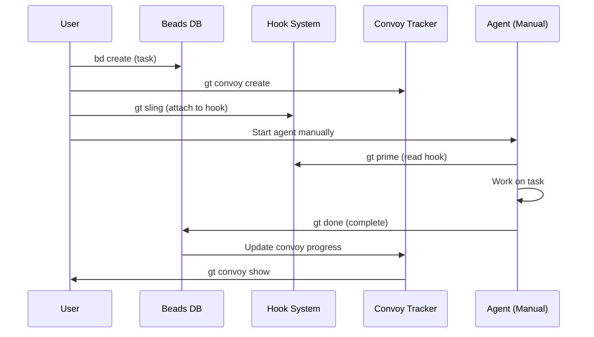
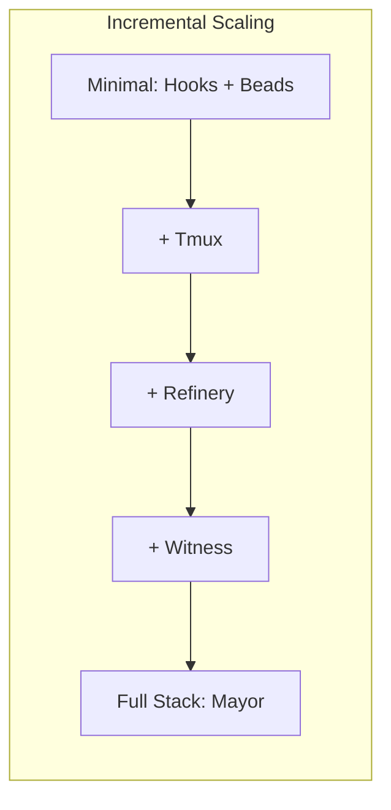
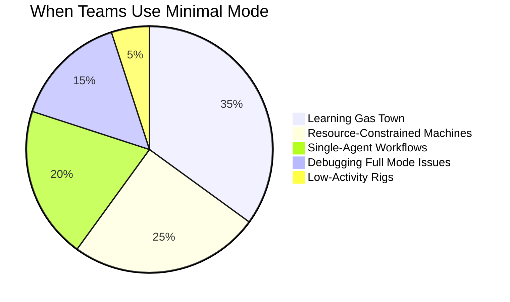
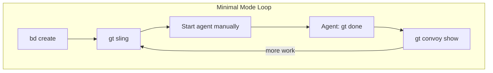
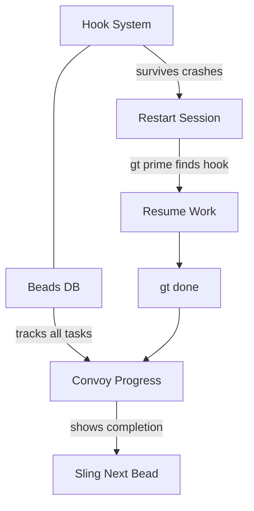

Not everyone wants to run a full fleet of AI agents from day one. Maybe your machine doesn't have Tmux. Maybe you want to learn Gas Town incrementally. Maybe you just prefer hands-on control. Minimal Mode gives you Gas Town's best features — crash-safe hooks, AI-native issue tracking, and convoy-based work bundling — without the overhead of the full agent hierarchy.

<!-- truncate -->

## What You Get in Minimal Mode

The core insight behind Minimal Mode is that Gas Town's value doesn't come *only* from automated orchestration. Three features are independently useful:



1. **Hooks** — Work assignments that survive crashes and session restarts
2. **Beads** — AI-native issue tracking with prefix-based routing
3. **Convoys** — Bundle related work and track collective progress

These features work without Tmux, without the Mayor, without the Witness. You are the coordinator — and that's fine for learning or for resource-constrained environments.

## The Minimal Loop

Here's the core workflow. It's simple by design:

```bash
# 1. Create issues
bd create --title "Fix login bug" --type bug --priority 1
# Created: gt-a1b2c

bd create --title "Add email validation" --type feature
# Created: gt-d3e4f

# 2. Bundle into a convoy
gt convoy create "Auth Sprint" gt-a1b2c gt-d3e4f
# Created: hq-cv-001

# 3. Sling the first issue to a rig
gt sling gt-a1b2c myproject

# 4. Open a terminal and start the agent manually
cd ~/gt/myproject/crew/yourname
claude
# Agent runs gt prime, finds hook, starts working

# 5. When it finishes (gt done), check progress
gt convoy show hq-cv-001

# 6. Sling the next issue
gt sling gt-d3e4f myproject
# Repeat steps 4-5
```

That's it. No daemon, no Witness, no Refinery. Just you, beads, and hooks.

## What's Different from Full Mode

The differences are exactly what you'd expect — you're doing manually what the full hierarchy automates:

| Concern | Full Mode | Minimal Mode |
|---------|-----------|--------------|
| Spawning agents | `gt sling` auto-spawns | You open a terminal and run `claude` |
| Merging to main | Refinery handles it | You merge manually or run `git merge` |
| Detecting stuck agents | Witness patrols every 5 minutes | You check periodically |
| Coordinating work | Mayor dispatches | You sling beads yourself |
| Crash recovery | Automatic via hooks | Hooks survive, but you restart manually |

The hook system is the critical piece that makes Minimal Mode viable. When your agent crashes mid-work, the hook still has the bead ID attached. The next time you start a session in that workspace, `gt prime` finds the hook and picks up where the last session left off. You don't lose work — you just need to restart the session yourself.



## When to Use Minimal Mode



**Starting out.** Minimal Mode is the best way to learn Gas Town. You see every step explicitly, which builds intuition for how the full system works.

**Resource-constrained machines.** The full hierarchy runs a Deacon, Mayor, Witness, and Refinery as persistent processes. On a laptop with limited RAM, Minimal Mode avoids all that overhead.

**Single-agent workflows.** If you're only running one agent at a time, the Mayor and Witness don't add much value. Minimal Mode is simpler.

**Debugging.** When something in the full hierarchy isn't working, dropping to Minimal Mode isolates whether the issue is in the orchestration or in the underlying work.

## Scaling Up Incrementally

The beauty of Minimal Mode is that you can add automation one piece at a time:

:::info[Hooks and Beads Work Without Any Agents Running]
The core value of Minimal Mode is that hooks and beads persist in the filesystem regardless of whether agents, the daemon, or tmux are running. You can create beads, hook work, and track convoy progress using only `bd` and `gt` commands in a regular shell. The agent infrastructure is purely additive — it automates execution but is not required for coordination.
:::

### Level 1: Add Tmux

Install Tmux and `gt sling` will auto-spawn polecats in tmux sessions:

```bash
gt sling gt-a1b2c myproject
# Polecat spawns in a tmux pane automatically
```

### Level 2: Add the Refinery

Let the Refinery handle merges so you don't have to:

```bash
gt refinery start myproject
# Now gt done auto-submits MRs and they merge automatically
```

### Level 3: Add the Witness

Let the Witness detect stuck agents and trigger recovery:

```bash
gt witness start myproject
# Now stalled polecats get nudged and recovered automatically
```

### Level 4: Full Stack

Start everything and let the Mayor coordinate:

```bash
gt start --all
gt mayor attach
```

Congratulations — you've graduated from Minimal Mode to the full [Mayor Workflow](/docs/workflows/mayor-workflow).





## Tips

:::tip
Use **crew workspaces** (`gt crew add myproject yourname`) instead of polecat directories. Crew workspaces persist between sessions. Polecat directories are ephemeral — they get cleaned up after work completes. For details on crew workspace management, see [Crew Workflow](/blog/crew-workflow).
:::

:::warning
Without the Witness, no one is watching your agents. If an agent crashes or gets stuck, it will stay that way until you notice. Check on your sessions periodically.
:::

:::tip
Always **push your changes** before ending a session. Without the Refinery handling merges automatically, unpushed work sits on a local branch where it can be lost if the machine reboots.
:::

:::note Minimal Mode is not "lesser" Gas Town
Many production Gas Town setups run certain rigs in Minimal Mode permanently. Low-activity rigs that process one or two beads per week don't need a Witness patrolling every 5 minutes. Minimal Mode is a first-class operating mode, not just a stepping stone to full automation.
:::

## Next Steps

- [Minimal Mode Reference](/docs/workflows/minimal-mode) — Full step-by-step walkthrough
- [Quick Start](/docs/getting-started/quickstart) — Initial setup before using any workflow
- [Mayor Workflow](/docs/workflows/mayor-workflow) — The fully automated workflow you'll graduate to
- [Hooks](/docs/concepts/hooks) — How crash-safe hooks persist work assignments across session restarts
- [Cost Optimization](/blog/cost-optimization) — Keep costs low while experimenting with Gas Town
- [Your First Convoy](/blog/first-convoy) — Your first full convoy after graduating from minimal mode
- [Common Pitfalls](/blog/common-pitfalls) — Avoid the 5 most common mistakes when scaling from minimal mode
- [Hooks: The Persistence Primitive](/blog/hook-persistence) — The crash-safe hook system that makes minimal mode viable
