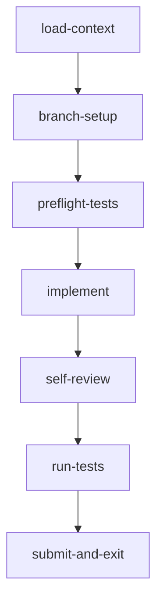
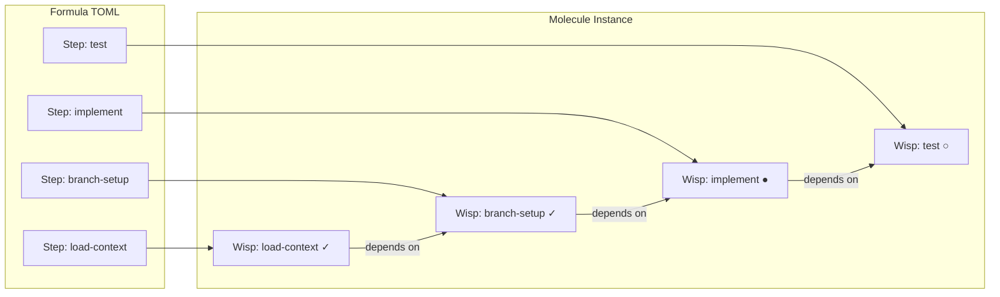
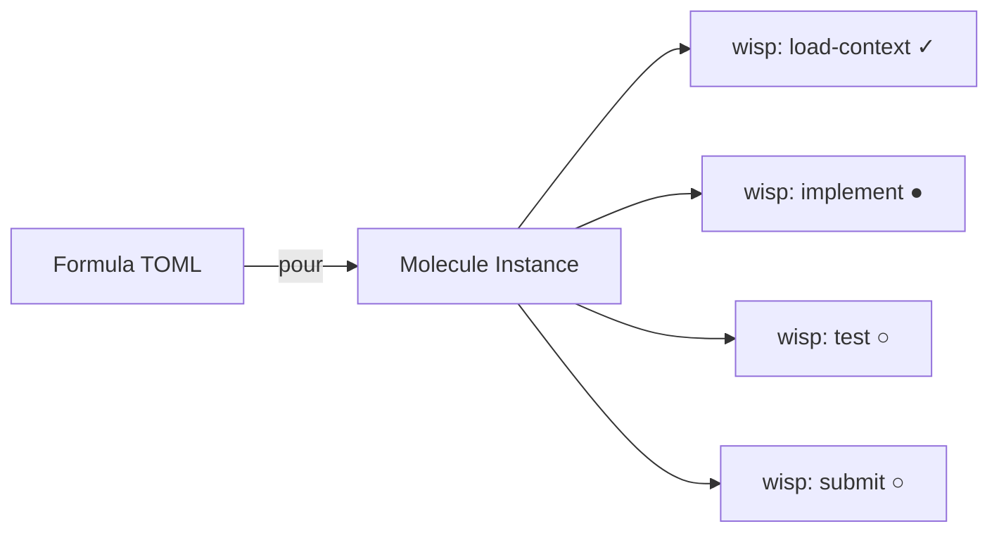
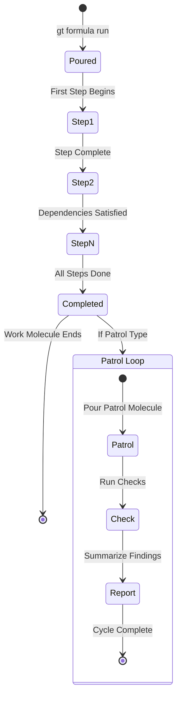
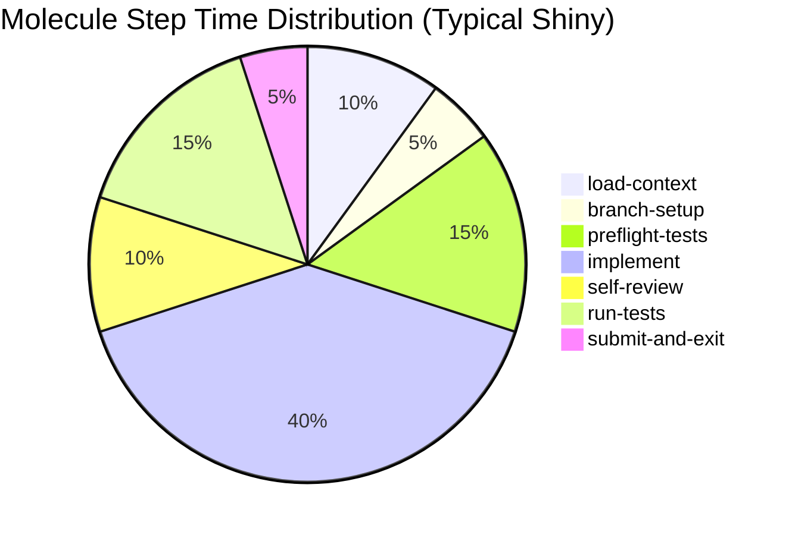

Every Gas Town agent follows a workflow. A polecat doesn't just "fix the bug" — it loads context, sets up a branch, runs preflight tests, implements the fix, self-reviews, runs tests again, and submits to the merge queue. Molecules are how Gas Town tracks progress through these multi-step workflows, and formulas are the templates that define them.

<!-- truncate -->

## The Class-Instance Relationship

The relationship between formulas and molecules is like classes and objects:

| Concept | What It Is | Where It Lives |
|---------|-----------|---------------|
| **Formula** | A TOML template defining steps, dependencies, and variables | `.beads/formulas/*.formula.toml` |
| **Molecule** | A running instance of a formula, tracking real progress | Bead in the beads database |

You **pour** a formula to create a molecule:

```bash
gt formula run shiny --bead gt-abc12
# Creates a molecule instance with steps tracking progress
```

Multiple molecules can be poured from the same formula simultaneously. Three polecats can each be running their own instance of the `shiny` formula — each molecule tracks its own progress independently. For advanced multi-molecule coordination, see [Your Second Convoy](/blog/your-second-convoy).

:::caution[Molecules Add Overhead — Use Them When You Need Step Tracking]
Every molecule step creates a wisp bead in the database, adding storage and I/O overhead. For trivial tasks that complete in one session without risk of crashing mid-workflow, consider using ad-hoc instructions instead of pouring a formula. Reserve molecules for workflows with meaningful crash risk or multi-step dependencies that justify the tracking cost.
:::

## Why Molecules Exist

Without molecules, a polecat gets a bead and... does whatever it wants. Maybe it forgets to run tests. Maybe it pushes without self-reviewing. Maybe it crashes halfway through and the next session doesn't know which steps were already done.

Molecules solve three problems:

### 1. Crash-Safe Progress

Each step in a molecule is tracked as a sub-bead (wisp). When a polecat completes a step, the molecule updates in the [beads database](/docs/concepts/beads). If the polecat crashes:

```text
Step: load-context    ✓  (done)
Step: branch-setup    ✓  (done)
Step: preflight-tests ✓  (done)
Step: implement       ●  (in progress - was working when crash happened)
Step: self-review     ○  (pending)
Step: run-tests       ○  (pending)
Step: submit          ○  (pending)
```

The next session reads the molecule and picks up from `implement` — it doesn't re-run `load-context` or `branch-setup`. This is the molecule's killer feature: **progress survives crashes, handoffs, and context compaction**.

### 2. Enforced Step Ordering

The formula declares dependencies between steps:



A polecat can't skip `preflight-tests` and jump straight to `implement`. The molecule won't advance until dependencies are satisfied. This enforces quality without relying on the agent to remember the correct order.

### 3. Reusable Workflow Patterns

Gas Town ships with 30+ built-in formulas:

| Formula | Purpose |
|---------|---------|
| `shiny` | Standard polecat work (implement a bead) |
| `code-review` | Parallel multi-perspective code review |
| `mol-witness-patrol` | Witness monitoring cycle |
| `mol-refinery-patrol` | Refinery merge cycle |
| `fix-and-verify` | Fix + automated verification |

Each formula encodes best practices for its workflow. The `shiny` formula ensures polecats always run preflight tests, self-review their code, and run the test suite before submitting. These steps aren't suggestions — they're enforced by the molecule. For more on enforcing quality standards, see [Design Principles](/docs/architecture/design-principles).

## Inside a Formula

A formula is a TOML file that defines steps, their dependencies, and any variables:



```toml
[formula]
name = "shiny"
description = "Standard polecat work formula"
version = "1.0"

[[steps]]
id = "load-context"
description = "Read the bead and understand the task"

[[steps]]
id = "branch-setup"
description = "Create feature branch from latest main"
needs = ["load-context"]

[[steps]]
id = "preflight-tests"
description = "Run tests to establish baseline"
needs = ["branch-setup"]

[[steps]]
id = "implement"
description = "Implement the changes"
needs = ["preflight-tests"]

[[steps]]
id = "self-review"
description = "Review your own changes for issues"
needs = ["implement"]

[[steps]]
id = "run-tests"
description = "Run tests to verify changes"
needs = ["self-review"]

[[steps]]
id = "submit-and-exit"
description = "Push branch and call gt done"
needs = ["run-tests"]
```

:::danger[Formula DAGs Must Be Acyclic]
The `needs` field defines dependencies between steps, forming a directed acyclic graph. If you accidentally create a cycle (e.g., step A needs B, step B needs C, step C needs A), the molecule will deadlock and the agent will never progress. Gas Town validates formulas when you pour them, but always double-check dependency chains when writing custom formulas with `gt formula validate <name>`.
:::

The `needs` field creates a DAG (directed acyclic graph) of step dependencies. Steps without `needs` can run immediately. Steps with `needs` wait until all dependencies complete.



:::note Progress Survives Everything
The molecule's killer feature is crash-safe step tracking. When a polecat crashes mid-workflow, the next session reads the molecule state and skips completed steps entirely — it does not re-run `load-context` or `branch-setup`. This means crashes, handoffs, and context compaction cost you only the in-progress step, not the entire workflow.
:::

:::tip Custom Formulas Live in .beads/formulas/
You can create project-specific formulas by saving TOML files to `.beads/formulas/<name>.formula.toml`. These are available immediately via `gt formula run <name>` and can be poured alongside the built-in formulas. Start by copying an existing formula like `shiny` and customizing the steps for your project's workflow.
:::

## Two Kinds of Molecules



Gas Town uses molecules for two distinct purposes:

### Work Molecules

Guide a polecat through a single task. Poured when a polecat starts working on a bead. The `shiny` formula is the default work molecule — it takes the polecat from "read the task" to "submit the result."

:::caution Work Molecules and Patrol Molecules Should Never Share a Formula
Work molecules run once and complete, while patrol molecules loop indefinitely. If you accidentally pour a patrol formula for a polecat task (or vice versa), the agent will either exit prematurely or loop forever. Always verify the formula type with `gt formula show <name>` before pouring.
:::

### Patrol Molecules

Guide persistent agents through recurring monitoring cycles. The Witness runs `mol-witness-patrol` in a loop — each cycle checks polecat health, evaluates gates, handles completions, and patrols for issues. When the patrol completes, a new one is immediately poured.

The difference: work molecules run once and complete. Patrol molecules loop forever.

## Monitoring Molecules

You can check a molecule's progress at any time:

```bash
gt mol status
```

```text
Molecule: mol-shiny-abc12
Formula: shiny
Status: in_progress
Steps:
  ✓ load-context
  ✓ branch-setup
  ✓ preflight-tests
  ● implement         (current)
  ○ self-review
  ○ run-tests
  ○ submit-and-exit
```

For patrol agents, molecule status shows the current patrol cycle:

```bash
gt mol status --rig myproject --agent witness
```

## Building Custom Formulas

You can create custom formulas for your project's specific workflows. For example, a release formula:

```toml
[formula]
name = "release"
description = "Release preparation workflow"

[[steps]]
id = "version-bump"
description = "Update version numbers"

[[steps]]
id = "changelog"
description = "Generate changelog from recent beads"
needs = ["version-bump"]

[[steps]]
id = "full-test"
description = "Run complete test suite"
needs = ["changelog"]

[[steps]]
id = "build"
description = "Build release artifacts"
needs = ["full-test"]

[[steps]]
id = "tag-and-push"
description = "Git tag and push"
needs = ["build"]
```

Save this as `.beads/formulas/release.formula.toml` and pour it:

```bash
gt formula run release
```

:::warning Do Not Manually Edit Molecule State in the Beads Database
Molecule progress is managed by the agent through `gt mol` commands. Directly editing wisp states in the `.beads/` database can put the molecule into an inconsistent state where completed steps appear pending or vice versa, causing the agent to skip work or repeat it. If a molecule is stuck, use `gt mol reset` to cleanly restart from a known step rather than hand-editing the underlying beads.
:::



## The MEOW Stack Connection

Molecules are one layer in the MEOW Stack (**M**olecules, **E**pics, **O**rchestration, **W**orkflows). Individual molecules handle single-agent workflows. At higher layers, convoys coordinate multiple molecules across agents, and protomolecules orchestrate complex multi-agent operations.

But molecules are the foundation. Without crash-safe step tracking, none of the higher layers would work — a single agent crash would cascade into convoy failures and orchestration breakdowns.

## Next Steps

- [Molecules & Formulas Reference](/docs/concepts/molecules) — Full reference with all step states, variables, and advanced features
- [The MEOW Stack](/docs/concepts/meow-stack) — How molecules fit into Gas Town's layered workflow architecture
- [Formula Workflow](/docs/workflows/formula-workflow) — Operational guide to running formula-based workflows
- [Wisps](/docs/concepts/wisps) — The sub-bead primitives that track individual molecule step completion
- [Building Your First Custom Formula](/blog/custom-formulas) — Step-by-step guide to creating TOML formulas
- [Formula Design Patterns](/blog/formula-design-patterns) — Advanced patterns for multi-step workflows
- [Work Distribution Patterns](/blog/work-distribution-patterns) — How formulas fit into the broader work distribution strategy
- [Hook-Driven Architecture](/blog/hook-driven-architecture) — How molecules track step-level progress through the hook system
