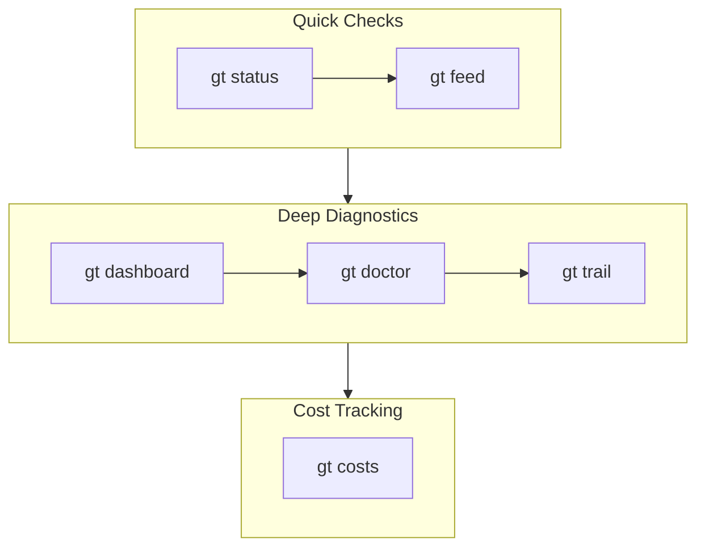
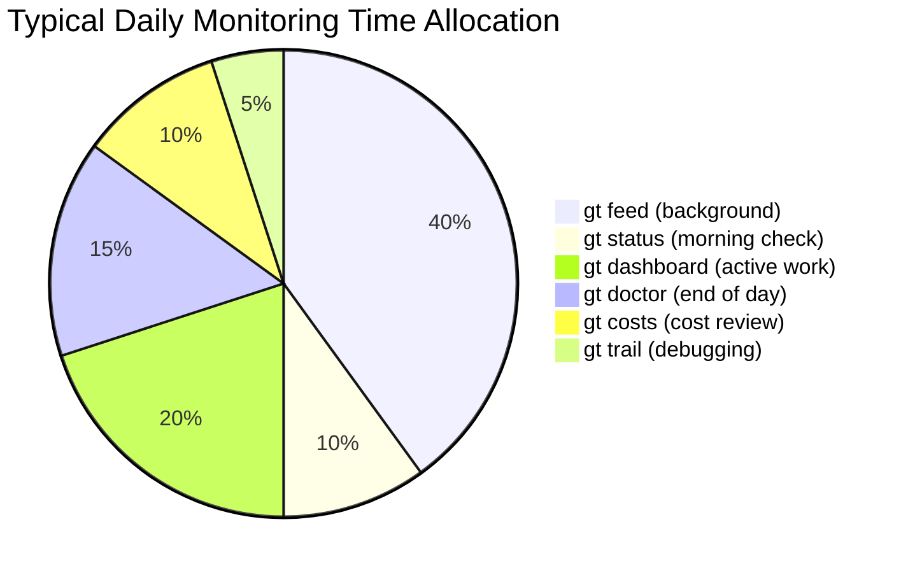
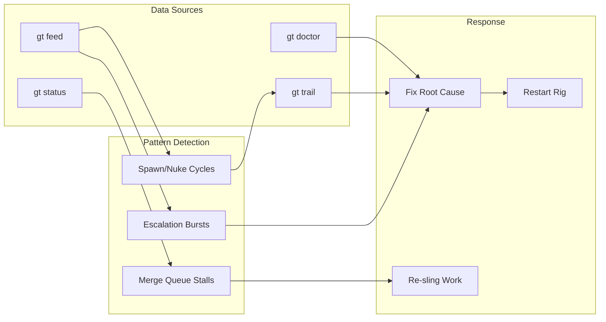
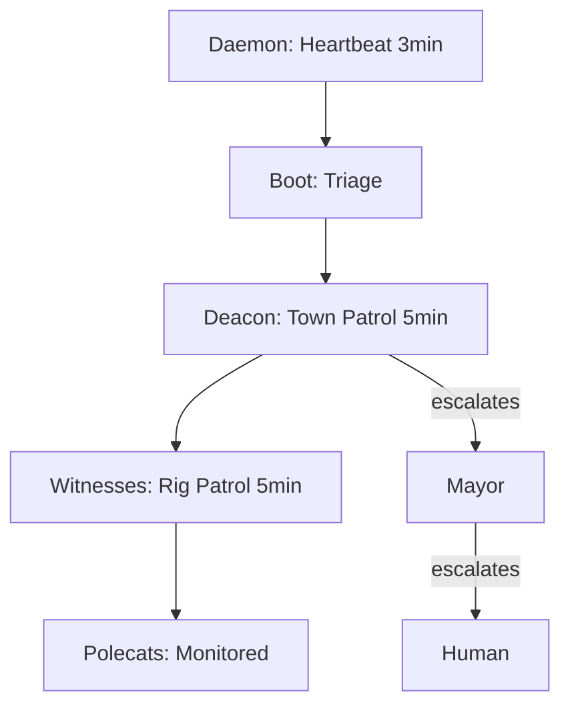

Running 10-30 AI agents in parallel is powerful, but you need visibility into what they're doing. Gas Town provides several monitoring tools that work together to give you a complete picture — from real-time activity streams to health diagnostics.

<!-- truncate -->

## The Monitoring Stack

Gas Town's monitoring tools form a layered stack, from quick checks to deep diagnostics:

```text
gt feed        → Real-time activity stream (what's happening now)
gt status      → System overview (what's running)
gt dashboard   → Rich status display (everything at a glance)
gt doctor      → Health diagnostics (what's wrong)
gt trail       → Recent agent output (what agents are doing)
gt costs       → Token spend tracking (what it's costing)
```

Each tool serves a different purpose. Here's when to use each one.



## gt feed: The Activity Stream

`gt feed` is your real-time window into Gas Town. It shows events as they happen — agents starting, work being assigned, merges completing, escalations firing.

```bash
# Watch all activity
gt feed

# Filter to a specific rig
gt feed --rig myproject

# Show only escalations and errors
gt feed --level warn
```

**When to use it:** Keep `gt feed` running in a terminal while you work. It's the fastest way to notice problems — a sudden burst of escalations, a polecat that keeps restarting, or a merge queue that stops moving.

**What to watch for:**

| Pattern | What It Means |
|---------|---------------|
| Rapid polecat spawn/nuke cycles | Agent is crashing repeatedly on the same task |
| Escalation bursts | Multiple agents hitting the same blocker |
| Long gap in merge activity | Refinery may be stuck or queue is empty |
| "Context full" handoffs | Normal — agents cycling as designed |

## gt status: The Quick Check

`gt status` gives you a snapshot of what's running across the whole town.

```bash
gt status
```

This shows:
- Which rigs are active
- How many polecats are running per rig
- Whether patrol agents (Witness, Refinery, Deacon) are alive
- Merge queue depth

**When to use it:** First thing in the morning, or anytime you want a quick sanity check before slinging new work.

## gt dashboard: The Full Picture

`gt dashboard` is the richest view — a formatted display showing agents, queues, work items, and health all in one place.

```bash
gt dashboard

# Auto-refresh every 30 seconds
gt dashboard --watch
```

**When to use it:** During active development sessions when you have multiple convoys in flight. The dashboard shows convoy progress, so you can see how close batches are to completion.

## gt doctor: Health Diagnostics

When something feels wrong, `gt doctor` runs a comprehensive health check:

```bash
# Full diagnostic
gt doctor

# Auto-fix common issues
gt doctor --fix
```

`gt doctor` checks:
- Daemon heartbeat (is the scheduler running?)
- Agent session health (are tmux sessions alive?)
- Git state (are clones clean?)
- Merge queue state (are there stuck MRs?)
- Orphaned resources (leftover worktrees, stale branches)

**When to use it:** When `gt feed` shows anomalies, when agents seem unresponsive, or as part of your weekly maintenance routine.

### Common gt doctor Findings

| Finding | Severity | Action |
|---------|----------|--------|
| Daemon not running | Critical | `gt daemon start` |
| Witness session dead | High | `gt rig restart <rig>` |
| Orphaned worktrees | Low | `gt cleanup` |
| Stale polecat branches | Low | `gt orphans --clean` |
| Git lock files | Medium | Check for hung git processes, then remove |

## gt trail: Agent Output

Sometimes you need to see what an agent is actually doing — not events, but the raw output.

```bash
# Recent output from all agents
gt trail

# Specific agent output
gt trail --agent polecats/alpha

# Last N lines
gt trail -n 50
```

:::tip[Combine gt trail with gt feed for Complete Diagnostics]
When debugging a stuck polecat, open two terminals: one running `gt feed` to see lifecycle events (spawns, nudges, escalations) and one running `gt trail --agent <name>` to see the agent's actual output. The feed shows WHEN things happen; the trail shows WHAT the agent is doing. Together they give you the complete diagnostic picture.
:::

**When to use it:** When a polecat is stuck and you want to understand what it's trying to do. The trail shows the agent's actual work output, which can reveal confusion about the task, repeated errors, or infinite loops.

:::warning gt trail Output Disappears When a Polecat Is Nuked
The trail captures output from the agent's tmux session, which is destroyed when the polecat is nuked or its sandbox is cleaned up. If you suspect a polecat will be terminated soon, capture the trail immediately with `gt trail --agent <name> > trail-dump.txt` before the Witness or Deacon issues a death warrant.
:::

## gt costs: Token Spend



AI agents consume tokens. `gt costs` tracks spend across agents and rigs:

```bash
# Total costs
gt costs

# Breakdown by rig
gt costs --by-rig

# Breakdown by agent
gt costs --by-agent

# Trend over time
gt costs --since 7d
```

**When to use it:** Daily if you're cost-conscious. Weekly at minimum. Unexpected spikes in token usage often indicate an agent retrying a broken task.

:::tip Watch for Rapid Spawn/Nuke Cycles
If `gt feed` shows a polecat being spawned and nuked repeatedly in quick succession, it usually means the agent is crashing on the same task. Don't wait for the Witness to escalate — check the bead description for ambiguity, inspect `gt trail` for the error, and consider re-decomposing the work into smaller pieces before re-slinging.
:::

:::note gt doctor --fix Is Safe to Run Regularly
The `gt doctor --fix` command only addresses well-understood, non-destructive cleanups — removing orphaned worktrees, clearing stale lock files, and restarting dead daemon processes. It will never modify your branches, delete uncommitted work, or alter bead state. Running it as part of your daily routine is safe and recommended.
:::

:::caution Don't Ignore Escalation Bursts in gt feed
If `gt feed` shows multiple escalations firing within a short window, it often indicates a systemic issue rather than individual polecat failures — such as a broken dependency, a flaky test, or a misconfigured rig. Investigate the common denominator across the escalations before addressing each one individually, or you risk wasting time on symptoms while the root cause continues generating new failures.
:::



## Building a Monitoring Routine

Here's a practical daily routine for monitoring a Gas Town fleet:

### Morning Check (2 minutes)

```bash
gt status                    # Everything running?
gt escalate list             # Any unacknowledged escalations?
gt costs --since 1d          # Anything unusual?
```

### During Active Work

```bash
gt feed                      # Keep running in a terminal
gt dashboard --watch         # Optional: rich display in second terminal
```

### End of Day (3 minutes)

```bash
gt convoy list               # Any stranded convoys?
gt doctor                    # System health check
gt costs --since 1d --by-rig # Cost review
```

### Weekly Review (10 minutes)

```bash
gt doctor                    # Full health check
gt costs --since 7d --by-rig # Weekly cost trend
gt orphans                   # Find leaked resources
gt cleanup                   # Clean up finished worktrees
gt escalate stale            # Close old escalations
gt convoy stranded           # Find abandoned convoys
```

## Alerts and Escalations

Gas Town's [escalation system](/docs/operations/escalations/) routes problems automatically:

- **P3 (Low):** Logged for review. No immediate action needed.
- **P2 (Medium):** Sent to your mailbox. Check during next patrol.
- **P1 (High):** Immediate notification via nudge. Check now.
- **P0 (Critical):** Routes to SMS. Drop everything.

Most day-to-day monitoring is about catching patterns before they become P0 escalations. The tools above give you early warning.



## The Automated Safety Net

Even when you're not watching, Gas Town monitors itself:

1. **Daemon** sends heartbeats every 3 minutes
2. **Boot** triages system state on each tick
3. **Deacon** patrols all rigs every 5 minutes
4. **Witnesses** patrol their polecats every 5 minutes
5. **Escalations** flow upward automatically

Your monitoring tools complement this automated layer — they give you visibility into what the automated monitoring is doing, and help you catch issues that fall outside the automated checks.

## Next Steps

- **[Operations Guide](/docs/operations/)** — Full operational reference
- **[Escalation System](/docs/operations/escalations/)** — Priority routing and severity levels
- **[Monitoring & Health](/docs/operations/monitoring)** — Health checks, patrol digests, and monitoring configuration
- **[Cost Optimization](/blog/cost-optimization)** — Strategies for reducing token spend
- **[Incident Response](/blog/incident-response)** — What to do when things go wrong
- **[The Witness Explained](/blog/witness-explained)** — How the Witness provides automated health monitoring
- **[Deacon Patrol](/blog/deacon-patrol)** — How the Deacon patrols all rigs and complements your monitoring routine
- [Diagnostics CLI Reference](/docs/cli-reference/diagnostics) — Commands for health checks and system diagnostics
