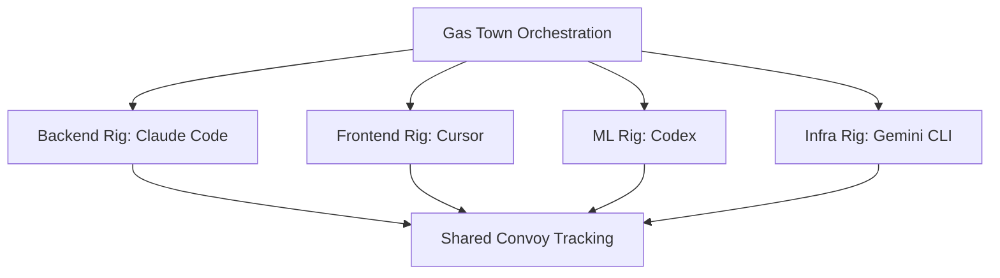
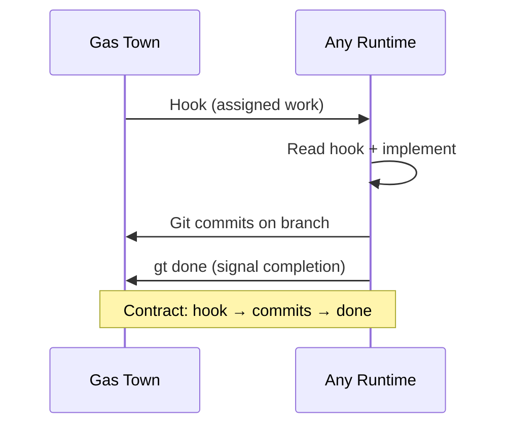

Gas Town isn't just for Claude Code. Its architecture is runtime-agnostic — the same beads, convoys, and handoff patterns work whether your agents run Claude, Gemini, Codex, or even a human with a terminal.

<!-- truncate -->

## The Runtime-Agnostic Principle

Gas Town separates **orchestration** from **execution**. The coordination layer (beads, convoys, hooks, molecules) doesn't care what's doing the work. It only cares that:

1. Work gets picked up from the hook
2. Commits land on the branch
3. The agent signals completion

This means you can mix runtimes within a single rig or across rigs:

```text
Town
├── backend/        ← Claude Code polecats (complex refactoring)
├── frontend/       ← Cursor agents (UI work with visual feedback)
├── ml-pipeline/    ← Codex workers (Python-heavy data work)
└── infra/          ← Gemini CLI agents (Terraform/GCP native)
```



## How Runtimes Plug In

Each Gas Town rig has a **runtime configuration** that tells the system how to spawn and manage agents:

```bash
# Check a rig's runtime
gt rig info backend
# Runtime: claude-code
# Session: tmux

gt rig info ml-pipeline
# Runtime: codex
# Session: tmux
```

The key contract between Gas Town and any runtime:

| Gas Town provides | Runtime must do |
|---|---|
| Work on the hook (`gt hook`) | Read the hook and understand the task |
| Git clone with clean state | Make commits to the branch |
| `gt done` command | Call it when work is complete |
| Beads for task tracking | Update bead status (`bd update`) |

Any tool that can read from a hook, write git commits, and call shell commands can be a Gas Town runtime.

## Choosing the Right Runtime

Different runtimes have different strengths:

| Runtime | Best For | Trade-offs |
|---------|----------|------------|
| **Claude Code** | Complex refactoring, multi-file changes, architecture work | Higher cost per token, deep reasoning |
| **Gemini CLI** | GCP-native work, large context windows, broad knowledge | Different tool ecosystem |
| **Codex** | Python/data science, rapid iteration, OpenAI ecosystem | More focused scope |
| **Cursor** | UI development, visual components, real-time preview | Requires display server |
| **Augment** | Enterprise codebases, legacy code understanding | Specialized setup |

## Cross-Runtime Convoys

The most powerful pattern: a single convoy spanning multiple runtimes:

```bash
# Backend refactoring — Claude Code excels at this
bd create --rig backend --title "Refactor auth middleware" --type task
# → be-auth (will be worked by Claude Code polecat)

# ML pipeline update — Codex handles Python naturally
bd create --rig ml-pipeline --title "Update feature extraction" --type task
# → ml-extract (will be worked by Codex agent)

# Frontend update — Cursor provides visual feedback
bd create --rig frontend --title "Update login component" --type task
# → fe-login (will be worked by Cursor agent)

# One convoy tracks them all
gt convoy create "Auth System Overhaul" be-auth ml-extract fe-login
```

Each rig spawns agents using its configured runtime. Gas Town doesn't care that three different AI systems are doing the work — it tracks progress uniformly through beads.

## Configuring a Rig's Runtime

When creating a new rig, specify the runtime:

```bash
# Create a rig with a specific runtime
gt rig create ml-pipeline --runtime codex --repo git@github.com:org/ml-pipeline.git

# Change an existing rig's runtime
gt rig config ml-pipeline runtime codex
```

The runtime determines:
- How polecat sessions are created (tmux vs other)
- What system prompt is injected at startup
- How the agent loads context (`gt prime`, etc.)
- What tools are available inside the session

## The Seance Pattern

For runtimes that need special initialization, Gas Town uses the **seance** pattern — a structured way to bootstrap an agent session with the right context:

```bash
# Seance loads: role context + beads context + hook state
gt seance start --runtime gemini --rig infra
```

The seance ensures that regardless of runtime, the agent starts with:
1. Its role and rig context
2. The current hook (assigned work)
3. Beads database access
4. Git repository state

This is what makes runtime-swapping possible without losing coordination state.



:::tip Start Single-Runtime, Specialize Later
Most teams get the best results by starting with Claude Code for all rigs and only introducing additional runtimes after they identify specific tasks that benefit from a different model's strengths. Premature multi-runtime setups add operational complexity without clear payoff.
:::

## Practical Tips

**Start with one runtime.** Most teams begin with Claude Code for everything, then specialize as they learn which tasks benefit from different runtimes.

**Runtime choice is per-rig, not per-bead.** You don't pick a runtime for each task — you pick it for each codebase. The rig's runtime handles all work slung to that rig.

**Test your contract.** When adding a new runtime, verify the basic loop:
```bash
# 1. Can the agent read its hook?
gt hook  # Inside the agent session

# 2. Can it make commits?
git add -A && git commit -m "test"

# 3. Can it signal completion?
gt done
```

If those three work, the runtime is Gas Town compatible.

**Monitor cross-runtime convoys carefully.** Different runtimes have different failure modes. Claude Code polecats might hit context limits; Codex agents might have different tool availability. The Witness monitors all runtimes equally, but error patterns vary.

## Next Steps

- **[Rigs](/docs/concepts/rigs)** — How rigs are configured and managed
- **[Seance](/docs/cli-reference/seance)** — Session bootstrap for any runtime
- **[Polecat Lifecycle](/docs/agents/polecats)** — How transient workers are managed across runtimes
- **[Architecture Overview](/docs/architecture/overview)** — The full Gas Town system design
- **[Understanding Rigs](/blog/understanding-rigs)** — How rigs organize different runtime environments
- **[Mastering gt sling](/blog/mastering-gt-sling)** — Slinging work across rigs with different runtimes
- **[Plugin System](/blog/plugin-system)** — Extending Gas Town with plugins for different runtime environments
- **[Hook-Driven Architecture](/blog/hook-driven-architecture)** — How hooks provide the universal contract between Gas Town and any runtime
