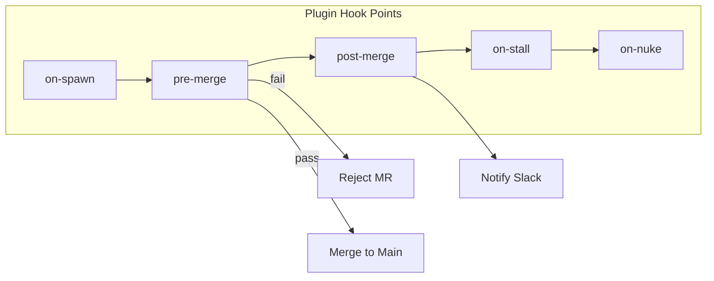
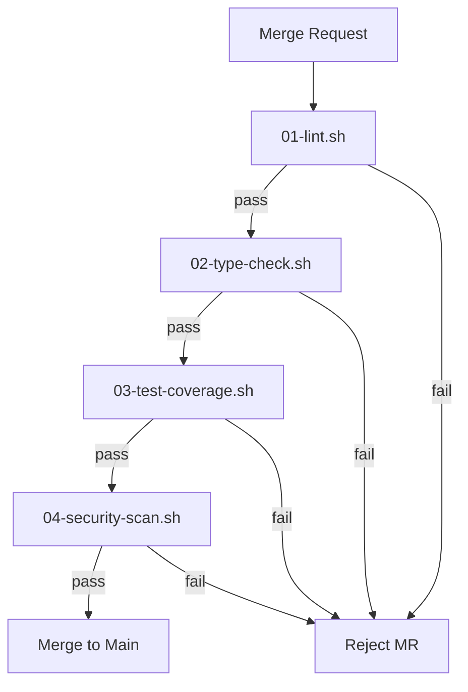

Gas Town ships with sensible defaults, but every team has unique needs. The plugin system lets you extend and customize agent behavior without forking the core -- adding custom quality gates, integrating external services, and shaping how agents work in your environment.

<!-- truncate -->

## What Are Plugins?

Plugins are scripts or configurations that hook into Gas Town's lifecycle events. When a polecat completes work, when the Refinery processes a merge, when the Witness detects a stall -- each of these events can trigger plugin code.

```text
~/gt/myproject/
├── plugins/
│   ├── pre-merge/        # Runs before Refinery merges
│   │   └── lint-check.sh
│   ├── post-merge/       # Runs after successful merge
│   │   └── notify-slack.sh
│   ├── on-stall/         # Runs when Witness detects a stall
│   │   └── alert-pagerduty.sh
│   └── quality-gates/    # Custom quality gate definitions
│       └── coverage.toml
```

Plugins live in the rig's `plugins/` directory and are version-controlled alongside your code. This means plugin changes go through the same review process as code changes.



## Plugin Types

### Quality Gate Plugins

The most common plugin type adds **custom quality gates** to the Refinery merge process. Out of the box, the Refinery runs tests and checks for clean rebasing. Quality gate plugins add additional checks:

```toml
# plugins/quality-gates/coverage.toml
name = "coverage-check"
description = "Ensure test coverage doesn't drop below 80%"
stage = "pre-merge"
command = "scripts/check-coverage.sh"
fail_action = "reject"   # reject | warn | notify
threshold = 80
```

When the Refinery processes a merge request, it runs all quality gate plugins in sequence. If any gate with `fail_action = "reject"` fails, the merge is blocked and a bead is created for the polecat to fix the issue.

### Notification Plugins

Notification plugins fire on lifecycle events and integrate Gas Town with external services:

```bash
#!/bin/bash
# plugins/post-merge/notify-slack.sh
# Called with: $1 = branch name, $2 = merge commit SHA

curl -X POST "$SLACK_WEBHOOK_URL" \
  -H 'Content-Type: application/json' \
  -d "{\"text\": \"Merged: $1 ($2)\"}"
```

Common notification targets include Slack, Discord, PagerDuty, and email. The plugin receives context about the event (branch name, bead ID, agent identity) as environment variables or arguments.

### Lifecycle Plugins

Lifecycle plugins run at specific points in an agent's lifecycle:

| Hook Point | When It Fires | Use Case |
|-----------|--------------|----------|
| `pre-merge` | Before Refinery merges a branch | Lint, coverage, security scan |
| `post-merge` | After successful merge | Notifications, deployment triggers |
| `on-stall` | When Witness detects a stuck polecat | Custom alerting, automatic remediation |
| `on-spawn` | When a new polecat is created | Environment setup, dependency install |
| `on-nuke` | When a polecat sandbox is destroyed | Cleanup, resource deallocation |
| `on-cycle` | When a persistent agent cycles | Metrics collection, health reporting |

## Writing a Plugin

A minimal plugin is a shell script in the right directory:

```bash
#!/bin/bash
# plugins/pre-merge/security-scan.sh
# Exit 0 = pass, Exit 1 = fail

echo "Running security scan..."
npm audit --audit-level=high

if [ $? -ne 0 ]; then
  echo "FAIL: High-severity vulnerabilities found"
  exit 1
fi

echo "PASS: No high-severity vulnerabilities"
exit 0
```

Make it executable and place it in the appropriate hook directory:

```bash
chmod +x plugins/pre-merge/security-scan.sh
git add plugins/pre-merge/security-scan.sh
git commit -m "Add pre-merge security scan plugin"
```

The Refinery will automatically discover and run it during merge processing. No registration or configuration beyond the file itself is needed — convention over configuration keeps the plugin system simple.

## Plugin Configuration

For more complex plugins, use a TOML configuration file:

```toml
# plugins/quality-gates/type-check.toml
name = "type-check"
description = "Run TypeScript type checking"
stage = "pre-merge"
command = "npx tsc --noEmit"
fail_action = "reject"
timeout = "120s"
retry = 1
```

| Field | Description |
|-------|-------------|
| `name` | Plugin identifier |
| `description` | Human-readable description |
| `stage` | Lifecycle hook point |
| `command` | Shell command to execute |
| `fail_action` | What happens on failure: `reject`, `warn`, or `notify` |
| `timeout` | Maximum execution time |
| `retry` | Number of retries on failure |



## Plugin Ordering

When multiple plugins target the same hook point, they execute in alphabetical order by filename. Use numeric prefixes to control ordering:

```text
plugins/pre-merge/
├── 01-lint.sh
├── 02-type-check.sh
├── 03-test-coverage.sh
└── 04-security-scan.sh
```

If any plugin fails with `fail_action = "reject"`, subsequent plugins are skipped and the merge is blocked.

## Best Practices

1. **Keep plugins fast.** Pre-merge plugins run on every merge. Aim for under 60 seconds total.
2. **Use `warn` for non-critical checks.** Reserve `reject` for checks that must pass (tests, security). Use `warn` for advisory checks (code style, documentation).
3. **Version control everything.** Plugins in `plugins/` are committed to git and reviewed like code.
4. **Test plugins independently.** Run your plugin scripts manually before deploying them.
5. **Set timeouts.** A plugin that hangs blocks the Refinery. Always set reasonable timeouts.
6. **Log results.** Write plugin output to a log file alongside exit codes. This makes debugging failed merges much easier when reviewing Refinery history.

## Next Steps

- [Operations: Plugins](/docs/operations/plugins) -- Detailed plugin operations guide
- [The Refinery](/docs/agents/refinery) -- How the Refinery processes merge requests
- [Quality Gates](/docs/concepts/gates) -- Built-in gate types and custom gates
- [Monitoring](/docs/operations/monitoring) -- Monitoring plugin execution and failures
- [The Refinery Deep Dive](/blog/refinery-deep-dive) -- How plugins integrate with the merge queue
- [Monitoring Your Fleet](/blog/monitoring-fleet) -- Monitoring plugin execution and failures
- [Custom Formulas](/blog/custom-formulas) -- Building custom formulas that leverage plugins
- [Configuration CLI Reference](/docs/cli-reference/configuration) — Commands for managing Gas Town configuration
