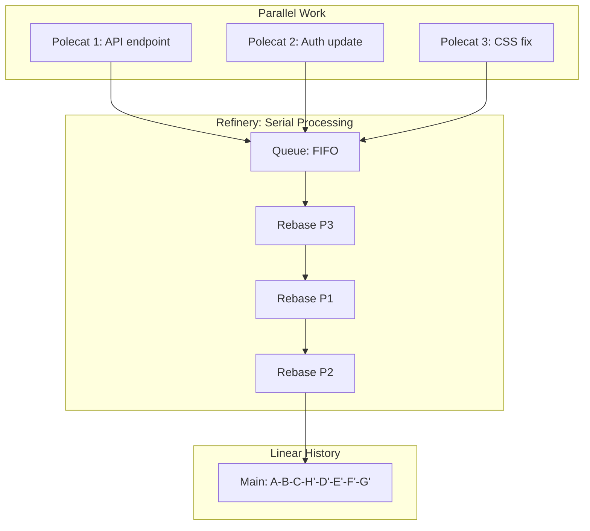
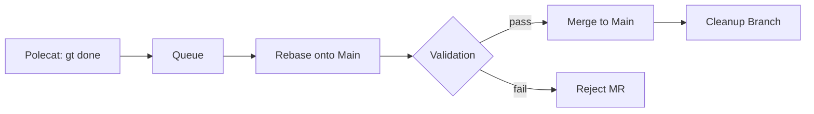
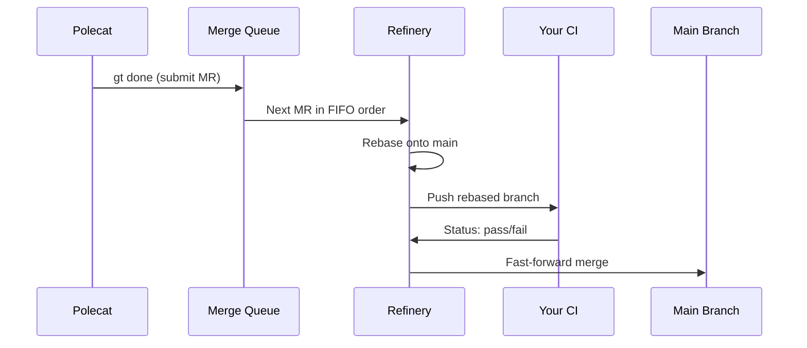
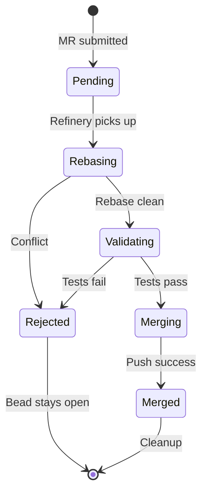
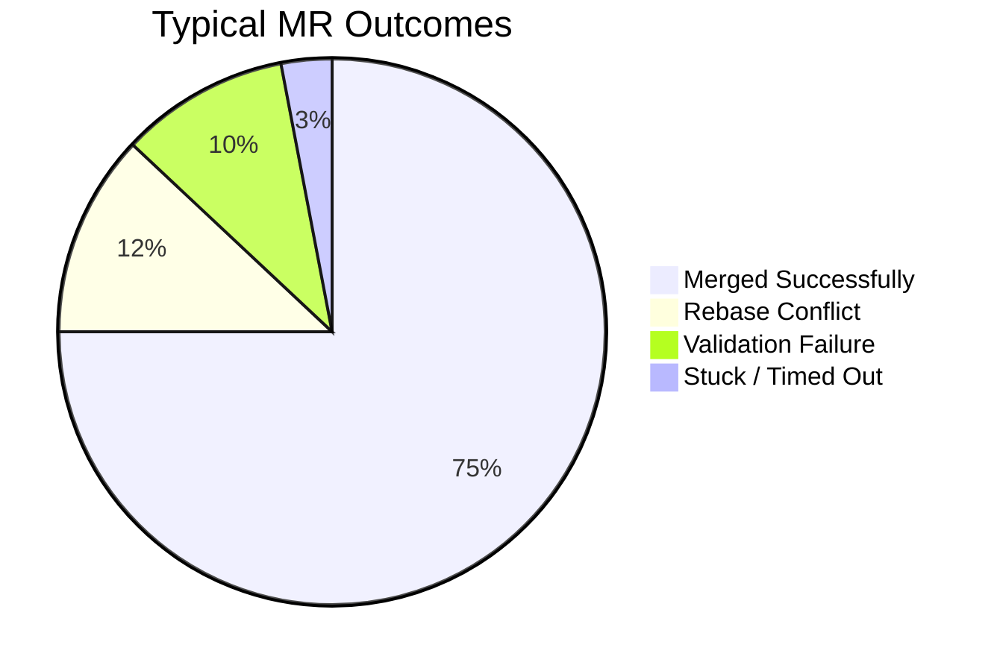
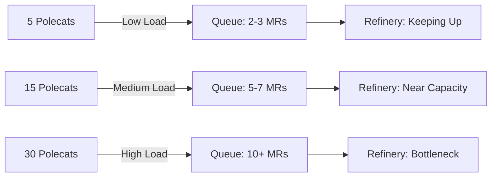
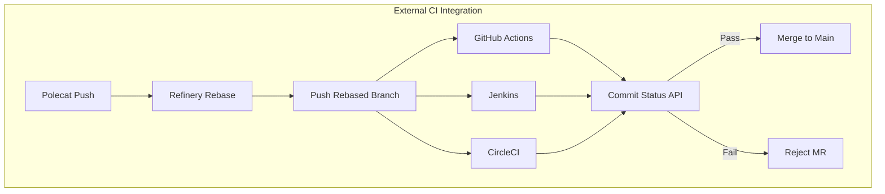

When 10 polecats are writing code in parallel, how does it all end up on main without chaos? The answer is the Refinery — Gas Town's per-rig merge queue processor that serializes parallel work into a clean, linear commit history.

<!-- truncate -->

## The Problem

Parallel development creates a fundamental conflict: multiple agents modify the same codebase simultaneously, producing branches that diverge from each other and from main.



```text
main:     A --- B --- C
polecat1:       \--- D --- E        (adds API endpoint)
polecat2:       \--- F --- G        (updates auth module)
polecat3:       \--- H              (fixes CSS)
```

If all three try to merge at once, you get conflicts, broken builds, and a non-linear history that's hard to reason about. Traditional solutions — merge commits, manual conflict resolution — don't scale to 10-30 agents.

## The Refinery's Approach

The Refinery processes merge requests (MRs) one at a time, in FIFO order. Each MR gets rebased onto the current tip of main, tested, and merged. If it fails, it gets rejected. For details on how the Refinery handles transient state during this process, see [wisps](/docs/concepts/wisps). To learn how the system remains operational even during unexpected failures, see [session cycling explained](/blog/session-cycling).

```text
Step 1: Rebase polecat3's work onto main
  main: A --- B --- C --- H'

Step 2: Rebase polecat1's work onto new main
  main: A --- B --- C --- H' --- D' --- E'

Step 3: Rebase polecat2's work onto new main
  main: A --- B --- C --- H' --- D' --- E' --- F' --- G'
```

The result is always a clean linear history, no matter how many agents are working in parallel.



## Anatomy of a Merge Request

When a polecat runs `gt done`, it creates a merge request (MR) in the Refinery's queue:

```text
MR {
  id:       "mr-a1b2c3"
  source:   "polecat/alpha/ga-xyz@ml-abc"   (branch)
  target:   "main"
  bead:     "ga-xyz"                         (the issue it addresses)
  status:   "pending"
  commits:  ["d4e5f6", "a7b8c9"]
}
```

The MR captures everything the Refinery needs: which branch to merge, what issue it addresses, and which commits are involved. For multi-step validation workflows, the Refinery can coordinate with [molecules](/docs/concepts/molecules) to track validation state across session boundaries.

## The Merge Pipeline

Each MR goes through a pipeline:

### 1. Queue

The MR enters the queue in FIFO order. The Refinery processes one MR at a time to avoid conflicts.

### 2. Rebase

The Refinery rebases the MR's commits onto the current tip of main:

```bash
git checkout main
git pull
git rebase --onto main <fork-point> <branch>
```

If the rebase has conflicts, the MR is rejected — the polecat (or a new one) will need to resolve them.

### 3. Validation

After a clean rebase, the Refinery runs validation. This can include:

- **Built-in checks:** Does the code compile? Do tests pass?
- **Your CI:** If `refinery.require_ci` is set, the Refinery waits for your GitHub Actions (or Jenkins, etc.) to report success.

```bash
# Configure Refinery to wait for your CI
gt rig config myproject refinery.require_ci true
```

### 4. Merge

If validation passes, the Refinery fast-forward merges to main and pushes:

```bash
git checkout main
git merge --ff-only <rebased-branch>
git push origin main
```

### 5. Cleanup

After a successful merge:
- The branch is deleted
- The polecat's worktree is cleaned up
- The associated bead is updated
- Convoy progress is recalculated (may trigger auto-close)

## Pipeline Stages at a Glance

| Stage | Purpose | Failure Behavior | Typical Duration |
|---|---|---|---|
| **Queue** | Hold MRs in FIFO order until the Refinery is ready to process them | No failure possible at this stage; MRs wait indefinitely until processed | Seconds to minutes depending on queue depth |
| **Rebase** | Replay the MR's commits onto the current tip of main to produce a linear history | Rejects the MR with `CONFLICT` status; the bead stays open for re-slinging or manual resolution | Seconds (fast-forward git operations) |
| **Validation** | Run built-in checks and external CI to verify the rebased code compiles and passes tests | Rejects the MR with `VALIDATION_FAILED` status; a new polecat can be spawned with error context | Minutes (depends on CI pipeline speed) |
| **Merge** | Fast-forward merge the validated, rebased branch into main and push | Extremely rare — typically a transient git push failure; Refinery retries automatically | Seconds |
| **Cleanup** | Delete the feature branch, clean up the polecat worktree, update bead status, recalculate convoy progress | Non-critical — failures are logged but do not block the queue from advancing | Seconds |

## What Happens When Merges Fail

Not every MR makes it through. Here's what happens at each failure point:

### Rebase Conflicts

**Cause:** Another agent's changes conflict with this MR's changes.

**Behavior:** The Refinery rejects the MR with a `CONFLICT` status. The original bead stays open. The Witness can spawn a new polecat to resolve the conflict, or the issue can be re-slung manually.

**Prevention:** Keep tasks small and focused. Beads that touch different files rarely conflict.

### Validation Failures

**Cause:** Tests fail after rebase, or CI reports failure.

**Behavior:** The MR is rejected with a `VALIDATION_FAILED` status. This often means the polecat's code was correct in isolation but breaks when combined with other recent changes.

**Recovery:** A new polecat can be spawned with the error context. Often, re-running on the latest main is enough to fix the issue.

### Stuck MRs

**Cause:** CI is slow, an external dependency is down, or the Refinery process itself is stuck.

**Behavior:** The [Witness](/docs/agents/witness) detects a stalled Refinery during its patrol and nudges it. If the Refinery remains stuck, the Witness escalates to the Deacon.

**Manual intervention:**

```bash
# Check queue status
gt mq list

# See what's stuck
gt mq status

# Skip a problematic MR
gt mq skip <mr-id>

# Force-process the queue
gt mq process
```



:::tip Keep Beads Small to Minimize Rebase Conflicts
The single biggest factor in Refinery throughput is merge conflict rate, and the single biggest factor in conflict rate is MR size. Beads that touch 1-3 files and produce fewer than 100 changed lines rebase cleanly in the vast majority of cases. If your conflict rate climbs above 15%, decompose your beads into smaller, more focused units before slinging.
:::

:::note Rejected MRs Do Not Block the Queue
When the Refinery rejects an MR due to a rebase conflict or validation failure, it immediately moves on to the next MR in the queue. The rejected bead stays open and can be re-slung to a fresh polecat, but it does not hold up other merges. This design ensures that one problematic MR never stalls the entire pipeline — the queue keeps flowing while the failed work is retried independently.
:::





:::info The Refinery Always Uses Fast-Forward Merges
The Refinery exclusively uses `--ff-only` merges, which means it never creates merge commits. This guarantees a perfectly linear commit history on main, making `git bisect`, `git log`, and blame annotations straightforward. If a fast-forward is not possible (because someone pushed directly to main), the Refinery detects the divergence and re-queues affected MRs for a fresh rebase.
:::

## Queue Ordering

The default ordering is FIFO — first submitted, first processed. But the Refinery respects priority when configured:

```bash
# High-priority MRs jump the queue
gt mq submit --priority high
```

Priority levels:
- **Critical:** Processed immediately (emergency fixes)
- **High:** Jumps ahead of normal priority
- **Normal:** Default FIFO ordering
- **Low:** Processed after all normal-priority MRs

## Monitoring the Queue

Several commands help you understand queue state:

```bash
# List all MRs in the queue
gt mq list

# Detailed status of queue processing
gt mq status

# Watch the Refinery's activity
gt feed --rig myproject | grep -i refinery

# Check Refinery health
gt rig status myproject
```

:::info Queue Depth Above 10 Suggests a Bottleneck
If your merge queue consistently holds more than 10 pending MRs, it means polecats are submitting work faster than the Refinery can validate and merge it. This is a sign to either increase the Refinery's patrol frequency, split the rig into smaller focused rigs, or temporarily reduce the number of active polecats until the backlog clears.
:::

## Throughput Considerations

The Refinery is intentionally single-threaded per rig. Processing MRs one at a time guarantees a clean history but creates a throughput bottleneck. Here's how to manage it:

The following diagram illustrates the relationship between queue depth and processing bottlenecks as more polecats submit work.




### Queue Depth

If your queue depth regularly exceeds 10 MRs, consider:

- **Splitting the rig:** If different subsystems can live in separate repos, create separate rigs. Each rig has its own Refinery.
- **Reducing MR size:** Smaller, more focused beads produce smaller MRs that process faster.
- **Faster CI:** If validation is the bottleneck, optimize your test suite.

### Merge Frequency

The Refinery processes one MR per patrol cycle (default: 5 minutes). For higher throughput:

```bash
# Increase patrol frequency
gt rig config myproject witness.patrol_interval 120  # 2 minutes
```

Be careful — faster patrols mean more token usage for patrol agents. For strategies on optimizing throughput at scale, see [Scaling Beyond 30 Agents](/blog/scaling-beyond-30).

### Conflict Rate

High conflict rates slow everything down because rejected MRs must be retried. If your conflict rate is above 10%:

- **Decompose work better:** Ensure beads touch non-overlapping files
- **Use convoys with dependencies:** If task B depends on task A, the dependency ensures A merges first
- **Sequence related work:** Don't sling 5 agents at the same file

## Integration with External CI

The Refinery is designed to work with your existing CI/CD pipeline, not replace it:

```text
Polecat pushes branch
  → Refinery rebases onto main
    → Refinery pushes rebased branch
      → GitHub Actions / Jenkins runs
        → CI reports back (commit status)
          → Refinery checks status
            → If pass: merge to main
            → If fail: reject MR
```



Configure this with:

```bash
# Require CI checks before merge
gt rig config myproject refinery.require_ci true

# Specify which checks must pass
gt rig config myproject refinery.required_checks "ci/build,ci/test,ci/lint"
```

:::info The Refinery Waits for CI Status Asynchronously
When `require_ci` is enabled, the Refinery pushes the rebased branch and then polls for commit status updates from your CI provider. It does not block the entire patrol cycle while waiting — instead, it marks the MR as "validating" and moves on to check other queue items. On the next patrol cycle, it rechecks the CI status and either merges or rejects based on the result. This keeps the Refinery responsive even when CI takes several minutes to complete.
:::

:::warning Never Push Directly to Main While the Refinery Is Active
Pushing commits directly to main bypasses the Refinery's rebase-and-validate pipeline. Every MR currently in the queue will need to rebase against your out-of-band changes, potentially causing cascading conflicts across all pending merges. Always route changes through the Refinery or a crew workspace.
:::

## Best Practices

**Keep MRs small.** Small MRs rebase cleanly, validate faster, and are easier to retry on failure. Aim for 1-3 commits per MR.

**Don't bypass the queue.** Pushing directly to main while the Refinery is active can cause cascading rebase failures. Use crew workspaces or the Refinery for all changes.

**Monitor queue depth.** A growing queue indicates a throughput problem. Address it before it becomes a bottleneck. For strategies on managing increasing queue depth and merge contention, see [monitoring your fleet](/blog/monitoring-fleet).

**Configure CI integration.** The Refinery's built-in checks are lightweight. For production codebases, always enable `require_ci` to run your full test suite.

## Next Steps

- **[Refinery Agent](/docs/agents/refinery/)** — The agent that runs the merge queue
- **[Merge Queue Commands](/docs/cli-reference/merge-queue/)** — Full CLI reference for `gt mq`
- **[Git Workflow Guide](/docs/guides/git-workflow)** — Best practices for git in multi-agent environments
- **[Gas Town vs CI/CD](/blog/gas-town-vs-cicd)** — How Gas Town complements your existing pipeline
- **[Advanced Convoy Patterns](/blog/advanced-convoy-patterns)** — Dependency management for cleaner merges
- **[Git Workflows for Multi-Agent Development](/blog/git-workflows-multi-agent)** — Git patterns that the Refinery enforces
- **[Code Review Workflow](/blog/code-review-workflow)** — How code review integrates with the Refinery merge pipeline
- [Refinery CLI Reference](/docs/cli-reference/refinery-commands) — Commands for managing the merge queue and Refinery
- [Lifecycle Management](/docs/operations/lifecycle) — Managing Refinery lifecycle and patrol cycles
