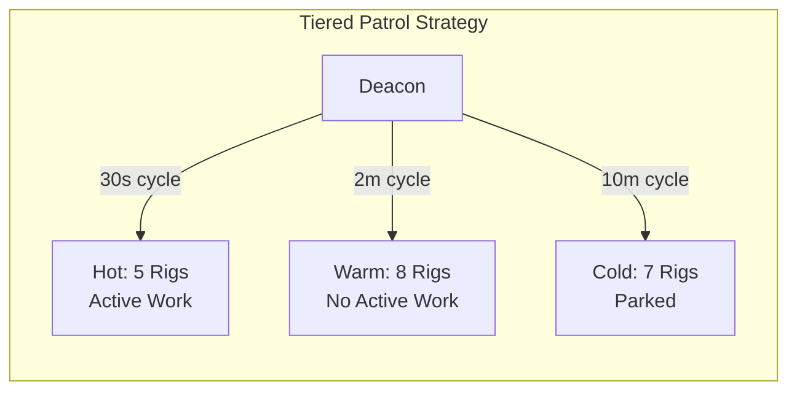
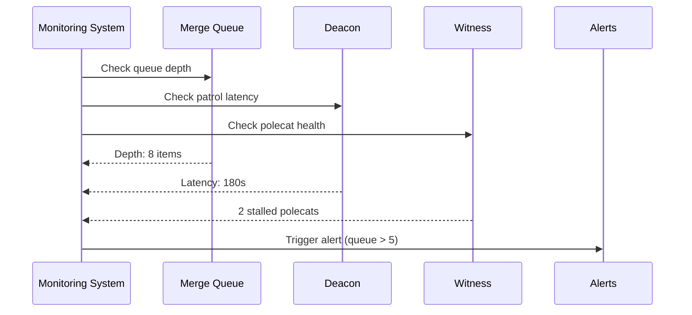
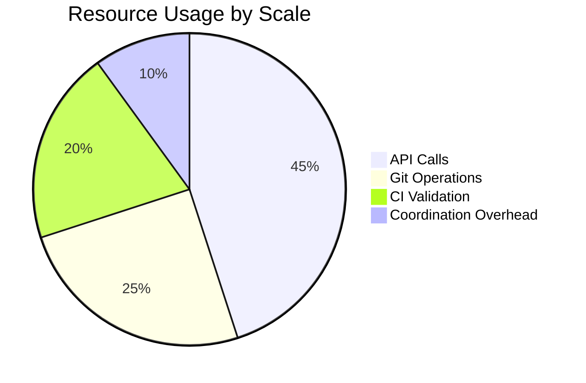
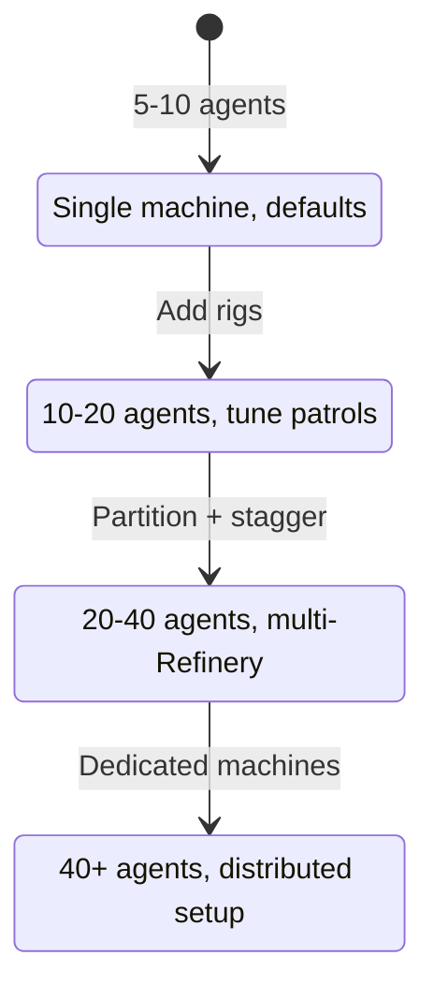

Gas Town's architecture is designed to scale horizontally. Adding more rigs and polecats is straightforward -- but at 30+ concurrent agents, you start hitting coordination bottlenecks that require deliberate architectural choices. Understanding the [escalation system](/blog/escalation-system) becomes critical at scale. Here is what we have learned about running Gas Town at scale.

<!-- truncate -->

## Where Bottlenecks Appear

Gas Town scales linearly up to about 10-15 agents with default settings. Beyond that, three areas need attention:

### 1. Git Contention

When multiple polecats work on the same rig and submit to the Refinery simultaneously, merge conflicts compound:

```text
5 polecats  → ~10% conflict rate   → occasional rebase
15 polecats → ~30% conflict rate   → frequent rebase, some cascading
30 polecats → ~50%+ conflict rate  → rebase storms, Refinery backlog
```

The Refinery processes merges sequentially (it must -- merge order matters). With 30 polecats submitting to the same rig, the merge queue grows faster than the Refinery can process it.

### 2. Deacon Patrol Latency

The [Deacon](/docs/agents/deacon) patrols all rigs sequentially. With 10+ rigs, each patrol cycle takes longer, and gate evaluations may lag:

```text
3 rigs   → Patrol cycle: ~30 seconds
10 rigs  → Patrol cycle: ~2 minutes
20 rigs  → Patrol cycle: ~5 minutes (gates may feel slow)
```

### 3. Mayor Coordination Overhead

The Mayor dispatches work across all rigs. With many concurrent convoys, the Mayor spends more time in coordination overhead and less time on strategic planning.


## Scaling Strategies

### Strategy 1: Partition by Rig

The most effective scaling strategy is **horizontal partitioning** -- spread work across more rigs rather than adding polecats to one rig.

```text
Before (bottleneck):
  myproject/   ← 20 polecats (merge queue overwhelmed)

After (scaled):
  myproject-core/     ← 7 polecats (core API changes)
  myproject-ui/       ← 7 polecats (frontend work)
  myproject-tests/    ← 6 polecats (test infrastructure)
```

Each rig has its own Refinery, Witness, and merge queue. Splitting a monorepo into logical components (or splitting a monolithic project across repos) dramatically reduces per-rig contention.

:::tip[When to Split]

Consider splitting a rig when the Refinery consistently has 5+ items in its merge queue. That is a signal that merge throughput cannot keep up with polecat output.

:::

### Strategy 2: Stagger Dispatches

Instead of dispatching an entire convoy of 20 beads at once, stagger the dispatches in waves:

```text
Wave 1: Dispatch 5 beads → polecats work → merges land
Wave 2: Dispatch 5 more  → build on landed code → merges land
Wave 3: Dispatch 5 more  → later work benefits from earlier merges
Wave 4: Final 5          → minimal conflicts (base is stable)
```

This reduces merge conflicts because later polecats work on a codebase that already includes earlier changes. The Mayor can implement this with convoy-level sequencing.

### Strategy 3: Dedicated Refineries

At extreme scale, a single Refinery per rig may not keep up. Gas Town supports running multiple Refinery instances:

```bash
# Scale up Refinery processing
gt rig scale myproject --refinery-workers 3
```

Multiple Refinery workers process the merge queue in parallel, with a coordination lock ensuring merge order consistency. This triples merge throughput at the cost of additional compute.

### Strategy 4: Tiered Deacon Patrols

Instead of one Deacon patrolling all rigs, partition rigs into tiers:

| Tier | Patrol Frequency | Rig Type |
|------|-----------------|----------|
| Hot  | Every 30 seconds | Active rigs with polecats |
| Warm | Every 2 minutes  | Active rigs without polecats |
| Cold | Every 10 minutes | Parked rigs (health check only) |

The Deacon prioritizes hot rigs, ensuring that active work gets fast gate evaluation while idle rigs consume minimal patrol time.



:::tip Scale API Concurrency Limits as You Add Agents
When you reach 20+ concurrent agents, you may hit your API provider's rate limits or concurrency caps. Check your provider's dashboard for throttling errors and request a concurrency increase if needed. Running at scale without adequate API limits causes agents to stall waiting for rate-limit backoff, which looks like normal stalls but affects many agents simultaneously.
:::



```mermaid
gantt
    title Scaling Timeline: From 5 to 40+ Agents
    dateFormat X
    axisFormat %s agents
    section Infrastructure
    Single Machine :milestone, 0, 10
    Add Load Balancing :milestone, 20, 0
    Distributed Setup :milestone, 40, 0
    section Optimization
    Partition Rigs :0, 15
    Stagger Dispatches :15, 25
    Multi-Refinery :25, 35
    Tiered Patrols :35, 45
```

| Scale | Agents | Rigs | Recommended Setup |
|-------|--------|------|-------------------|
| Small | 5-10 | 1-3 | Single machine, 8+ cores, 32GB RAM |
| Medium | 10-20 | 3-7 | Single machine, 16+ cores, 64GB RAM |
| Large | 20-40 | 5-15 | Two machines, load-balanced rigs |
| XL | 40+ | 15+ | Distributed setup, dedicated machines per rig cluster |

Each polecat session consumes an API call budget and local disk space (git worktree). The primary cost scaling factor is **API calls**, not local compute. Monitor your API usage and budget accordingly. For comprehensive strategies on tracking and optimizing costs, see [cost management](/docs/guides/cost-management).

## Monitoring at Scale

At 30+ agents, monitoring becomes essential rather than optional. Key metrics to track:

The following diagram shows the monitoring workflow for tracking agent health at scale.




```bash
# Merge queue depth (should stay under 5)
gt mq list --json | jq '.pending | length'

# Gate evaluation latency (should stay under 60s)
gt status --json | jq '.deacon.last_patrol_duration'

# Polecat throughput (completions per hour)
bd list --status=done --since=1h --json | jq '. | length'

# Conflict rate (should stay under 30%)
gt refinery stats --json | jq '.conflict_rate'
```

Set up alerting when:
- Merge queue exceeds 5 items for more than 10 minutes
- Deacon patrol takes more than 5 minutes
- Conflict rate exceeds 40%
- Any agent has been unresponsive for more than 15 minutes


:::warning Monitor Your API Token Budget at Scale
At 30+ concurrent agents, API token costs can escalate rapidly — especially if polecats are retrying broken tasks or patrol agents are cycling frequently. Set a daily budget alert with `gt costs --alert-threshold` and review `gt costs --by-agent` daily. A single misbehaving polecat stuck in a retry loop can consume more tokens in one hour than 10 healthy polecats use in a full day.
:::

:::note Horizontal Partitioning Also Improves Fault Isolation
Splitting a monolithic rig into multiple smaller rigs does more than reduce merge contention — it also isolates failures. When a single rig experiences a Refinery stall, an infrastructure issue, or a cascade of rebase conflicts, only the agents on that rig are affected. Other rigs continue operating normally, which means your overall throughput degrades gracefully rather than collapsing entirely.
:::





:::caution Do Not Scale Polecats Without Scaling Witness Patrols
Adding more polecats to a rig without adjusting the Witness patrol interval creates a supervision gap. The default 5-minute patrol cycle may not catch stalls quickly enough when 20+ agents are running concurrently. As you scale past 15 polecats per rig, reduce the patrol interval proportionally or split the rig so each Witness supervises fewer agents.
:::

## Common Pitfalls at Scale

1. **Not splitting rigs early enough.** By the time merge conflicts are constant, you should have split the rig already.
2. **Dispatching too much work at once.** Stagger dispatches to let earlier work land before later work begins.
3. **Ignoring Refinery backlog.** A growing merge queue means polecats are producing faster than you can merge. Either add Refinery workers or reduce polecat count.
4. **Skipping monitoring.** At scale, problems compound quickly. What is a minor hiccup with 5 agents becomes a cascade with 30.

:::tip Set Up Queue Depth Alerts Before Reaching 20 Agents
Configure automated alerts when your merge queue depth exceeds 5 items for more than 10 minutes. This gives you early warning that throughput is becoming a bottleneck — before polecats start stalling and conflicts cascade. Use `gt mq list --json | jq '.pending | length'` in a cron job or monitoring script to track queue depth over time.
:::

:::info Conflict Rate Is the Most Reliable Early Warning Signal for Scaling Issues
When your rig's conflict rate climbs above 20%, it signals that agents are stepping on each other's changes faster than the Refinery can serialize them. This happens before queue depth becomes critical and before agents start visibly stalling — making it the earliest indicator that you need to split the rig, stagger dispatches, or reduce concurrent polecats. Monitor `gt refinery stats --json | jq '.conflict_rate'` as your primary scaling health metric.
:::

Understanding the [work distribution architecture](/docs/architecture/work-distribution) helps you choose the right dispatch pattern when scaling across many rigs. For insights on creating effective task decomposition, see the [formula design patterns](/blog/formula-design-patterns) guide. If you experience increasing stalls and recovery events at scale, review the [incident response](/blog/incident-response) procedures to understand how escalation flows through the supervision tree.

## Next Steps

- [Architecture Overview](/docs/architecture/overview) -- How Gas Town's components fit together
- [Monitoring & Observability](/docs/operations/monitoring) -- Setting up monitoring dashboards
- [The Refinery](/docs/agents/refinery) -- Understanding the merge queue processor
- [Rigs](/docs/concepts/rigs) -- How to add and manage rigs
- [Cost Optimization](/blog/cost-optimization) -- Cost tracking strategies for large deployments
- [Lifecycle Management](/blog/lifecycle-management) -- Managing rig lifecycle at scale
- [Monitoring Your Fleet](/blog/monitoring-fleet) -- Fleet monitoring becomes critical at scale
- [Work Distribution Patterns](/blog/work-distribution-patterns) -- Choosing the right dispatch pattern when scaling across many agents
- [Session Cycling Explained](/blog/session-cycling) -- Managing context windows effectively at scale
- [Refinery Deep Dive](/blog/refinery-deep-dive) -- Understanding merge queue bottlenecks and throughput optimization at scale
- [Troubleshooting Guide](/docs/operations/troubleshooting) -- Diagnosing and resolving scaling bottlenecks
