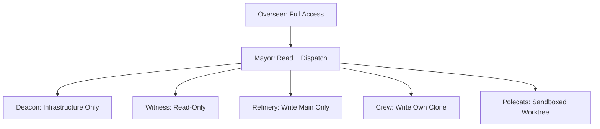
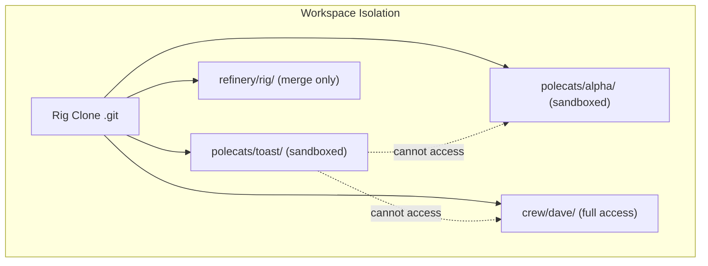

When you give AI agents write access to your codebase, security stops being theoretical. Gas Town's security model is built around a simple principle: **minimize the blast radius of any single agent's actions** through workspace isolation, scoped permissions, and trust boundaries.

<!-- truncate -->

## The Trust Hierarchy

Gas Town organizes agents into a trust hierarchy where each level has progressively narrower access:

```text
Overseer (Human)     ← Full access, all rigs, all secrets
  └── Mayor          ← Read access to all rigs, dispatch authority
      └── Deacon     ← Infrastructure management, no code write access
      └── Per-Rig Agents:
          ├── Witness     ← Read-only monitoring of rig state
          ├── Refinery    ← Write access to main branch only
          ├── Crew        ← Full write access to their clone
          └── Polecats    ← Write access to sandboxed worktree only
```

Each agent can only affect what its trust level permits. A polecat cannot push to main directly -- it submits to the Refinery, which validates and merges. The Witness can observe but not modify code. The Mayor can dispatch but not implement.



## Workspace Isolation

The first line of defense is **physical isolation through git worktrees**. Every polecat works in its own isolated worktree:

```text
~/gt/myproject/
├── refinery/rig/     # Refinery's canonical clone (protected)
├── crew/dave/        # Dave's persistent workspace
├── polecats/
│   ├── toast/        # Polecat toast's isolated worktree
│   └── alpha/        # Polecat alpha's isolated worktree
```

Polecats cannot see or modify each other's worktrees. A polecat that goes haywire -- writing garbage to files, deleting directories, corrupting state -- affects only its own sandbox. The Witness detects the problem, and the sandbox is nuked without impacting any other agent or the main branch.

### Why Worktrees, Not Containers?

Gas Town uses git worktrees rather than Docker containers for isolation because:

- **Speed** -- Worktree creation is milliseconds vs. seconds for containers
- **Git-native** -- No extra tooling to manage; git handles the isolation
- **Lightweight** -- No container runtime overhead; polecats are just directories
- **Sufficient isolation** -- For code changes, filesystem isolation is what matters

This is a deliberate trade-off: Gas Town provides **code isolation**, not **process isolation**. If you need stronger sandboxing (untrusted code execution, network isolation), layer containers on top.



## The Refinery Gate

The Refinery is the single point where code enters `main`. No agent pushes directly to the main branch (except crew workers, who are human-managed). This creates a natural security checkpoint:

```text
Polecat work → Branch push → Merge Request → Refinery validates → Merge to main
                                                 ↓
                                          Tests must pass
                                          Rebase must succeed
                                          No conflict markers
```

The Refinery runs the full test suite before merging. If tests fail, the merge is rejected and a conflict-resolution bead is created. This prevents broken code from reaching main, even if a polecat's implementation has bugs.

## Secrets Management

Gas Town follows a strict rule: **secrets never enter agent context**.

- **Environment variables** -- Agents inherit minimal env vars. Secrets are not set in agent sessions.
- **`.env` files** -- The `.gitignore` in every rig excludes `.env`, credentials, and key files.
- **Beads** -- The beads database stores work metadata, not secrets. If a bead description inadvertently contains a secret, it is flagged during review.
- **Handoff mail** -- Mail content is stored in the beads database. Never include secrets in handoff notes.

:::warning[API Keys]

If your CI needs API keys, configure them in your CI provider's secrets management (GitHub Secrets, etc.), not in the Gas Town workspace. Agents should never have direct access to production credentials.

:::

## Agent Identity and Audit Trail

Every action in Gas Town is attributable. The `BD_ACTOR` environment variable identifies each agent:

```text
gastowndocs/crew/nic       # Crew worker nic in the gastowndocs rig
gastowndocs/polecats/toast # Polecat toast in the gastowndocs rig
```

This identity is recorded on every bead operation, git commit, and mail message. The beads database provides a complete audit trail: who created an issue, who worked on it, who closed it, and when.

## Limiting Blast Radius

The security model's primary goal is limiting blast radius. Here is how different failure modes are contained:

| Failure Mode | Blast Radius | Recovery |
|-------------|-------------|----------|
| Polecat writes bad code | Its worktree only | Witness nukes sandbox |
| Polecat crashes mid-work | Its branch only | New polecat resumes from hook |
| Refinery merges a bug | Main branch | Revert commit, file P0 bead |
| Witness false positive | Polecat killed early | Bead returns to ready queue |
| Mayor dispatches wrong work | Wasted polecat cycles | Close incorrect beads, re-dispatch |

The worst case -- a bug merged to main -- is handled by standard git practices (revert) and the beads system (P0 escalation). Gas Town does not add risk beyond what any CI/CD pipeline has.

## Best Practices

1. **Never commit secrets.** Use `.gitignore` patterns for `.env`, `*.key`, `credentials.*`, and similar files.
2. **Review Refinery merges.** Enable branch protection and required reviews for production repositories.
3. **Monitor the audit trail.** Use `bd list` and `gt feed` to watch for unexpected activity.
4. **Scope agent permissions.** Crew workers need write access; the Witness does not. Keep permissions minimal.
5. **Use gates for sensitive operations.** Production deploys and infrastructure changes should require human approval via [gates](/docs/concepts/gates).

## Next Steps

- [Architecture Overview](/docs/architecture/overview) -- How agents are organized within the town
- [Gates](/docs/concepts/gates) -- Human approval gates for sensitive operations
- [Monitoring & Observability](/docs/operations/monitoring) -- Watching agent behavior in real time
- [Troubleshooting](/docs/operations/troubleshooting) -- When things go wrong and how to recover
- [Git Worktrees](/blog/git-worktrees) -- Worktree isolation as a security boundary
- [Death Warrants](/blog/death-warrants) -- How the warrant system enforces safe termination
- [Understanding Rigs](/blog/understanding-rigs) -- How rigs enforce the security boundaries described here
