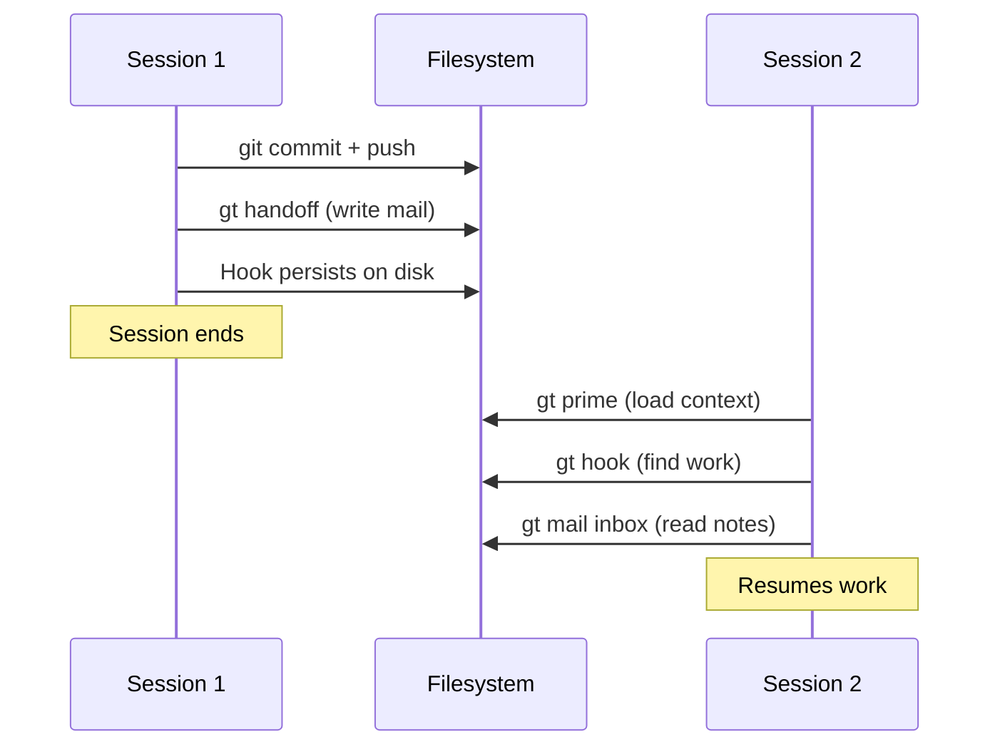
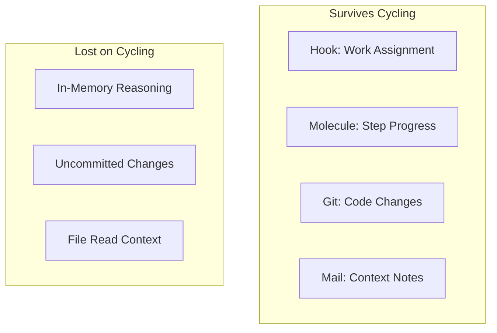
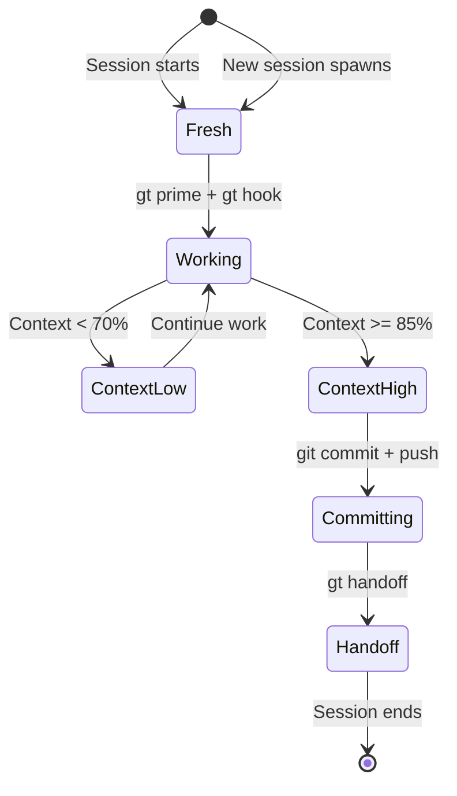
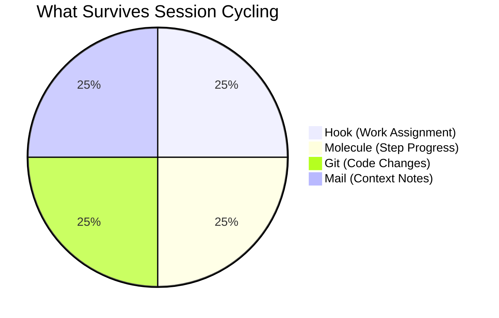
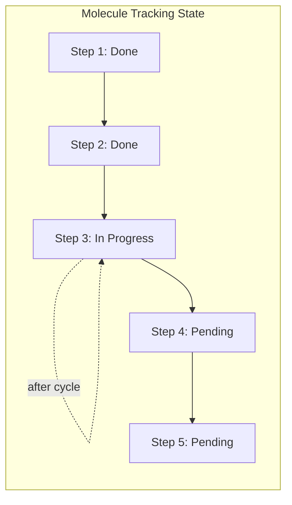
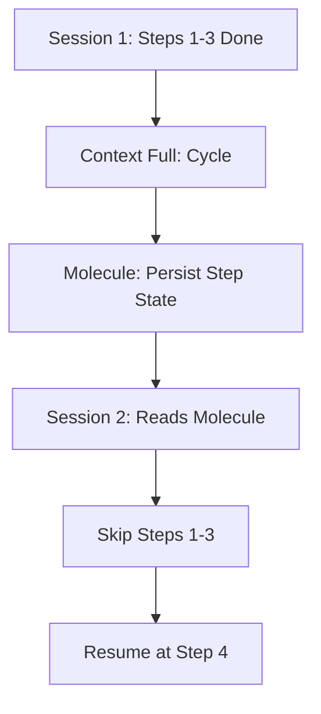
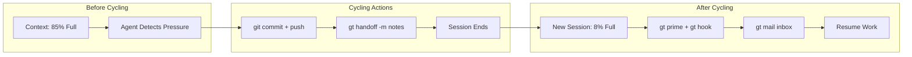

Every AI coding agent has a context window — a limit on how much text it can hold in its working memory. When that window fills up, most AI tools just stop working. Gas Town solves this with session cycling: agents hand off work to fresh sessions automatically, preserving progress across the boundary. This capability is essential for [scaling beyond 30](/blog/scaling-beyond-30) concurrent agents.

<!-- truncate -->

## The Context Problem

Claude Code (and every other LLM-based coding agent) has a finite context window. As an agent works — reading files, writing code, running tests, reasoning about problems — the context fills up. At some point, the agent hits the limit and can't continue.

```text
Session starts:    [=========                          ] 20% full
After reading code: [=====================              ] 45% full
After some work:   [================================   ] 85% full
Context full:      [===================================] 100% → Session must end
```

Without session cycling, all in-progress work context is lost. The agent would need to start from scratch — re-reading files, re-understanding the task, and potentially duplicating work.

## How Session Cycling Works

Gas Town's session cycling protocol (`gt handoff`) preserves work across session boundaries:

### 1. Detect Context Pressure

Agents can detect when their context is getting full. At HIGH context utilization:

```text
Agent detects: Context at 85% → Time to cycle
```

### 2. Commit Progress

Before cycling, the agent commits all in-progress work:

```bash
git add -A
git commit -m "WIP: progress on feature X"
git push
```

### 3. Write Handoff Mail

The agent writes context notes for its successor:

```bash
gt handoff -s "Implementing auth middleware" -m "
Issue: ga-xyz
Branch: polecat/alpha/ga-xyz@mol-abc
Progress: 3 of 5 endpoints protected
Next: Add middleware to /api/users and /api/orders
Note: The JWT library requires v3.x for RS256 support
"
```

### 4. Session Ends, New Session Starts

The old session terminates. A fresh session starts with full context capacity:

```text
New session:    [===                                ] 8% full
```

### 5. Resume from Hook

The new session follows the standard propulsion protocol:

```bash
gt prime          # Load role context
gt hook           # Find the hooked work (still there!)
gt mail inbox     # Read the handoff mail for context
# Resume work immediately
```

The hook persists because it's stored in the filesystem, not in the agent's context. The molecule tracks which step the agent was on. The handoff mail provides context that the previous session had accumulated. For a deeper look at how [crew members](/blog/crew-workflow) use this pattern in long-lived workspaces, see the crew workflow guide.



## What Gets Preserved

| State | How It Survives |
|-------|-----------------|
| Current task assignment | Stored on the hook (filesystem) |
| Workflow progress | Molecule step tracking (beads database) |
| Code changes | Git commits on the branch |
| Context notes | Handoff mail (beads) |
| Branch and worktree | Git worktree (filesystem) |

## What Gets Lost

| State | Why It's Lost | Mitigation |
|-------|---------------|------------|
| In-memory reasoning | Not stored anywhere | Write key insights to handoff mail |
| Uncommitted changes | Only in old session's memory | Always commit before cycling |
| File read context | Previous session's context | New session re-reads as needed |

The most important rule: **commit before you cycle**. Uncommitted code changes are the only real risk of data loss during session cycling.

:::caution Do Not Rely on In-Memory State Across Session Boundaries
Session cycling destroys all in-memory reasoning, variable values, and file contents the agent had loaded. If a piece of information is critical for the next session — such as a specific line number, a configuration quirk, or a workaround for a flaky test — it must be written to the handoff mail or committed to a file. Anything not persisted to disk or the beads database will be lost.
:::

## Who Cycles and When

### Polecats (Ephemeral Workers)

Polecats cycle when their context fills during a task. The [Witness](/docs/agents/witness) monitors polecat session age and can nudge stuck polecats to cycle.

```text
Polecat starts → works → context fills → gt handoff → new session → resumes
```

### Patrol Agents (Witness, Refinery)

Patrol agents cycle on a fixed schedule — typically after N patrol rounds. Since patrol work is repetitive (check health, process queue), context accumulates predictably.

```text
Witness: patrol → patrol → patrol → context HIGH → gt handoff → resume
```

### Town Agents (Mayor, Deacon)

Town-level agents cycle less frequently since they coordinate rather than code. They cycle when context reaches critical levels.

### Crew (Human Workspaces)

Crew workers cycle at their own discretion — when they feel context is getting full, or when finishing a logical chunk of work.

```bash
# Crew member cycles manually
gt handoff -s "Done with auth module" -m "
Completed: All 5 endpoints protected
Filed: ga-xyz follow-up for rate limiting
Tests: All passing
"
```







## The Role of Molecules

Molecules are what make session cycling work for multi-step tasks. For a detailed technical reference on molecule concepts, see the [molecules documentation](/docs/concepts/molecules). Each molecule tracks:



The following diagram illustrates how molecule state enables seamless resumption after session cycling.




- Which steps are complete
- Which step is currently active
- What the next step is

When a new session picks up a molecule, it knows exactly where to resume:

```bash
gt mol status
# Output:
# Molecule: mol-polecat-work (ga-xyz)
#   ✓ step-1: load-context
#   ✓ step-2: implement
#   ● step-3: test          ← current
#   ○ step-4: submit
```

The new session sees "step-3 is in progress" and knows to continue testing, not start over from step-1.

:::danger Force-Terminating a Session Mid-Cycle Risks Uncommitted State Loss
If you manually kill an agent session while it is cycling — using `tmux kill-session` or similar commands — any code changes committed to git survive, but molecule step progress recorded only in memory may be lost. Always let sessions complete their `gt handoff` cycle gracefully, or use `gt polecat nuke` which ensures proper cleanup and molecule state persistence before termination.
:::

:::warning Always Commit Before Cycling
Uncommitted code changes are the single biggest risk during session cycling. When context pressure hits 85%, commit your work-in-progress immediately — even if it is incomplete. A WIP commit on the branch is recoverable; uncommitted changes in a terminated session are gone forever.
:::

:::tip Include "What Didn't Work" in Handoff Mail
The most valuable piece of context for a successor session is not what you accomplished — it can see that from the code and molecule state. What it cannot see is what you tried that failed, which approaches led to dead ends, and which files looked relevant but were not. Including these negative results in your handoff mail prevents the next session from repeating the same mistakes. For more on effective communication patterns between agents, see [agent communication patterns](/blog/agent-communication-patterns).
:::

:::info Molecules Make Multi-Session Tasks Seamless
Without molecules, a cycling agent would need to re-read the entire codebase and rediscover its progress from scratch. Molecules eliminate this overhead by recording exactly which steps are complete, which step is in progress, and what comes next. The new session reads the molecule state in seconds and resumes work immediately, making session boundaries nearly invisible to the overall workflow.
:::



**Write useful handoff mails.** The next session has zero context about your decisions. Include:
- What you tried that didn't work
- Key files and line numbers
- Any discoveries that aren't obvious from the code

**Don't fight the cycle.** When context is HIGH, cycle promptly. Agents that try to squeeze in "one more thing" risk running out of context mid-operation, which can leave messy state.

**Trust the hook.** Your work assignment persists across sessions. You don't need to re-create beads, re-set-up branches, or re-attach molecules. The hook has it all.

:::info Patrol Agents Cycle More Predictably Than Polecats
The Witness and Refinery cycle on a fixed schedule — typically every N patrol rounds — because their work is repetitive and context accumulates in a predictable pattern. Polecats cycle unpredictably based on task complexity and context fill rate. When debugging patrol agent behavior, check the patrol count since the last cycle with `gt agent status <agent-name>` to verify cycling is happening as expected.
:::

:::caution Session Cycling Does Not Reduce Total Token Usage
Cycling to a fresh session resets the context window, allowing the agent to continue working — but the total token count across both sessions is cumulative, not reset. If the first session consumed 50,000 tokens and the second session consumes 30,000 tokens, your bill reflects 80,000 tokens. Session cycling solves the context limit problem but does not reduce API costs; in fact, it may increase costs slightly due to context re-loading overhead.
:::

## Next Steps

- **[Session Cycling](/docs/concepts/session-cycling/)** — Full concept reference
- **[GUPP & NDI](/docs/concepts/gupp/)** — The design principles behind crash-safe progress
- **[Hooks](/docs/concepts/hooks/)** — The persistence primitive that makes cycling work
- **[Understanding GUPP](/blog/understanding-gupp)** — Practical examples of crash-safe design
- **[Hooks: The Persistence Primitive](/blog/hook-persistence)** — How hooks make session cycling crash-safe
- **[The Mail System](/blog/mail-system)** — How handoff mail preserves context across session cycles
- **[Molecules and Formulas](/blog/molecules-and-formulas)** — How molecules track multi-step progress across session boundaries
- **[Refinery Deep Dive](/blog/refinery-deep-dive)** — How the Refinery's patrol cycle interacts with session cycling
- [Compact CLI Reference](/docs/cli-reference/compact) — Commands for manual and automatic context compaction
- [Session Commands CLI Reference](/docs/cli-reference/session-commands) — Commands for session health checks and management
- [Communication CLI Reference](/docs/cli-reference/communication) — Managing handoff mail and agent-to-agent messaging
