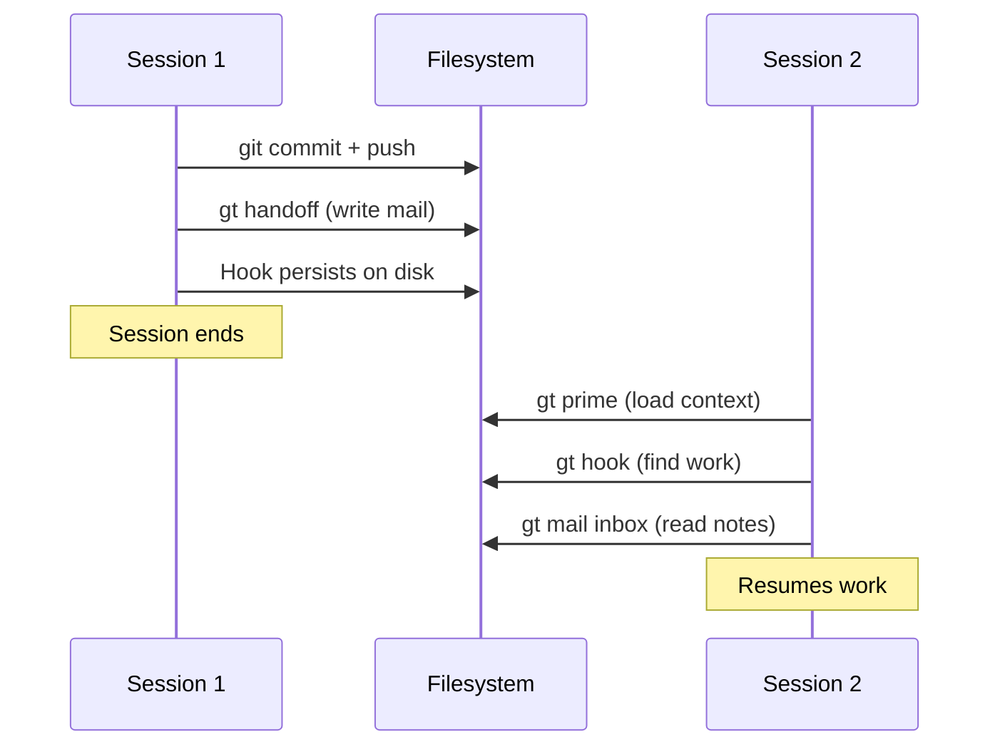
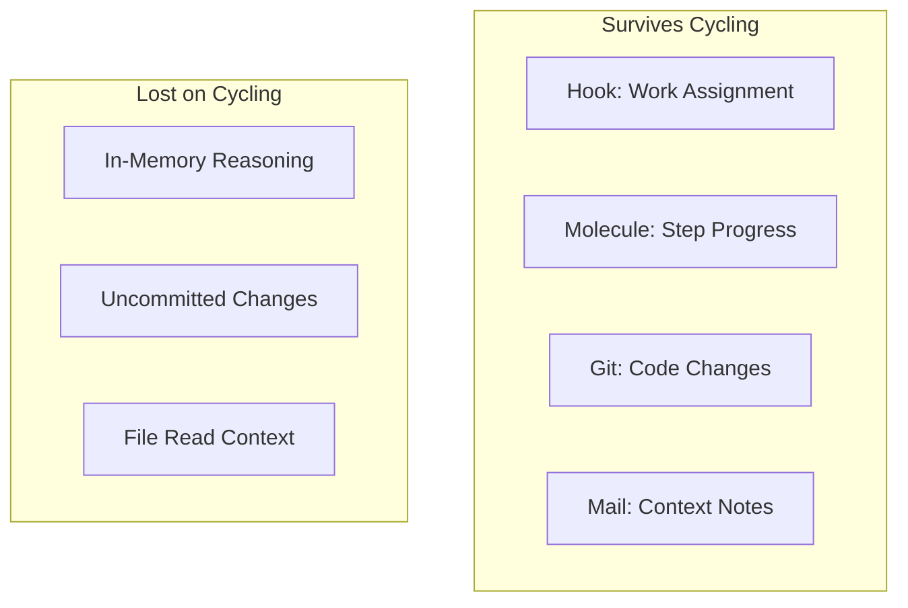

Every AI coding agent has a context window — a limit on how much text it can hold in its working memory. When that window fills up, most AI tools just stop working. Gas Town solves this with session cycling: agents hand off work to fresh sessions automatically, preserving progress across the boundary.

<!-- truncate -->

## The Context Problem

Claude Code (and every other LLM-based coding agent) has a finite context window. As an agent works — reading files, writing code, running tests, reasoning about problems — the context fills up. At some point, the agent hits the limit and can't continue.

```text
Session starts:    [=========                          ] 20% full
After reading code: [=====================              ] 45% full
After some work:   [================================   ] 85% full
Context full:      [===================================] 100% → Session must end
```

Without session cycling, all in-progress work context is lost. The agent would need to start from scratch — re-reading files, re-understanding the task, and potentially duplicating work.

## How Session Cycling Works

Gas Town's session cycling protocol (`gt handoff`) preserves work across session boundaries:

### 1. Detect Context Pressure

Agents can detect when their context is getting full. At HIGH context utilization:

```text
Agent detects: Context at 85% → Time to cycle
```

### 2. Commit Progress

Before cycling, the agent commits all in-progress work:

```bash
git add -A
git commit -m "WIP: progress on feature X"
git push
```

### 3. Write Handoff Mail

The agent writes context notes for its successor:

```bash
gt handoff -s "Implementing auth middleware" -m "
Issue: ga-xyz
Branch: polecat/alpha/ga-xyz@mol-abc
Progress: 3 of 5 endpoints protected
Next: Add middleware to /api/users and /api/orders
Note: The JWT library requires v3.x for RS256 support
"
```

### 4. Session Ends, New Session Starts

The old session terminates. A fresh session starts with full context capacity:

```text
New session:    [===                                ] 8% full
```

### 5. Resume from Hook

The new session follows the standard propulsion protocol:

```bash
gt prime          # Load role context
gt hook           # Find the hooked work (still there!)
gt mail inbox     # Read the handoff mail for context
# Resume work immediately
```

The hook persists because it's stored in the filesystem, not in the agent's context. The molecule tracks which step the agent was on. The handoff mail provides context that the previous session had accumulated.



## What Gets Preserved

| State | How It Survives |
|-------|-----------------|
| Current task assignment | Stored on the hook (filesystem) |
| Workflow progress | Molecule step tracking (beads database) |
| Code changes | Git commits on the branch |
| Context notes | Handoff mail (beads) |
| Branch and worktree | Git worktree (filesystem) |

## What Gets Lost

| State | Why It's Lost | Mitigation |
|-------|---------------|------------|
| In-memory reasoning | Not stored anywhere | Write key insights to handoff mail |
| Uncommitted changes | Only in old session's memory | Always commit before cycling |
| File read context | Previous session's context | New session re-reads as needed |

The most important rule: **commit before you cycle**. Uncommitted code changes are the only real risk of data loss during session cycling.

## Who Cycles and When

### Polecats (Ephemeral Workers)

Polecats cycle when their context fills during a task. The Witness monitors polecat session age and can nudge stuck polecats to cycle.

```text
Polecat starts → works → context fills → gt handoff → new session → resumes
```

### Patrol Agents (Witness, Refinery)

Patrol agents cycle on a fixed schedule — typically after N patrol rounds. Since patrol work is repetitive (check health, process queue), context accumulates predictably.

```text
Witness: patrol → patrol → patrol → context HIGH → gt handoff → resume
```

### Town Agents (Mayor, Deacon)

Town-level agents cycle less frequently since they coordinate rather than code. They cycle when context reaches critical levels.

### Crew (Human Workspaces)

Crew workers cycle at their own discretion — when they feel context is getting full, or when finishing a logical chunk of work.

```bash
# Crew member cycles manually
gt handoff -s "Done with auth module" -m "
Completed: All 5 endpoints protected
Filed: ga-xyz follow-up for rate limiting
Tests: All passing
"
```



## The Role of Molecules

Molecules are what make session cycling work for multi-step tasks. Each molecule tracks:

- Which steps are complete
- Which step is currently active
- What the next step is

When a new session picks up a molecule, it knows exactly where to resume:

```bash
gt mol status
# Output:
# Molecule: mol-polecat-work (ga-xyz)
#   ✓ step-1: load-context
#   ✓ step-2: implement
#   ● step-3: test          ← current
#   ○ step-4: submit
```

The new session sees "step-3 is in progress" and knows to continue testing, not start over from step-1.

:::warning Always Commit Before Cycling
Uncommitted code changes are the single biggest risk during session cycling. When context pressure hits 85%, commit your work-in-progress immediately — even if it is incomplete. A WIP commit on the branch is recoverable; uncommitted changes in a terminated session are gone forever.
:::

## Tips for Effective Cycling

**Commit frequently.** Don't wait until context is full to commit. Small, frequent commits mean less risk of lost work when a session ends unexpectedly.

**Write useful handoff mails.** The next session has zero context about your decisions. Include:
- What you tried that didn't work
- Key files and line numbers
- Any discoveries that aren't obvious from the code

**Don't fight the cycle.** When context is HIGH, cycle promptly. Agents that try to squeeze in "one more thing" risk running out of context mid-operation, which can leave messy state.

**Trust the hook.** Your work assignment persists across sessions. You don't need to re-create beads, re-set-up branches, or re-attach molecules. The hook has it all.

## Next Steps

- **[Session Cycling](/docs/concepts/session-cycling/)** — Full concept reference
- **[GUPP & NDI](/docs/concepts/gupp/)** — The design principles behind crash-safe progress
- **[Hooks](/docs/concepts/hooks/)** — The persistence primitive that makes cycling work
- **[Understanding GUPP](/blog/understanding-gupp)** — Practical examples of crash-safe design
- **[Hooks: The Persistence Primitive](/blog/hook-persistence)** — How hooks make session cycling crash-safe
- **[The Mail System](/blog/mail-system)** — How handoff mail preserves context across session cycles
- [Compact CLI Reference](/docs/cli-reference/compact) — Commands for manual and automatic context compaction
- [Session Commands CLI Reference](/docs/cli-reference/session-commands) — Commands for session health checks and management
