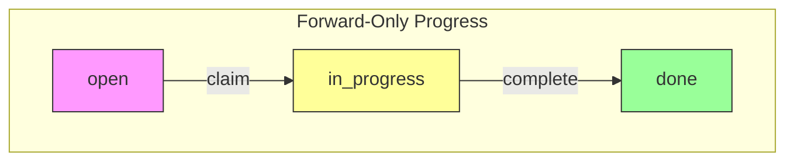
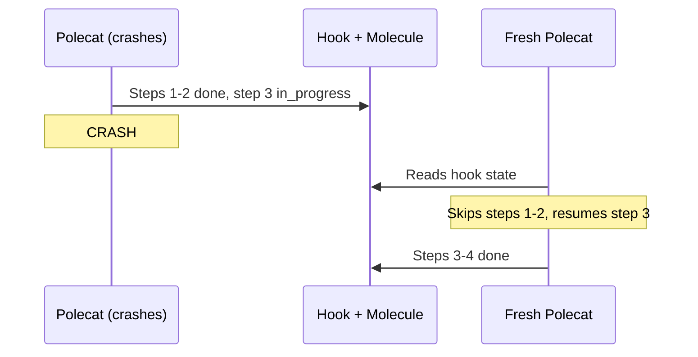
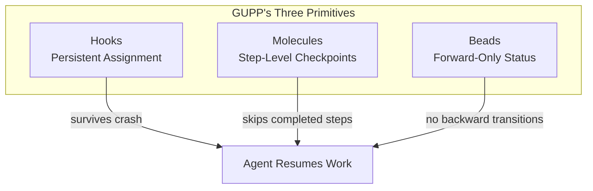
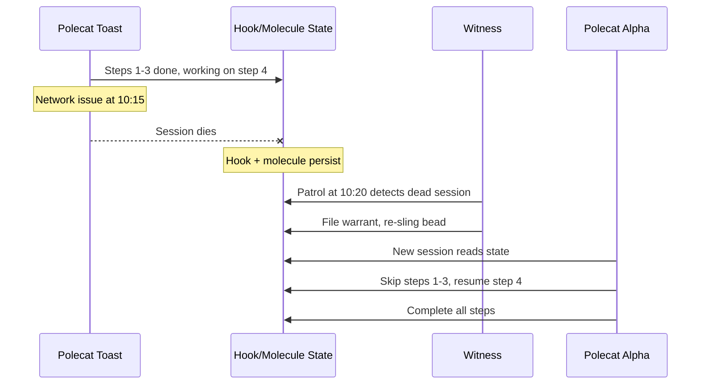
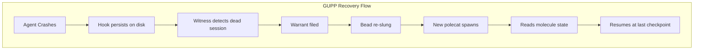
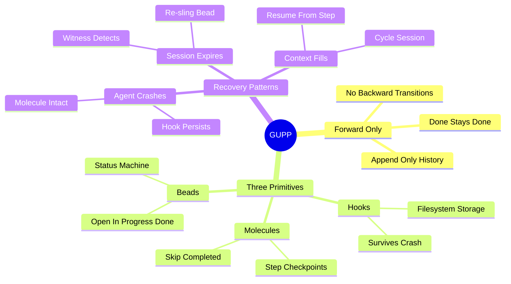

Multi-agent systems are inherently chaotic. Agents crash. Sessions expire. Context windows fill up. Gas Town handles all of this gracefully thanks to one core principle: **GUPP**. This principle is fundamental to [understanding rigs](/blog/understanding-rigs) and their resilience.

<!-- truncate -->

## The Problem: AI Agents Are Fragile

AI coding agents operate in sessions with finite context windows. Any of these can happen at any moment:

- **Context fills up** — the agent loses track of what it was doing
- **Session crashes** — network issue, timeout, or runtime error
- **Agent gets confused** — loops on a failing test, goes down the wrong path
- **Machine restarts** — power loss, OS update, or manual restart

In a traditional single-agent setup, any of these means starting over. In a multi-agent system with 20+ concurrent workers, failures are not exceptions — they're the normal operating condition.

## The Solution: Forward-Only Progress

GUPP (Gas Town Universal Propulsion Principle) states:

> **Every operation must move the system forward or leave it unchanged. No operation should move backward.**

This means:

- **Completed work stays completed.** When a molecule step is marked `done`, it's permanently done. A fresh agent picking up the work skips it.
- **Partial progress is preserved.** If an agent crashes after completing 4 of 9 steps, the next agent starts at step 5.
- **State never goes backward.** Bead statuses progress `open → in_progress → done`. There is no `done → open` transition.

## How It Works: Three Primitives



GUPP is enforced by three concrete mechanisms:

### 1. Hooks (Persistent Assignment)

A [hook](/docs/concepts/hooks) is a pointer from an agent to its current work. Hooks are stored on the filesystem, not in memory. When an agent crashes:

```text
Before crash:  hook → ga-a1b2c (bead assigned to polecat Toast)
After crash:   hook → ga-a1b2c (still there — filesystem survived)
New session:   hook → ga-a1b2c (fresh agent reads it and continues)
```

The hook is why "did the agent finish?" doesn't matter. What matters is: "is the work still on a hook?" If yes, someone will pick it up.

### 2. Molecules (Step-Level Checkpoints)

A [molecule](/docs/concepts/molecules) tracks multi-step workflows as a sequence of individual steps. Each step's completion is persisted to the beads database:

```text
Before crash:
  load-context      [done]
  branch-setup      [done]
  implement         [in_progress]  ← agent was here
  run-tests         [pending]

After restart:
  load-context      [done]        ← skipped
  branch-setup      [done]        ← skipped
  implement         [in_progress] ← resume here
  run-tests         [pending]
```

The fresh agent doesn't redo steps 1-2. It reads the molecule state and picks up from step 3.

### 3. Beads (Forward-Only Status)

[Beads](/docs/concepts/beads) enforce forward-only state progression. There is no API to move a bead from `done` back to `open`. If completed work needs revision, you create a new bead — you don't reopen the old one.

This prevents a class of bugs where agents fight over state: Agent A closes a bead, Agent B reopens it, Agent A closes it again, and so on.

:::warning Create Follow-Up Beads Instead of Reopening Closed Work
When you discover that a completed bead needs additional work — such as an edge case that was missed or a new requirement — create a fresh bead with `bd create` that references the original. Never attempt to reopen the closed bead by editing the database directly. This preserves GUPP's forward-only guarantee and maintains a clear audit trail of what was done when.
:::



## Agent States and GUPP Behavior

| Agent State | How Detected | GUPP Behavior | Recovery Action |
|---|---|---|---|
| **Idle** | No bead on hook; agent session is alive | No forward progress needed — agent is available for new work | Witness may assign queued beads via `gt sling`, or the agent waits for the next assignment |
| **Working** | Bead on hook; molecule steps advancing; session alive | Forward progress is actively happening — completed steps are checkpointed to the database | None required; the supervision tree monitors progress passively |
| **Stalled** | Bead on hook; no molecule step progress for multiple patrol cycles; session alive | GUPP guarantees completed steps are preserved even though the agent is stuck | Witness files a warrant, terminates the stalled session, and re-slings the bead so a fresh polecat resumes from the last checkpoint |
| **Cycling** | Agent context window fills up; agent initiates a voluntary session handoff | GUPP ensures all completed molecule steps survive the context refresh; new session reads hook and resumes | Agent writes a handoff summary, session ends, fresh session starts and picks up from the current in-progress step automatically |
| **Dead** | Bead on hook; tmux session no longer exists (crash, timeout, or machine restart) | Hook and molecule state persist on disk and in the database — no work is lost | Witness detects the missing session on its next patrol, files a warrant, and re-slings the bead to a new polecat |



:::info Forward-Only Status Prevents Agent State Conflicts
The reason beads enforce forward-only transitions is not just about crash recovery — it also eliminates a class of coordination bugs. In systems where agents can reopen closed work, two agents may race to claim the same reopened bead, duplicating effort and producing conflicting code. By making `done` permanent, Gas Town guarantees that each unit of work is completed exactly once.
:::

## NDI: The Practical Companion

GUPP has a companion principle: **Nondeterministic Idempotence (NDI)**. It acknowledges that AI agents are nondeterministic — ask Claude to implement the same feature twice and you'll get different code.

NDI says: **that's fine.** What matters is the end state (tests pass, feature works), not the exact implementation. A fresh agent may solve the same step differently than the crashed agent would have, and that's acceptable.

```text
Crashed agent would have used:  Joi validation library
Fresh agent actually uses:      Zod validation library
Both produce:                   Valid input validation with passing tests ✓
```

## GUPP in Practice: A Recovery Walkthrough

Let's trace a real failure-recovery sequence to see GUPP in action:



The following timeline shows how GUPP enables automatic recovery from an agent crash.

```mermaid
timeline
    title GUPP Recovery Timeline
    section Agent Crash
        10:00 : Polecat toast starts work
        10:15 : Network issue kills session
    section Persistence
        10:15 : Hook persists on disk
        10:15 : Molecule state in DB intact
    section Recovery
        10:20 : Witness detects dead session
        10:20 : Warrant filed, bead re-slung
        10:21 : New polecat alpha spawns
        10:21 : Skips completed steps, resumes
    section Completion
        10:35 : Alpha completes work
        10:36 : Refinery merges to main
```


```text
10:00  Polecat "toast" starts working on ga-xyz (molecule step: implement)
10:15  Network issue kills the tmux session
10:15  Hook state on disk: ga-xyz still attached
10:15  Molecule state in DB: steps 1-3 done, step 4 in_progress
10:20  Witness patrol detects toast is dead (session gone)
10:20  Witness files warrant for toast, re-slings ga-xyz to the rig
10:21  New polecat "alpha" spawns, finds ga-xyz on hook
10:21  Alpha reads molecule: skips steps 1-3, resumes step 4
10:35  Alpha completes all steps, runs gt done
10:36  Refinery merges to main
```

No human involvement. No lost work. The 15-minute gap was the only cost — and that's just the Witness patrol interval. The key moments are at 10:15 (hook and molecule state survive the crash) and 10:21 (fresh agent skips completed steps).



## What This Means For You

As a Gas Town user, GUPP means:

- **Don't worry about crashes.** They're handled automatically.
- **Don't manually restart failed work.** The Witness detects zombies and the system re-slings the work. For more on how work is distributed and recovered, see [work distribution patterns](/blog/work-distribution-patterns).
- **Don't babysit polecats.** The supervision tree (Witness → Deacon → Mayor) handles recovery at every level. When escalation is needed, the [escalation system](/blog/escalation-system) routes issues to the appropriate handler.
- **Trust the hook.** If work is on a hook, it will get done — eventually.

:::note The Supervision Gap After a Witness Crash Is Bounded by Deacon Patrol Interval
When a Witness session crashes, there is a brief period when stalled polecats in that rig will not be detected or nudged — but this gap never exceeds one Deacon patrol cycle. The Deacon detects the missing Witness during its next patrol and restarts it, restoring supervision. For production-critical rigs, keep the Deacon patrol interval short to minimize this supervision gap.
:::

:::note GUPP applies to you too
GUPP isn't just for polecats. When you're a crew worker and your session crashes, your hook still has your molecule attached. Run `gt prime` in your next session and you'll pick up right where you left off. The principle is universal across all Gas Town agent types.
:::

:::warning Do Not Manually Revert Bead Status
GUPP enforces forward-only state transitions for a reason: reverting a bead from `done` back to `open` can cause race conditions where multiple agents fight over the same work. If completed work needs revision, create a new bead that references the original. Never edit the beads database directly to change a bead's status backward — use `bd create` to file follow-up work instead.
:::

:::tip Test GUPP Recovery by Simulating Failures Early
When setting up a new rig, deliberately kill a polecat session mid-task with `gt polecat nuke` and verify that the hook persists, the molecule state is intact, and a fresh polecat resumes from the correct step. Running this exercise early builds confidence that your rig's GUPP guarantees work in practice — not just in theory — and helps you identify any configuration issues before they surface during real production work.
:::



:::danger NDI Does Not Mean "Anything Goes"
Nondeterministic Idempotence allows different agents to solve the same step differently — but the end state must still satisfy the acceptance criteria. If two agents produce conflicting implementations that both pass local tests but break when integrated, NDI has not been violated; your task decomposition or test coverage has. NDI is about tolerating implementation variance, not excusing sloppy task definitions or missing validation steps.
:::

## Further Reading

- **[GUPP & NDI](/docs/concepts/gupp)** — Full technical reference
- **[Design Principles](/docs/architecture/design-principles)** — All twelve principles including GUPP
- **[Agent Hierarchy](/docs/architecture/agent-hierarchy)** — The supervision tree that enforces recovery
- **[Hooks](/docs/concepts/hooks)** — The persistence primitive that makes GUPP possible
- **[Hooks: The Persistence Primitive](/blog/hook-persistence)** — How hooks implement GUPP's crash-safety guarantee
- **[Session Cycling Explained](/blog/session-cycling)** — How GUPP applies to context refresh and handoffs
- **[Common Pitfalls](/blog/common-pitfalls)** — Mistakes that happen when teams skip GUPP principles
- **[Why Beads?](/blog/why-beads)** — How beads enforce forward-only state transitions, a key GUPP mechanism
- **[Lifecycle Management](/blog/lifecycle-management)** — How GUPP guarantees apply to rig lifecycle transitions
- [Sessions CLI Reference](/docs/cli-reference/sessions) — Commands for session lifecycle and molecule management
