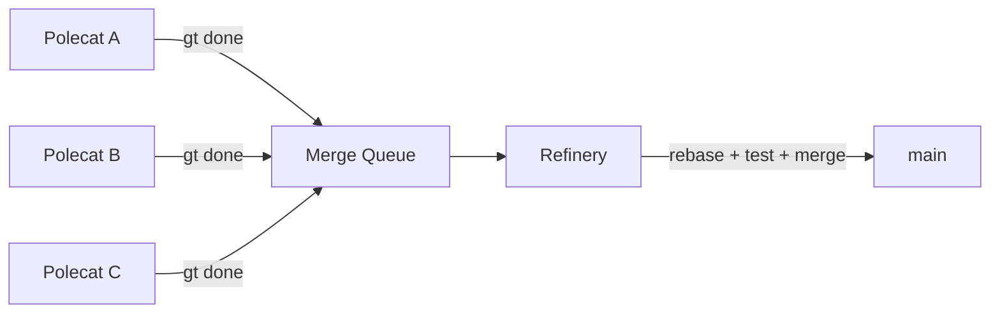
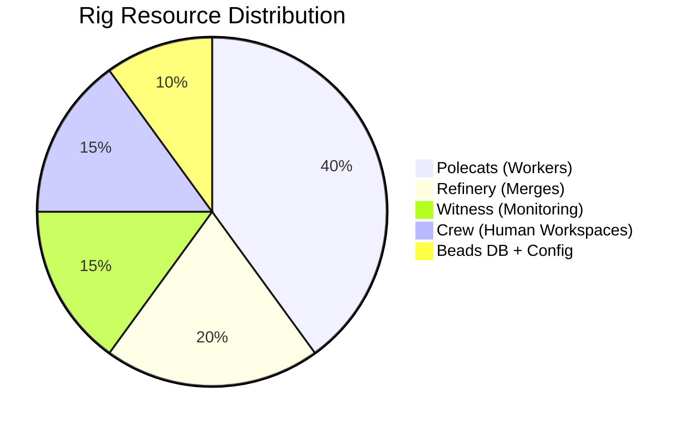
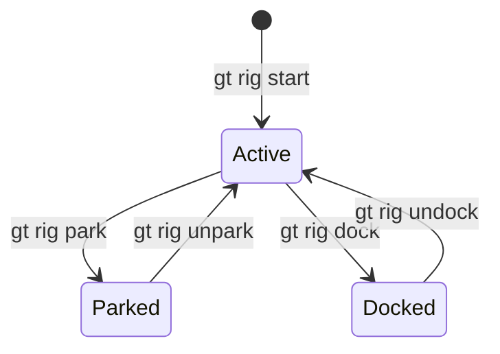
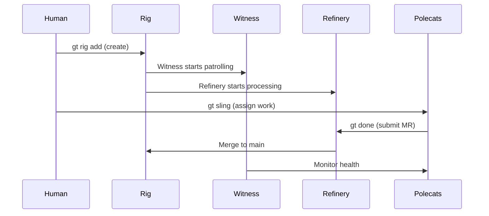

Everything in Gas Town revolves around rigs. A rig wraps a git repository with the full agent infrastructure — Witness, Refinery, polecats, crew workspaces, and a beads database. Understanding when to create rigs, how to manage their lifecycle, and how they interact with each other is fundamental to running Gas Town effectively.

<!-- truncate -->

## What a Rig Actually Contains

When you run `gt rig add myproject git@github.com:you/repo.git`, Gas Town creates a directory structure that gives every agent its own isolated workspace:

```text
~/gt/myproject/
├── .beads/            # Issue tracking database
├── config.json        # Rig configuration
├── refinery/rig/      # Canonical main clone (merge operations happen here)
├── crew/              # Human developer workspaces
│   └── dave/          # Dave's persistent clone
├── witness/           # Witness agent state
├── polecats/          # Ephemeral worker sandboxes
│   ├── toast/         # Polecat "toast" worktree
│   └── alpha/         # Polecat "alpha" worktree
└── plugins/           # Rig-level plugins
```

The key insight: **each agent gets its own git worktree**. Polecats never share a working directory with each other or with crew. This eliminates the class of bugs where two agents edit the same file simultaneously — each agent operates on its own copy of the codebase.

## The Rig's Two Persistent Agents

Every active rig has two long-running agents:

### Witness (The Pit Boss)

The Witness monitors polecat health. It runs a patrol molecule in a loop, checking each polecat's status:

- Is the polecat still running?
- Has it been idle too long?
- Did it crash without calling `gt done`?

When something is wrong, the Witness nudges the polecat, escalates to the Mayor, or nukes the sandbox and respawns the work.

### Refinery (The Merge Queue)

The Refinery serializes all merges to main. Even though polecats work in parallel, the Refinery processes their branches one at a time:



Each branch is rebased onto the latest main, validated (tests must pass), and fast-forward merged. This guarantees a clean, linear history where every commit on main is verified.

## Rig Lifecycle States

Rigs have three operational states, and choosing the right one matters:

| State | When to Use | What Happens |
|-------|-------------|--------------|
| **Active** | Normal development | All agents running, polecats spawned for new work |
| **Parked** | Taking a break, will resume soon | Agents idle, no new polecats, state preserved |
| **Docked** | Project on hold indefinitely | Fully shut down, Deacon skips health checks |

```bash
# Normal operation
gt rig start myproject

# Taking a lunch break / focusing on another rig
gt rig park myproject
gt rig unpark myproject      # Resume when ready

# Project going on hold for weeks
gt rig dock myproject
gt rig undock myproject      # Bring it back later
```

The distinction between parked and docked is important. **Parked** means the Daemon knows the rig exists and will include it in status reports — it's just temporarily inactive. **Docked** means the Daemon pretends the rig doesn't exist. Use parking for hours or days; use docking for weeks or longer.

## When to Create a New Rig

**Create a rig when:** The project has its own git repository and would benefit from its own agent infrastructure.

Good rig candidates:
- A web application with its own CI/CD pipeline
- A library that other projects depend on
- A documentation site (like this one!)
- A microservice with independent deployment

**Don't create a rig when:**
- The project is a subdirectory of a monorepo (monorepos are one rig)
- It's a temporary experiment (use a plain git clone)
- The project is tightly coupled to another and they share a repo

The rule of thumb: **one git repo = one rig**.



## Multi-Rig Coordination

Most Gas Town deployments run 2-5 rigs. Coordinating work across rigs uses three mechanisms:

### Cross-Rig Beads

Beads use prefix-based routing. Each rig has its own prefix (e.g., `gt-` for the main project, `bd-` for beads, `ga-` for docs). When you reference a bead from another rig, the prefix routes it correctly:

```bash
bd show gt-abc12    # Routes to the myproject rig's beads
bd show bd-def34    # Routes to the beads rig's beads
```

### Cross-Rig Convoys

Convoys can include beads from multiple rigs, enabling coordinated work across projects:

```bash
gt convoy create "Auth Upgrade" gt-auth1 gt-auth2 bd-tracking
```

### Cross-Rig Worktrees

When a crew member needs to fix something in another rig, `gt worktree` creates an isolated workspace:

```bash
gt worktree beads    # Creates ~/gt/beads/crew/myproject-dave/
# Work directly in the other rig's codebase
# Submit when done — your identity is preserved
```





## Practical Tips

:::tip
**Start with one rig.** Get comfortable with the workflow before adding more. Each rig adds agent overhead (Witness + Refinery), so only create rigs for projects that genuinely need autonomous agent management.
:::

:::tip
**Park rigs you're not actively using.** If you're focused on one project for the day, park the others. This reduces agent activity and saves compute costs.
:::

:::warning
**Don't forget docked rigs.** When a docked rig is undocked weeks later, its main branch may be far behind remote. Run `git pull` in the refinery clone before starting agents.
:::

:::tip
**Monitor rig health with `gt rig status`.** This shows active polecats, merge queue depth, and agent health at a glance. Run it regularly when managing multiple rigs.
:::

## Next Steps

- [Rigs Reference](/docs/concepts/rigs) — Full reference with all commands and configuration options
- [Rig Management CLI](/docs/cli-reference/rigs) — Commands for adding, starting, stopping, parking, and docking rigs
- [Witness Agent](/docs/agents/witness) — The per-rig health monitor that watches polecats
- [Refinery Agent](/docs/agents/refinery) — The per-rig merge queue that serializes polecat work to main
- [Scaling Beyond 30 Agents](/blog/scaling-beyond-30) — How to partition rigs for large deployments
- [Your First Convoy](/blog/first-convoy) — End-to-end walkthrough of creating work in a rig
- [Gas Town's Security Model](/blog/security-model) — How rig isolation provides security boundaries
- [Lifecycle Management](/blog/lifecycle-management) — Managing rig lifecycle states and transitions at scale
