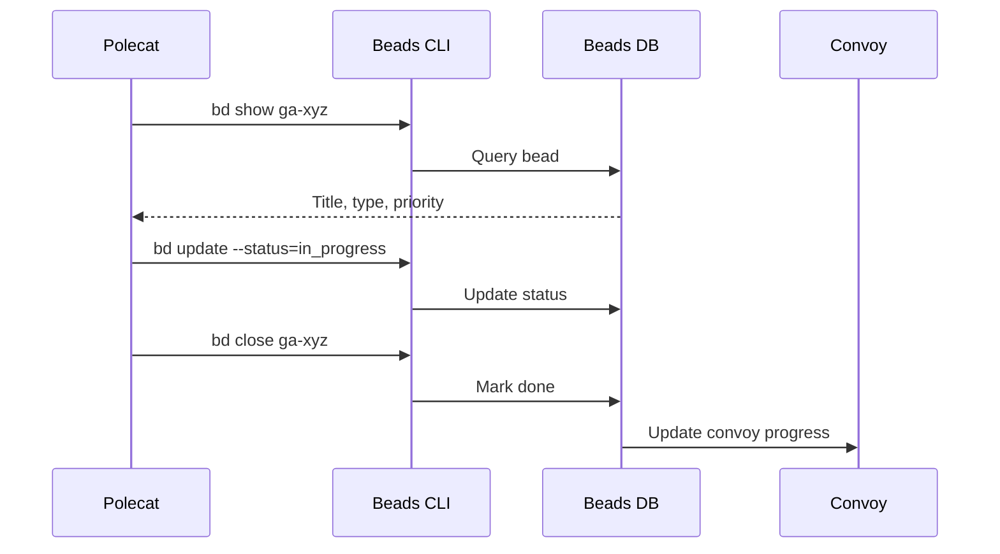
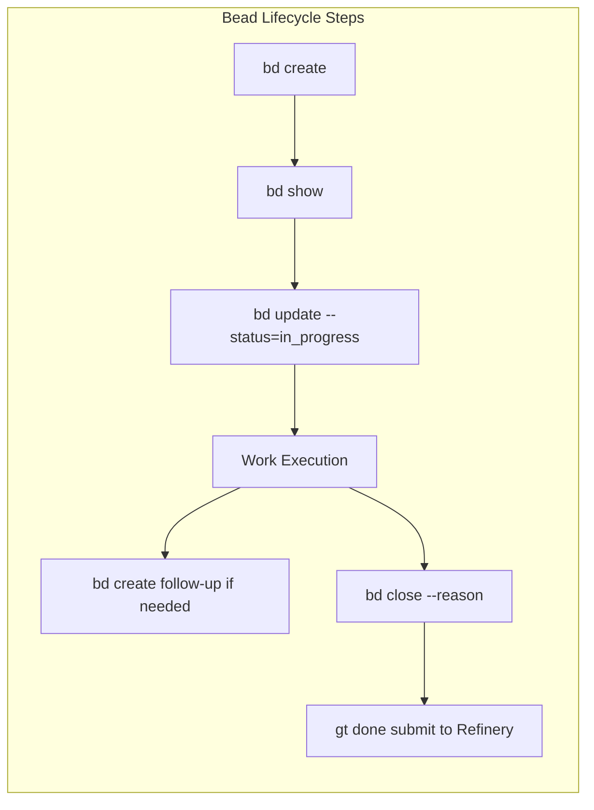
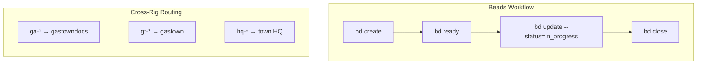
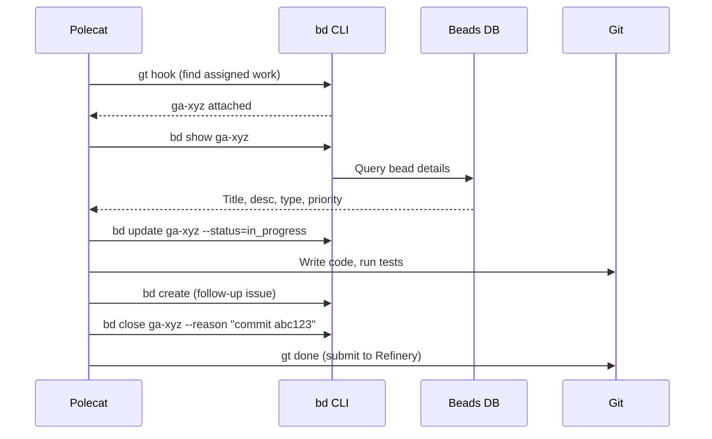
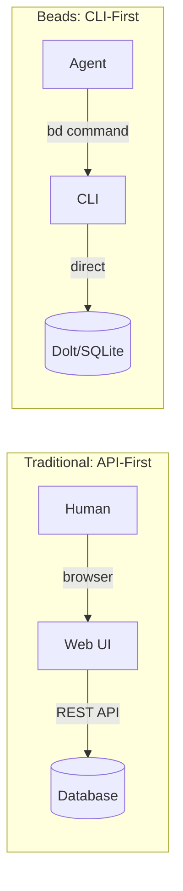
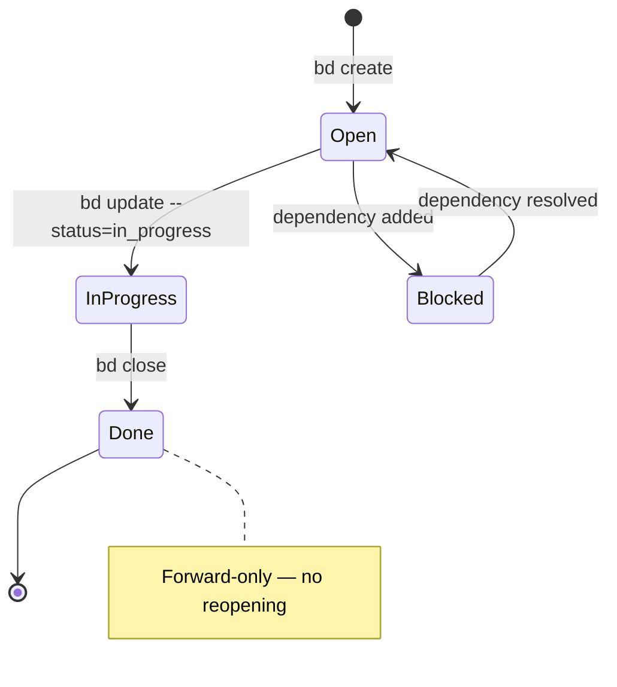

Every project management tool assumes a human is driving. Jira has dashboards designed for people to click through. GitHub Issues has a web UI built for browser interactions. Linear optimizes for keyboard-driven humans. None of them are designed for an AI agent that works through a terminal.

That's why Gas Town has Beads.

<!-- truncate -->

## The Problem with Existing Trackers

AI coding agents like Claude Code work through the command line. When an agent needs to check its assignments, update progress, or create follow-up tasks, it needs to do that through CLI commands — not API calls to external services.

Here's what using GitHub Issues from an agent looks like:

```bash
# Check assignments (requires gh CLI + authentication + parsing JSON)
gh issue list --assignee @me --json number,title,state | jq '.[] | select(.state == "OPEN")'

# Update status (no native "in progress" state)
gh issue comment 42 --body "Starting work on this issue"

# Create follow-up (need to format markdown, add labels manually)
gh issue create --title "Follow-up: handle edge case" --body "..." --label "task"
```

Now here's the same workflow with Beads:

```bash
# Check assignments
bd ready

# Update status
bd update ga-abc --status=in_progress

# Create follow-up
bd create "Handle edge case" -t task
```

The difference isn't just fewer keystrokes. Beads is designed around how agents actually work.

## What Makes Beads Different

### 1. CLI-First, Not API-First

Beads has no web UI, no REST API, and no dashboard. Everything happens through the `bd` command. This is intentional — AI agents work through terminals, and every layer of abstraction between the agent and its data creates latency and failure modes.

```bash
bd create "Fix login timeout" -t bug -p 1     # Create
bd show ga-xyz                                  # Read
bd update ga-xyz --status=in_progress           # Update
bd close ga-xyz --reason "Fixed in commit abc"  # Close
```

### 2. Git-Backed Storage

Beads stores everything in a local SQLite database that syncs through Dolt (a git-compatible database). This means:

- **No external dependencies.** No Jira server to go down, no API rate limits, no network latency.
- **Works offline.** Agents can create and update beads without network access.
- **Auditable history.** Every change is tracked, just like git commits.
- **Cross-rig routing.** Beads IDs include rig prefixes, so `bd show ga-xyz` routes to the right database automatically.

For complete `bd` command syntax and options, see the [work CLI reference](/docs/cli-reference/work).



### 3. Built-in Dependencies

Traditional trackers bolt on dependency tracking as an afterthought. In Beads, dependencies are a core primitive:

```bash
# Create tasks with dependencies
bd create "Add auth middleware" -t task      # → ga-001
bd create "Protect API endpoints" -t task    # → ga-002
bd dep add ga-002 ga-001                     # ga-002 needs ga-001

# Only show unblocked work
bd ready                                      # Only shows ga-001
```

This matters because Gas Town uses dependencies to sequence agent work. The Mayor won't sling `ga-002` until `ga-001` has merged. For more on how the Mayor orchestrates work distribution, see [the mayor workflow](/blog/mayor-workflow).

### 4. Types and Priorities

Beads has a simple, agent-friendly taxonomy:

**Types:**
| Type | Meaning |
|------|---------|
| `task` | New feature or enhancement |
| `bug` | Something broken |
| `spike` | Research or investigation |
| `chore` | Maintenance or cleanup |

**Priorities:**
| Priority | Meaning | Escalation |
|----------|---------|------------|
| P0 | Critical | Routes to SMS |
| P1 | High | Immediate attention |
| P2 | Medium | Normal queue |
| P3 | Low | When convenient |

Agents use these to make autonomous decisions. A polecat that discovers a P0 bug during feature work knows to escalate immediately.

:::danger Never Edit the Beads SQLite Database Directly
The beads database is managed by the `bd` CLI and synced through Dolt. Editing the SQLite file directly — with tools like `sqlite3` or DB Browser — bypasses validation, breaks sync history, and can corrupt the forward-only state guarantees that GUPP depends on. Always use `bd` commands to create, update, and close beads.
:::



```text
ga-*    → gastowndocs rig
gt-*    → gastown rig
bd-*    → beads rig
hq-*    → town-level coordination
```

The `bd` command routes automatically based on prefix:

```bash
bd show ga-xyz    # Routes to gastowndocs beads
bd show gt-abc    # Routes to gastown beads
bd show hq-def    # Routes to town beads
```

This means agents can reference and update beads from any rig without knowing the physical database location. The [GUPP protocol](/docs/concepts/gupp) ensures that bead state transitions are forward-only, preventing agents from reopening or reverting completed work.



## The Agent Workflow

Here's how a typical polecat uses Beads during a work session:

The following diagram illustrates the complete lifecycle of a bead from creation to closure.




```bash
# 1. Check hook for assigned work
gt hook                       # Returns: ga-xyz attached

# 2. Read the assignment
bd show ga-xyz                # Title, description, type, priority

# 3. Claim it
bd update ga-xyz --status=in_progress

# 4. Do the work...
# (write code, run tests, etc.)

# 5. Discover a follow-up issue
bd create "Edge case: empty input not handled" -t bug -p 2

# 6. Close the original issue
bd close ga-xyz --reason "Implemented in commit abc123"

# 7. Submit to merge queue
gt done
```

Every step is a single CLI command. No context switching, no web browsers, no JSON parsing.

:::tip Always Include the Commit Hash When Closing Beads
When you run `bd close ga-xyz --reason "..."`, include the actual git commit hash or PR number in the reason field. This creates a bidirectional link between the issue tracker and the code change, making it trivial to trace from a bead to the exact commit that resolved it — critical for debugging regressions months later.
:::



## Beads vs Traditional Trackers

| Feature | Beads | GitHub Issues | Jira | Linear |
|---------|:-----:|:------------:|:----:|:------:|
| CLI-first | Yes | Partial (gh) | No | Partial |
| Works offline | Yes | No | No | No |
| Git-backed | Yes | No | No | No |
| Built-in dependencies | Yes | No | Yes | Yes |
| Cross-rig routing | Yes | N/A | N/A | N/A |
| Agent-optimized | Yes | No | No | No |
| Web UI | No | Yes | Yes | Yes |
| Human dashboards | No | Yes | Yes | Yes |

Beads deliberately trades human-friendly features (dashboards, drag-and-drop boards, rich text formatting) for agent-friendly features (CLI speed, offline operation, automatic routing).

:::note Beads Complements Your Existing Tracker — It Does Not Replace It
Beads is the agent-facing execution layer, not a full project management tool. Keep using Jira, Linear, or GitHub Issues for human workflows like sprint planning, stakeholder reporting, and non-technical tickets. The Mayor can bridge the gap by reading from external trackers and creating beads for the work Gas Town needs to execute.
:::

:::tip Use `bd ready` as Your Primary Work Queue
Instead of scanning `bd list` and filtering manually, use `bd ready` as your go-to command for finding actionable work. It automatically filters out blocked beads, closed beads, and beads already assigned to other agents — showing only work that can be started right now. This is the same view the Mayor and Witness use when deciding what to sling next.
:::

:::warning Keep Bead Descriptions Concise and Unambiguous
A bead's description is the primary instruction a polecat reads when starting work. Vague descriptions like "fix the auth bug" force the agent to guess which bug, which file, and what the expected behavior should be — often leading to wasted context and incorrect fixes. Include the specific file or module, the observed vs. expected behavior, and any relevant error messages. Two precise sentences beat two vague paragraphs.
:::



## When You Still Need a Traditional Tracker

Beads doesn't replace your project management tool for human workflows:

- **Sprint planning** — Use your existing tool for human planning meetings
- **Stakeholder reporting** — Dashboards and burndown charts require a web UI
- **Non-technical tickets** — Customer support, design requests, etc.

The recommended pattern is to use your traditional tracker for human-facing project management and Beads for the agent-facing execution layer. The Mayor can read from external trackers and create beads for the work Gas Town needs to execute.

:::info Beads Sync Through Dolt, Not Real-Time Replication
The beads database uses Dolt for git-style versioned storage, which means changes propagate through explicit sync operations — not automatically in real time. If you create a bead on rig A and immediately query it from rig B, you may not see it until the next Dolt sync cycle completes. For cross-rig coordination, expect a sync latency of 30-60 seconds depending on your Dolt configuration. This is a deliberate trade-off for offline capability and auditability.
:::

## Next Steps

- **[Beads Concept Page](/docs/concepts/beads/)** — Full technical reference
- **[Work Management CLI](/docs/cli-reference/work/)** — Complete `bd` command reference
- **[Convoys](/docs/concepts/convoys)** — How beads are grouped into tracked batches
- **[Mayor Agent](/docs/agents/mayor)** — The orchestrator that creates, prioritizes, and distributes beads to agents
- **[Your First Convoy](/blog/first-convoy)** — See beads in action during a real workflow
- **[The Mayor Workflow](/blog/mayor-workflow)** — How the Mayor creates and manages beads
- **[Why Git Worktrees?](/blog/git-worktrees)** — The isolation strategy that makes beads-driven work safe
- **[Work Distribution Patterns](/blog/work-distribution-patterns)** — How beads flow through manual convoys, the Mayor, and formulas
