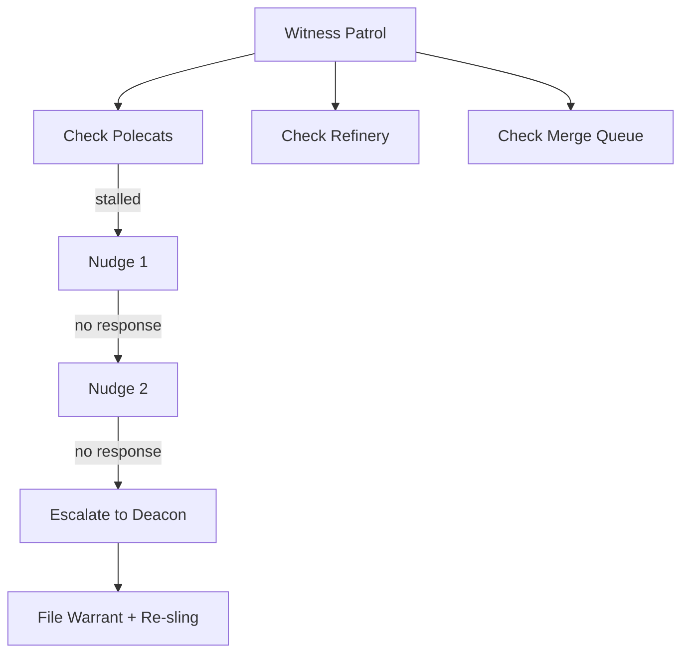
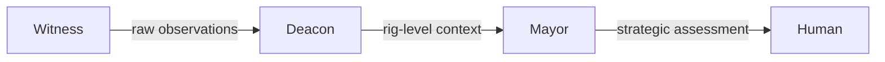

When you run 10 polecats in parallel, things go wrong. Agents get stuck in loops, context fills up without cycling, merge requests stall, and sessions crash. The Witness is Gas Town's answer to this chaos — a per-rig watchdog that patrols its agents and triggers recovery before you even notice a problem.

<!-- truncate -->

## What Does the Witness Do?

The Witness is a persistent agent assigned to each rig. Every 5 minutes (by default), it runs a patrol — a systematic check of everything in its rig:

```text
Patrol Cycle:
  1. Check all polecat sessions → alive? stuck? context full?
  2. Check Refinery → processing? stalled?
  3. Check merge queue → growing? blocked?
  4. Check convoy progress → any stranded?
  5. Report findings → nudge, escalate, or log
```

Think of the Witness as a shift supervisor walking the factory floor. It doesn't do the work — it makes sure the workers are doing the work.



## Detecting Stalled Polecats

The most common problem the Witness catches is a stalled polecat — an agent that stops making progress.

### How Stalls Are Detected

The Witness checks several signals:

| Signal | What It Means |
|--------|---------------|
| Session age exceeds threshold | Polecat may have forgotten to cycle |
| No git commits in N minutes | Polecat isn't producing output |
| Same molecule step for too long | Polecat is stuck on one task |
| Session is dead/disconnected | Polecat crashed |

### The Recovery Sequence

When a stall is detected, the Witness follows a graduated response:

```text
1. Nudge: "Hey, are you stuck? Check gt hook."
   → If polecat responds and resumes → Done

2. Second nudge: "Still no progress. Status?"
   → If polecat responds → Done

3. Escalate to Deacon: "Polecat alpha is unresponsive."
   → Deacon may file a warrant (termination order)
   → Work gets re-slung to a new polecat
```

The Witness always tries the least disruptive action first. A nudge often works — the agent was just confused, and the nudge reorients it.

## Monitoring the Refinery

The Witness also watches the rig's Refinery (merge queue processor):

- **Is the Refinery session alive?** Dead sessions mean no merges are processing.
- **Is the queue growing?** A queue that only grows suggests the Refinery is stuck or validation is failing.
- **Are MRs timing out?** Long-running validations may indicate infrastructure problems.

If the Refinery is stuck, the Witness nudges it. If that doesn't work, it escalates to the Deacon, who can restart the Refinery session.

## The Patrol Molecule

The Witness itself runs a molecule — `mol-witness-patrol`. This formula defines the steps of each patrol:

```text
Step 1: Process inbox (check for mail from Deacon, polecats)
Step 2: Check all polecat sessions
Step 3: Check Refinery health
Step 4: Check merge queue status
Step 5: Check convoy progress
Step 6: Report status to Deacon
Step 7: Check own context → cycle if needed
```

Because the Witness uses a molecule, its patrol state survives crashes. If the Witness itself goes down mid-patrol, it picks up where it left off.

## Witness Configuration

Key configuration options for tuning Witness behavior:

```bash
# Patrol frequency (default: 300 seconds / 5 minutes)
gt rig config myproject witness.patrol_interval 300

# Stall detection threshold (seconds without progress)
gt rig config myproject witness.stall_threshold 600

# Max nudges before escalating
gt rig config myproject witness.max_nudges 2
```

### Tuning Guidelines

| Setting | Lower Value | Higher Value |
|---------|-------------|--------------|
| Patrol interval | Faster detection, higher token cost | Slower detection, lower cost |
| Stall threshold | More false positives (healthy agents flagged) | Real stalls take longer to catch |
| Max nudges | Faster escalation to Deacon | More chances for agents to self-recover |

For most setups, the defaults work well. Decrease the stall threshold if your tasks are time-sensitive; increase it if your tasks naturally involve long computation periods.

## What the Witness Does NOT Do

Understanding the Witness's scope helps avoid confusion:

| Not the Witness's Job | Whose Job |
|----------------------|-----------|
| Assign work to polecats | Mayor |
| Merge code to main | Refinery |
| Monitor other rigs | Deacon |
| Make strategic decisions | Mayor |
| Fix broken code | Polecats |

The Witness is purely a health monitor. It observes and reports. It can nudge agents back on track, but it never takes direct action on code or work items.



## The Escalation Flow

When the Witness escalates, the information flows upward:

```text
Witness → Deacon: "Polecat alpha in rig myproject is stalled.
  Session age: 45 min. No commits in 30 min.
  Nudged twice, no response."

Deacon → (evaluates): Is this a pattern? Other rigs affected?
  → Files warrant for polecat termination
  → Re-slings the work to a new polecat

Deacon → Mayor (if needed): "Rig myproject having recurring stalls.
  3 polecats stalled in the last hour."

Mayor → Human (if needed): "Something is wrong with myproject.
  Possible infrastructure issue or bad task decomposition."
```

Each level adds context and makes higher-level decisions. The Witness provides raw observations; the Deacon provides rig-level context; the Mayor provides strategic assessment.

:::tip Tune the Stall Threshold to Match Your Workload
The default stall threshold (600 seconds without progress) works well for typical coding tasks, but if your agents handle long-running computations or large test suites, increase it to avoid false positives. Conversely, for time-sensitive hotfix rigs, lower the threshold so stalls are caught faster. Check `gt rig config <rig> witness.stall_threshold` to see your current setting.
:::

:::warning Do Not Lower the Stall Threshold Below 120 Seconds
Setting the stall threshold too low causes the Witness to flag healthy polecats as stalled — especially agents that are reading large files, running test suites, or waiting for CI results. False-positive stall detections trigger unnecessary nudges and escalations, which waste tokens and can interrupt agents mid-work. Keep the threshold at 120 seconds or above to avoid this churn.
:::

## Observing the Witness

You can monitor the Witness's activity:

```bash
# Check Witness status
gt rig status myproject

# Watch Witness patrol activity
gt feed --rig myproject | grep -i witness

# Attach to Witness session (read-only)
gt witness attach myproject
```

The Witness logs its patrol findings, so you can review what it detected during its last patrol cycle.

## Next Steps

- **[Witness Agent Reference](/docs/agents/witness/)** — Full technical reference
- **[Escalation System](/docs/operations/escalations/)** — How escalations flow through the hierarchy
- **[Monitoring Guide](/docs/operations/monitoring)** — Operational monitoring for Gas Town deployments
- **[Monitoring Your Fleet](/blog/monitoring-fleet)** — Practical monitoring guide
- **[Incident Response](/blog/incident-response)** — What to do when the Witness escalates to you
- **[The Escalation System](/blog/escalation-system)** — How escalations from the Witness get routed and resolved
- **[Death Warrants](/blog/death-warrants)** — How the Witness files warrants to safely terminate unresponsive agents
- [Polecat CLI Reference](/docs/cli-reference/polecat-commands) — Commands for managing polecat lifecycle and worktrees
