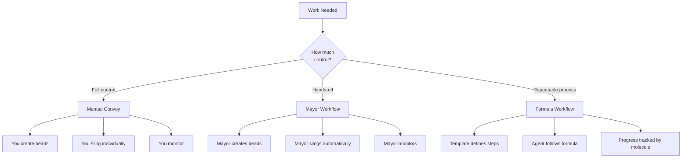
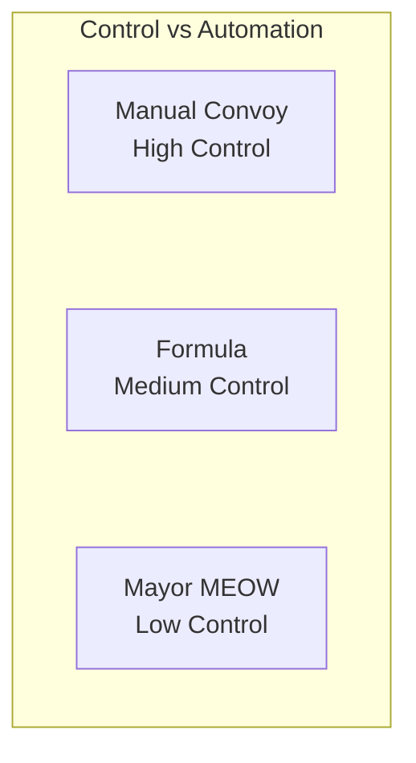
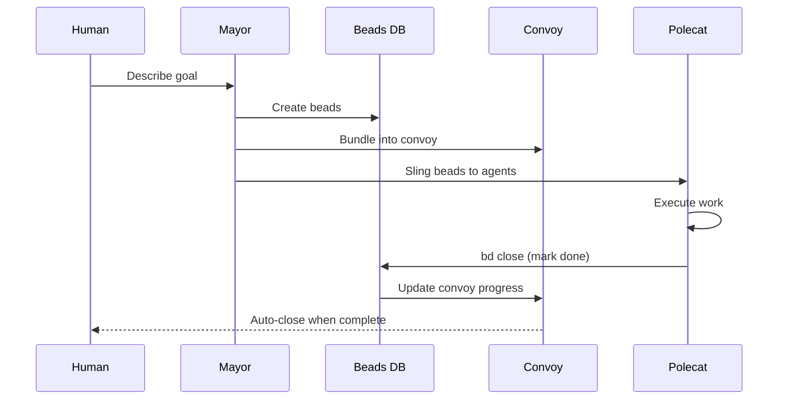
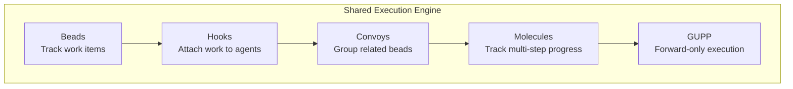

Gas Town offers three distinct ways to distribute work across agents: manual convoys, the Mayor workflow (MEOW), and formula-driven molecules. Each pattern trades control for automation differently. Choosing the wrong one costs time. Choosing the right one feels like magic.

<!-- truncate -->

## The Three Patterns

Before diving into when to use each, here's what they are:

**Manual Convoy** — You create beads, bundle them in a convoy, sling each one individually, and monitor progress. Maximum control, maximum effort.

**Mayor Workflow (MEOW)** — You describe what you want in natural language. The Mayor creates beads, creates a convoy, slings work, and monitors everything. Minimum effort, less control.

**Formula Workflow** — You apply a pre-built TOML template that defines the steps. The formula becomes a live molecule that guides execution. Repeatable, structured, consistent.



## When to Use Manual Convoys

Manual convoys are the right choice when:

- **You know exactly what the tasks are** and how to decompose them
- **Dependencies matter** — you need precise control over which task blocks which
- **Cross-rig coordination** requires human judgment about which rig handles what
- **Security-sensitive work** where you want to review each assignment before it happens
- **Learning Gas Town** — manual mode teaches you how the system works

### The Workflow

```bash
# 1. Create beads for each piece of work
bd create --title "Fix SQL injection in login" --type bug --priority 1
bd create --title "Add input validation" --type task --priority 2

# 2. Bundle them in a convoy
gt convoy create "Auth Hardening" gt-a1 gt-b2

# 3. Sling each to the right agent/rig
gt sling gt-a1 backend
gt sling gt-b2 backend

# 4. Monitor
gt convoy show hq-cv-001
```

**Overhead**: High. You're doing the Mayor's job manually.
**Control**: Complete. Every decision is yours.

## When to Use the Mayor Workflow

MEOW is the right choice when:

- **You have a fuzzy goal** and want the Mayor to decompose it into tasks
- **Multi-rig work** where the Mayor can route beads to appropriate rigs
- **Speed matters more than precision** — you want work started in minutes, not after careful planning
- **You trust the system** and don't need to review every assignment
- **Large batches** with 5+ tasks where manual management becomes tedious

### The Workflow

```bash
# 1. Attach to the Mayor
gt mayor attach

# 2. Describe what you want in natural language
> Fix the 5 failing tests in auth, add rate limiting to the login endpoint,
> and update the API docs with the new rate limit headers.

# 3. Mayor creates beads, convoy, and slings automatically

# 4. Monitor from the side
gt convoy list
gt feed
```



**Overhead**: Minimal. You describe, the Mayor executes.
**Control**: Low. The Mayor makes decomposition and routing decisions.

## When to Use Formulas

Formulas are the right choice when:

- **The process is repeatable** — code review, release prep, security audit
- **Consistency matters** — every instance should follow the same steps
- **The steps are well-defined** but the content varies (different features, different PRs)
- **You want a template** that any agent can follow without special instructions
- **Multi-dimension analysis** — convoy formulas split work across perspectives (correctness, security, performance)

### The Workflow

```bash
# 1. Browse available formulas
gt formula list

# 2. Run a formula with variables
gt formula run shiny --var feature="Add notification system"

# 3. The molecule guides execution step by step
gt mol status
gt mol progress <mol-id>

# 4. Agent advances through steps
gt mol step done
```

**Overhead**: Low (after formula creation). Running a formula is one command.
**Control**: Medium. The template defines the process; the agent has freedom within each step.

## Decision Framework

Use this matrix when choosing:

| Factor | Manual Convoy | Mayor (MEOW) | Formula |
|--------|:---:|:---:|:---:|
| Decomposition effort | You | Mayor | Template |
| Routing decisions | You | Mayor | Template/You |
| Process consistency | Variable | Variable | High |
| Setup time | High | Low | Low (once created) |
| Learning curve | Low | Low | Medium |
| Best for one-off work | Yes | Yes | No |
| Best for repeated work | No | No | Yes |
| Cross-rig support | Manual | Automatic | Template-defined |

### Quick Decision Tree

1. **Is this a repeatable process?** (code review, release, audit) → **Formula**
2. **Can you describe it in one paragraph?** → **Mayor (MEOW)**
3. **Do you need precise control over every assignment?** → **Manual Convoy**
4. **Not sure?** → Start with **Mayor**. Fall back to **Manual Convoy** if the Mayor's decomposition doesn't match your intent.

:::tip When in Doubt, Start with the Mayor
If you are unsure which work distribution pattern to use, start with the Mayor workflow (MEOW). You can always inspect the beads and convoy it creates, then manually re-sling or override individual assignments. This gives you the speed of automation with a fallback to manual control if the decomposition does not match your intent.
:::

:::warning Avoid Using Formulas for One-Off Work
Formulas are designed for repeatable processes — code review, release prep, security audits. Using a formula for one-off feature work adds template overhead without payoff, and the rigid step structure can actually slow agents down when the task does not follow a predictable pattern. Use a manual convoy or the Mayor for ad-hoc work, and reserve formulas for workflows you will run more than three times.
:::

:::note You Can Switch Patterns Mid-Convoy
If you start with the Mayor workflow and realize the decomposition does not match your needs, you can take over mid-flight. Use `gt release` to pull beads back from agents, adjust descriptions or dependencies with `bd update` and `bd dep add`, and re-sling manually. The convoy continues tracking all beads regardless of how they were dispatched, so switching from automated to manual control is seamless.
:::

:::danger Do Not Sling the Same Bead to Multiple Rigs Simultaneously
Each bead should be assigned to exactly one rig at a time. Slinging the same bead to two rigs creates a race condition where both rigs produce competing implementations, and whichever merges second will likely hit a rebase conflict. If you need parallel work on related functionality across rigs, create separate beads for each rig with explicit dependencies between them.
:::

## Combining Patterns

The patterns aren't mutually exclusive. Advanced operators often combine them:

- **Mayor + Manual Override**: Let the Mayor decompose and create the convoy, then manually re-sling specific beads to different targets
- **Formula + Convoy**: Use a convoy formula that spawns parallel legs, each following a structured template
- **Manual + Formula**: Create beads manually, then apply a formula to each one for structured execution

```bash
# Let Mayor decompose, then override one assignment
gt mayor attach
> "Fix auth bugs and add rate limiting"
# Mayor creates convoy with 3 beads
gt release gt-b2                    # Pull one bead back
gt sling gt-b2 security-team-rig    # Re-route to security experts
```





## The Work Distribution Architecture

All three patterns ultimately use the same underlying machinery:

1. **Beads** track the work
2. **Hooks** attach work to agents
3. **Convoys** group related beads
4. **Molecules** (for formulas) track multi-step progress
5. **GUPP** ensures agents execute immediately when work appears

The pattern you choose only affects who does the decomposition and routing. The execution engine is identical.

## Next Steps

- [Work Distribution Architecture](/docs/architecture/work-distribution) — The underlying machinery all patterns share
- [Manual Convoy Workflow](/docs/workflows/manual-convoy) — Detailed manual convoy guide
- [Mayor Workflow (MEOW)](/docs/workflows/mayor-workflow) — Full MEOW documentation
- [Formula Workflow](/docs/workflows/formula-workflow) — Creating and using formulas
- [Mastering gt sling](/blog/mastering-gt-sling) — The command that powers all work assignment
- [Understanding Rigs](/blog/understanding-rigs) — How rigs organize the agents that receive work
- [Advanced Convoy Patterns](/blog/advanced-convoy-patterns) — Complex orchestration patterns for manual convoys
- [The Mayor Workflow](/blog/mayor-workflow) — Deep dive into the Mayor's automated decomposition and dispatch
