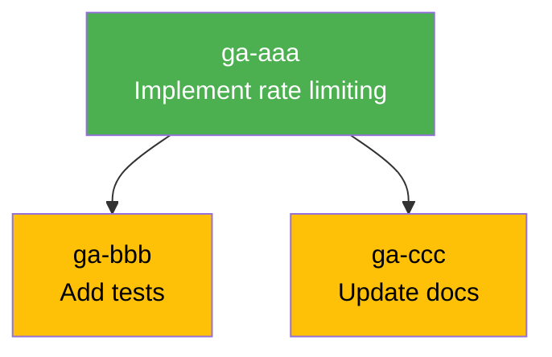
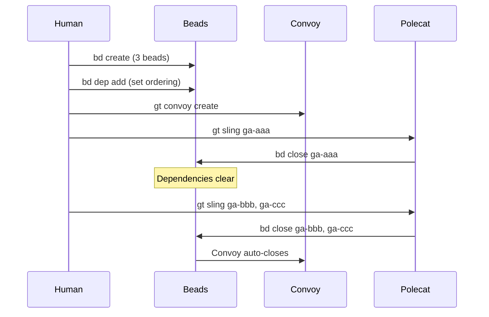
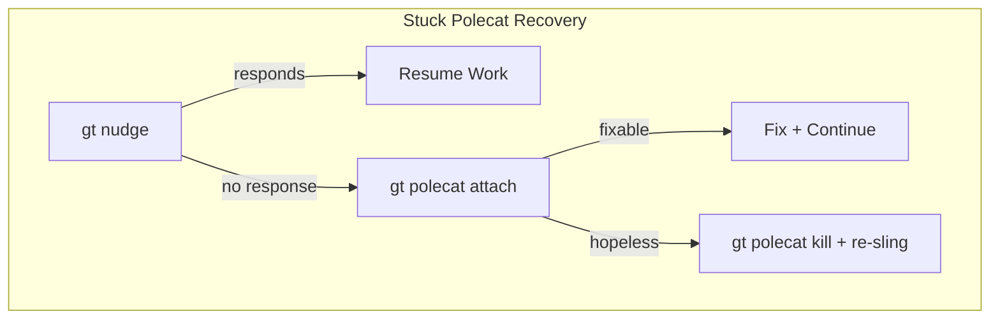
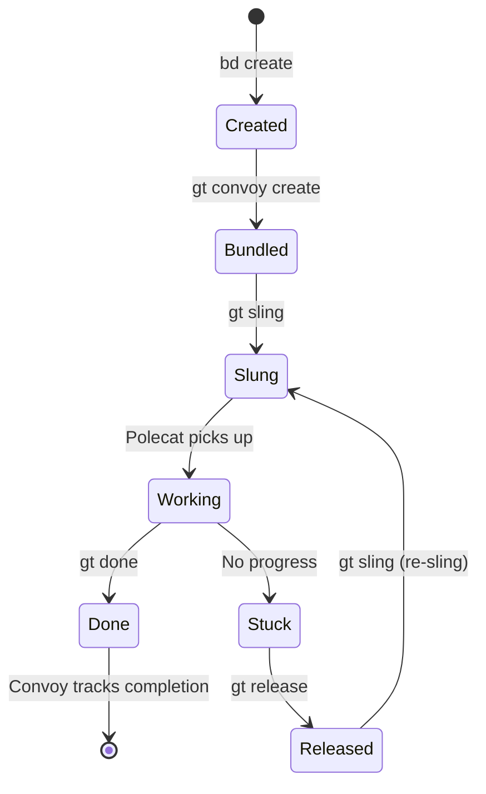

Your [first convoy](/blog/first-convoy) was three independent beads slung to one rig. Everything worked because nothing depended on anything else. Real work is messier. Your second convoy will teach you dependencies, cross-rig coordination, monitoring, and what to do when things go wrong.

<!-- truncate -->

## What Changes After "Hello World"

The first convoy tutorial teaches the mechanics: create beads, bundle, sling, monitor. But it sidesteps the hard parts:

- What if task B depends on task A finishing first?
- What if work spans multiple rigs?
- What if a polecat gets stuck?
- How do you handle a convoy that's half-done and half-broken?

These are the patterns that separate a Gas Town beginner from a productive operator.

## Pattern 1: Dependencies Between Beads

Real work has ordering constraints. You can't write tests before the feature exists. You can't update docs before the API is finalized.

```bash
# Create beads with an implicit dependency
bd create --title "Implement rate limiting middleware" --type task --priority 1
# → ga-aaa

bd create --title "Add rate limit tests" --type task --priority 2
# → ga-bbb

bd create --title "Document rate limit headers" --type task --priority 2
# → ga-ccc

# Set dependencies: tests and docs block on implementation
bd dep add ga-bbb ga-aaa   # ga-bbb needs ga-aaa
bd dep add ga-ccc ga-aaa   # ga-ccc needs ga-aaa
```

Now bundle and sling:

```bash
gt convoy create "Rate Limiting" ga-aaa ga-bbb ga-ccc
gt sling ga-aaa myproject
```

Only sling `ga-aaa` initially. The other beads are blocked. When the implementation polecat finishes and `ga-aaa` closes, the dependencies clear:

```bash
# After ga-aaa completes, check what's unblocked
bd ready
# → ga-bbb: Add rate limit tests (no blockers)
# → ga-ccc: Document rate limit headers (no blockers)

# Now sling the unblocked work
gt sling ga-bbb myproject
gt sling ga-ccc myproject
```



The [Witness](/docs/agents/witness) can also auto-sling unblocked beads if configured to do so.



## Pattern 2: Cross-Rig Work

Some convoys span multiple projects. A frontend change might depend on a backend API update:

```bash
# Create beads for different rigs
bd create --title "Add /api/notifications endpoint" --type task
# → ga-ddd (for the backend rig)

bd create --title "Build notification bell component" --type task
# → ga-eee (for the frontend rig)

# Set cross-rig dependency
bd dep add ga-eee ga-ddd   # frontend needs backend API

# Bundle and sling to different rigs
gt convoy create "Notifications" ga-ddd ga-eee
gt sling ga-ddd backend
# Wait for backend to finish, then:
gt sling ga-eee frontend
```

Cross-rig convoys work exactly like single-rig convoys — the dependency system doesn't care which rig a bead is assigned to. The convoy tracks completion across all rigs.

## Pattern 3: Monitoring a Running Convoy

With 5+ polecats working, you need to know what's happening:

```bash
# Overview of all convoys
gt convoy list

# Detailed view of one convoy
gt convoy show hq-cv-042

# Live activity feed across all rigs
gt feed

# Check individual polecat status
gt polecat list --rig myproject
```

Key signals to watch for:

| Signal | Meaning | Action |
|---|---|---|
| Polecat status: `working` | Normal operation | None |
| Polecat status: `idle` | Finished or stuck | Check if bead is closed |
| Convoy progress: `3/5` | Three beads done | Check remaining two |
| Stranded beads | Unassigned work | `gt sling` the stranded beads |

```bash
# Find beads that fell through the cracks
gt convoy stranded
```



## Pattern 4: Handling Stuck Polecats

Polecats get stuck. Tests fail. Dependencies are missing. Context windows fill up. Here's the recovery playbook:

### Nudge First

Sometimes a polecat just needs a push:

```bash
gt nudge myproject/polecats/toast "Status update? Are you blocked?"
```

### Check Its Work

Attach to the polecat's session to see what it's doing:

```bash
gt polecat attach toast --rig myproject
```

### Re-Sling the Work

If the polecat is truly stuck, release the bead and re-sling:

```bash
gt release ga-aaa               # Release bead from stuck polecat
gt sling ga-aaa myproject       # Fresh polecat picks it up
```

### Nuclear Option

If the polecat is a zombie consuming resources:

```bash
gt polecat nuke myproject/toast  # Terminate and clean up
```

The bead returns to `pending` status. Sling it again to a fresh polecat.

:::note The Witness Can Auto-Sling Unblocked Beads for You
If you configure auto-slinging on your rig, the Witness will detect when a dependency clears and automatically sling the unblocked bead to an available polecat. This eliminates the need to manually watch for completed dependencies and run `gt sling` yourself. Enable it with `gt rig config <rig> witness.auto_sling true` — but note that it removes your ability to review each assignment before dispatch.
:::

## Pattern 5: Growing a Convoy Mid-Flight

Requirements change. You discover additional work halfway through a convoy:

```bash
# Add a new bead to an existing convoy
bd create --title "Fix edge case in rate limiter" --type bug --priority 1
# → ga-fff

gt convoy add hq-cv-042 ga-fff
gt sling ga-fff myproject
```

The convoy's completion criteria automatically expands. It won't auto-close until all beads (including the new one) are done.

:::tip Decompose Aggressively — Five Small Beads Beat Two Large Ones
Small, focused beads finish faster, parallelize better, conflict less during merging, and are far easier to re-sling when a polecat gets stuck. If a bead description takes more than a short paragraph, it is probably too big. Split it before slinging.
:::

:::warning Do Not Sling Dependent Beads Before Their Blockers Complete
Slinging a bead that still has unresolved dependencies will assign it to a polecat that cannot make progress — the agent will stall waiting for prerequisite code that has not landed on main yet. Always check `bd ready` before slinging to confirm a bead's dependencies have cleared. If you sling prematurely, the Witness will eventually detect the stall, but you will have wasted a polecat session and its token budget.
:::

:::info Use `gt convoy show` to Spot Stranded Beads Early
A stranded bead is one that belongs to a convoy but has not been slung to any agent — it sits in the ready queue with no polecat assigned. This commonly happens when a dependency clears and you forget to sling the unblocked work. Running `gt convoy show <id>` after each bead completes helps you catch stranded beads immediately, so your convoy does not stall waiting for work that nobody has picked up.
:::



## Lessons from Second Convoys

**Decompose aggressively.** Five small beads are better than two large ones. Small beads finish faster, parallelize better, and are easier to re-sling when something goes wrong.

**Set dependencies explicitly.** Don't rely on polecats to figure out ordering. Use `bd dep add` to make the dependency graph explicit.

**Monitor actively.** Check `gt convoy show` every few minutes during active convoys. Catch stuck polecats early before they waste context.

**Don't over-sling.** Slinging 10 beads simultaneously to one rig creates resource contention. Start with 3-5 parallel polecats and scale up as needed.

**Use the Mayor for complex convoys.** If you're managing more than 5 beads with cross-rig dependencies, consider the [Mayor workflow](/docs/workflows/mayor-workflow) instead. Let the Mayor handle decomposition and routing.

## Next Steps

- [Manual Convoy Workflow](/docs/workflows/manual-convoy) — Full reference for convoy creation and management
- [Work Distribution Architecture](/docs/architecture/work-distribution) — How work flows through the dependency system
- [Troubleshooting](/docs/operations/troubleshooting) — Common polecat issues and recovery procedures
- [Your First Convoy](/blog/first-convoy) — Review the basics if needed
- [Work Distribution Patterns](/blog/work-distribution-patterns) — When to use manual convoys vs. Mayor vs. formulas
- [Monitoring Your Fleet](/blog/monitoring-fleet) — Practical monitoring techniques for running convoys
