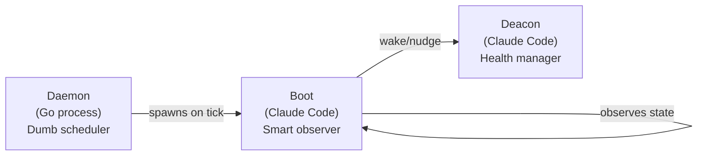
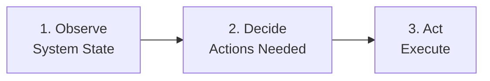
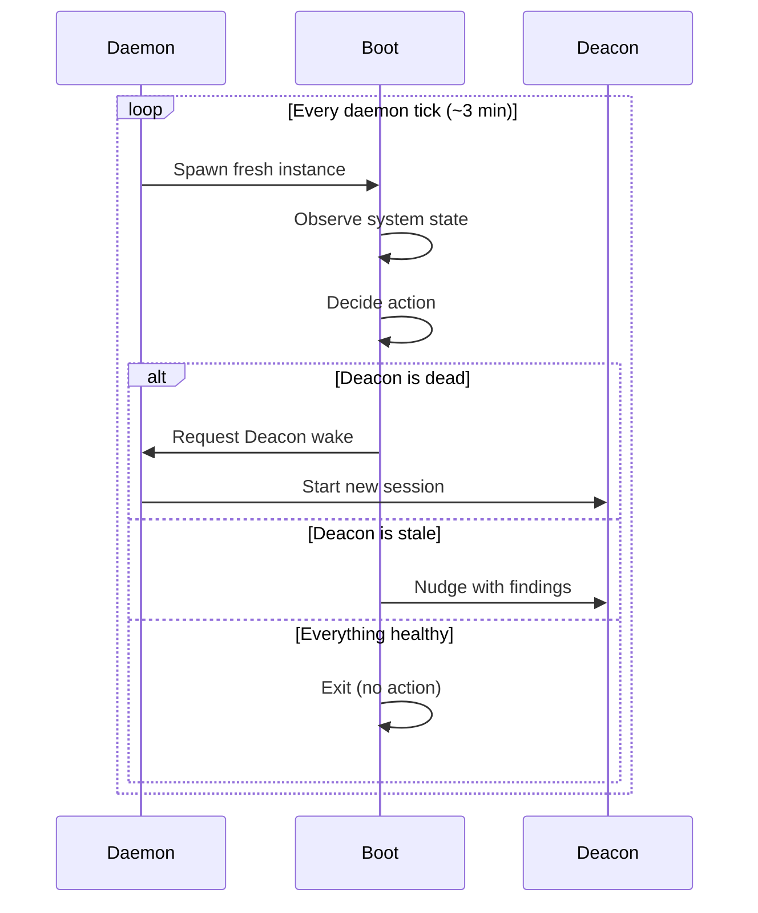

# Boot -- Daemon Watchdog Dog

> Boot is the first responder. It runs fresh on every daemon tick, takes a snapshot of the world, and decides whether the Deacon needs waking or nudging.

---

## Overview

Boot is a special-purpose Dog that runs fresh on each daemon tick. Unlike persistent agents that maintain long-running sessions, Boot starts clean every time, observes the current system state, decides what actions are needed, and either wakes the Deacon or nudges it with findings. Boot is the bridge between the "dumb" Daemon (a Go process that just sends heartbeats) and the "smart" Deacon (a Claude Code agent that makes health decisions).

Boot ensures the Deacon is awake and informed, even after crashes, restarts, or extended downtime.

## Key Characteristics

| Property | Value |
|----------|-------|
| **Scope** | Town-level |
| **Lifecycle** | Per-tick (fresh each run) |
| **Instance count** | 1 |
| **Session type** | Short-lived, clean start |
| **Patrol cycle** | Each daemon tick (~3 min) |
| **Location** | `~/gt/deacon/dogs/boot/` |
| **Git identity** | No |
| **Mailbox** | No |

## Why Boot Exists

The Daemon is intentionally simple -- a Go process that sends heartbeats and processes lifecycle requests. It does not understand agent health, work state, or system topology. But it needs to know whether the Deacon (which does understand these things) is alive and responsive.

Boot fills this gap:



Without Boot, the Daemon would have to contain logic for understanding agent state -- violating the "dumb scheduler, smart agents" design principle.

## The Triage Cycle

Boot follows a strict three-phase triage cycle on every run:



### Phase 1: Observe

Boot surveys the current system state:

- **Deacon status**: Is the Deacon session alive? When did it last respond?
- **Witness inventory**: How many Witnesses should exist? How many are running?
- **Polecat census**: Are there active polecats? Any obvious zombies?
- **Queue state**: Is the merge queue backed up?
- **Disk health**: Is disk space critically low?
- **Stale hooks**: Are there hooks with no active agent?

### Phase 2: Decide

Based on observations, Boot decides the appropriate action:

| Observation | Decision |
|-------------|----------|
| Deacon is dead | Wake (start new session) |
| Deacon is alive but stale | Nudge with findings |
| Deacon is healthy and recent | No action needed |
| Critical issues found | Nudge with priority findings |
| Everything healthy | No action needed |

### Phase 3: Act

Boot executes its decision:

- **Wake**: Start a new Deacon session via the Daemon
- **Nudge**: Send findings to the Deacon's session
- **No action**: Exit cleanly

## Boot vs Deacon

| Property | Boot | Deacon |
|----------|------|--------|
| **Runs** | Fresh each tick | Persistent session |
| **Observes** | System snapshot | Ongoing monitoring |
| **Decides** | Wake/nudge Deacon | Health actions for all agents |
| **Acts on** | Deacon only | Witnesses, Dogs, escalations |
| **Has state** | None (fresh each run) | Full patrol state |
| **Intelligence** | Triage only | Full health management |

Think of Boot as the alarm clock and the Deacon as the person who gets up and handles the day.

## Fresh Start Advantage

Because Boot starts clean every time, it has unique advantages:

1. **No stale state** -- Boot never carries over corrupted state from a previous run
2. **Crash-proof** -- If Boot crashes, the next tick spawns a fresh instance
3. **Unbiased observation** -- Every run sees the system as it actually is, not as it was
4. **Low resource cost** -- Short-lived sessions use minimal resources

## Location

Boot lives within the Deacon's dog directory:

```text
~/gt/deacon/dogs/boot/
├── CLAUDE.md          # Boot agent context and instructions
├── last-run.json      # Timestamp and results of last run
└── triage-log.jsonl   # History of triage decisions
```

## Timing

Boot runs on the daemon's tick cycle:

```text
Daemon tick (every ~3 min)
  → Spawn Boot
  → Boot observes, decides, acts
  → Boot exits
  → (wait for next tick)
  → Spawn Boot again (fresh)
```

The Boot run typically completes in seconds -- it is designed for rapid triage, not deep analysis.

## Interaction Diagram



## Tips and Best Practices

:::tip[Check Boot Logs for Triage History]

The triage log at `~/gt/deacon/dogs/boot/triage-log.jsonl` provides a timeline of Boot's observations and decisions. This is valuable for diagnosing intermittent issues.

:::

:::tip[Boot Runs Are Fast]

If Boot is taking a long time, something may be wrong with the system state it is trying to observe. Check disk space and agent session states manually.

:::

:::info[Boot Cannot Fix Problems]

Boot only triages and communicates. It wakes the Deacon or nudges it with findings. The Deacon is the agent that takes corrective action. Boot never directly starts Witnesses, kills polecats, or modifies state.

:::

:::info[Boot Is Automatic]

You do not start or stop Boot manually. The Daemon spawns it automatically on every tick. If the Daemon is running, Boot is running.

:::

## The Decision Matrix

Boot uses a precise decision matrix during the Decide phase:

| Deacon State | Activity Level | Action |
|--------------|----------------|--------|
| Dead session | N/A | **START** new Deacon session |
| Active output | N/A | **NOTHING** (healthy) |
| Idle < 5 min | N/A | **NOTHING** (recently active) |
| Idle 5-15 min | Has mail waiting | **NUDGE** with findings |
| Idle > 15 min | N/A | **WAKE** (restart session) |
| Errors/stuck | N/A | **INTERRUPT** (force intervention) |

## Common Patterns

### Normal Healthy Tick

Most Boot runs result in no action:

```text
Spawn → Observe: Deacon active, recent output → Decide: NOTHING → Exit
```

This is the expected state. Boot confirms health and exits in seconds.

### Deacon Recovery After Crash

When the Deacon session crashes:

```text
Spawn → Observe: Deacon session dead → Decide: START → Act: Request Deacon wake → Exit
Next tick: Spawn → Observe: Deacon alive but fresh → Decide: NUDGE (stale hooks, pending work) → Exit
```

Boot may need 2-3 ticks to fully recover the Deacon: one to start it, subsequent ticks to nudge it with accumulated findings.

### Stale Handoff Cleanup

Boot cleans up stale handoff messages older than 1 hour. This prevents old handoff context from confusing newly spawned sessions.

## Troubleshooting

### Boot Is Not Running

Boot is spawned automatically by the Daemon. If Boot is not running:

```bash
gt daemon status             # Is the Daemon process alive?
gt daemon start              # Restart Daemon if needed
```

Boot has no independent lifecycle -- it exists only when the Daemon spawns it.

### Deacon Is Not Being Woken

If the Deacon is dead and Boot is not starting it:

1. Verify the Daemon is running: `gt daemon status`
2. Check Boot's triage log for recent decisions:
   `~/gt/deacon/dogs/boot/triage-log.jsonl`
3. If Boot is running but deciding NOTHING, it may be misreading the Deacon state

### Boot Runs Are Taking Too Long

Boot is designed for rapid triage (seconds, not minutes). If Boot is slow:

- Disk I/O may be saturated (check disk usage)
- Agent state files may be corrupted or very large
- The system may have many rigs/agents to inventory

## Related

- [Deacon](deacon.md) -- The agent that Boot monitors and wakes
- [Dogs](dogs.md) -- Boot is a specialized dog managed by the Deacon
- [Molecules](../concepts/molecules.md) -- The `mol-boot-triage` formula defines Boot's triage cycle

### Blog Posts

- [The Deacon: Gas Town's Background Coordinator](/blog/deacon-patrol) -- How the Deacon patrols the town, manages agent lifecycles, and coordinates recovery
- [Understanding the Gas Town Daemon Process](/blog/daemon-process) -- How the background daemon manages agent lifecycles including Boot's watchdog cycle