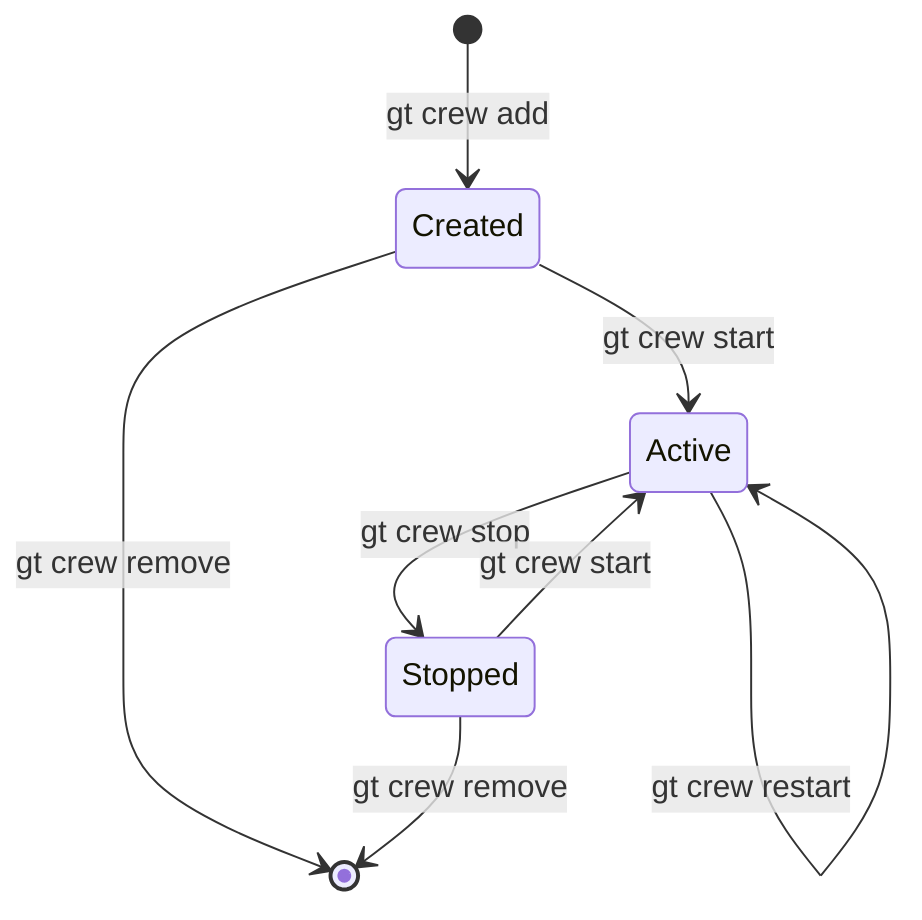
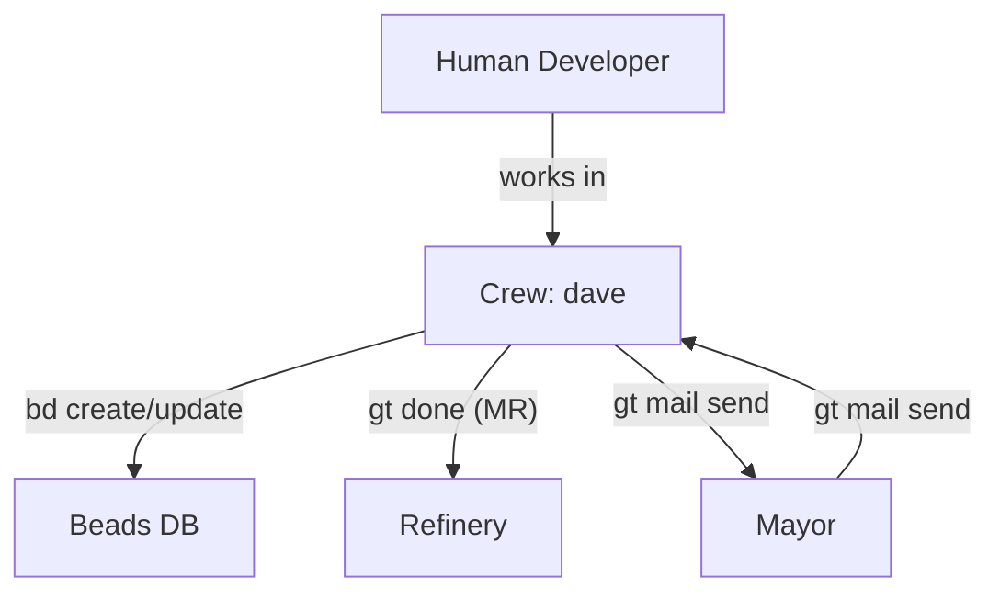

# Crew -- Human Workspaces

> Crew workspaces give human developers a first-class seat at the Gas Town table -- persistent, fully integrated, and always ready for hands-on work.

---

## Overview

Crew members are persistent workspaces for human developers within a Gas Town rig. Unlike polecats (which are ephemeral AI workers), crew workspaces are full git clones that persist indefinitely and are managed by the human developer. Each crew member has a named directory, a complete copy of the repository, and full integration with Gas Town's communication and tracking systems.

Crew workspaces let humans work alongside AI agents in the same project, using the same tools and tracking systems, without interference.

## Key Characteristics

| Property | Value |
|----------|-------|
| **Scope** | Per-rig |
| **Lifecycle** | Persistent (user-managed) |
| **Instance count** | Named members per rig |
| **Session type** | User-controlled (manual or tmux) |
| **Patrol cycle** | None |
| **Location** | `~/gt/<rig>/crew/<name>/` |
| **Git identity** | Yes (developer's own) |
| **Mailbox** | No |

## Full Git Clones

Unlike polecats, which use git worktrees (lightweight branches off the canonical clone), crew workspaces are **full git clones**. This means:

| Property | Crew (Full Clone) | Polecat (Worktree) |
|----------|-------------------|---------------------|
| `.git` directory | Full repository | Link to parent |
| Independent history | Yes | Shared with canonical |
| Survives canonical changes | Yes | May need refresh |
| Disk usage | Higher | Lower |
| Branch flexibility | Full | Limited |

Full clones give human developers complete independence -- they can rebase, force-push, switch branches, and perform any git operation without affecting other agents.

## Named Members

Crew members are named after the humans who use them:

```
~/gt/myproject/crew/
├── dave/          # Dave's workspace
├── emma/          # Emma's workspace
└── fred/          # Fred's workspace
```

Each member's workspace is a complete, self-contained development environment.

## Gas Town Integration

Crew workspaces are fully integrated with Gas Town's systems:

### Beads (Issue Tracking)

Crew members can use the `bd` CLI to create, update, and close issues:

```bash
cd ~/gt/myproject/crew/dave
bd list                        # View rig issues
bd create --title "New feature"  # Create an issue
bd close gt-abc12              # Close an issue
```

### Hooks

Crew members can attach work to their hook, just like any agent:

```bash
gt hook                        # Check current hook
gt hook gt-abc12               # Attach work
gt done                        # Submit MR and complete
```

### Mail and Communication

Crew members can send messages to agents:

```bash
gt mail send mayor "Ready for review on feature-x"
gt mail inbox                  # Check messages
```

### Optional Tmux Integration

Crew workspaces can be managed with tmux for multi-pane workflows:

```bash
gt crew start myproject dave   # Start dave's workspace in tmux
```

This opens a tmux session with the crew workspace ready.

## Commands

| Command | Description |
|---------|-------------|
| `gt crew add <rig> <name>` | Create a new crew workspace |
| `gt crew remove <rig> <name>` | Remove a crew workspace |
| `gt crew list` | List all crew members across rigs |
| `gt crew start <rig> <name>` | Start a crew workspace (tmux) |
| `gt crew stop <rig> <name>` | Stop a crew workspace session |
| `gt crew at <rig> <name>` | Attach to a running crew session |
| `gt crew refresh <rig> <name>` | Pull latest changes into workspace |
| `gt crew restart <rig> <name>` | Stop and restart a crew session |

## Lifecycle

Crew workspaces follow a user-managed lifecycle:



Unlike polecats, crew workspaces are never automatically nuked. They persist until the human explicitly removes them.

## Directory Structure

```
~/gt/<rig>/crew/<name>/
├── .git/              # Full git repository
├── CLAUDE.md          # Gas Town context (if using Claude Code)
├── .beads/            # Link to rig-level beads
└── <project files>    # Complete working copy
```

## Configuration

Crew workspaces inherit rig-level configuration with optional per-member overrides:

| Setting | Default | Description |
|---------|---------|-------------|
| Auto-refresh | `false` | Automatically pull latest on session start |
| Default branch | `main` | Branch to track |
| Tmux layout | `single-pane` | Tmux window layout preference |
| Agent runtime | `claude` | AI agent runtime for the workspace |

## Interaction Diagram



## Tips and Best Practices

:::tip[Use gt crew refresh Regularly]

Keep your crew workspace up to date with the latest `main` by running `gt crew refresh` frequently. This minimizes merge conflicts when you submit your work.

:::

:::tip[Coordinate with the Mayor]

Before starting work, check with the Mayor via `gt mail send mayor "Starting work on X"` to avoid duplicating effort with active polecats.

:::

:::tip[Use gt done for Clean Merges]

Even though you can push directly, using `gt done` from a crew workspace routes your changes through the Refinery merge queue. This ensures proper validation and serialized merges.

:::

:::info[Crew vs Polecats]

Crew workspaces are for humans who want persistent, long-lived development environments. Polecats are for AI agents executing single tasks. Do not use crew workspaces for automated work -- use polecats instead.

:::

:::warning[Crew Workspaces Are Not Backed Up]

Crew workspaces are full clones on the local filesystem. Uncommitted work exists only in your workspace. Commit and push regularly.


:::