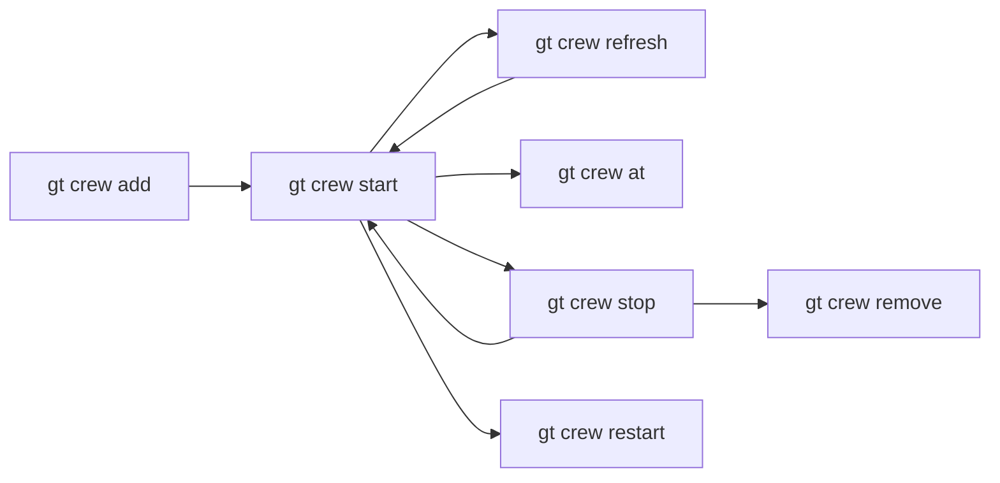
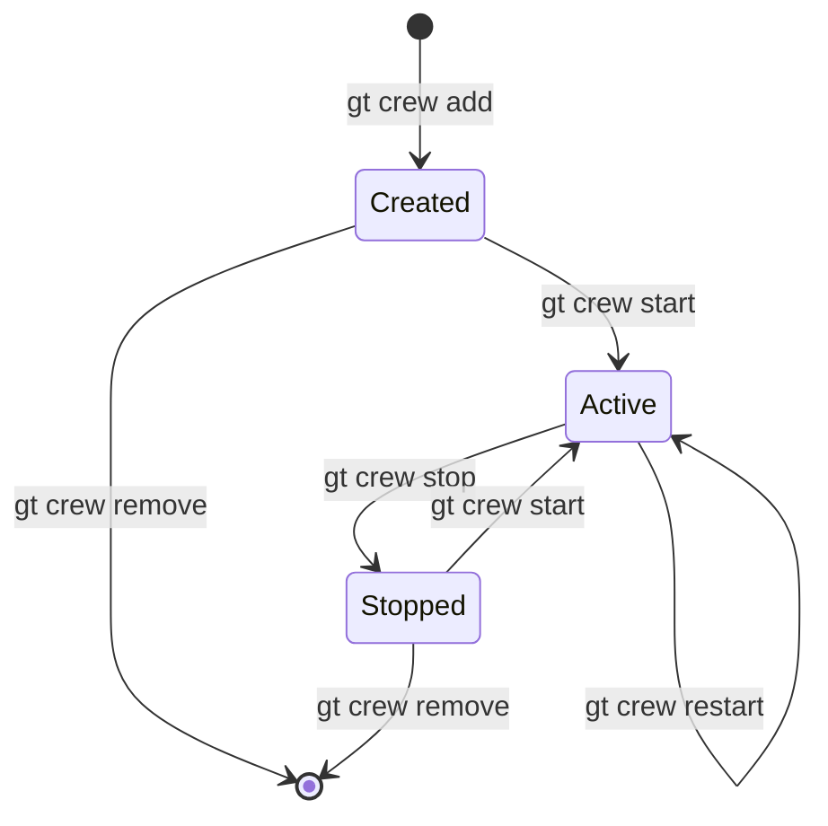
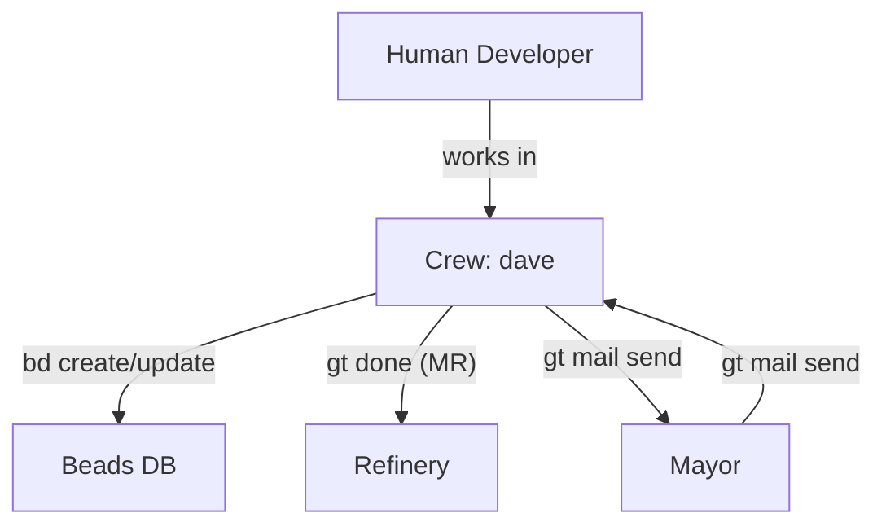
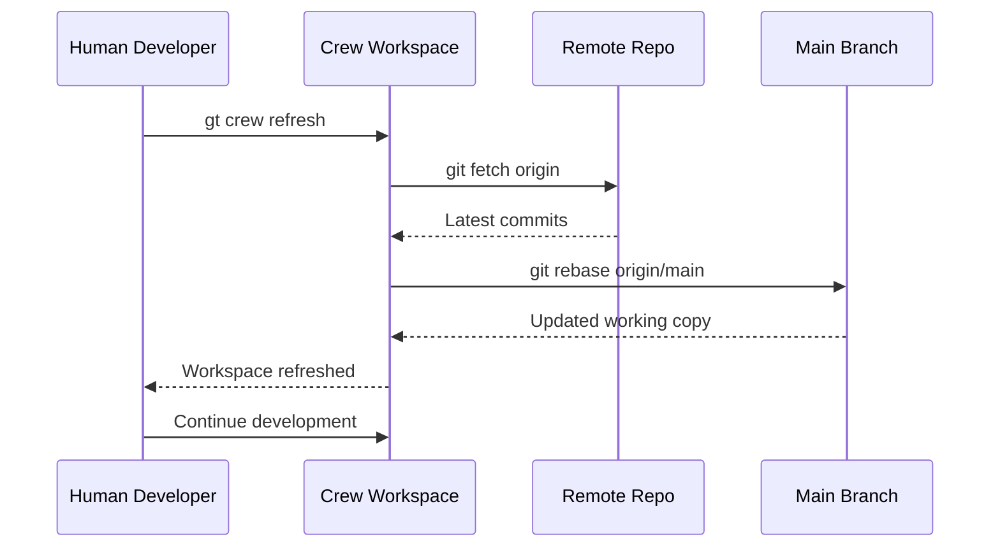
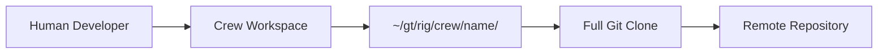

# Crew -- Human Workspaces

> Crew workspaces give human developers a first-class seat at the Gas Town table -- persistent, fully integrated, and always ready for hands-on work.

---

## Overview

Crew members are persistent workspaces for human developers within a Gas Town rig. Unlike polecats (which are ephemeral AI workers), crew workspaces are full git clones that persist indefinitely and are managed by the human developer. Each crew member has a named directory, a complete copy of the repository, and full integration with Gas Town's communication and tracking systems.

Crew workspaces let humans work alongside AI agents in the same project, using the same tools and tracking systems, without interference.

## Key Characteristics

| Property | Value |
|----------|-------|
| **Scope** | Per-rig |
| **Lifecycle** | Persistent (user-managed) |
| **Instance count** | Named members per rig |
| **Session type** | User-controlled (manual or tmux) |
| **Patrol cycle** | None |
| **Location** | `~/gt/<rig>/crew/<name>/` |
| **Git identity** | Yes (developer's own) |
| **Mailbox** | No |

## Full Git Clones

Unlike polecats, which use git worktrees (lightweight branches off the canonical clone), crew workspaces are **full git clones**. This means:

| Property | Crew (Full Clone) | Polecat (Worktree) |
|----------|-------------------|---------------------|
| `.git` directory | Full repository | Link to parent |
| Independent history | Yes | Shared with canonical |
| Survives canonical changes | Yes | May need refresh |
| Disk usage | Higher | Lower |
| Branch flexibility | Full | Limited |

Full clones give human developers complete independence -- they can rebase, force-push, switch branches, and perform any git operation without affecting other agents. For more on branch isolation strategies, see [Git Workflows for Multi-Agent Development](/blog/git-workflows-multi-agent).

## Named Members

Crew members are named after the humans who use them:

```text
~/gt/myproject/crew/
├── dave/          # Dave's workspace
├── emma/          # Emma's workspace
└── fred/          # Fred's workspace
```

Each member's workspace is a complete, self-contained development environment.

## Gas Town Integration

Crew workspaces are fully integrated with Gas Town's systems:

### Beads (Issue Tracking)

Crew members can use the `bd` CLI to create, update, and close issues:

```bash
cd ~/gt/myproject/crew/dave
bd list                        # View rig issues
bd create --title "New feature"  # Create an issue
bd close gt-abc12              # Close an issue
```

### Hooks

Crew members can attach work to their hook, just like any agent:

```bash
gt hook                        # Check current hook
gt hook gt-abc12               # Attach work
gt done                        # Submit MR and complete
```

### Mail and Communication

Crew members can send messages to agents:

```bash
gt mail send mayor "Ready for review on feature-x"
gt mail inbox                  # Check messages
```

### Optional Tmux Integration

Crew workspaces can be managed with tmux for multi-pane workflows:

```bash
gt crew start myproject dave   # Start dave's workspace in tmux
```

This opens a tmux session with the crew workspace ready.

## Commands



| Command | Description |
|---------|-------------|
| `gt crew add <rig> <name>` | Create a new crew workspace |
| `gt crew remove <rig> <name>` | Remove a crew workspace |
| `gt crew list` | List all crew members across rigs |
| `gt crew start <rig> <name>` | Start a crew workspace (tmux) |
| `gt crew stop <rig> <name>` | Stop a crew workspace session |
| `gt crew at <rig> <name>` | Attach to a running crew session |
| `gt crew refresh <rig> <name>` | Pull latest changes into workspace |
| `gt crew restart <rig> <name>` | Stop and restart a crew session |

## Lifecycle

Crew workspaces follow a user-managed lifecycle:



Unlike polecats, crew workspaces are never automatically nuked. They persist until the human explicitly removes them.

## Directory Structure

```text
~/gt/<rig>/crew/<name>/
├── .git/              # Full git repository
├── CLAUDE.md          # Gas Town context (if using Claude Code)
├── .beads/            # Link to rig-level beads
└── <project files>    # Complete working copy
```

## Configuration

Crew workspaces inherit rig-level configuration with optional per-member overrides:

| Setting | Default | Description |
|---------|---------|-------------|
| Auto-refresh | `false` | Automatically pull latest on session start |
| Default branch | `main` | Branch to track |
| Tmux layout | `single-pane` | Tmux window layout preference |
| Agent runtime | `claude` | AI agent runtime for the workspace |

## Interaction Diagram



## Tips and Best Practices

:::tip[Use gt crew refresh Regularly]

Keep your crew workspace up to date with the latest `main` by running `gt crew refresh` frequently. This minimizes merge conflicts when you submit your work.

:::

:::tip[Coordinate with the Mayor]

Before starting work, check with the Mayor via `gt mail send mayor "Starting work on X"` to avoid duplicating effort with active polecats.

:::

:::tip[Use gt done for Clean Merges]

Even though you can push directly, using `gt done` from a crew workspace routes your changes through the Refinery merge queue. This ensures proper validation and serialized merges.

:::

:::info[Crew vs Polecats]

Crew workspaces are for humans who want persistent, long-lived development environments. Polecats are for AI agents executing single tasks. Do not use crew workspaces for automated work -- use polecats instead.

:::

:::warning[Crew Workspaces Are Not Backed Up]

Crew workspaces are full clones on the local filesystem. Uncommitted work exists only in your workspace. Commit and push regularly.

:::

:::caution[Uncommitted Work in Crew Workspaces]

Because crew workspaces are full git clones on the local filesystem, uncommitted work exists only in your workspace. If your disk fails or workspace is deleted, uncommitted work is lost. Commit and push regularly, especially before long breaks.

:::

:::danger[Never Force-Push from Crew Workspaces]

Crew workspaces have full git capabilities, including the ability to rewrite history with force-push. This can orphan polecat branches and corrupt the merge queue. Always use `gt done` to submit work through the Refinery, which handles rebasing safely. Reserve force-push for personal branches only.

:::

## Crew Refresh Flow

The following diagram shows how a crew workspace stays synchronized with the main branch through the refresh process.



## Common Patterns

### Setting Up a New Crew Workspace

```bash
gt crew add myproject dave           # Create workspace
gt crew start myproject dave         # Start session (tmux)

# Inside the workspace:
cd ~/gt/myproject/crew/dave
bd list                              # See available work
bd create --title "My feature" --type feature
# Work on the feature...
gt done                              # Submit through Refinery
```

### Working Alongside Polecats

Human crew members and AI polecats work in the same rig simultaneously. To avoid conflicts:

1. Check active polecats before starting: `gt polecat list`
2. Claim your issue to signal you are working on it: `bd update <id> --status=in_progress --assignee=dave`
3. Communicate via mail if needed: `gt mail send mayor "Starting work on X"`

### Submitting Work Through the Merge Queue

Crew members can use `gt done` just like polecats. This routes changes through the Refinery for proper validation:

```bash
git add <files>
git commit -m "Add feature X"
gt done                              # Submit MR to Refinery
```

This is preferred over pushing directly to `main`, even for crew members.

## Crew vs Polecat Workflow Comparison

The following timeline shows how crew and polecat workflows differ for the same feature.

```mermaid
gantt
    title Feature Implementation: Crew vs Polecat
    dateFormat HH:mm
    axisFormat %H:%M

    section Crew Workflow
    Setup workspace            :a1, 00:00, 10min
    Review requirements        :a2, after a1, 15min
    Implement incrementally    :a3, after a2, 2h
    Manual testing            :a4, after a3, 30min
    Submit via gt done        :a5, after a4, 5min

    section Polecat Workflow
    Auto-spawn                :b1, 00:00, 2min
    Load context & preflight  :b2, after b1, 5min
    Implement                 :b3, after b2, 45min
    Run tests                 :b4, after b3, 10min
    Submit & nuke             :b5, after b4, 3min
```



## Troubleshooting

### Crew Workspace Is Out of Date

```bash
gt crew refresh myproject dave       # Pull latest main
```

If there are conflicts during refresh, resolve them manually in the workspace.

### Cannot Create Crew Workspace

Verify the rig exists and has a valid git URL:

```bash
gt rig list                          # Confirm rig is registered
gt rig status myproject              # Check rig health
```

### Session Disconnected

If a tmux session disconnects:

```bash
gt crew at myproject dave            # Re-attach to existing session
# Or restart:
gt crew restart myproject dave
```

### Crew Workspace Structure

How a human developer connects to the Gas Town workspace hierarchy through a crew workspace.



## Related

- [Polecats](polecats.md) -- AI workers that crew members work alongside
- [Refinery](refinery.md) -- Merge queue that crew work flows through
- [Beads](../concepts/beads.md) -- Issue tracking available to crew members
- [Rigs](../concepts/rigs.md) -- Project containers where crew workspaces live

### Blog Posts

- [Session Cycling](/blog/session-cycling) -- How crew members handle context limits with session handoffs
- [Common Pitfalls](/blog/common-pitfalls) -- Mistakes to avoid when working alongside AI agents
- [Crew Workflow](/blog/crew-workflow) -- End-to-end guide to setting up and using crew workspaces effectively
- [Git Worktrees](/blog/git-worktrees) -- How Gas Town uses git worktrees and full clones for workspace isolation
- [Hooks: The Persistence Primitive That Makes Gas Town Crash-Safe](/blog/hook-persistence) -- How crew workspace state persists through session cycling