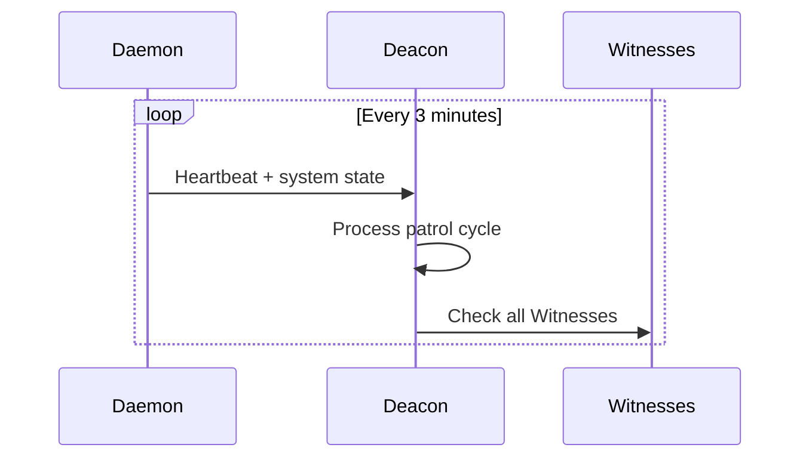
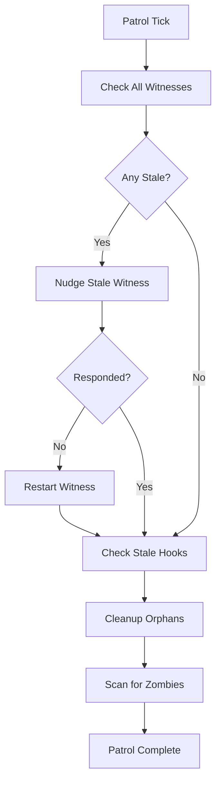
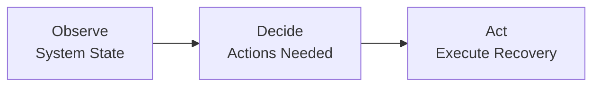
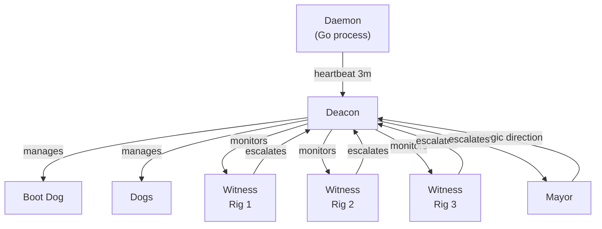

# Deacon -- Town-Level Watchdog

> The Deacon is the immune system of Gas Town. It monitors the health of every agent, manages lifecycles, and ensures the system self-heals when things go wrong.

---

## Overview

The Deacon is a persistent, town-level agent responsible for health monitoring and lifecycle management across the entire Gas Town installation. It receives periodic heartbeats from the Daemon, monitors all Witnesses, manages Dogs for cross-rig infrastructure work, and performs boot triage when the system starts up. If the Mayor is the brain, the Deacon is the nervous system -- always watching, always ready to respond.

## Key Characteristics

| Property | Value |
|----------|-------|
| **Scope** | Town-level (all rigs) |
| **Lifecycle** | Persistent |
| **Instance count** | 1 per town |
| **Session type** | Long-running Claude Code session |
| **Patrol cycle** | 5 minutes |
| **Location** | `~/gt/deacon/` |
| **Git identity** | No |
| **Mailbox** | Yes |

## Responsibilities

### 1. Receive Daemon Heartbeats

The Daemon (a Go process) sends heartbeats to the Deacon on a 3-minute interval. These heartbeats trigger the Deacon's patrol cycle and carry system state information.



### 2. Monitor All Witnesses

The Deacon supervises every Witness in every rig. If a Witness becomes unresponsive or dies, the Deacon restarts it:

| Witness State | Deacon Action |
|---------------|---------------|
| Healthy | No action |
| Slow to respond | Nudge |
| Unresponsive | Restart session |
| Dead | Spawn new Witness |

### 3. Manage Dogs

Dogs are reusable infrastructure workers managed by the Deacon for cross-rig tasks. The Deacon spawns, assigns, and monitors Dogs:

```bash
gt dog list          # List active dogs
gt dog add <name>    # Create a new dog
```

### 4. Patrol Cycle

Every 5 minutes, the Deacon runs a patrol cycle:



### 5. Boot Triage Process

When the system starts up (or after a crash), the Deacon runs boot triage to assess and recover state:



**Boot triage steps:**

1. **Observe** -- Inventory all rigs, check agent sessions, scan for orphaned work
2. **Decide** -- Determine which agents need starting, which work needs reassignment
3. **Act** -- Start Witnesses, restart stalled agents, re-sling orphaned work

### 6. Handle Escalations from Witnesses

When a Witness encounters a problem it cannot resolve (e.g., a rig-level failure), it escalates to the Deacon. The Deacon either handles it directly or escalates further to the Mayor.

## Commands

### Deacon Management

| Command | Description |
|---------|-------------|
| `gt deacon start` | Start the Deacon session |
| `gt deacon stop` | Stop the Deacon session |
| `gt deacon status` | Check Deacon health and patrol state |

### Maintenance Commands

| Command | Description |
|---------|-------------|
| `gt deacon stale-hooks` | Find and report hooks with no active agent |
| `gt deacon cleanup-orphans` | Remove orphaned worktrees and temp files |
| `gt deacon zombie-scan` | Detect and report zombie agent sessions |

## Configuration

The Deacon's behavior is configured through town-level settings:

| Setting | Default | Description |
|---------|---------|-------------|
| Patrol interval | 5 min | Time between patrol cycles |
| Heartbeat timeout | 10 min | Time before Daemon heartbeat considered missed |
| Witness restart threshold | 3 missed patrols | Missed patrols before restarting a Witness |
| Zombie age threshold | 30 min | Idle time before a session is considered zombie |

## Deacon State

The Deacon tracks the following state:

| State File | Purpose |
|------------|---------|
| `~/gt/deacon/state.json` | Current patrol state and agent inventory |
| `~/gt/deacon/dogs/` | Dog workspace directory |
| `~/gt/deacon/CLAUDE.md` | Deacon agent context and instructions |

## Interaction Diagram



## Tips and Best Practices

:::tip[Check Deacon Status After Restarts]

After restarting the Daemon or recovering from a crash, run `gt deacon status` to verify the Deacon has completed boot triage and all Witnesses are healthy.

:::

:::tip[Use Zombie Scan Proactively]

Run `gt deacon zombie-scan` periodically if you suspect stuck sessions. The Deacon does this automatically, but manual scans give you immediate visibility.

:::

:::warning[Do Not Run Multiple Deacons]

Like the Mayor, the Deacon is a singleton. Running multiple instances will cause conflicting health decisions and potential data corruption.

:::

:::info[Deacon vs Mayor]

The Deacon handles **operational health** (is everything running?). The Mayor handles **strategic coordination** (what should we build?). They communicate but have non-overlapping responsibilities.

:::

## Common Patterns

### Idle Town Protocol

When no active work exists across rigs, the Deacon enters idle monitoring mode. It skips health nudges for docked rigs and uses exponential backoff to reduce resource usage:

```
Active rigs with polecats → Full patrol cycle
No active work anywhere → Idle monitoring (reduced frequency)
```

This prevents unnecessary Witness nudges and resource consumption when the system is quiet.

### Orphan Process Cleanup

The Deacon detects and cleans up orphaned Claude subagent processes (those with TTY = "?") that were left behind by crashed sessions. This happens automatically during the patrol cycle.

### Gate Evaluation and Dispatch

The Deacon checks timer gates for expiration, closes elapsed gates, and dispatches molecules that were blocked on those gates to available polecats:

```bash
bd gate list                 # See open gates
# Deacon auto-closes expired timer gates
# Deacon auto-dispatches unblocked molecules
```

### Second-Order Monitoring

The "who watches the watchers" problem is solved by Witness pings. Each Witness sends a `WITNESS_PING` to the Deacon during its patrol. If the Deacon stops receiving pings, it knows a Witness has died:

```
Witness patrol → sends WITNESS_PING → Deacon archives it
No ping for 3+ cycles → Deacon restarts the Witness
No ping for 5+ cycles → Deacon escalates to Mayor
```

## Troubleshooting

### Deacon Is Not Starting

The Daemon spawns Boot, and Boot wakes the Deacon. Verify the chain:

```bash
gt daemon status             # Is the Daemon running?
# Check Boot's triage log:
# ~/gt/deacon/dogs/boot/triage-log.jsonl
gt deacon status             # Check Deacon state
```

### Witnesses Are Not Being Monitored

Verify the Deacon is receiving `WITNESS_PING` messages. If Witnesses are running but not pinging, they may be stuck in their own patrol cycle:

```bash
gt deacon status             # Check last patrol time
gt rig status <rig>          # Check Witness state per rig
```

### Dogs Are Not Being Dispatched

The Deacon maintains a minimum pool of idle dogs. If dogs are not spawning:

```bash
gt dog list                  # Check current dog pool
gt deacon status             # Verify Deacon patrol is running
```

### Zombie Polecats Accumulating

The Deacon detects zombies during its patrol but only files "death warrants" -- Boot handles the actual process cleanup. If zombies are accumulating, check that Boot is running:

```bash
gt daemon status             # Boot runs on daemon ticks
gt polecat list              # See zombie states
```

## See Also

- **[Boot](boot.md)** -- The Daemon's watchdog that wakes the Deacon
- **[Dogs](dogs.md)** -- Infrastructure workers managed by the Deacon
- **[Witness](witness.md)** -- Per-rig monitors that the Deacon supervises
- **[Mayor](mayor.md)** -- Provides strategic direction to the Deacon
- **[Gates](../concepts/gates.md)** -- Async coordination primitives the Deacon evaluates
- **[Molecules](../concepts/molecules.md)** -- Workflows the Deacon dispatches when gates open
- **[Patrol Cycles](../concepts/patrol-cycles.md)** -- Periodic monitoring cadence the Deacon follows
- **[Escalations](../operations/escalations.md)** -- How problems are routed up from Witnesses to the Deacon
- **[Lifecycle](../operations/lifecycle.md)** -- Agent lifecycle management the Deacon oversees