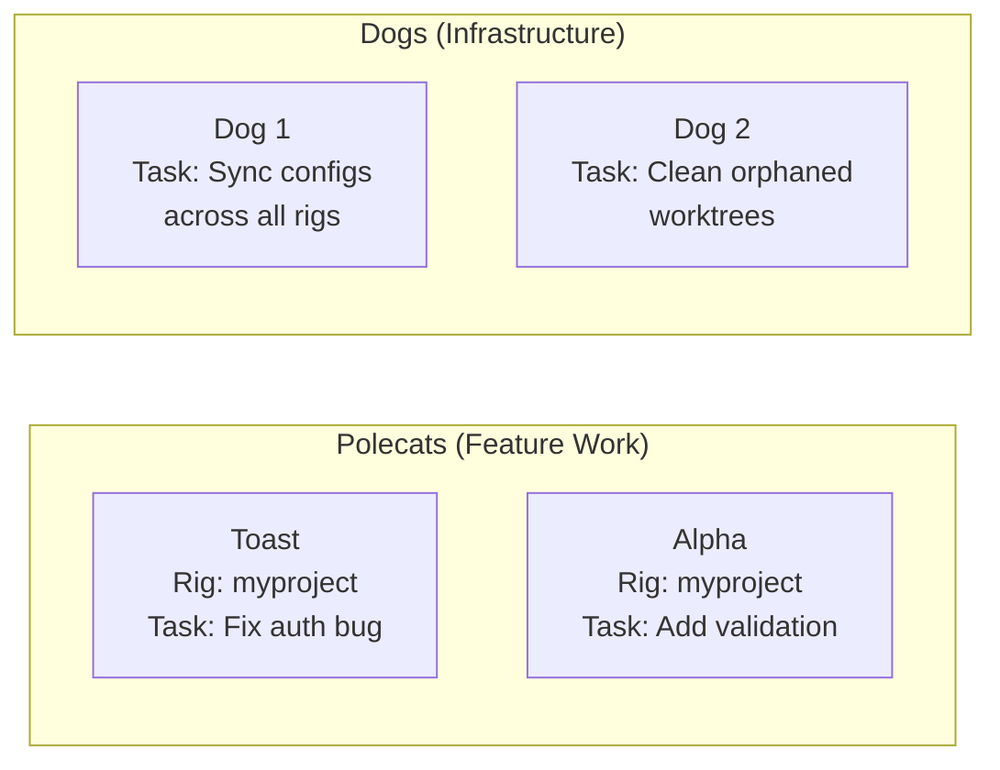
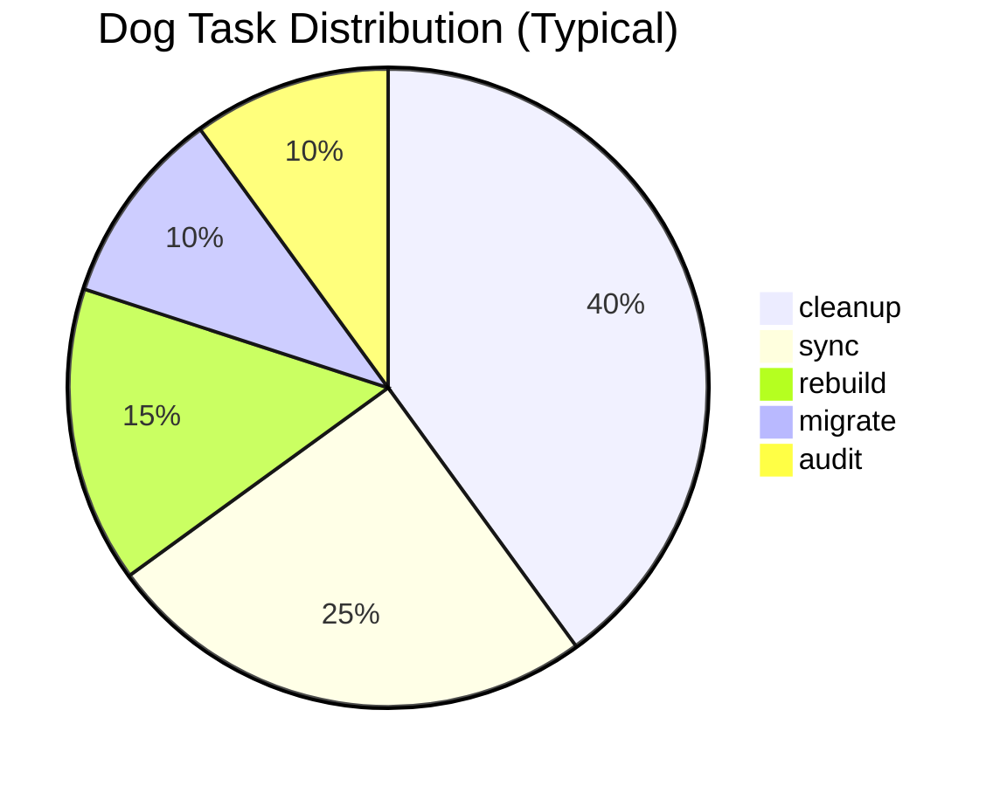
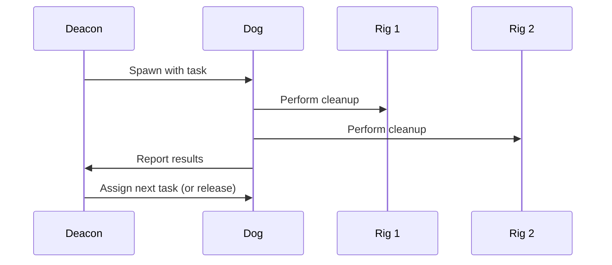
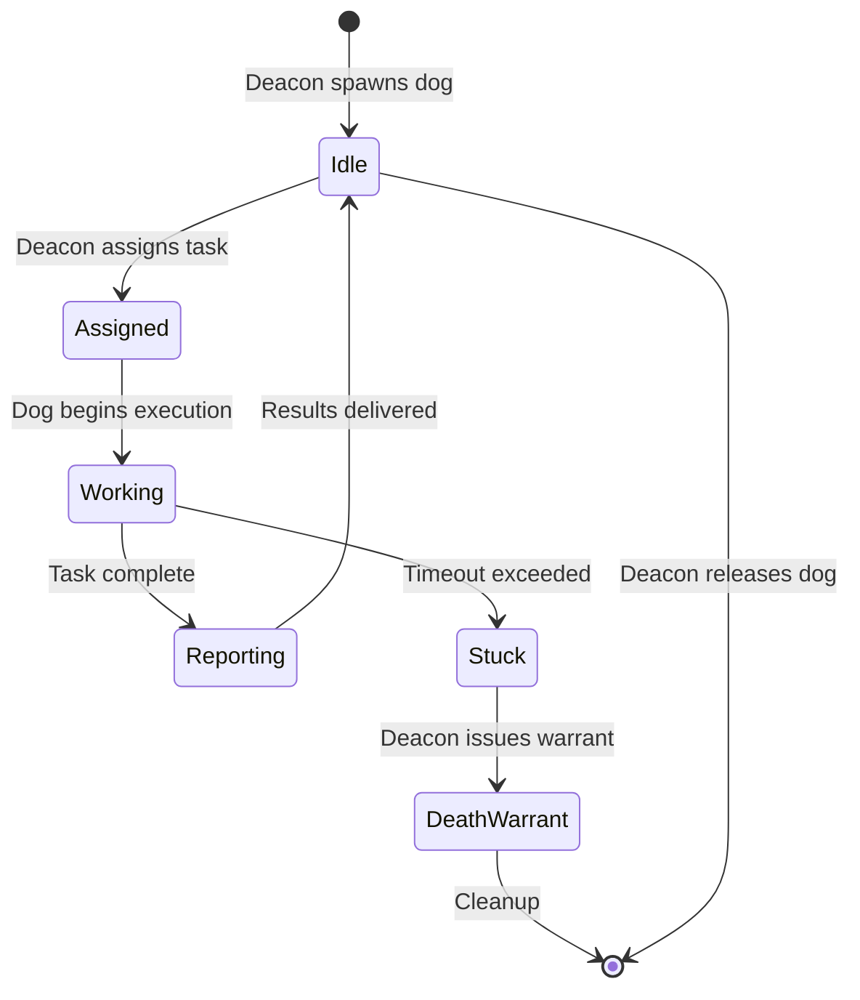
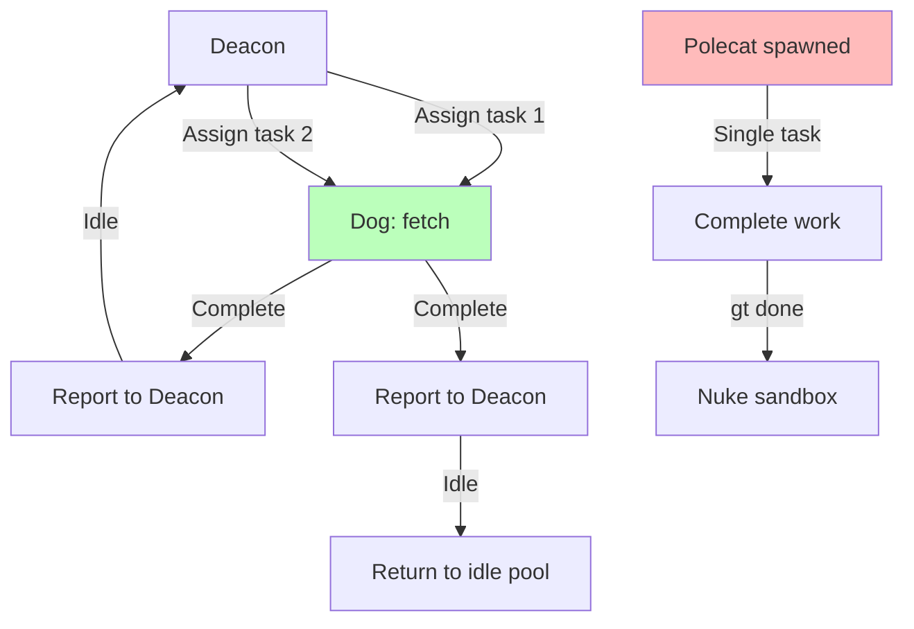
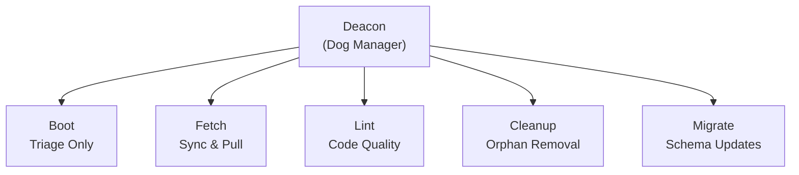

# Dogs -- Infrastructure Workers

> Dogs do the dirty work. They clean up messes, sync systems, and handle cross-rig infrastructure tasks that no single polecat or witness can manage alone.

---

## Overview

Dogs are reusable worker agents managed by the Deacon for infrastructure and maintenance tasks that span multiple rigs. While polecats are ephemeral single-rig feature builders, Dogs are multi-task cross-rig utility workers. They handle rebuilding, syncing, migrations, orphan cleanup, and any other infrastructure work that falls outside the scope of feature development.

## Key Characteristics

| Property | Value |
|----------|-------|
| **Scope** | Cross-rig (town-level) |
| **Lifecycle** | Reusable (multiple tasks) |
| **Instance count** | As needed |
| **Session type** | Task-driven Claude Code session |
| **Patrol cycle** | None (managed by Deacon) |
| **Location** | `~/gt/deacon/dogs/` |
| **Git identity** | No |
| **Mailbox** | No |

## Dogs vs Polecats

This is the most common point of confusion. Here is the distinction:

| Property | Polecats | Dogs |
|----------|----------|------|
| **Purpose** | Build features | Clean messes |
| **Scope** | One rig | Cross-rig |
| **Lifecycle** | Ephemeral (one task, then nuke) | Reusable (multiple tasks) |
| **Managed by** | Witness | Deacon |
| **Works on** | Feature code | Infrastructure |
| **Git identity** | Yes (unique per cat) | No |
| **Submits MRs** | Yes (via gt done) | Rarely |
| **Location** | `~/gt/<rig>/polecats/<name>/` | `~/gt/deacon/dogs/` |



**Rule of thumb**: If the work produces a feature branch and an MR, it is a Polecat. If the work maintains infrastructure, it is a Dog. For deeper insights on architectural decision-making, see [Gas Town vs CI/CD](/blog/gas-town-vs-cicd).

## Responsibilities

:::caution

Dogs operate across rigs and can modify shared infrastructure. If a dog task fails mid-execution, it may leave inconsistent state between rigs. Always check `gt dog status <id>` after errors and run `gt deacon cleanup-orphans` if needed.

:::

### 1. Cross-Rig Infrastructure

Dogs handle tasks that touch multiple rigs:

- Syncing configuration files across rigs
- Updating shared dependencies
- Migrating data structures
- Cross-rig consistency checks

### 2. Cleanup Operations

Dogs perform bulk cleanup that is beyond a single Witness's scope:

- Orphaned worktree removal across all rigs
- Stale branch cleanup
- Disk space reclamation
- Temp file purging

### 3. System Rebuilding

When infrastructure needs rebuilding:

- Recreating broken worktrees
- Re-initializing corrupted beads databases
- Rebuilding agent context files
- Restoring from backup state

### 4. Migrations

When Gas Town itself needs updating:

- Schema migrations for beads
- Configuration format updates
- Plugin upgrades across rigs

## Work Types



| Work Type | Description | Frequency |
|-----------|-------------|-----------|
| `rebuild` | Recreate broken infrastructure | As needed |
| `sync` | Synchronize state across rigs | Periodic |
| `migrate` | Update schemas or formats | On upgrade |
| `cleanup` | Remove orphans and stale data | Regular |
| `audit` | Verify system integrity | On demand |

## Managed by the Deacon

Dogs do not operate independently. The Deacon manages their complete lifecycle:



The Deacon:

1. **Spawns** Dogs when infrastructure work is needed
2. **Assigns** tasks with clear scope and completion criteria
3. **Monitors** Dog progress
4. **Reuses** Dogs for additional tasks if available
5. **Releases** Dogs when no more work is queued

## Location

All Dogs operate from the Deacon's dog directory:

```text
~/gt/deacon/dogs/
├── boot/              # Boot dog (special - see Boot docs)
├── dog-001/           # General purpose dog
├── dog-002/           # Another dog
└── ...
```

Each Dog gets its own subdirectory for task context and working files.

## Commands

| Command | Description |
|---------|-------------|
| `gt dog list` | List all active dogs |
| `gt dog add <name>` | Create a new dog in the kennel |
| `gt dog status <id>` | Check a specific dog's status |

## Tips and Best Practices

:::tip[Let the Deacon Manage Dogs]

Dogs are designed to be managed by the Deacon automatically. Manual dog management (`gt dog add`) should be rare and reserved for specific infrastructure emergencies.

:::

:::tip[Check Dog Activity After Issues]

If you notice infrastructure problems (orphaned files, stale worktrees, inconsistent state), check `gt dog list` to see if a Dog is already handling it. The Deacon is likely already aware.

:::

:::info[Dogs Are Not Feature Workers]

If you need a feature implemented, use a Polecat (via `gt sling`). Dogs are strictly for infrastructure. Trying to use a Dog for feature work will bypass the merge queue and code review process.

:::

:::warning[Boot Is a Special Dog]

The [Boot](boot.md) agent is a specialized Dog with its own lifecycle (runs fresh on each daemon tick). See the Boot documentation for details.

:::

:::tip[Dog Naming Convention]

Dogs are typically named after their purpose (boot, fetch, lint) rather than using the NATO phonetic alphabet like polecats. This makes it easier to understand what a dog does just from seeing its name in logs or status output.

:::

:::info[Dogs Share Context Across Tasks]

Unlike polecats which start fresh each time, dogs maintain session context across multiple tasks. This means a dog can build up specialized knowledge about infrastructure patterns as it works, making it more efficient on recurring tasks. However, this also means dogs need periodic session cycling to avoid context bloat.

:::

## Dog Lifecycle States

A dog transitions between idle and active states as the Deacon assigns and completes tasks.



## Common Patterns

### Auto-Dispatch via gt sling

Dogs are typically dispatched by the Deacon, but the `gt sling` command can also dispatch work to idle dogs:

```bash
gt sling <infrastructure-task> deacon/dogs  # Auto-dispatches to an idle dog
```

### Dog Pool Maintenance

The Deacon maintains a minimum pool of idle dogs so infrastructure tasks can be dispatched immediately. During the patrol cycle, the Deacon checks:

- Are there enough idle dogs in the pool?
- Are any dogs stuck past their timeout?
- Should any stuck dogs receive a death warrant?

### Cross-Rig Cleanup Example

A typical dog cleanup task might span all rigs:

```text
Dog receives: "Clean orphaned worktrees across all rigs"
  → Scan rig 1: Remove 3 orphaned directories
  → Scan rig 2: Remove 1 orphaned directory
  → Report results to Deacon
  → Accept next task or return to idle pool
```

### Session Garbage Collection

The Deacon dispatches dogs for session cleanup when it detects stale tmux sessions or orphaned processes. The dog handles the actual file and process cleanup.

### Dog Task Distribution Flow

Dogs handle work assignment differently from polecats, with multi-task reuse and cross-rig scope.




## Troubleshooting

### Dog Is Stuck on a Task

Dogs that exceed their task timeout receive a "death warrant" from the Deacon during the health check:

```bash
gt dog list                  # Check dog states
gt dog status <id>           # See specific dog activity
```

If a dog is genuinely stuck, the Deacon will file a warrant and Boot will handle process cleanup.

### No Idle Dogs Available

If infrastructure work is queued but no dogs are available:

```bash
gt dog list                  # See active dogs
gt dog add <name>            # Manually add a dog to the pool
```

The Deacon should auto-spawn dogs, but manual intervention may be needed if the Deacon is down.

### Dog Work Is Not Being Tracked

Dogs do not submit MRs through the Refinery. Their work is tracked through the Deacon's mail system. If dog completions are not being registered:

```bash
gt mail inbox                # Check Deacon's mailbox for DOG_DONE messages
gt deacon status             # Verify Deacon is processing mail
```

### Dog Types and Roles

Dogs are specialized by purpose, with Boot being a unique triage-only dog and others handling general infrastructure.



## Related

- [Deacon](deacon.md) -- Manages the dog pool and dispatches tasks
- [Boot](boot.md) -- A special-purpose dog for system triage
- [Polecats](polecats.md) -- Feature workers (contrast with infrastructure dogs)
- [Rigs](../concepts/rigs.md) -- Dogs operate across rigs, unlike polecats

### Blog Posts

- [The Deacon: Gas Town's Background Coordinator](/blog/deacon-patrol) -- How the Deacon patrols the town, manages agent lifecycles, and dispatches dogs
- [Scaling Gas Town Beyond 30 Agents](/blog/scaling-beyond-30) -- Architectural patterns for running at scale with dozens of concurrent agents
- [Infrastructure Dogs: The Cleanup Crew Behind Gas Town](/blog/infrastructure-dogs) -- How dogs handle cross-rig cleanup, syncing, migrations, and rebuilding
- [Death Warrants](/blog/death-warrants) -- How stuck dogs receive death warrants and get cleaned up by the system
- [Boot Dogs: The Daemon's Triage Engine](/blog/boot-dogs) -- How Boot runs as a specialized dog for daemon-level triage