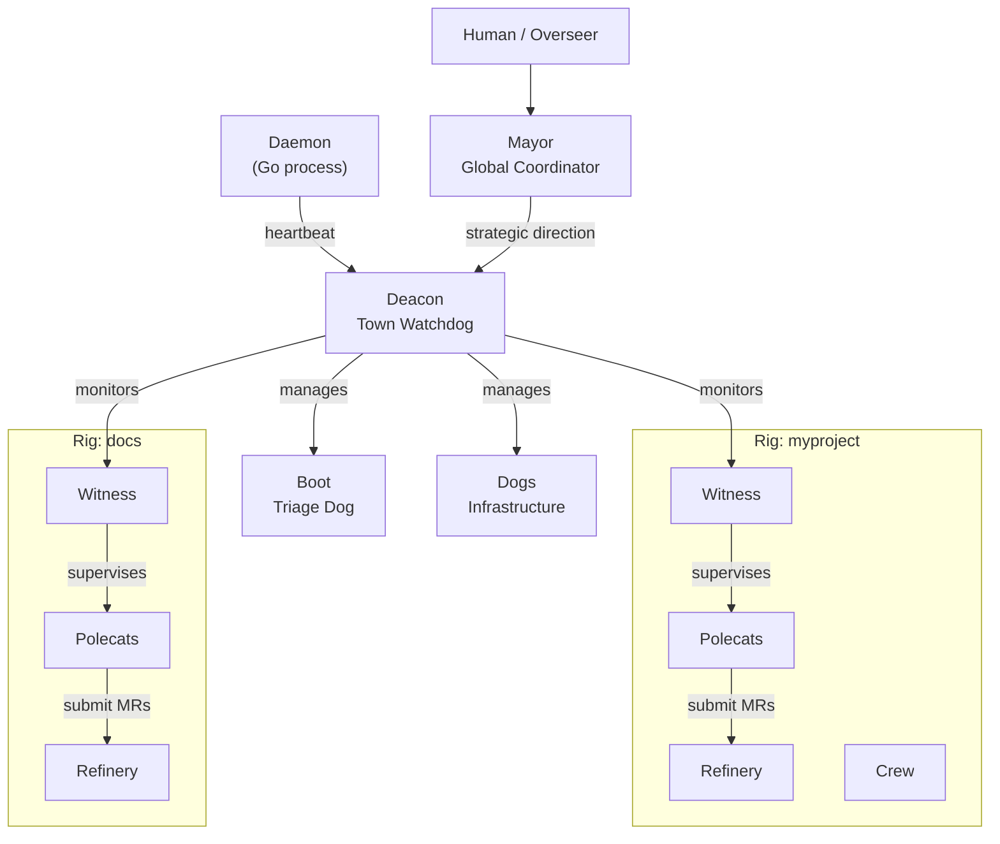

# Agents

Gas Town's agent hierarchy is a supervisor tree inspired by Erlang/OTP. Each role has a well-defined scope, lifecycle, and set of responsibilities -- ensuring reliable, self-healing operation from a single worker to 30 concurrent agents.

---

## The Agent Roster

| Agent | Tagline | Scope | Lifecycle | Count |
|-------|---------|-------|-----------|-------|
| [Mayor](mayor.md) | Global Coordinator | Town | Persistent | 1 |
| [Deacon](deacon.md) | Town-Level Watchdog | Town | Persistent | 1 |
| [Witness](witness.md) | Per-Rig Health Monitor | Rig | Persistent | 1 per rig |
| [Refinery](refinery.md) | Merge Queue Processor | Rig | Persistent | 1 per rig |
| [Polecats](polecats.md) | Ephemeral Workers | Rig | Ephemeral | Many per rig |
| [Dogs](dogs.md) | Infrastructure Workers | Town | Reusable | As needed |
| [Crew](crew.md) | Human Workspaces | Rig | Persistent | Named members |
| [Boot](boot.md) | Daemon Watchdog Dog | Town | Per-tick | 1 |

## Hierarchy



## Comparison Table

### Lifecycle and Persistence

| Property | Mayor | Deacon | Witness | Refinery | Polecats | Dogs | Crew | Boot |
|----------|-------|--------|---------|----------|----------|------|------|------|
| **Lifecycle** | Persistent | Persistent | Persistent | Persistent | Ephemeral | Reusable | Persistent | Per-tick |
| **Session type** | Long-running | Long-running | Long-running | Long-running | Single-task | Multi-task | User-managed | Fresh each run |
| **Survives restart** | Yes | Yes | Yes | Yes | No | Yes | Yes | N/A |
| **Patrol cycle** | On-demand | 5 min | 5 min | 5 min | None | None | None | Each daemon tick |

### Scope and Multiplicity

| Property | Mayor | Deacon | Witness | Refinery | Polecats | Dogs | Crew | Boot |
|----------|-------|--------|---------|----------|----------|------|------|------|
| **Scope** | Town | Town | Per-rig | Per-rig | Per-rig | Cross-rig | Per-rig | Town |
| **Instance count** | 1 | 1 | 1 per rig | 1 per rig | Many | As needed | Named | 1 |
| **Works on code** | Read-only | No | No | Merge only | Yes | Infra only | Yes | No |
| **Has git identity** | Yes | No | No | Yes | Yes | No | Yes | No |

### Communication

| Property | Mayor | Deacon | Witness | Refinery | Polecats | Dogs | Crew | Boot |
|----------|-------|--------|---------|----------|----------|------|------|------|
| **Receives mail** | Yes | Yes | Yes | Yes | Yes | No | No | No |
| **Receives nudges** | Yes | Yes | Yes | Yes | Yes | No | No | No |
| **Sends escalations** | To human | To Mayor | To Deacon | To Witness | To Witness | To Deacon | N/A | To Deacon |
| **Has mailbox** | Yes | Yes | Yes | Yes | Yes | No | No | No |

## Supervision Chain

The monitoring chain ensures no agent runs unsupervised:

```
Daemon --[heartbeat]--> Deacon
Deacon --[monitors]---> Witnesses (all rigs)
Witness --[watches]---> Polecats (in its rig)
Witness --[watches]---> Refinery (in its rig)
Mayor  --[strategy]---> Deacon
```

When something goes wrong, escalations flow upward:

```
Polecat (stuck)
  --> Witness detects stall
    --> Witness nudges polecat
      --> If still stuck: Witness escalates to Deacon
        --> Deacon escalates to Mayor
          --> Mayor escalates to Human/Overseer
```

## Role Separation

Each role has clear, non-overlapping responsibilities:

| Role | Does | Does NOT |
|------|------|----------|
| **Mayor** | Coordinate strategy, assign work | Monitor health |
| **Deacon** | Monitor health, manage lifecycle | Assign features |
| **Witness** | Watch polecats in its rig | Process merges |
| **Refinery** | Merge code to main | Write features |
| **Polecat** | Implement features | Monitor others |
| **Dog** | Infrastructure and cleanup tasks | Feature work |
| **Crew** | Human development workspace | Automated tasks |
| **Boot** | Triage system state | Direct action |

:::tip[Choosing the Right Agent]

- Need to **build a feature**? That is a Polecat.
- Need to **merge code**? That is the Refinery.
- Need to **clean up infrastructure**? That is a Dog.
- Need to **monitor health**? That is the Witness (per-rig) or Deacon (town-wide).
- Need to **coordinate work**? That is the Mayor.
- Need a **human workspace**? That is Crew.


:::